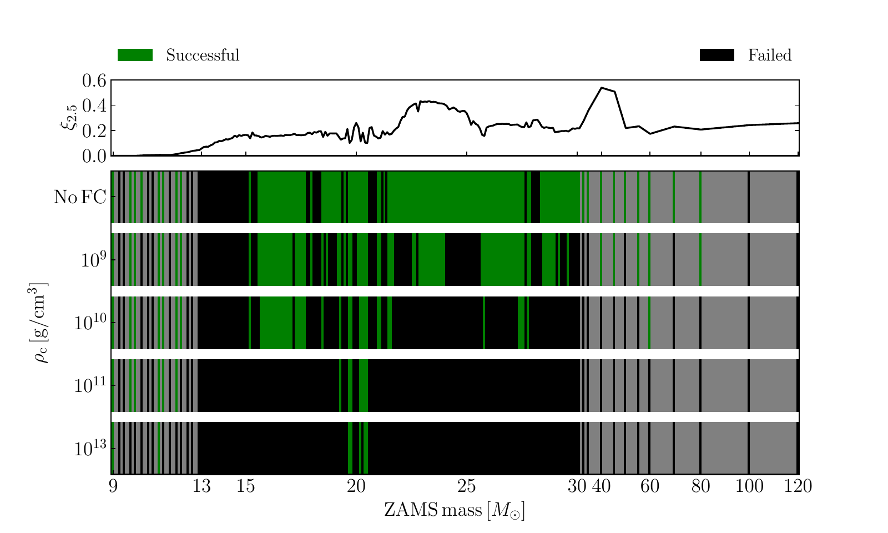
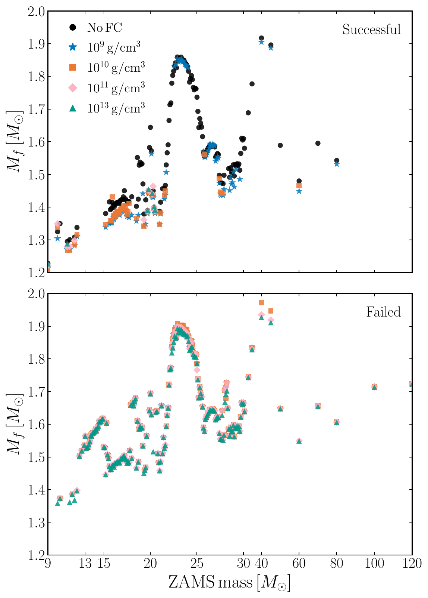

v3.13
Analyzing | Framework v3.13

> **Access Status** — Full paper: retrieved as the local arXiv v3 PDF (8 pages, 18 Aug 2026; the arXiv comment says v3 "matches version accepted for publication in Phys. Rev. D Letters", published as Phys. Rev. D 114 (2026) L061304; I did not read the journal typeset version itself). I read all 8 pages directly, including the reference list and the explanatory footnotes [93] and [94]. The Letter has no appendix or separate supplement. · Abstract: from the PDF and the arXiv abs page (version history v1 15 May 2026, v2 17 Aug 2026, v3 18 Aug 2026). · Figures: both figures viewed as the authors' own files from the arXiv source (`neutrino-2605.16504_fig1.png`, `_fig2.png`), checked against the captions on PDF pages 3–4. Both are embedded below. Table I is reproduced as a Markdown table. · Comparison papers: for each one I checked the arXiv abs page for the latest version and the current abstract only, not the full text: companion paper arXiv:2605.18972 (v3, 18 Aug 2026; PRD 114, 043054); Akaho et al. arXiv:2601.08269 (v2, 11 May 2026; PRL 136, 191002); Ehring et al. arXiv:2301.11938 (v2, 2 Apr 2023; PRD 107, 103034) and arXiv:2305.11207 (v2, 2 Jan 2025; PRL 131, 061401); Wang & Burrows arXiv:2503.04896 (v2, 13 May 2025); Mori et al. arXiv:2501.15256 (v2, 4 Mar 2025); Boccioli & Fragione arXiv:2404.05927 (v3, 27 Dec 2024); Sukhbold et al. arXiv:1510.04643 (v3, 13 Feb 2016); Müller, Heger & Powell arXiv:2407.08407 (v2, 15 Jan 2025); Neustadt et al. arXiv:2104.03318 (v2, 24 Jan 2022). · Analysis basis: full text plus figures. Claim checks were run in Python (scripts `claimcheck_fig1.py`, `claimcheck_imf.py`, `claimcheck_imf2.py`, `claimcheck_mass.py` in the run's work directory), including a pixel-level read of Fig. 1.

---

## 1. Punchy Title & One-Sentence Hook

**Shuffle the Neutrino Flavors, Starve the Shock: A Simple Flavor-Mixing Switch Turns Many Would-Be Supernovae into Quiet Black Holes**

In 195 one-dimensional collapse simulations, letting neutrinos fully mix their flavors anywhere inside a chosen density cutoff roughly doubles to quadruples the share of massive stars that collapse to black holes with no supernova, and hits stars of 16–30 solar masses hardest. The open question is how much of that holds once the crude "instant mixing" switch is replaced by real flavor physics: even the authors call their largest numbers implausibly high.

---

## 2. Big-Picture Context

When a massive star's iron core collapses, it forms a hot proto-neutron star and launches a shock wave. Within about a tenth of a second that shock stalls a couple of hundred kilometres out, choked by the stellar material still raining onto it. Whether the star then explodes depends on whether the neutrinos streaming out of the proto-neutron star deposit enough energy behind the stalled shock to push it outward again. This is the "delayed neutrino-driven" mechanism, and it works only marginally. Success means a supernova and a neutron star. Failure means the shock dies, the star implodes, and a black hole forms, often with nothing more than a faint, reddish dimming that telescopes can easily miss. Since the early 2010s, simulation surveys over large grids of stellar models have shown that the outcome does not track initial mass in any simple way. Explosions and failures sit in interleaved "islands of explodability", and black holes can form from stars as light as about 13 M☉. The older picture held that only stars above roughly 40 M☉ fail.

Several puzzles from observation push on this question. First, the **red supergiant problem**: the stars seen before Type IIP supernovae, all red supergiants, top out around 16–18 M☉, although red supergiants up to about 25–30 M☉ exist. Either those heavier stars fail to explode, or the progenitor masses are mis-estimated. Second, the **supernova rate problem**: the cosmic rate of observed core-collapse supernovae seems to fall below what the star-formation rate predicts, which leaves room for "missing" dark collapses. Third, direct searches for vanishing stars (the Large Binocular Telescope survey, the N6946-BH1 candidate, a recent disappearing star in Andromeda) imply a failed fraction somewhere between about 5% and 50%. The paper quotes that range. Neustadt et al. (arXiv:2104.03318, v2) found 0.16, with a 90% interval from about 0.04 to 0.39, from the LBT data. Fourth, the observed neutron-star mass distribution peaks near 1.3–1.4 M☉ and has a low-mass tail down to about 1.17 M☉. Simulations have struggled to make neutron stars that light.

Into this landscape comes **neutrino flavor conversion (FC)**. Neutrinos come in three flavors (electron, muon, tau). Only electron-flavor neutrinos and antineutrinos heat the gas efficiently, through charged-current absorption on neutrons and protons. Supernova codes have long assumed that flavor oscillations happen far outside the explosion engine, so they could be ignored. Theory over the last decade, especially work on the "fast flavor instability" driven by neutrino–neutrino interactions, says flavor can scramble in and around the proto-neutron star itself, right where the energy budget is set. A handful of simulations have now added schematic or subgrid FC to single progenitors. The answers point in different directions. Ehring et al. found in 1D that FC hampers explosion of a 20 M☉ star; in 2D it helps 9–12 M☉ stars and hinders around 20 M☉. Wang & Burrows saw transient heating changes of about 10%. Mori et al. found boosted explosion energies in 3D. Akaho et al., with multi-angle Boltzmann transport and a quantum-kinetics-based subgrid model, found a "bifurcated" effect: FC helps the lowest-mass progenitor and hurts heavier ones, with the mass accretion rate as the switch. The authors' own companion paper (arXiv:2605.18972, v3) concludes that FC enhances or hinders explosion depending on *where* it happens (near the gain region versus near neutrino decoupling), independent of progenitor mass.

**Paper Type & Stakes:** This is a short computational population-study Letter (peer-reviewed, Phys. Rev. D Letters). It runs one simplified FC prescription through a 195-progenitor grid in 1D+ simulations and asks what changes in the population: the failed fraction, which masses fail, and remnant masses. The stakes are whether neutrino quantum physics deep inside the core must be part of any prediction of neutron-star and black-hole birth rates, which feed into gravitational-wave population modelling, nucleosynthesis and supernova-rate accounting.

**Prior Belief Check:** The *direction* of the result fits the existing 1D literature: Ehring et al.'s 1D parametric study already found that FC below a density threshold hampers explosion, and this paper uses the same prescription. What is new is running it across a population and turning it into population numbers. Experts will not be surprised that FC changes explodability. They will be skeptical of the *magnitude* at the deeper thresholds: 74–88% failed collapses (IMF-weighted) would sharply conflict with observed supernova rates and failed-SN searches, and the authors say so. The result also sits awkwardly next to multi-dimensional work (Ehring 2D, Akaho et al.), where FC *helps* low-mass, low-accretion-rate progenitors explode. In this 1D population, as far as I can read Fig. 1, FC never rescues a failed model. So this is best read as "a schematic FC switch is a first-order lever on population statistics" rather than as a calibrated forecast. It complicates rather than contradicts the consensus.

**Replication & Convergence Note:** This is a single-group result (Gogilashvili & Tamborra, building on their companion paper and on the Ehring–Tamborra prescription), from one code (GR1D with the STIR turbulence model), one progenitor set, one equation of state and one FC scheme. No independent population-level study of FC exists yet. Independent confirmation would mean another group running a comparable progenitor grid with a different code and transport (for example FLASH-STIR, Fornax with its Box3D FC model, or a multi-angle subgrid model like Akaho et al.'s) and finding a similar rise in the failure fraction concentrated at 16–30 M☉. The single-progenitor multi-D studies already disagree on the *sign* of the effect at low mass, so this replication matters.

---

## 3. Necessary Background Crash-Course

### 3.1 The stalled shock and the neutrino heating budget

At core bounce the inner core stiffens at nuclear density and rebounds, and a shock wave forms. Within roughly 100 ms the shock loses its punch to two drains. It spends energy breaking heavy nuclei into free nucleons (about 9 MeV per nucleon, about 1.7 × 10⁵¹ erg per 0.1 M☉ of iron dissociated), and neutrinos carry energy away. The shock stalls at about 150–250 km. Outer layers keep falling onto it at a rate of a few tenths of a solar mass per second, and their ram pressure holds it down.

Behind the shock, the geometry has three layers you need for this paper:

- The **neutrinosphere** (tens of kilometres out, density about 10¹¹ g/cm³) is the "last-scattering surface" where neutrinos stop being trapped and start streaming freely. It is different for each flavor and energy.
- The **gain radius** (roughly 80–120 km, about 10¹⁰ g/cm³) is the point outside which neutrino *heating* beats neutrino *cooling* of the gas.
- The **gain region** lies between the gain radius and the shock (about 10⁹ g/cm³ and below). This is where net energy is deposited.

Worked numbers: the neutron star's gravitational binding energy is about 3 × 10⁵³ erg, and about 99% of it leaves as neutrinos over roughly 10 seconds. A typical supernova explosion energy is about 10⁵¹ erg, or about 0.3% of that budget. So the gain region has to capture only a small fraction of the neutrino energy streaming through it. Over the critical few hundred milliseconds it captures roughly 5–10%. Change that capture efficiency by a few tens of percent and you move a marginal star across the explode/fail line. This is why a seemingly "small" change to neutrino spectra can dominate the outcome.

**Analogy:** treat the stalled shock as a server with a fixed incoming request load (the infalling stellar matter), kept alive by a compute budget (the neutrino heating). If the delivered compute exceeds a threshold set by the load, the backlog clears and the system breaks free (explosion). If not, the queue grows until the server falls over (collapse to a black hole). Stars with denser cores send a heavier, longer-lasting load.

**Breaks when:** you treat the load and the budget as independent. In a supernova the infalling matter *also powers* the neutrino luminosity: accretion onto the proto-neutron star releases gravitational energy, partly as neutrinos. Heavier load raises the budget too. That coupling is why explodability is not monotonic in mass, and why a lever like FC can push different stars in different directions.

### 3.2 Why only electron-flavor neutrinos heat, and why energy matters

Neutrinos come in electron (νe), muon (νμ) and tau (ντ) flavors, plus their antiparticles. Behind the shock, matter is mostly free neutrons and protons. Electron neutrinos are absorbed by neutrons (νe + n → p + e⁻) and electron antineutrinos by protons (ν̄e + p → n + e⁺). These are charged-current reactions, and they dump the neutrino's energy into the gas. Muon and tau neutrinos (lumped as "heavy-lepton" νx) are too light in energy to make their partner muons or taus, so they only scatter weakly through neutral currents and pass through without heating much. Codes like GR1D track three species: νe, ν̄e and one νx standing in for each of the four heavy species.

The absorption cross-section grows roughly as the square of the neutrino energy. Worked example: an electron neutrino at 15 MeV is absorbed (15/12)² ≈ 1.56 times more readily than one at 12 MeV, and it deposits 25% more energy per absorption. Per unit of number flux, heating scales roughly as the cube of energy, so (1.25)³ ≈ 1.95: nearly twice the heating from a 25% harder spectrum. Heavy-lepton neutrinos typically emerge with higher mean energies than νe, because they decouple deeper and hotter. So mixing flavors can do two opposite things to the electron-flavor population. It can *harden* its spectrum (good for heating), and it can *drain* its numbers or luminosity into the non-heating heavy channels (bad for heating), while also changing how fast the hot neutron star cools.

**Analogy:** only one class of worker has write permission to the target database (the gas). The other class can walk through the server room but cannot commit anything. Both classes carry payloads of different sizes, and the heavy class carries bigger payloads.

**Breaks when:** you assume the "no-write" workers are inert overall. Heavy-lepton neutrinos still carry energy *out* of the neutron star. Extra heavy-lepton emission from the region near the neutrinospheres cools that region, makes the proto-neutron star contract faster, and changes the luminosities everyone else sees. The database analogy has no slot for "taking work away from the system changes the system that produces the workers".

### 3.3 Flavor conversion and the "instant equipartition" switch

In dense neutrino gases, neutrinos interact with each other, and flavor evolution becomes collective. The *fast flavor instability* can scramble flavors over centimetre-to-metre scales and nanosecond times wherever the angular distributions of νe and ν̄e "cross" (a so-called ELN crossing). Simulating that self-consistently inside a supernova code is far beyond current computing, because the scales are about 10⁸ times smaller than the hydrodynamic grid. So people use stand-ins.

This paper uses the bluntest stand-in, from Ehring et al. and Just et al. At t = 0.02 s after bounce, in every cell where the baryon density is below a chosen threshold ρc, and in each energy bin separately, the code instantly forces the neutrino populations to flavor equipartition, under three constraints: total neutrino number is conserved, momentum is conserved, and electron lepton number (electron neutrinos minus electron antineutrinos) is conserved. The paper does not say whether the switch stays on for the rest of the run. Its wording ("shortly after bounce") and the companion paper suggest it is applied continuously from 20 ms on, wherever the density is below ρc.

Here is my illustration of what those constraints imply, with made-up counts for one energy bin (this is not from the paper). Say a cell holds 10 νe, 8 ν̄e, and 6 each of νμ, ν̄μ, ντ, ν̄τ.

- Antineutrinos total 8 + 6 + 6 = 20. Equipartition among the three antineutrino flavors gives 6.67 each.
- Electron lepton number must stay at 10 − 8 = 2, so νe becomes 6.67 + 2 = 8.67.
- Neutrinos total 10 + 6 + 6 = 22, so νμ = ντ = (22 − 8.67)/2 = 6.67.

Net effect: in this bin, electron neutrinos drop from 10 to 8.67 and electron antineutrinos from 8 to 6.67, while each heavy species rises from 6 to 6.67. Because the operation runs bin by bin, high-energy bins where heavy flavors were more abundant *feed* the electron flavors, and low-energy bins drain them. That is the spectral hardening. The total electron-flavor count goes down. Which wins (harder spectrum versus fewer heating particles, plus extra cooling of the neutron-star surface) depends on *where* the switch acts. The threshold ρc is the paper's proxy for "how deep FC reaches", since nobody yet knows where fast FC actually occurs in a real supernova.

The four thresholds map onto the layers of §3.1, according to the paper and its Fig. 1 of the companion paper:

| ρc (g/cm³) | Where FC switches on (region below this density) |
| --- | --- |
| 10⁹ | Only the outer gain region near the shock |
| 10¹⁰ | Down to roughly the gain radius |
| 10¹¹ | Down to roughly the neutrinosphere |
| 10¹³ | Deep inside the proto-neutron star |

**Concept:** FC under this scheme is a forced, instantaneous rebalancing of neutrino populations per energy bin, in all cells below a density cutoff. It conserves particle number, momentum and electron lepton number, and it redistributes both *how many* electron-flavor neutrinos there are and *how energetic* they are. Its net effect on heating has both signs. Spectral hardening raises heating. Loss of electron-flavor luminosity and extra heavy-flavor cooling near the neutrinospheres lower it.

**Vehicle:** a load balancer that, every tick, takes the worker pools in each size class (small jobs, medium jobs, big jobs) across three teams and evens out the head counts per class. One rule is fixed: Team A must always have exactly as many more workers than its mirror team A′ as it had before. Only Team A and A′ can commit writes. Teams B and C cannot.

**Analogy:** worker size class ↔ neutrino energy bin. Team A / A′ ↔ νe / ν̄e. Teams B, C ↔ heavy-lepton flavors. Evening head counts per class ↔ equipartition per energy bin. The fixed A-minus-A′ rule ↔ electron lepton number conservation. The balancer's reach (which server racks it touches) ↔ the density cutoff ρc. Team A ends up with fewer total workers but a larger share of big-job workers.

**Breaks when:** you ask *whether* the balancer runs and where. A real load balancer runs by design. Fast flavor conversion runs only where the neutrino angular distributions are unstable, may stop short of full equipartition, and evolves on its own as the system changes. The vehicle has no slot for "the balancing itself depends on the state it is balancing". That is exactly the gap between this schematic switch and quantum-kinetic reality.

### 3.4 Compactness and the islands of explodability

To rank how hard a star will be to explode, modellers use the **compactness parameter** of the pre-collapse core (O'Connor & Ott 2011):

$$\xi_{2.5} = \frac{2.5}{R(2.5\,M_\odot)/1000\ \text{km}}$$

**Symbol definitions:**
$\xi_{2.5}$ : compactness at an enclosed mass of 2.5 solar masses (dimensionless)
$R(2.5\,M_\odot)$ : radius inside which the star holds 2.5 solar masses, just before collapse (km)

**What this actually means:** it measures how tightly the inner 2.5 solar masses are packed. If those 2.5 M☉ sit within 5,000 km, ξ = 2.5/5 = 0.5. If they spread out to 12,500 km, ξ = 0.2. A compact core feeds material onto the shock faster and for longer, which means a heavier load in the §3.1 analogy. Think of it as the *depth of the request backlog queued behind the front door*. In this grid, ξ2.5 jumps around non-monotonically with initial mass (Fig. 1, top): near zero below 12 M☉, about 0.15–0.25 for 13–21 M☉, a hump of 0.35–0.45 around 22–25 M☉, and a spike to about 0.55 near 40 M☉. That jaggedness comes from how carbon and oxygen shell burning proceeds in the last millennia of the star's life, and it is why explodability shows "islands" rather than a clean cutoff.

**Breaks when:** you read compactness as the whole story. Explodability correlates with ξ, but no single-number threshold separates explosions from failures cleanly. Two-parameter criteria (Ertl et al.) and the location of the silicon/oxygen interface (Boccioli et al.) do better, and the outcome also depends on the code's physics. In this paper, the 13–15 M☉ stars with *low* ξ already fail without FC.

### 3.5 Turning a model grid into a population: IMF weighting

A grid of 195 models is not a population. Nature makes many more 10 M☉ stars than 50 M☉ stars. The standard weighting is the **Salpeter initial mass function (IMF)**: the number of stars born per unit mass falls as mass to the −2.35 power.

$$\frac{dN}{dM} \propto M^{-2.35}$$

**Symbol definitions:**
$dN/dM$ : number of stars born per unit initial (ZAMS) mass
$M$ : initial stellar mass (solar masses)

**What this actually means:** it is a popularity distribution, like a request log where small requests dominate. Integrating it over the paper's 9–120 M☉ range (my Python calculation, `claimcheck_fig1.py`) gives the share of all core-collapse progenitors in each band: **9–13 M☉: 40%; 13–16 M☉: 15%; 16–30 M☉: 27%; 30–120 M☉: 17%**. The grid is *not* sampled that way. From the Fig. 1 bars, I count about 17 models in 9–13 M☉, 171 in 13–30 M☉ (spaced every 0.1 M☉), and about 13 above 30 M☉. So the raw "fraction of models that fail" overweights 13–30 M☉ stars, and the IMF-weighted fraction is the number to compare with the sky. Two consequences follow. The 9–16 M☉ band (55% of all progenitors) controls the observable failed fraction. And a change concentrated at 16–30 M☉ moves the raw count much more than the IMF-weighted number.

**Breaks when:** you treat the weighting as unique. Turning discrete models into a continuous population requires assigning each model a mass "bin". The paper does not say how it does this, and as the Claim Check shows, the answer is sensitive to it.

### 3.6 1D+ simulations and what "explosion" means here

A real supernova engine is three-dimensional. Convection and the sloshing "standing accretion shock instability" (SASI) help the shock along. Pure 1D (spherical) simulations almost never explode. "1D+" codes put back the effect of turbulent convection through a mixing-length model. This paper uses STIR (Supernova Turbulence in Reduced-dimensionality), with its strength set by a dimensionless parameter αMLT = 1.51, a value the STIR authors chose to match multi-D results. The code is GR1D: general-relativistic hydrodynamics on 850 radial zones, with energy-dependent M1 neutrino transport over 18 energy bins, NuLib interaction rates, and the SFHo nuclear equation of state. The authors call a model "successful" if the shock passes 1,000 km within the 1–3 s simulated; otherwise it is "failed".

**Analogy:** STIR is a calibrated performance model that stands in for a full cycle-accurate simulator. It reproduces average throughput but not specific contention patterns.

**Breaks when:** the missing patterns are the ones that matter. STIR does not include SASI (which helps compact, high-accretion-rate progenitors) or proto-neutron-star convection (which FC at high ρc is expected to strengthen). The paper flags both, and both bias the grid toward failure.

### 3.7 Baryonic versus gravitational remnant mass

The simulation reports the **baryonic mass** Mf: the rest mass of the matter inside the neutrinosphere at 1 s after bounce. Telescopes measure **gravitational mass**, which is smaller because the neutron star's binding energy has been radiated away. The paper converts with a standard fit:

$$M_{\rm bary} = M_{\rm grav} + 0.075\,M_{\rm grav}^2$$

**Symbol definitions:**
$M_{\rm bary}$ : total rest mass of the baryons in the neutron star (solar masses)
$M_{\rm grav}$ : mass measured by orbits and gravitational waves (solar masses)

**What this actually means:** a heavier star is bound more tightly and "loses" a larger fraction. Solving the fit (`claimcheck_mass.py`): baryonic 1.30 → gravitational 1.19; 1.40 → 1.28; 1.50 → 1.36; 1.85 → 1.65 M☉. That is roughly an 8–11% haircut, like a compression ratio that rises with file size.

**Breaks when:** you treat Mf at 1 s as the final mass. For exploding models, footnote [93] says 1D cannot capture simultaneous accretion and outflow, so the 1D Mf is a *lower bound* on the real neutron-star mass. For failed models, the black hole will keep swallowing the star, so Mf at 1 s is far below the final black-hole mass.

> **Central analogy for this paper:** a load balancer starving the write-capable worker pool.

*Analyst-built concept diagram (not from the paper):*

```
 195 progenitors (9-120 Msun, Sukhbold+16, solar Z)
            |
            v
 GR1D + STIR (1D+), M1 transport, SFHo EOS
            |
            v  t = 0.02 s after bounce
 FC switch: equipartition per energy bin where rho < rho_c
 (rho_c = 1e9 | 1e10 | 1e11 | 1e13 g/cm^3, or no FC)
            |
            v
 nu_e / anti-nu_e spectra harder, numbers down;
 heavy-flavor emission up -> heating vs cooling shift
            |
            v
 Shock radius > 1000 km by 1-3 s ?
     | yes                        | no
     v                            v
 explosion -> NS (Mf at 1 s)   failed -> BH (Mf at 1 s)
            |
            v
 Count + Salpeter weight -> f_fail 25.6% (no FC)
 -> 50.8 / 77.4 / 93.3 / 96.4 % as rho_c deepens
```

Read it top to bottom: one switch (how deep flavor equipartition reaches) feeds the heating balance. That decides each star's fate, and the 195 fates are rolled up into population fractions and remnant masses.

---

## 4. Core Technical Explanation

### 4.1 What the authors actually ran

The authors take the 200-model solar-metallicity grid of Sukhbold et al. (2016; arXiv:1510.04643 v3), which spans 9–120 M☉ and is densely sampled every 0.1 M☉ from 13 to 30 M☉. They simulate 195 of these models. (Fig. 1 marks unsimulated masses in gray. The paper does not say which five were dropped or why.) Each model collapses in GR1D and then runs for 1–3 s after bounce, five times over: once without FC and once at each of the four density thresholds. That is about 975 simulations. Everything else (the progenitors, STIR's αMLT = 1.51, the SFHo equation of state, the 850-zone grid, the 18 energy bins) is held fixed. So the experiment isolates a single knob: how deep the flavor-equipartition switch reaches.

Each threshold has a physical meaning (see the §3.3 table). At ρc = 10⁹ g/cm³, flavors equilibrate only in the outer gain region near the shock. There, spectral hardening of the electron-flavor neutrinos should *help* heating directly, since the reshuffled neutrinos are absorbed right where energy is needed. At 10¹¹ to 10¹³ g/cm³, equipartition reaches the neutrinosphere and below. There, converting electron flavors to heavy flavors *at their source* raises heavy-lepton luminosity, cools the neutrinosphere layers, and lowers the electron-flavor luminosity that reaches the gain region. The companion paper (arXiv:2605.18972 v3, abstract only) states the general rule: FC near the gain region increases heating and can enhance explosion, while FC near the neutrino-decoupling region increases cooling and hinders it. This Letter asks what that rule does to a whole population.

### 4.2 The central result: the islands map



*Figure 1 (from the paper): top, pre-collapse core compactness ξ2.5 versus initial (ZAMS) mass; bottom, outcome per progenitor (green = explosion, black = failed explosion, gray = not simulated) for no FC (top row) and FC below ρc = 10⁹, 10¹⁰, 10¹¹ and 10¹³ g/cm³ (rows two to five). Note the non-linear mass axis: 9–30 M☉ takes three quarters of the width.*

**What to look at:** compare each row with the No-FC row above it. Green blocks at 16–30 M☉ turn black progressively as ρc deepens, until by 10¹¹–10¹³ only a few models near 19.5–20.5 M☉ survive. Then line up the black regions with the compactness curve: the failures in the No-FC row cluster at 13–15 M☉ and in narrow slivers near 18, 19.5, 20.6–21.4 and 27.7–28.4 M☉, several of them at local wiggles of ξ2.5.

This figure is the heart of the paper. Read row by row, it tells a clean story:

- **No FC.** About a quarter of the models fail. They cluster at 13–15 M☉ (a well-known failure band in STIR-type 1D+ grids), at scattered points in 9–13 M☉, and in narrow slivers between 17.8 and 28.4 M☉, plus 100 and 120 M☉. Most of 16–30 M☉ explodes, including the high-compactness hump at 22–25 M☉. The 22–25 M☉ explosions shed most of their mass early, and as Fig. 2 shows, they leave heavy neutron stars.
- **ρc = 10⁹ g/cm³.** Large chunks of 16–30 M☉ go black: roughly 22–23 M☉, 25–26.5 M☉, and many single models between 17 and 22 M☉. My pixel read (§4.5) counts failures in 16–30 M☉ rising from 19 of 140 models to 62 of 140.
- **ρc = 10¹⁰ g/cm³.** Most of 20–30 M☉ fails. 15–18 M☉ still explodes, as do a few isolated models near 26 and 27.5 M☉.
- **ρc = 10¹¹ and 10¹³ g/cm³.** Nearly everything between 13 and 30 M☉ fails, except a handful near 19.6–20.4 M☉ that keep exploding in every row. Above 30 M☉, the scattered explosions of the No-FC row (32–80 M☉) are all gone already at 10¹⁰.

Two features deserve emphasis because the text does not spell them out.

First, the effect is **monotonic and one-directional at the population level**. Going down the rows, failures only grow. Reading each model's bar in every row (my pixel analysis in §4.5), I find **no model that fails without FC but explodes with it, at any threshold**. So even at ρc = 10⁹, where the companion paper's rule says FC should *enhance* heating, this population shows no rescues. The "helping" side of FC appears only as earlier and more energetic revival in models that already explode (that is what lowers their remnant masses, §4.4). It never shows up as a flipped outcome. This matters for comparisons with Ehring et al.'s 2D and Akaho et al.'s multi-angle results, where FC *helps* low-mass progenitors cross the line.

Second, the most affected range (16–30 M☉) is also the range of the red supergiant problem. The paper presents this overlap as a possible natural explanation. That is suggestive, but note that the 13–16 M☉ band, already failing without FC, sits *below* the observed IIP progenitor ceiling (about 16–18 M☉). That band should be producing visible supernovae, so in this code the reference model already has a tension in the other direction.

The paper explains the trend in one sentence: the deeper the equilibration, the more energy moves from electron-flavor to heavy-flavor neutrinos, and the less efficient the heating. In load-balancer terms, the deeper the balancer reaches, the earlier in the pipeline it drains the write-capable pool. At the shallowest setting it mostly reshuffles job sizes among workers already in the server room. At the deepest it cuts the write-capable crew at the factory gate.

### 4.3 From counts to rates: Table I

The authors reduce Fig. 1 to two numbers per scenario: the raw fraction of failed models, and the fraction weighted by the Salpeter IMF.

*Table I (from the paper): failed-explosion fractions.*

| ρc (g/cm³) | f_fail (share of models) | f_Salp (Salpeter-weighted) |
| --- | --- | --- |
| No FC | 25.6% | 27.0% |
| 10⁹ | 50.8% | 47.6% |
| 10¹⁰ | 77.4% | 61.9% |
| 10¹¹ | 93.3% | 73.9% |
| 10¹³ | 96.4% | 88.3% |

**What to look at:** the right column is the one to compare with the sky. With no FC it sits at 27%, inside the 5–50% observational range. With FC it climbs to 48–88%. Note that f_Salp is *below* f_fail in every FC row but *above* it with no FC. Under FC, the IMF-heavy low-mass stars must be failing *less* often than the grid average, which the Claim Check examines.

The authors draw two conclusions. First, the 27% No-FC baseline agrees with earlier spherically symmetric studies and with observational constraints. Second, with FC the IMF-weighted fraction rises to 47.6% (ρc = 10⁹) and up to 88.3% (ρc = 10¹³). They describe the 73.9% and 88.3% values as "seemingly in tension with observational constraints" and say all the numbers should be "interpreted with caution": the real answer requires FC that evolves dynamically in time and space, through multi-D subgrid models built on kinetic simulations that are still under development. They also note that a different IMF (Kroupa) gives similar results (not shown).

They are candid about the missing physics. The models lack proto-neutron-star convection, which deep FC is expected to *boost* (Ref. [86]), potentially restoring some heating. They lack SASI, which helps compact, high-accretion progenitors and so could rescue some of the 16–30 M☉ failures. And they use one equation of state, while the companion work suggests the FC impact varies quantitatively with it. All of these push in the direction of fewer failures than the table shows. The authors write that the *relative* increase in failures caused by FC is robust with respect to the reference population, while the absolute fraction is sensitive to the simulation details.

### 4.4 Remnant masses: Fig. 2



*Figure 2 (from the paper): baryonic mass Mf inside the neutrinosphere at 1 s after bounce (or at black-hole formation, if earlier) versus ZAMS mass; top panel exploding models, bottom panel failing models; black circles = no FC, blue stars, orange squares, pink diamonds and teal triangles = FC below 10⁹, 10¹⁰, 10¹¹ and 10¹³ g/cm³.*

**What to look at:** in the top panel, compare black circles with the colored symbols at the same mass. Between 15 and 22 M☉ the colored points sit about 0.03–0.06 M☉ lower. Also note *where black circles have no colored partner*: most of the 20–25 M☉ peak at Mf ≈ 1.6–1.85 M☉ and the 30–35 M☉ points have only black circles or blue stars, because at deeper thresholds those stars no longer explode. In the bottom panel, the symbols almost overlap (the caption notes the black and blue symbols hide under the orange ones).

The authors read Fig. 2 this way. For exploding models, FC triggers earlier, more energetic shock revival, so less matter accretes onto the proto-neutron star, and Mf is systematically lower, most of all at the shallowest threshold (10⁹), where revival is most efficient. Successful Mf spans 1.2–1.9 M☉. After the baryonic-to-gravitational conversion, they say, the FC neutron stars agree better with the observed population peak near 1.2–1.4 M☉ and with its low-mass end (they cite Müller, Heger & Powell, arXiv:2407.08407 v2, whose 3D models reach a record low 1.192 M☉ for stars near the minimum core-collapse mass). For failed models, FC delays or kills revival, so accretion runs longer and Mf at 1 s is slightly *higher*, most noticeably at deep thresholds. They warn that this is not the final black-hole mass: fallback of the envelope after 1 s could make it much larger.

Two things are worth seeing in that panel, neither spelled out in the text. The *per-object* shift is modest. For 15–19 M☉ models it is about 1.41 → 1.37 M☉ baryonic, which is about 0.03 M☉ gravitational (my conversion, `claimcheck_mass.py`). Much of the *population-level* shift toward lighter neutron stars at ρc ≥ 10¹⁰ comes from **selection**: the progenitors that made the heaviest neutron stars (22–25 M☉, Mf ≈ 1.7–1.85 M☉, gravitational ≈ 1.5–1.65 M☉) stop exploding and drop out of the neutron-star sample entirely. At ρc = 10⁹, the 22–25 M☉ heavy-NS peak survives almost unchanged (the blue stars overlie the black circles). There, the population shift is only the small per-object shift plus some loss of mid-mass explosions. Either way, the conclusion "FC → lighter neutron stars" holds. The mechanism is mostly "FC turns heavy-NS producers into black holes", not "FC makes each neutron star much lighter".

### 4.5 Claim check

All checks used Python on the paper's own Table I and on a pixel-level read of the authors' Fig. 1 source image: each model's bar was classified as green/black/gray in each row and mapped to mass using the axis ticks (`claimcheck_fig1.py`, `claimcheck_imf.py`, `claimcheck_imf2.py`). The figure resolves each 0.1 M☉ model as a 4-pixel bar, so single-model misreads are possible.

**1. The raw failed fractions (Table I, f_fail) — Reproduced.** The paper claims 25.6% → 50.8% → 77.4% → 93.3% → 96.4%. Each is an exact share of 195 (50, 99, 151, 182, 188 models), so the table is self-consistent. Counting bars in Fig. 1 independently gives about 200 bars (consistent with Sukhbold's 200-model grid, including a few the paper may not have simulated) and failure shares of 27.5%, 52.5%, 77.5%, 93.5% and 97.0%, within 0.1–2 points of the table in every row. This is the backbone of the "FC increases failures" claim, and it holds.

**2. "Especially in the 16–30 M☉ range" — Reproduced, plus a finding.** In 16–30 M☉, failures go from 19/140 models (14%) with no FC to 62, 107, 133 and 135 of 140 (44%, 76%, 95%, 96%). The same bar-by-bar comparison finds **zero models that switch from failed to exploding at any threshold**, against 50–139 that switch the other way. This sharpens the paper's message: in this setup FC never rescues an explosion, even at ρc = 10⁹. That is worth knowing when comparing with multi-D studies where FC helps low-mass stars explode.

**3. The IMF-weighted fractions (f_Salp) — Not reproduced.** These are the numbers the paper compares with observations (27% with no FC, "consistent with observational constraints"; 47.6–88.3% with FC). I weighted the Fig. 1 outcomes with the Salpeter IMF in every convention I could think of: mass bins around each model, or a per-model weight; lower IMF bound 8 or 9 M☉; slopes of 2.35 and 1.35. None reproduces the column. The closest gives 38.6 / 59.2 / 73.0 / 83.3 / 96.6%, an RMS miss of about 10 points, and *every* variant comes out higher than the paper's values. The cause is visible in the figure. About 7 of the 16 models at 9–13 M☉ fail even with no FC, and that band carries 40% of the IMF weight. At ρc = 10¹³, only one 9–13 M☉ model and a handful near 20 M☉ survive, which caps the weighted survival at a few percent, not 11.7%. The weighting procedure is unstated, so an untried convention or a misread bar could explain part of the gap. But if the figure is right, the printed fractions are too low, and the "consistent with observations" verdicts weaken.

**4. Lighter neutron stars with FC — Partly reproduced.** The direction is visible in Fig. 2. Converting the plotted masses gives gravitational masses of about 1.17–1.32 M☉ for most FC explosions between 9 and 22 M☉, in the range of the observed peak. But the per-object reduction is only about 0.03–0.05 M☉, and the larger population shift comes from heavy-NS producers turning into black holes (§4.4). Also, footnote [93] says the 1D masses for exploding models are lower bounds. That weakens any claim of *agreement* with observed masses, as opposed to a *trend*.

**Sensitivity check.** The most influential input is ρc, a free parameter standing in for unknown physics, and the headline outcome (IMF-weighted failure) moves from 48% to 88% across it. The qualitative claim "FC raises the failed fraction" survives every threshold. The quantitative claim "FC can stay consistent with observations" survives only at ρc = 10⁹ and only under the paper's weighting: 47.6% sits just under the 50% ceiling the paper uses, but above the 90% upper bound of about 39% from the LBT search (Neustadt et al. 2021). Under my figure-based weightings even ρc = 10⁹ gives about 55–60%. So the observational-consistency conclusion survives unless the true IMF-weighted fraction is a few points higher than printed, which my check suggests is plausible.

**Robustness test (simulation type: comparison with independent codes).** Do other codes see the same sign? Partly not. Ehring et al.'s 1D study with the same prescription found that FC hampers a 20 M☉ explosion, which agrees. But their 2D study found FC helps 9–12 M☉ progenitors explode, and Akaho et al.'s multi-angle Boltzmann models find FC helps the lowest-mass, low-accretion-rate progenitor. So the low-mass end, which controls the IMF-weighted fraction, is exactly where independent multi-D work points the other way. The robust part is "FC pushes 16–30 M☉ stars toward failure". The population number is not yet code-independent.

**Internal consistency (significant items only).** (i) Table I's f_Salp column does not follow from Fig. 1 under any standard weighting (item 3). This matters because it is the column used to compare with observations. (ii) The introduction says that "when FC occurs near the stalled shock, it accelerates shock revival", and the companion's abstract says FC near the gain region "enhances" explosion. Readers may take that to mean some stars are rescued. In this population none are: the acceleration applies only to stars that explode anyway. (iii) Fig. 2's caption calls Mf "the final mass of the remnant", while the text and footnote [93] say it is not final for either branch. The text is the correct reading.

### 4.6 Assumption Audit

> **Watch:** Reader likely assumes the 47.6–88.3% failure fractions are predictions of how many stars fail in nature once flavor conversion is included. The paper actually gives a *bracket over an unknown*: ρc is a free proxy for where fast flavor conversion occurs, the equipartition is forced to completion instantly from 20 ms on, and the authors themselves call the deep-threshold numbers in tension with observations and to be interpreted with caution. Read the table as a sensitivity sweep ("if FC reaches this deep with full strength, here is the damage"). It is not a forecast, and none of the five rows is singled out as the best estimate.

> **Watch:** Reader likely assumes "FC makes neutron stars lighter" means each neutron star comes out noticeably lighter. The paper's Fig. 2 actually shows a per-object shift of only about 0.03–0.06 M☉ (baryonic) for typical exploding stars. Much of the population-level shift at ρc ≥ 10¹⁰ comes from the progenitors that made 1.5–1.65 M☉ (gravitational) neutron stars failing and becoming black holes instead. Footnote [93] adds that the 1D baryonic masses of exploding models are *lower bounds*, since 1D misses continued accretion through downflows. The mass "agreement" with the low-mass tail is a trend inside a framework that is biased low to begin with.

> **Watch:** Reader likely assumes that because FC near the gain region can *strengthen* heating (the companion paper's headline), some stars fail without FC but explode with it, so the islands would reshuffle in both directions. In this population, as far as Fig. 1 can be read, the islands only ever *sink*. No failed model is rescued at any threshold, including 10⁹ g/cm³. The "enhancing" effect shows up only as earlier, more energetic revival in models that already explode. This is where the 1D result differs most from multi-dimensional studies, which find FC helping low-mass progenitors.

> **Watch:** Reader likely assumes the population fractions were computed with the IMF weighting in a way that can be checked from the figure. The paper actually does not state its weighting, and my recomputation from Fig. 1 does not reproduce the f_Salp column. Every standard convention I tried gives higher failure fractions, including about 39–44% with no FC, because about 7 of the 16 IMF-dominant 9–13 M☉ models already fail without FC. Treat the 27% baseline and the "consistent with observations" claims as unverified until the weighting is documented.

---

## 5. What's Genuinely New or Clever

The new step is **scale**. Earlier FC-in-supernova studies (Ehring et al., Wang & Burrows, Mori et al., Akaho et al., and the authors' own companion paper) followed one to a handful of progenitors and asked whether FC helps or hurts *this* star. This Letter is, by its own description, the first to push FC through a full, densely sampled progenitor grid (195 models, 9–120 M☉, about 975 runs) and report *population* quantities: the failed fraction, IMF-weighted rates, which mass ranges flip, and how the neutron-star mass distribution moves. That moves FC from "a correction to the explosion mechanism" to "a parameter of the neutron-star and black-hole birth function", which is the input population-synthesis and gravitational-wave modellers actually use. Cheap 1D+ machinery makes this possible: GR1D with STIR runs fast enough to sweep five FC configurations across hundreds of stars. That trade (schematic physics, full statistics) is the right first move, even though it limits how far the numbers can be trusted.

A second, smaller insight is the **mass-range specificity**. FC's damage concentrates at 16–30 M☉, the stars that explode without FC but sit near the margin, because their compactness and accretion histories leave them a slim heating surplus. That links a microphysical lever to two observational puzzles that both live in that mass range (missing high-mass IIP progenitors, and the deficit of observed supernovae against star formation). New to the field: the explicit population-level link. New to the reader but not to the field: the idea that FC can hinder explosion (Ehring et al. 2023 found that in 1D) and that compactness islands control explodability (O'Connor & Ott 2011; Sukhbold et al. 2016).

**Predictive Content Check**

**Falsifiable handle:** the paper makes a conditional, population-level prediction. *If* fast FC reaches the neutrinosphere or deeper (ρc ≥ 10¹¹ g/cm³) at full strength in real supernovae, then 74–88% of collapses (IMF-weighted) should fail, and stars of 16–30 M☉ should essentially never explode. Both can be tested against data. Failed-supernova searches already put the failed fraction at about 16% (90% range about 4–39%, LBT), which would rule out the deep-threshold rows *as realized in this code*. The red supergiant problem predicts an upper progenitor mass for IIP supernovae near 16–18 M☉. The ρc = 10¹⁰–10¹³ rows predict an even sharper cutoff below about 20 M☉ (only a few models near 19.5–20.5 M☉ survive). On remnant masses, the shallow-threshold case predicts that the heaviest neutron stars from single stars (above about 1.5 M☉ gravitational) come mostly from 22–25 M☉ progenitors, and that this channel vanishes if FC runs deep. In practice, the falsification strikes the *combination* "this FC scheme + this 1D+ code". Since the schematic switch has no internal parameter tied to first-principles FC, data that rule out deep ρc cannot tell "FC doesn't reach that deep" apart from "the 1D+ baseline is too failure-prone". The paper predicts a direction and a range, not a unique number. That is honest for a Letter, but it limits how sharply observations can test it.

---

## 6. Limitations & Open Questions

**Schematic, instantaneous, complete flavor equipartition.** Real fast flavor conversion occurs only where angular crossings exist, need not reach full equipartition, and changes in time and space. The switch here acts on every cell below ρc from 20 ms onward. **(A) Consensus** — the authors state that the exact fraction requires FC incorporated dynamically through multi-D subgrid models, and the FC community broadly agrees that equipartition is an extreme limit. **(paper, "Fraction of Failed Supernovae" section; broader literature)**

**1D+ physics omits SASI and proto-neutron-star convection, which biases toward failure.** STIR captures average convective efficiency but not SASI (which helps compact, high-accretion-rate progenitors, exactly the 16–30 M☉ stars most affected), and the models lack PNS convection, which FC at high ρc is expected to strengthen. **(A) Consensus** — the paper says this "may bias our CCSN explodability landscape toward failed explosions", and multi-D modellers routinely make this critique of 1D+ grids. **(paper, Conclusions; broader literature)**

**The sign of FC's effect at low progenitor mass is code-dependent.** Multi-D work (Ehring et al. 2D; Akaho et al. multi-angle Boltzmann; Mori et al. 3D) finds FC helping lower-mass or low-accretion progenitors. This 1D population shows no rescues anywhere, and the 9–13 M☉ range, which carries 40% of the IMF weight, decides the observable fraction. **(B) Contested** — the authors' companion work finds the effect independent of progenitor mass and set by location, while Akaho et al. find it bifurcated by accretion rate, so reasonable groups currently disagree on the controlling variable. **(broader literature; analyst inference for the "no rescues" reading)**

**The IMF-weighted fractions do not reproduce from Fig. 1.** My recomputations under several standard weightings give systematically higher failed fractions (about 39–44% with no FC instead of 27%; about 55–60% instead of 47.6% at ρc = 10⁹), and the paper does not state its procedure. **(C) Speculative** — this comes from my pixel-level recomputation of Fig. 1 outcomes combined with Salpeter weights over 9–120 M☉, and an unlisted convention or a misread bar could explain part of the gap. **(analyst inference)**

**One progenitor set, one equation of state, solar metallicity, single stars only.** The explodability map changes between stellar-evolution codes (Woosley–Heger versus Chieffi–Limongi), with EOS, and with 3D pre-collapse perturbations. Most massive stars interact with binary companions, which strips envelopes and reshapes cores. **(A) Consensus** — the paper acknowledges progenitor-set, explosion-treatment, EOS and 1D-progenitor sensitivity, and binarity is a standard caveat in population work, though the paper does not raise it. **(paper, Fraction section; broader literature for binarity)**

**The explosion criterion and simulation length.** A shock passing 1,000 km within 1–3 s is a practical but rough proxy. Marginal models can reach 1,000 km and still not unbind the envelope, and late revival beyond the simulated window is not captured. **(C) Speculative** — the paper does not test alternative criteria, and the effect on the counts is unknown, so this is my judgement about where marginal cases might move. **(analyst inference)**

**Remnant masses are lower bounds (successful) and early snapshots (failed).** Footnote [93] states the 1D masses of exploding models are lower bounds, and the text warns that Mf at 1 s is not the final black-hole mass. The "better agreement with the low-mass neutron-star tail" is therefore a trend inside a low-biased framework, and much of the population shift comes from heavy-NS producers turning into black holes. **(B) Contested** — the direction is clear, but whether it eases the minimum-mass tension depends on multi-D accretion corrections that other groups (e.g., Müller, Heger & Powell) treat in 3D, and those can be comparable in size to the FC shift. **(paper, footnote [93]; analyst inference on the selection effect)**

**Observational anchors are themselves soft.** The red supergiant problem may partly reflect statistics and luminosity-to-mass systematics (Davies & Beasor, cited by the paper as Ref. [28]). The failed fraction from direct searches rests on one or two candidates. The supernova-rate problem has narrowed as surveys deepened. "Naturally easing" these problems is weaker evidence than it sounds. **(B) Contested** — the existence and size of the red supergiant problem are actively debated in the literature the paper cites. **(broader literature)**

**Open questions for the next 12–24 months:** (1) Rerun the grid with a dynamical, angle-aware FC subgrid model (e.g., a BGK-type relaxation scheme or Akaho et al.'s multi-angle model) in place of the ρc switch. (2) Repeat with SASI-capable 2D models on a subsample in 16–30 M☉ to see how many failures survive. (3) Publish the per-model outcome table and the IMF weighting procedure, so the f_Salp column can be reproduced. (4) Check whether deep FC's expected boost to PNS convection reverses some failures. (5) Fold the outcomes into a diffuse supernova neutrino background prediction, since failed collapses emit hotter neutrino spectra, which gives an independent test with Super-Kamiokande-Gd and JUNO.

---

## 7. Detailed Summary & Explanation

The paper asks a simple question: if neutrinos change flavor deep inside a collapsing star, which is plausible given modern theory but absent from most simulations, how does the overall population of supernovae, neutron stars and black holes change? To answer it, the authors take 195 stellar models from 9 to 120 solar masses and simulate each one's collapse five times with a fast one-dimensional code that mimics convection through a calibrated turbulence model. The first run has no flavor change. In the other four, all neutrinos are forced into an even mix of flavors, energy bin by energy bin, everywhere the density falls below a chosen cutoff. The cutoff is set progressively deeper: from just behind the shock wave, to the boundary where heating takes over from cooling, to the neutrinos' last-scattering surface, to deep inside the newborn neutron star.

The result is a sweep, not a single forecast. Without flavor change, about a quarter of the models fail to explode and form black holes, which matches earlier work with similar codes. With flavor change, failures climb steadily with the depth of mixing: about half of the models at the shallowest cutoff, three quarters at the next, and over 90% at the two deepest. After weighting by how often each stellar mass is born, the paper reports the failed share rising from 27% to between 48% and 88%. Stars between 16 and 30 solar masses are hit hardest. Most of them explode without flavor change and fail with it. The paper notes that this mass range coincides with the missing high-mass progenitors of ordinary supernovae and with the gap between observed supernova rates and the star-formation rate. Flavor change also lowers the masses of the neutron stars that do form, which the authors argue brings the theory closer to the observed lightest neutron stars. They are frank that the deepest-mixing numbers are too high to square with observations, and that a real answer needs flavor physics computed dynamically in multi-dimensional simulations.

Three interpretive choices shape this summary. First, I present the table as a sensitivity sweep, because the density cutoff is a stand-in for unknown physics and no row is the "best guess". Second, I stress that in this population flavor change only ever pushes stars *toward* failure. My bar-by-bar read of the main figure finds no star rescued, even at the shallowest cutoff, where flavor mixing should help heating. Multi-dimensional studies by other groups find flavor change helping some lower-mass stars explode, so the low-mass end, which dominates the population because small stars are far more numerous, is where this result is least settled. Third, I separate two kinds of remnant-mass change. Each exploding star's neutron star gets only slightly lighter, a few hundredths of a solar mass. The larger shift in the neutron-star population comes from the stars that used to make the heaviest neutron stars failing outright and making black holes instead. And the one-dimensional masses are, by the authors' own footnote, lower limits.

My checks support the core qualitative claims. The raw failure counts in the table match the figure to within a couple of percentage points, and the concentration of new failures at 16–30 solar masses is clear. I could not reproduce the birth-rate-weighted fractions from the figure under any standard weighting. My estimates come out higher, including about 40% failures even without flavor change, mainly because roughly half the lowest-mass models already fail in this code. The paper does not explain its weighting, so this may be a convention I have not guessed. But it matters, because those weighted numbers are the ones compared with the sky, and the claim that the shallowest-mixing case stays consistent with observations hangs close to the edge.

What the reader should take away: within a deliberately crude model, where and how strongly neutrinos change flavor is a first-order control on how many massive stars explode, as large as the progenitor and code differences modellers already argue about. That makes flavor physics something population forecasts cannot ignore. The specific percentages are not yet trustworthy.

> **Where I'm least confident in this analysis:** the no-rescue finding and the failed IMF-weighting reproduction both rest on my pixel-level read of Fig. 1, where each model is a 4-pixel bar. I counted about 200 bars against 195 simulated models and cannot tell which five the paper excluded. The authors' weighting convention is undocumented, so a careful convention I did not try (or a few misclassified low-mass bars, which carry large IMF weight) could close part of the gap. I also read the comparison papers only through their latest arXiv abstracts, so my characterization of where multi-D studies find FC helping is at abstract-level resolution.

> **Revision notes:** the referee pass added the bar-by-bar "no rescues" finding and its tension with the companion paper's "enhance near the gain region" headline, reframed the remnant-mass result as mostly selection plus a lower-bound caveat (footnote [93]), added the Neustadt et al. LBT bound to the sensitivity check, flagged the Fig. 2 caption wording, and expanded §3 with the worked equipartition and IMF-share examples.

---

## 8. Three Crystallized Takeaways

1. **Where neutrinos swap flavor can decide whether a star explodes.** In 195 simulated collapses, forcing neutrinos into an even flavor mix inside a density cutoff raised the share of stars that fail and quietly form black holes from about a quarter to between half and almost all. The deeper the mixing reaches, the worse it gets.

2. **The damage concentrates on 16–30 solar-mass stars, and it only goes one way.** Those stars mostly explode without flavor mixing and mostly fail with it, which lines up with the missing high-mass supernova progenitors. In this one-dimensional setup no failed star is ever rescued, although multi-dimensional studies by other groups find flavor mixing *helping* some lighter stars.

3. **Treat the percentages as a dial reading, not a forecast.** The mixing depth is a stand-in for physics nobody can yet compute. The deepest settings contradict observed supernova counts, and the birth-rate-weighted numbers do not reproduce cleanly from the paper's own figure. The robust lesson is that flavor physics belongs in neutron-star and black-hole population models.

---

## 9. Shorter Summary

Massive stars end with their cores collapsing into a newborn neutron star. Whether the star then explodes as a supernova depends on neutrinos pouring out of that core and heating the matter behind a stalled shock wave. If heating falls short, the star collapses into a black hole with little or no visible explosion. Only electron-type neutrinos heat the gas efficiently. Theory now suggests neutrinos may change flavor deep in the core, which most simulations ignore.

Gogilashvili and Tamborra simulated 195 stellar models between 9 and 120 solar masses with a fast one-dimensional code, five times each: once without flavor change, and four times with neutrinos forced into an even mix of flavors everywhere below a chosen density, from just behind the shock to deep inside the neutron star.

Without flavor change, about a quarter of the models fail. With it, failures climb steadily with mixing depth, to about half, three quarters, and over 90% of the models. Weighted by how often each stellar mass is born, the paper reports failure rising from 27% to between 48% and 88%. Stars of 16 to 30 solar masses are hit hardest, the same range where astronomers see few supernova progenitors. Neutron stars that do form come out somewhat lighter, which the authors say better matches observations.

The authors caution that their flavor-mixing switch is crude, that their simplified physics favors failure, and that the deepest-mixing results conflict with observed supernova numbers. An independent check confirms the raw counts and the concentration at 16–30 solar masses. It finds no star that flavor mixing rescues from failure. It could not reproduce the birth-rate-weighted percentages from the paper's figure; the estimates came out higher. Studies in more dimensions by other groups find flavor mixing sometimes helps lighter stars explode, so the overall rate remains open.

The lasting point: neutrino flavor physics is a first-order lever on how many stars explode and on how many neutron stars versus black holes the universe makes, so future population predictions need it, computed properly.

---

*Analysis by Claude (Opus 5.5), headless run, 2026-10-03, Framework v3.13; explanatory posture (peer-reviewed: Phys. Rev. D 114, L061304). Claim checks: `claimcheck_fig1.py`, `claimcheck_imf.py`, `claimcheck_imf2.py`, `claimcheck_mass.py`.*
