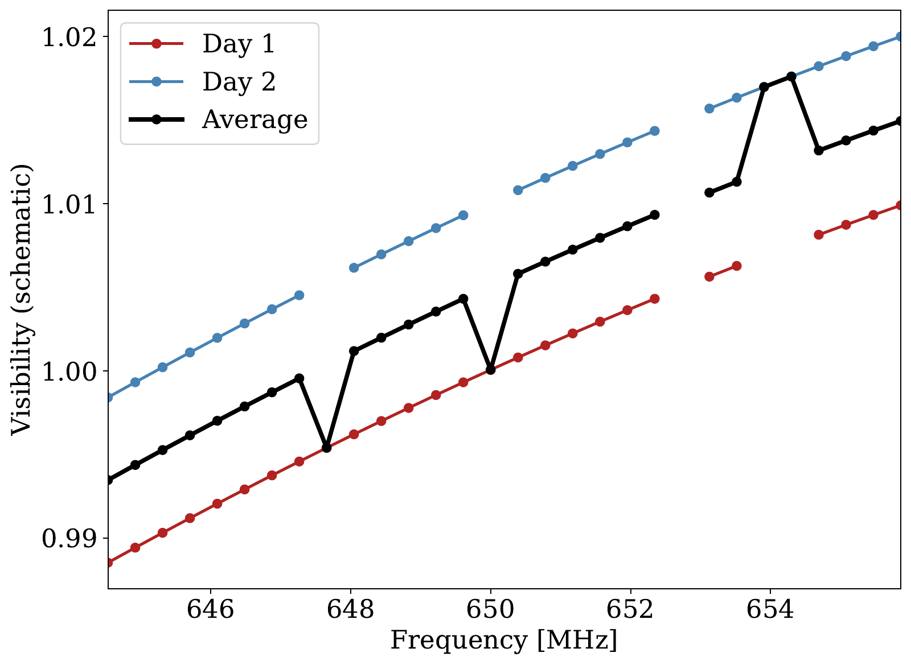
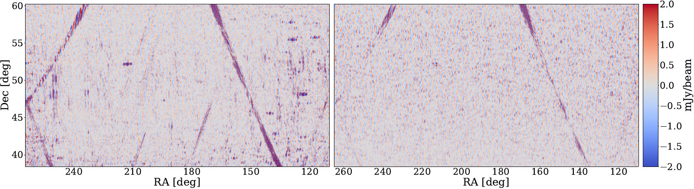
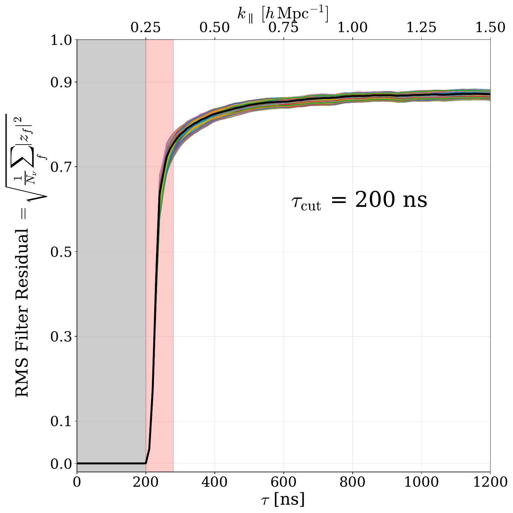
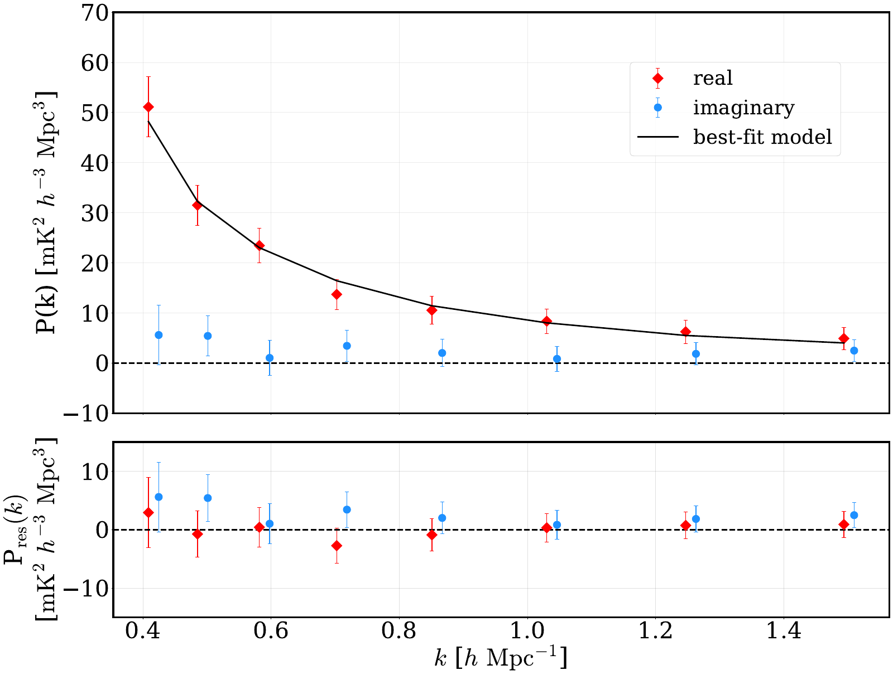
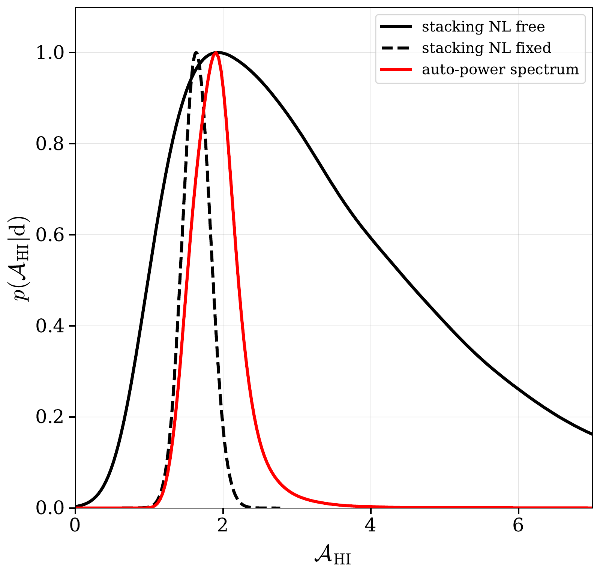

v3.15
Analyzing | Framework v3.15 | unrefereed preprint (arXiv v2, no journal ref) — adversarial posture

> **Access Status** — Full paper: retrieved as the local arXiv v2 PDF (56 pages, dated 30 March 2026; arXiv v2 posted 26 March 2026), read in full with the Read tool, including Appendices A–D and the references; the full-text extraction was available as a backup but not needed · Abstract: read in the PDF, and checked against the arXiv abs page (v1 24 Nov 2025, v2 26 Mar 2026, comment "Minor updates based on improved simulations; conclusions unchanged"; no journal reference) · Figures: all 29 viewed in the PDF page images; the arXiv-source PNGs of Figs. 2, 6, 10, 13 and 23 were viewed separately and are embedded below (numbering checked against the PDF captions) · Supplementary material: none separate. Companion interpretation paper (arXiv:2603.25680, v1 only, 26 Mar 2026) and MeerKAT comparison paper (arXiv:2301.11943, v1 and v2) checked through their arXiv abs pages, which I could only see through a tool summary of each page (details in §2) · Analysis basis: full text.

## 1. Punchy Title & One-Sentence Hook

**CHIME Hears the Hydrogen Hum on Its Own: A 12σ 21 cm Power Spectrum at z ≈ 1 with No Galaxy Survey Needed**

After fifteen years in which radio intensity mapping only "worked" when it borrowed an optical galaxy catalog to tell it where to look, CHIME has pulled the faint, grainy 21 cm glow of neutral hydrogen from 8 to 10 billion years ago straight out of its own data. That glow sits under radio foregrounds about ten thousand times brighter. The catch: the pipeline that makes this possible throws away the very large scales (the baryon acoustic oscillations) that the telescope was built to measure.

## 2. Big-Picture Context

Neutral hydrogen (HI) emits a weak radio line at a rest wavelength of 21 cm (1420.4 MHz). The universe expands, so hydrogen at redshift z shows up at 1420.4/(1+z) MHz. Frequency therefore acts as a distance coordinate: tune a radio receiver across a band and you sweep a slab of the universe along the line of sight. **21 cm intensity mapping** uses this to build three-dimensional maps of the hydrogen glow without resolving individual galaxies. It measures the combined emission of all the hydrogen in each large voxel. In principle that is a cheap, fast way to map large-scale structure over huge volumes, and so to measure the expansion history through the baryon acoustic oscillation (BAO) scale.

In practice the method has been stuck at the "cross-correlation" stage. Our own Galaxy's synchrotron emission and extragalactic radio sources outshine the cosmological 21 cm signal by four to five orders of magnitude. Any spectral wobble the instrument or the software adds to those foregrounds can mimic or swamp the signal. The safe way around this is to correlate the radio map with an optical galaxy survey: foreground junk does not know where the galaxies are, so it averages away, and only the real hydrogen survives. That is how the first detections worked (Green Bank Telescope × DEEP2 in 2010, and later Parkes, MeerKAT and others). CHIME itself used the same route in 2022–2023: it stacked its maps on eBOSS galaxy and quasar positions, getting 7.1σ (LRGs), 5.7σ (ELGs) and 11.1σ (quasars) (CHIME Collaboration 2023, arXiv:2202.01242, v1 only, as listed on the abs page), and it cross-correlated with the eBOSS Lyman-α forest at z ≈ 2.3. Cross-correlation proves the signal exists. But it can only measure the hydrogen clustering times the clustering of the galaxy tracer, and it can never be stronger than the overlap with the external survey allows.

The real goal is the **auto-power spectrum**: the hydrogen map correlated with itself. That is the measurement a standalone 21 cm cosmology machine needs. It is also much harder, because any residual systematic that is stable in time adds positive power and looks just like signal. This paper reports that measurement. It uses 94 nights of 2019 CHIME data in a 608–708 MHz band (z = 1.34 to 1.01, centre z ≈ 1.16) over about 2,200 square degrees near the North Galactic Cap. The result is a spherically averaged power spectrum on scales 0.4 ≲ k ≲ 1.5 h/Mpc, detected at 12.4σ, with two independent half-band detections at 8.6σ and 9.1σ.

**Paper Type & Stakes:** this is an observational methods-and-detection paper from a large instrument collaboration, in which most of the pages describe a rebuilt data-processing pipeline. What is at stake is whether a wide-field, non-tracking cylinder interferometer can control its systematics well enough to stand on its own. That is the prerequisite for CHIME's eventual BAO goal and for successors such as CHORD and HIRAX.

**Prior Belief Check:** the result fits mainstream expectations. Everyone expected that a large enough, well-calibrated array would eventually detect the auto-spectrum, and the amplitude agrees with CHIME's own earlier stacking measurement. What experts will find notable is the *strength* of the first detection (12σ rather than a marginal 3σ), and how it was achieved: by filtering foregrounds on each 10-second sample before any averaging, rather than by relying on a better sky model. It is not a cosmology result. Detecting the signal only at nonlinear scales, with BAO scales discarded, is a milestone in systematics control, not a new constraint on dark energy. The one physics result that could surprise people comes from the companion paper, not this one. There, the measured amplitude and shape disagree with the IllustrisTNG hydrodynamic simulations at 3.1σ (TNG100) and 4.0σ (TNG300), which the authors attribute to nonlinear redshift-space clustering of HI rather than to the total amount of HI (arXiv:2603.25680 v1 abstract, as seen through a tool summary of the abs page).

**Replication & Convergence Note:** this is a single-instrument, single-team result with no independent confirmation at this redshift. The closest comparison is MeerKAT's claimed auto-power detection at much lower redshift (z ≈ 0.32 and 0.44) on Mpc scales (Paul et al., arXiv:2301.11943). The CHIME paper cites MeerKAT's v1 numbers: 8.0σ and 11.5σ. MeerKAT's **v2 (22 June 2026, now published as ApJL 1005, L56)** reports more cautious figures: 3.2σ and 3.5σ with conservative baseline flagging, and 5.9σ and 9.18σ only with a power-spectrum-based flagging method. I read both abstracts only through a tool summary of the arXiv abs pages, not the full MeerKAT paper. So the one external auto-detection the CHIME paper points to has itself become more qualified since CHIME's v2 was posted. Independent confirmation would mean a second instrument (CHORD, HIRAX, Tianlai, or MeerKLASS at higher z) measuring a consistent amplitude at z ≈ 1. Within CHIME, the next step is the same pipeline applied to the roughly seven-year archive. That would test stability, but it would not be independent.

## 3. Necessary Background Crash-Course

### Origins & Big Picture: where the hydrogen at z ≈ 1 came from

The hydrogen CHIME sees is the leftover fuel of galaxy formation. Run the clock forward from the Big Bang. For the first 380,000 years the universe is a hot plasma. Then it cools enough for protons and electrons to combine into neutral hydrogen, and for a few hundred million years ("the Dark Ages") almost all ordinary matter is neutral gas. Tiny density ripples, seeded in the first instant and visible in the cosmic microwave background, grow under gravity. Dark matter collapses into halos, gas falls into them and cools, and the first stars and galaxies light up. Their ultraviolet light then **reionizes** the gas between galaxies. By about z ≈ 6, roughly a billion years after the Big Bang, the intergalactic hydrogen is almost entirely ionized again.

After reionization, neutral hydrogen survives only where it can shield itself: in dense clouds inside and around galaxies, where the gas is thick enough that the outer layers absorb the ionizing radiation before it reaches the core. These are the "damped Lyman-α systems" that quasar spectra reveal. The striking fact is how stable the total amount stays. Measured as a fraction of the critical density, the cosmic HI density sits at a few × 10⁻⁴ from z ≈ 5 down to today. It changes by only a factor of about two, even though the cosmic star-formation rate rises to a peak at z ≈ 2 ("cosmic noon") and then falls roughly tenfold to the present. Hydrogen is constantly being turned into stars and replenished by fresh inflow, a bit like a buffer that stays about half full while traffic through it surges and fades.

CHIME's band catches this buffer at z ≈ 1.0–1.3, 8–9 billion years ago, as star formation is already declining from its peak. At this epoch HI lives mostly in ordinary star-forming galaxies inside moderately massive dark-matter halos. Those halos trace the cosmic web, so the HI glow traces it too, just more weakly or more strongly depending on how strongly HI-rich galaxies cluster relative to the underlying matter. That ratio is the **HI bias**. Two numbers set how bright and how lumpy the 21 cm sky looks: how much HI there is (the HI density) and how clustered it is (the bias). The measured power depends on their product, which is why this paper cannot separate them (§4).

The technique has its own origin story. In the late 2000s, Chang, Pen, Peterson and collaborators argued that you do not need to see individual galaxies to map structure. A coarse map of total 21 cm brightness carries the large-scale clustering information. The 2010 Green Bank detection (in cross-correlation with DEEP2 galaxies) proved the signal was there. CHIME was then designed as a dedicated, cheap, wide-field machine for the BAO scale: four fixed 20 m × 100 m cylinders, 1,024 dual-polarization feeds and no moving parts, with the Earth's rotation sweeping the sky overhead each day. As a side effect it became the world's most prolific fast-radio-burst detector. Its 21 cm path has run through stacking (2023), Lyman-α cross-correlation (2024) and now this auto-spectrum. Within the bigger picture, CHIME sits between the low-redshift HI surveys of nearby galaxies and the high-redshift reionization experiments (HERA, LOFAR, MWA). It covers the "dark energy era" (z ≈ 0.7–2.5), when cosmic acceleration took hold.

### Intensity mapping: measure the aggregate, not the individuals

**Analogy:** a galaxy survey is like logging every packet on a network: precise, but expensive per item. Intensity mapping is like reading the aggregate traffic counters on each switch port. You lose the individual packets but get the load pattern across the whole network almost for free, and the large-scale pattern is what cosmology needs.

**Breaks when:** you ask what sets the brightness of one voxel. A traffic counter reports a definite total. A 21 cm voxel reports total HI *plus* foregrounds that are thousands of times brighter, and no port-counter analogy has a "noise floor that is 10,000× the signal" built in. That gap is the whole difficulty of this paper.

### Interferometers, baselines and "delay": how CHIME sees

CHIME does not form images directly. It correlates the voltages from every pair of feeds; each pair is a **baseline**, and its correlation is a **visibility**. A source off to one side reaches one feed slightly before the other. That arrival-time offset, the **geometric delay**, is at most the baseline length divided by the speed of light. For CHIME's 100 m maximum spacing it is about 330 ns.

Here is the key point, built from scratch. The phase of a visibility is 2π × frequency × delay, so as you step across frequency the phase turns at a rate set by the delay. A source with delay τ makes the visibility oscillate across frequency with a period of 1/τ. **Worked example:** a 200 ns delay gives a period of 1/(200 × 10⁻⁹ s) = 5 MHz. A source on CHIME's longest baseline, low on the horizon, therefore produces a frequency ripple no faster than one cycle every 3 MHz or so. If you Fourier-transform each visibility along frequency ("the delay transform"), smooth-spectrum sky emission piles up below a few hundred nanoseconds. That region is the **foreground wedge**: wider for longer baselines, but bounded.

The cosmological 21 cm signal behaves differently. Each channel (390 kHz wide) is a different redshift slice, so it sees different, independent clumps of hydrogen. The signal therefore varies from channel to channel and spreads power out to high delays. High delay corresponds to small scales along the line of sight. At z = 1.16, a 280 ns delay corresponds to a line-of-sight wavenumber k‖ ≈ 0.35 h/Mpc, a wavelength of about 18 h⁻¹ Mpc. Above that, the sky should be "signal plus noise" only, *if* nothing in the instrument or software has added non-smooth structure to the foregrounds.

### The central difficulty: compressible foregrounds, incompressible signal

> **Concept:** Synchrotron foregrounds have smooth, power-law-like spectra, so a handful of slowly varying numbers per sky direction describe them almost completely. The 21 cm signal is a random field: neighbouring channels are only weakly correlated, so no short description captures it. Foreground removal discards everything a smooth model can predict and keeps the residual. That works only if nothing non-smooth has been stamped onto the foregrounds. The non-smooth stamps include gain ripples, cable reflections, beam chromaticity, and above all data processing (masking a channel, averaging days with different masks). Since the foregrounds are about 10⁴ times brighter, even a 10⁻⁴ fractional non-smooth stamp is as large as the signal.

> **Vehicle:** A lossless compressor fed a slowly varying sensor log shrinks it to a few coefficients; whatever is left after you subtract the compressor's prediction is the genuinely unpredictable part. Feed it a log where one sample was dropped and back-filled with zero, though, and the compressor's model breaks: that glitch shows up in the "unpredictable" residual, at full amplitude.

> **Analogy:** smooth foregrounds ↔ the highly compressible sensor log; the delay filter ↔ subtracting the compressor's low-order prediction; the 21 cm signal ↔ the genuinely incompressible residual; RFI masks, gain jumps and day-to-day averaging with different masks ↔ dropped samples and back-fills that turn compressible data into fake incompressible content.

> **Breaks when:** you ask how to tell real incompressible content from manufactured incompressible content. A compressor cannot tell; a residual is a residual. The paper can, only statistically: real hydrogen is the same every night, unpolarized, isotropic and independent of which baselines or sky patches you use, and it correlates with eBOSS quasars. That is why Section 7's null tests carry as much weight as the detection itself.

Figure 2 shows the most important manufactured-content mechanism in miniature.



*Figure 2 (from the paper): schematic. Two days' visibilities (red, blue) are each perfectly smooth but differ by a 1% gain; different channels are masked on each day (gaps). Their average (black) jumps wherever only one day contributes.*

**What to look at:** neither coloured line has any structure, yet the black average is jagged. Averaging-then-filtering creates high-delay power out of pure foreground. That is why CHIME now filters each 10-second sample *before* averaging.

### The power spectrum and the noise-bias trick

The **power spectrum** P(k) is the variance of the map broken down by spatial scale: how much the brightness fluctuates on wavelength 2π/k. Units here are mK² (h⁻¹ Mpc)³, temperature-squared times volume. Squaring a noisy map always adds positive noise power, the "noise bias", which would swamp a weak signal. CHIME splits the 94 nights into two interleaved halves ("even" and "odd" days) and multiplies one half's map by the other's. Noise is independent between the halves, so on average it cancels; sky signal is common to both, so it survives. Because the two halves are independent complex maps, their cross-power has a real part (sky signal plus noise) and an imaginary part that should contain only noise. That gives a built-in null test.

**Analogy:** comparing two independent replica logs of the same events. Shared events line up; each replica's private jitter does not, so it averages away.

**Breaks when:** the error is shared by both replicas. A foreground leak that is stable from night to night appears in both even and odd days and survives the cross-correlation exactly like signal. The even/odd split removes noise bias; it does *not* remove stable systematics.

### Bias, Ω_HI and redshift-space distortions: why only a product is measured

On the scales measured, the 21 cm power is roughly (mean HI brightness)² × (HI clustering strength)² × (matter power). The mean brightness is proportional to the HI density, Ω_HI. The clustering strength is the HI bias plus an extra term from **redshift-space distortions**: galaxies falling toward overdensities are Doppler-shifted, which squashes structures along the line of sight and boosts the apparent clustering by an amount set by the growth rate f (the Kaiser effect). On small scales, random internal motions smear structures along the line of sight instead ("Fingers of God"). The paper packages the degenerate product into one amplitude parameter, the one equation the headline result rests on:

$$\mathcal{A}_{\rm HI}^{2} = 10^{6}\,\Omega_{\rm HI}^{2}\,\left(b_{\rm HI} + \langle f\mu^{2}\rangle\right)^{2}$$

**Symbol definitions:**
$\mathcal{A}_{\rm HI}^{2}$ : the measured amplitude of the 21 cm power spectrum (dimensionless)
$\Omega_{\rm HI}$ : mean density of neutral hydrogen as a fraction of the critical density (≈ 6 × 10⁻⁴ expected at z ≈ 1.16)
$b_{\rm HI}$ : HI bias, how much more strongly HI clusters than dark matter
$\langle f\mu^{2}\rangle$ : the average redshift-space boost; f is the growth rate and μ the cosine of the angle to the line of sight; fixed at 0.761 here

**What this actually means:** the telescope measures "amount × clumpiness", like a network monitor that reports total bytes × burstiness but not either factor alone. Double the HI and halve the excess clustering and the power barely moves. Splitting them needs an outside prior on one factor.

> **Central analogy for this paper:** signal is what the smooth predictor can't compress.

## 4. Core Technical Explanation

### The flow, end to end

*Analyst-built concept diagram (not from the paper):*

```
 102 nights 2019 (night-only) --> drop 8 bad days --> 94 nights
           |
           v
 RFI masking: radiometer test | fringe-rate | delay chi2
 (38.7% of 608-708 MHz night data masked)
           |
           v
 NS beamforming, achromatic triangular weights
 (1217 beams, |y|<0.4; long NS baselines >73 m dropped)
           |
           v
 PER-SAMPLE delay filter (tau_cut = 200 ns, every 10 s)
 + HyFoReS bandpass-leak fix + cross-talk subtraction
           |
           v
 rebin in ERA -> even / odd day stacks -> m-mode maps
           |
           v
 masks: 40 HI absorbers, bright-source tracks (~33% sky)
           |
           v
 delay transform -> keep tau > 280 ns (k_par > 0.35)
 cross even x odd -> 2D P(k_perp,k_par) -> 8 k-bins
           |
           v
 1000 noise sims -> covariance -> Delta chi2 -> 12.4 sigma
```

Read it top to bottom. Each box removes one way of manufacturing fake high-delay power, and the last box checks whether what survives exceeds what noise alone would produce.

### Step 1: harsher, smarter RFI removal

Human-made radio interference (TV, cellular, aircraft reflections, satellites) is spectrally sharp, so it lands at exactly the high delays where the signal lives. The authors replace their earlier flagging with three independent detectors and OR their masks together.

- A **radiometer test** compares the measured variance of each visibility (from differences of 30 ms samples) with the variance predicted from the feeds' own auto-correlations. Pure thermal noise gives a ratio of 1. RFI, which is coherent across baselines, pushes it up.
- A **fringe-rate filter** uses the fact that steady sky sources drift through the beam at a known maximum rate set by Earth's rotation. Anything varying faster, such as TV signals bouncing off aircraft or meteor trails, must be transient.
- A **delay-space χ² test** filters out foregrounds aggressively and flags whatever residual remains at high delay.

In the analysis band these remove 38.7% of night-time data (Table 1), on top of daytime data, which is excluded entirely. The authors deliberately err toward over-masking. A by-product of the radiometer test is worth noting: the measured noise is consistently at least 2.3% higher than the radiometer equation predicts, "a behavior observed across days and polarizations whose origin remains unknown" (Appendix A.1).

### Step 2: make the beam the same at every frequency

An interferometer's synthesized beam naturally shrinks as frequency rises, because the same baseline spans more wavelengths. A beam that changes with frequency is itself a spectral structure: a point source sitting on a sidelobe at one frequency and in a null at the next gets a ripple. CHIME now weights its north–south baselines with a triangular taper whose width is scaled with frequency. Short baselines get more weight at higher frequency, so the beam (FWHM ≈ 20′ at zenith) stays the same shape across the band. This gives up a little point-source sensitivity in exchange for spectral smoothness.

### Step 3: filter before you average (the key change)

This is the change that most clearly separates this pipeline from the 2023 one. Figure 2 showed why: averaging days with different channel masks, then filtering, injects foreground power into high delays. CHIME now applies the delay filter (DAYENU, an inverse-covariance filter that treats everything below 200 ns as foreground) to *every 9.94-second integration*, using that integration's own mask, before any averaging. The filter, and the way it shapes the noise, are carried along through every later step, so they can be applied identically to simulations.

Two further cleanups target leaks the filter cannot catch:

- **HyFoReS** notices that the residual leakage from bright sources shares a common frequency pattern across all sources. That pattern is the signature of a small error in the daily bandpass calibration. HyFoReS estimates this pattern by cross-correlating the filtered data with a foreground template over the whole sky, then subtracts it.
- **Cross-talk subtraction** handles the additive offset from receiver noise leaking between neighbouring feeds. CHIME estimates it from a fixed one-hour stretch of sky each quarter and subtracts it after filtering.

The result shows up in the maps (Fig. 6) and in the delay response (Fig. 10).



*Figure 6 (from the paper): foreground-filtered map at 678.5 MHz near the North Galactic Cap. Left, the 2023 pipeline; right, the new pipeline, same data.*

**What to look at:** the blotches, streaks and vertical striping on the left largely vanish on the right. The diagonal "U" tracks that remain are very bright sources (Cyg A, Cas A and others) leaking in through far sidelobes; they get masked in Step 5.



*Figure 10 (from the paper): how much of a unit-amplitude sinusoid at delay τ survives the stacked foreground filter (bottom axis delay, top axis k‖ at z = 1.16). Coloured lines are different sky positions (RFI masks of 15–21%); black is the median.*

**What to look at:** below 200 ns (grey) nothing survives; between 200 and 280 ns (pink) the response climbs steeply; above that it plateaus near 0.85. The analysis keeps only τ > 280 ns, i.e. k‖ > 0.35 h/Mpc, and that cut is what removes the BAO scale (wiggles at roughly 0.05–0.3 h/Mpc).

### Step 4: maps, absorbers and the even/odd split

The 94 nights are split into even and odd stacks per quarter of the year. Each stack is combined across east–west baselines into maps using CHIME's "m-mode" method, which works in Fourier space with respect to the Earth's rotation angle. The field is 110°–265° in right ascension and 38.4°–60.2° in declination, 0.67 sr, with 385 hours of effective integration. Single-channel noise is about 0.5 mJy/beam.

A side discovery: the clean maps reveal 40 narrow-band *absorption* features at S/N > 7, stable night to night. One is the known 21 cm absorber B1543+480 at z = 1.277 (Fig. 7). The other 39 are new candidate absorption systems. Each is masked over 27 channels (1.29% of voxels), because the high-pass filter turns a narrow absorption dip into ringing side-lobes that would contaminate the spectrum. After masking, the voxel histogram matches the even-minus-odd jackknife map. Both are 10–15% wider than a unit Gaussian, which the authors attribute to sky-temperature-dependent noise not included in the fast-cadence noise estimate.

### Step 5: spatial masks, then the power spectrum

Bright continuum sources still leak power through the far sidelobes of the primary beam, because CHIME's sparse east–west sampling cannot localize them well. The authors mask:

- elliptical patches around every source above 10 Jy as it transits;
- the full sky tracks of sources above 60 Jy;
- a patch tied to the inner Galactic plane seen in the sidelobes.

Together these remove about 33% of the field. They then form the delay spectrum of each pixel with a regularized inverse-covariance estimator, Fourier-transform the maps spatially, cross-multiply even × odd, and average into cylindrical bins (k⊥, k‖) and then into 8 spherical bins from 0.41 to 1.49 h/Mpc. The k⊥ range is limited to 0.08–0.48 h/Mpc, so the spherical bins are dominated by line-of-sight modes. They convert to physical units with a full end-to-end simulation: a flat-spectrum sky, mock visibilities, the same pipeline. The same conversion is applied to data, signal model and noise, so the filter's signal loss is forward-modelled rather than corrected after the fact.

The noise covariance comes from 1,000 Monte Carlo noise realizations pushed through the whole pipeline. Each realization is scaled per pixel to match the spatial variation of the even–odd jackknife, so it captures sky "self-noise". Adjacent k-bins are correlated by at most about 15% (Fig. 11).

### The result



*Figure 13 (from the paper): the heart of the paper. Real part (red) and imaginary part (blue) of the spherically averaged Stokes-I power spectrum, 608–708 MHz, z ≈ 1.16; black is the best-fit four-parameter HI model. Bottom: residuals.*

**What to look at:** the red points fall smoothly from about 51 mK² h⁻³Mpc³ at k = 0.41 to about 5 at k = 1.49, each well above zero. The model goes through them with χ² = 1.6 (p = 0.92). The blue imaginary points, which should be pure noise, scatter around a few mK². (Note that every one of them sits above zero; see the Claim check.)

The 2D spectrum (Fig. 12) is noise-dominated bin by bin (±3σ), with no visible wedge-shaped leakage. The signal emerges only once tens of thousands of (k⊥, k‖) cells are averaged into 8 shells. Splitting the band in half gives two independent detections:

| Band | z range | S/N (F-based, paper's headline) | A²_HI (stat) |
| --- | --- | --- | --- |
| 608.2–707.8 MHz | 1.34–1.01 | **12.4σ** | 3.55 (+0.96 / −1.32) ± 0.61 sys |
| 658.2–707.8 MHz | 1.16–1.01 | **8.6σ** | 2.47 (+1.59 / −1.08) ± 0.43 sys |
| 608.2–658.2 MHz | 1.34–1.16 | **9.1σ** | 3.24 (+6.79 / −2.11) ± 0.56 sys |

*Table (from the paper's Table 2 and §6.2.3, key columns only).*

**What to look at:** the two half-bands agree within 1σ. The model predicts only about 13% evolution between them, so the data cannot yet see evolution; the asymmetric errors reflect strongly non-Gaussian posteriors.

The significance comes from a likelihood-ratio test. They compare χ² for "no signal" with χ² for the best-fit model, and calibrate the resulting χ² difference against the 1,000 noise simulations. They choose an F distribution rather than χ², because the covariance is itself estimated from simulations and has its own scatter. The more naive χ² and amplitude-only versions give 13.0σ and 13.6σ; the paper conservatively headlines the lowest number.

### Validation: what would a fake look like, and does the data show it?

The authors run ten checks. Each is designed so that a specific contaminant would show up as a mismatch, while real hydrogen would not.

- **Imaginary part:** consistent with noise (χ²/dof = 0.82, p = 0.58), which argues against phase-calibration errors between halves.
- **Even-minus-odd nights:** consistent with zero (p = 0.90 real), which argues against transient RFI.
- **Stokes Q:** Q is the XX−YY difference map. Unpolarized HI should cancel in it, while polarized foregrounds leaking through Faraday rotation would not. It is consistent with noise (p = 0.21, 0.33).
- **RA halves and declination halves:** simulated Galactic emission has over 40% more variance in one RA half, yet the spectra match (p = 0.54, 0.46).
- **Baseline subsets:** the 22 m baselines alone versus 22+44+66 m match (p = 0.75). Foreground leakage should grow with baseline length.
- **Sub-bands:** they agree. Synchrotron foregrounds rise steeply toward low frequency, so leakage would inflate the lower band.
- **Mask thresholds:** lowering the track-mask threshold from 60 to 20 Jy, or the transit-mask threshold from 10 to 2 Jy, changes nothing beyond noise. For the transit mask, a source-leakage model predicts that the leaked power should drop to 0.45 of its value (about 55% less); no such drop appears.
- **Cross-check with eBOSS:** stacking the same maps on 33,119 eBOSS quasars recovers the signal at 9.1σ. The amplitude inferred from stacking agrees with the auto-spectrum's within 1σ (Fig. 23).



*Figure 23 (from the paper): posterior for the clustering amplitude A_HI from quasar stacking (black solid, nonlinear parameters free; black dashed, fixed) and from the auto-power spectrum (red, square root of A²_HI).*

**What to look at:** the red peak sits at about 1.9, inside the broad black stacking posterior (peak ≈ 1.9). A residual systematic would inflate the auto-spectrum but not the cross-correlation, so it would push the red curve to the right. It does not. Note also how much narrower the auto constraint is.

This last test is the strongest single argument. Additive foreground leakage, RFI and instrument artefacts are uncorrelated with quasar positions, so they bias the auto-spectrum upward but not the stacking. A 1σ match therefore caps any additive contamination at roughly the stacking error, which is large (A_HI = 1.93 +2.50/−0.93 with nonlinear parameters free).

### Claim check

Checks were run in Python (`claim_check.py` in the work directory). The data points were read by eye from Figs. 13 and 16, and the covariance was built from Fig. 11's correlation matrix, so expect a few-percent reading error.

**1. Detection significance — Reproduced.** The paper claims 12.4σ (F-based), 13.0σ (χ²-based) and 13.6σ (amplitude-only). From the read-off bandpowers and covariance I get a χ² difference of about 183, which converts to 12.4σ with the paper's F(3.6, 992) prescription, 13.0σ with χ², and 13.5σ for an amplitude-only matched filter. The fit χ² ≈ 1.6 also matches. The headline number follows from the plotted data and the stated statistics.

**2. Scale and geometry bookkeeping — Reproduced.** With the Planck parameters the paper uses, 200 ns and 280 ns map to k‖ = 0.25 and 0.35 h/Mpc at z = 1.16. The band's comoving depth (≈ 502 h⁻¹ Mpc) gives a k‖ bin width of 0.0125, against 0.012 stated. The field's area comes out at 0.667 sr (2,190 deg²), against 0.67 sr and 2.2 × 10³ deg². The quoted 0.45 leakage factor for the transit-mask test is (2/10)^0.5, as printed.

**3. Amplitude consistency — Reproduced, with an interpretive note.** √3.55 = 1.88 (68%: 1.49–2.12) against stacking's 1.93, consistent. As an illustration only: if one adopts the Crighton et al. fit the paper uses for the HI density (Ω_HI ≈ 6.4 × 10⁻⁴ at z = 1.16), the amplitude implies an HI bias of about 2.2 (1.6–2.6). That is on the high side of typical HI-bias expectations near 1–1.5 at this redshift, and it points in the same direction as the companion paper's tension with IllustrisTNG. But the phenomenological nonlinear terms soak up part of the amplitude at these k, so this is not a clean bias measurement *(analyst inference)*.

**Sensitivity check.** The detection depends most on the three lowest-k bins (0.41–0.58 h/Mpc). On a diagonal approximation they carry about 72% of the squared S/N, and they sit closest to the filter's transition band. Dropping the lowest bin leaves about 11.5σ, the lowest two about 9.2σ, the lowest three about 6.9σ (amplitude-only). So the *detection* survives any plausible problem confined to the edge bins. The *amplitude*, and any shape inference, rests mostly on bins whose signal-loss correction (forward-modelled; the filter still removes about 10% of the signal near 0.4 h/Mpc relative to its high-delay plateau) must be right. A 20% error in that transfer function would move A²_HI by about 20%, within the current error bars.

**Robustness test (observational: alternative explanations and nulls).** The suite of null tests is unusually thorough, and the even/odd, baseline, RA/Dec, sub-band and mask-threshold tests each target a distinct contaminant. Their weak point is the statistic: each is an 8-bin χ² omnibus test, which is insensitive to a small *same-sign* offset across all bins.

**4. Internal consistency — one moderate finding, one minor.**

*Moderate (analyst observation from the figures, not a refutation):* all **8 of 8** imaginary bandpowers in Fig. 13 are positive. Under a pure-noise null the chance of that is about 0.8%. A correlation-aware weighted mean gives +2.3 ± 1.2 mK², about 1.9σ. The Stokes-Q real part in Fig. 16 is positive in 7 of 8 bins: weighted mean +2.9 ± 1.2 mK², about 2.4σ, or roughly 10–30% of the Stokes-I power in several bins. The paper reports only the χ² p-values (0.58 and 0.21). Those are correct but blind to a coherent offset. A positive Q signal may be benign: real unpolarized HI leaking into pseudo-Q through XX/YY beam differences would produce exactly this. Taken together, though, the two patterns mean "consistent with noise" is weaker evidence than it reads, and the Stokes-Q test bounds polarized leakage less tightly than §7.3's "rules out" language implies. Neither pattern threatens a 12σ detection. Both bear on percent-level amplitude claims.

*Minor:* the arXiv abstract metadata still shows the v1 significances (12.5σ, 8.7σ, 9.2σ), while the v2 PDF gives 12.4σ, 8.6σ and 9.1σ. §7.10 quotes the auto-spectrum as "13.1σ", which matches neither the headline 12.4σ nor Table 2's χ²-based 13.0σ.

### Assumption Audit

> **Watch:** Reader likely assumes "first auto-correlation detection" means CHIME has now measured cosmology from 21 cm alone (BAO, expansion history). The paper actually measures only nonlinear scales, k ≈ 0.4–1.5 h/Mpc. The 280 ns cut removes the BAO scale entirely, and the authors say so (§8). What is constrained is one degenerate amplitude, "amount of HI × clumpiness", plus two phenomenological shape parameters with no clean physical meaning. The milestone is systematics control, not a cosmological parameter.

> **Watch:** Reader likely assumes a 12.4σ detection means the *amplitude* is known to about 8%. The paper actually has a 12σ rejection of "no signal", but A²_HI = 3.55 carries a roughly −37%/+27% statistical error plus about 17% systematic. The best-fit nonlinear parameters sit at extreme values near prior edges, which the authors acknowledge. Most of the S/N comes from the three lowest-k bins, next to the filter edge, where the forward-modelled signal loss matters most. Detecting the signal and measuring it are different things here.

> **Watch:** Reader likely assumes "without reliance on external galaxy surveys" means the result is free of outside inputs. The paper actually does not need eBOSS for the *detection*. But the conversion to physical units uses end-to-end simulations through a beam model (rev_03). The noise covariance is calibrated to the even–odd jackknife. The redshift evolution of Ω_HI and b_HI is fixed to the Crighton et al. and IllustrisTNG fitting functions. And the eBOSS stacking is the single strongest argument against residual additive systematics. "Standalone" describes the signal, not the validation.

> **Watch:** Reader likely assumes the null tests "passing" means no systematic is present. The paper actually shows that each test is consistent with noise under an 8-bin χ². That bounds systematics only at the level the test is sensitive to. As the Claim check shows, a small same-sign offset can pass such tests (imaginary part 8/8 positive; Stokes Q 7/8 positive). The test that does bound additive contamination directly, the agreement with stacking, has wide error bars.

## 5. What's Genuinely New or Clever

The sharpest idea is **treating the data-processing order itself as a systematic, and fixing it by filtering before averaging**. The radio-cosmology community has long known that masks couple to foregrounds. Figure 2 puts it in five lines: two smooth days, two different masks, one jagged average. The standard pipeline (CHIME 2023 included) averaged first and filtered later, so every day's different RFI mask and gain stamped high-delay structure into an average that was then too contaminated to clean. Filtering every 10-second integration with its own mask, and carrying both the filter and its noise covariance through every later linear step, turns the problem from "build a better sky model" into "never create non-smooth structure in the first place". It is computationally heavy, but it is general, and it is what other arrays (HIRAX, CHORD, MeerKAT) can adopt directly. That is new to the field as a demonstrated end-to-end practice, not just to the reader.

The second clever move is **building the validation around physical asymmetries between signal and contaminant**, rather than around a single goodness-of-fit. simulated Galactic emission varies over 40% more in one RA half; foreground leakage scales with baseline length; synchrotron rises toward low frequency; polarized leakage would appear in Q; additive junk does not correlate with quasars. Each split is chosen so that a specific contaminant must break the symmetry. The transit-mask test even makes a quantitative prediction (a 55% drop in leaked power from 10 Jy to 2 Jy thresholds) that the data refute. Together with the auto-versus-stacking amplitude match, this is the most complete case yet that a 21 cm auto-signal is sky hydrogen.

A smaller but real bonus: 39 new candidate 21 cm absorbers at z ≈ 1.0–1.3 found as a by-product of the cleaned maps. That opens a separate science channel (HI absorption toward radio sources) from the same data.

### Predictive Content Check

1. **Falsifiable handle (always):** the measurement makes concrete, checkable statements. (a) Any independent instrument mapping HI at z ≈ 1.0–1.3 should find a power-spectrum amplitude A²_HI ≈ 3.6 (roughly 2.2–4.5 at 68%) on 0.4–1.5 h/Mpc, with the shape in Fig. 13 (about 50 mK² h⁻³Mpc³ at k = 0.4 falling to about 5 at k = 1.5). (b) Adding CHIME's remaining ~6 years should raise the significance roughly as the square root of the number of nights, with the half-band amplitudes converging toward the model's 13% evolution. (c) Lower transit-mask thresholds should continue to leave the power unchanged. If CHORD, or CHIME's full archive, finds the amplitude shrinking as masks tighten or as more data are added, the signal was partly systematic. The companion paper adds a physics handle: IllustrisTNG's HI is too weakly (or wrongly) clustered in redshift space at these scales, at 3–4σ, and better-modelled simulations should close that gap without changing the total HI content.

2. **Formalism load:** skipped. The pipeline's linear algebra (inverse-covariance filters, propagated covariances, forward-modelled transfer functions) is plainly doing its job; the only fitted model has four parameters and is described as phenomenological.

## 6. Limitations & Open Questions

**The BAO scale and all linear scales are removed.** The 200 ns filter plus the 280 ns cut leaves only k ≳ 0.35 h/Mpc, so the measurement cannot yet do the cosmology CHIME was built for. **(A) Consensus** — the authors state it directly, and foreground-avoidance at low k‖ is a known trade-off across the field. **(paper §8, §5.3)**

**Only a degenerate amplitude is constrained.** Ω_HI and b_HI cannot be separated without an external prior; splitting them needs a prior from DLAs, galaxy HI surveys or simulations. **(A) Consensus** — this is intrinsic to auto-spectrum intensity mapping and acknowledged. **(paper §6.2.3)**

**The shape model is phenomenological, and its best fit sits at extreme parameter values.** The best-fit values of the four parameters (HI-density scaling, bias scaling, nonlinear mixing, Fingers-of-God scaling) are (2.8, 0.24, 0, 0.29) for the full band, with similarly odd values in the sub-bands, some near prior edges. The authors argue the marginal posteriors are what matter. **(B) Contested** — some modellers will accept a marginalized amplitude from a degenerate four-parameter fit; others will want a physically motivated nonlinear HI model before trusting the amplitude. **(paper §6.2.2)**

**The noise model is approximate at the ~10% level.** The per-baseline noise scaling is assumed to go as 1/redundancy, time-to-rebinning correlations are ignored, and the sky-noise template is frequency-independent. The masked-map histograms are 10–15% wider than the fast-cadence noise predicts, and the measured radiometer noise is 2.3% high for unknown reasons. A 10% underestimate of the errors would lower the headline significance by roughly 1σ, not erase it. **(B) Contested** — the authors judge the residuals adequate after jackknife scaling; a stricter referee could ask for an end-to-end noise validation independent of the jackknife used for calibration. **(paper §5.4, §3.8, App. A.1)**

**The null tests use omnibus χ² statistics that miss coherent offsets.** The imaginary bandpowers are all positive (about 1.9σ coherent), and Stokes-Q real power is positive in 7 of 8 bins (about 2.4σ coherent, about 10–30% of the I power in several bins). These are not reported in the paper. **(C) Speculative** — this comes from my recomputation using values read off Figs. 13 and 16 and the Fig. 11 correlation matrix; reading error and the post-hoc choice of test weaken it, and I/Q beam leakage of real HI could explain the Q pattern harmlessly. **(analyst inference)**

**The significance is concentrated next to the filter edge.** About 72% of the squared S/N sits in the three lowest-k bins, where the filter still attenuates the signal by up to about 10% relative to its plateau and the forward-modelled transfer function carries the amplitude. **(C) Speculative** — the paper forward-models this carefully and the Appendix C prior test shows stability; the concern comes from my recomputation of where the S/N lives, not from evidence of an error. **(analyst inference)**

**Heavy masking and one small field.** About 33% of the field is spatially masked, 38.7% of in-band night data are RFI-masked, the upper sub-band loses about 50% of channels, and only 94 nights from 2019 over 2,200 deg² are used. One unexplained variable point source appears in both data and noise maps (masking it changes nothing). **(A) Consensus** — this is the authors' own stated scope; it limits statistical power and the generality of the systematics control to other sky regions. **(paper §2.4, §3.1, App. B)**

**Intracylinder baselines are excluded, and their cross-talk is untreated.** This removes the largest angular scales and defers the treatment of the strongest cross-talk. **(A) Consensus** — explicitly deferred by the authors. **(paper §3.6, §8)**

**One of the three noise-realization sets failed a KS test for the F-distribution fit.** The authors show it is a mild outlier, but the headline significance averages over sets. **(B) Contested** — the authors' treatment is reasonable; others might prefer a larger simulation set before quoting σ to the first decimal place. **(paper App. D.1)**

**There is no independent confirmation at z ≈ 1, and the cited external auto-detection has weakened.** MeerKAT's z ≈ 0.3–0.4 claim, cited by CHIME at 8.0σ and 11.5σ, now reads 3.2σ and 3.5σ with conservative flagging in its published v2. **(A) Consensus** — single-instrument status is a fact; the MeerKAT revision comes from its arXiv v2 abstract, seen only through a tool summary. **(broader literature)**

**Open questions for the next 12–24 months:** Can a better beam model and a gentler filter recover k‖ ≈ 0.1–0.2 h/Mpc, and with it the BAO scale? Does the amplitude hold steady as the full archive is added? What are the 39 new absorber candidates? And does the IllustrisTNG tension point to HI velocity structure in halos that the simulations get wrong?

## 7. Detailed Summary & Explanation

The CHIME Collaboration reports the first detection of the 21 cm intensity-mapping signal in auto-correlation at redshift about one. In plain terms, the radio glow of neutral hydrogen in galaxies 8–9 billion years ago has been measured from the radio maps alone, without using a galaxy catalog to locate it. From 94 clean nights of 2019 data in a 100 MHz band (z from 1.34 down to 1.01), over about 2,200 square degrees near the North Galactic Cap, they measure the power spectrum on scales of roughly 4 to 16 h⁻¹ Mpc. The signal is 12.4 standard deviations above a noise-only hypothesis using their most conservative statistic. Each half of the band, analysed independently, also detects it at 8.6 and 9.1 standard deviations.

Most of the paper is about how they got the foregrounds out. Galactic and extragalactic radio emission is about ten thousand times brighter than the hydrogen signal, but it is spectrally smooth. The hydrogen is not, because each frequency channel samples a different slice of the universe. Filtering out smooth spectral structure leaves the hydrogen, as long as nothing has made the foregrounds non-smooth. The new pipeline is built around never creating such structure:

- three independent RFI detectors;
- a beam that keeps the same shape across frequency;
- foreground filtering applied to every 10-second sample before any averaging;
- a whole-sky correction for a bandpass calibration error;
- cross-talk subtraction after filtering;
- masks over bright-source tracks and 40 newly found hydrogen absorbers.

The noise and the filter's signal loss are both modelled by pushing simulations through the identical pipeline.

The validation is the paper's strongest asset. The signal is unchanged between halves of the sky with different Galactic brightness, between declination halves, between short and long baselines, between the two sub-bands, and across progressively harsher source masks. It is absent from night-to-night differences, from the imaginary part and from the polarized Stokes-Q map. Its amplitude matches what the same maps give when stacked on 33,119 eBOSS quasars. Additive contamination would inflate the auto-spectrum but not the stacking, so that last match is the most direct evidence that the power is real hydrogen.

Physically, the result constrains one combination: the square of (HI density × (HI bias + redshift-space boost)). The best-fit value is A²_HI ≈ 3.6, with statistical errors of roughly a third. The companion paper finds this amplitude and shape disagree with IllustrisTNG simulations at 3–4σ, apparently because the simulations' small-scale velocity-space clustering of HI is wrong rather than its total quantity.

**Why I framed it this way.** I treat this as a systematics-control milestone rather than a cosmology result, for two reasons. The authors themselves say the BAO scale is gone. And the parameter measured is a degenerate amplitude fit with a phenomenological shape model. I gave the validation suite almost as much weight as the detection, because in an auto-spectrum the hard question is not "is there power?" but "is the power hydrogen?". My own checks reproduce the headline significance from the plotted data, so the number is sound. The caveats I add (coherent same-sign patterns in two null tests, S/N concentrated at the filter edge) bear on how precisely the amplitude is known, not on whether the detection is real. Under the adversarial posture the paper earns its central claim: the detection is real and well defended, and the interpretation layer is preliminary by the authors' own description.

**Where I'm least confident in this analysis:** the coherent-offset finding in the imaginary and Stokes-Q bandpowers rests on values I read by eye from the figures. I applied Fig. 11's Stokes-I correlation matrix to those null spectra, and I chose the test after seeing the data. It may be a 2σ look-elsewhere artefact, or harmless I→Q beam leakage of real HI, and I cannot check it without the tabulated bandpowers. More broadly, I explained the delay filter, HyFoReS and m-mode map-making at the level of what they protect against. I did not verify their implementation, and subtle signal loss or leakage would live in exactly those details.

**Revision notes:** the referee pass added the MeerKAT v1→v2 change, the S/N-by-bin sensitivity check, the 13.1σ vs 12.4σ text inconsistency, the noise-model significance impact, and explicit "detection ≠ measurement" framing; it cut a derivation of the delay-to-k‖ conversion and trimmed the RFI-method detail.

## 8. Three Crystallized Takeaways

1. A Canadian radio telescope with no moving parts has detected the faint collective glow of hydrogen gas from 8–9 billion years ago from its own maps alone, at 12 standard deviations. It never needed an optical galaxy survey to tell it where to look, though it used one afterwards to confirm the result.

2. The breakthrough came from software discipline more than hardware: the radio sky is ten thousand times brighter than the signal, and the team won by filtering every ten-second snapshot *before* averaging, so that the mismatch between days could not manufacture fake signal.

3. This proves the method works, not yet the cosmology. The scales that carry dark-energy information (the baryon acoustic oscillations) were deliberately thrown away to make the detection clean, and the measurement only gives "amount of hydrogen × how clumpy it is" as a single number.

## 9. Shorter Summary

Neutral hydrogen gives off a faint radio signal at a wavelength of 21 centimetres. Because the universe expands, hydrogen at different distances shows up at different radio frequencies. A radio telescope can therefore make a three-dimensional map of hydrogen without seeing individual galaxies, a technique called intensity mapping. Until now, this signal has only been detected by matching radio maps against optical galaxy catalogs. Radio emission from our own Galaxy is about ten thousand times brighter and buries the hydrogen otherwise.

The CHIME telescope in British Columbia has now detected the hydrogen signal on its own. Using 94 nights of 2019 data, it measured how strongly the hydrogen glow clumps on scales of roughly 20–75 million light-years, at a time 8–9 billion years ago. The detection is 12 standard deviations strong, and each half of the frequency band detects it independently.

The key was a rebuilt data pipeline. Galactic radio emission changes smoothly with frequency, while the hydrogen signal does not. The team removed smooth structure from every ten-second snapshot before averaging, so that differences between nights could not create fake signal. They also masked interference, bright radio sources and 40 newly found hydrogen absorption features. A long series of checks argues that the signal is real hydrogen: it is the same in different sky regions, with different antenna spacings and in both frequency halves, and it agrees with an independent measurement that matches the maps against quasar positions.

The limits are clear. To make the detection clean, the team discarded the large scales that carry information about dark energy. The measurement constrains only the amount of hydrogen multiplied by how strongly it clusters. A companion paper finds that a leading galaxy simulation predicts the wrong clustering at 3–4 standard deviations. No other telescope has yet confirmed the signal at this distance.

---
*Analysis generated 2026-10-03 by Claude (headless pipeline), Framework v3.15; source: arXiv:2511.19620v2 (unrefereed preprint; adversarial posture). Numeric checks: `claim_check.py`.*
