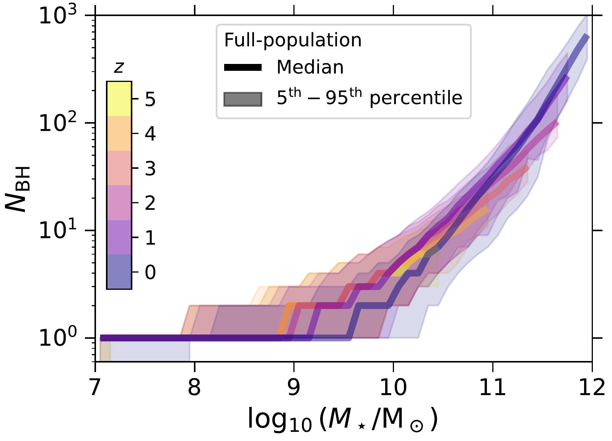
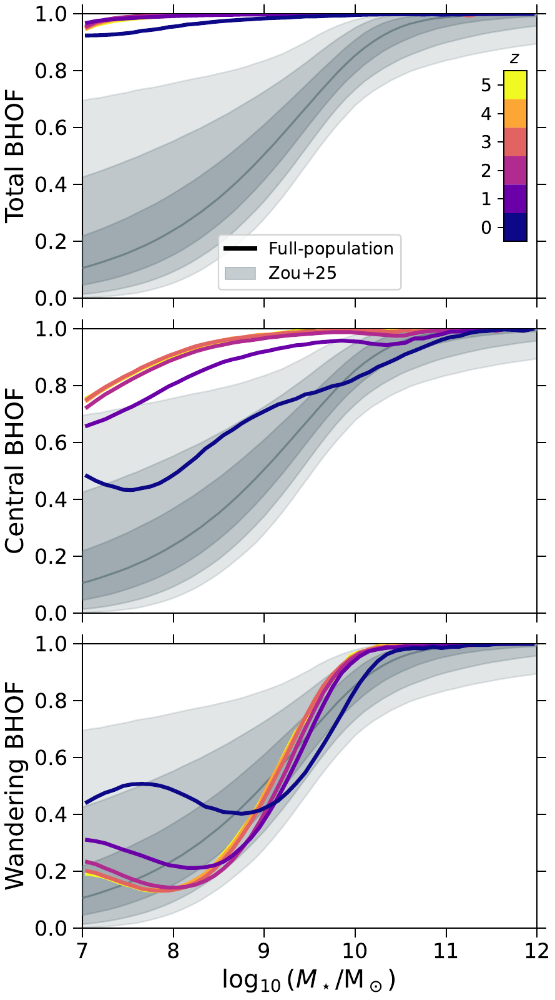
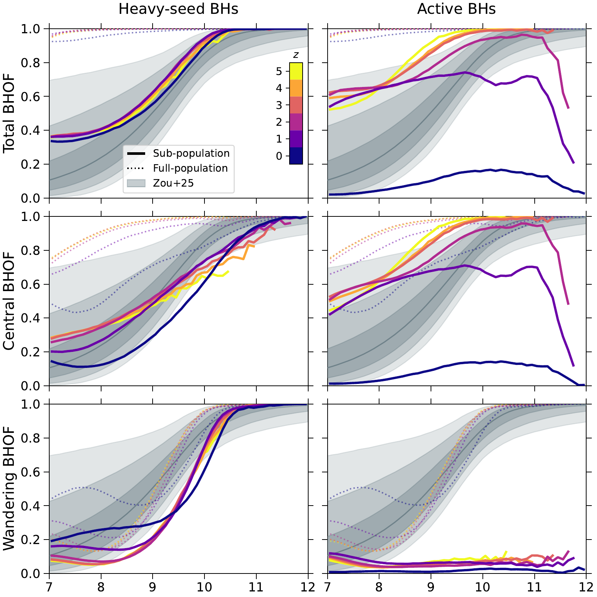
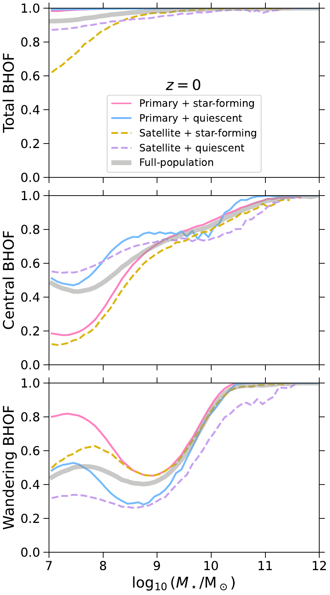
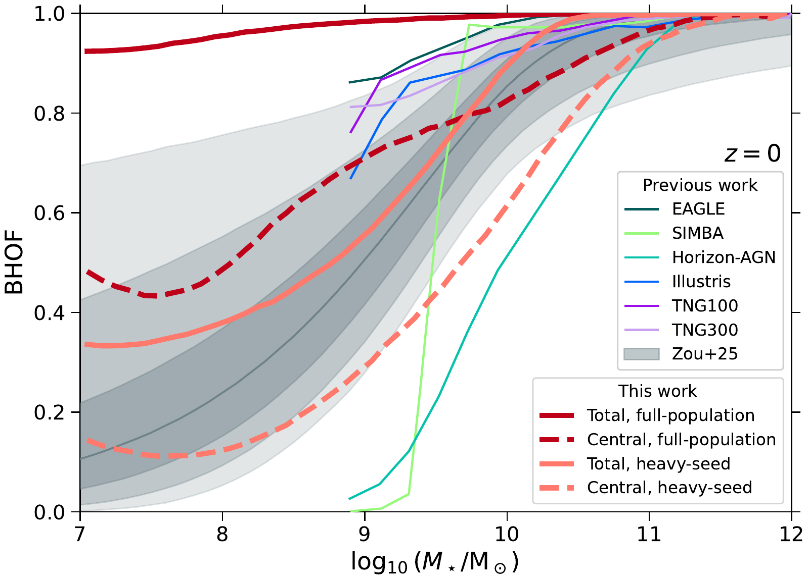

v3.13
Analyzing | Framework v3.13

> **Access Status** — Full paper: retrieved as the local arXiv v2 PDF (10 pages, "Draft version September 9, 2026", the latest version; v1 10 Jul 2026, v2 7 Sep 2026 per the arXiv abs page), read in full including references; there are no appendices and no separate supplement. · Abstract: read in the PDF and on the arXiv abs page (journal-ref: Weller et al. 2026, ApJL 1008, L54; DOI 10.3847/2041-8213/ae9c38). · Figures: all five figures viewed as the authors' own files from the arXiv source (pipeline figure files 1–5), each checked against its caption in the PDF; numbering matches. · Context sources: Ni et al. 2022 (ASTRID BH paper, arXiv:2110.14154 **v2**, 20 Mar 2022) — pages 2–4 and 10–12 of the v2 PDF read directly for the seeding rule, softening length and star-particle mass; Zou et al. 2025 (arXiv:2510.05252, **v1** is the only version, abs page checked); Haidar et al. 2022 (arXiv:2201.09888, latest **v2**, 14 Jun 2022, abs page checked); Contini et al. 2026 (arXiv:2606.22758, latest **v3**, 23 Sep 2026, abs page checked). For Zou, Haidar and Contini I saw the abs-page version history and the abstract only through a summarizing fetch tool, not their full text; statements about their methods beyond the abstract are flagged where they occur. · Analysis basis: full text. · Claim-check arithmetic run in Python (`claim_check.py` in the work directory).

---

## 1. Punchy Title & One-Sentence Hook

**Present, Racked, or Powered On: Why "Does This Galaxy Have a Black Hole?" Is Really Three Questions**

In the ASTRID simulation nearly every galaxy down to ten million solar masses of stars owns a massive black hole, yet by today roughly half of the smallest ones keep it somewhere outside their bright inner core, and only a few percent are feeding it hard enough to show up as an active nucleus. So the single number observers try to measure, the black hole occupation fraction, splits into separate fossils of seeding, orbital dynamics, and accretion that a survey can easily mix up.

---

## 2. Big-Picture Context

Massive black holes sit at the centers of essentially every big galaxy, and their masses track their hosts' stellar bulges tightly. That tidy picture comes almost entirely from the high-mass end, though. Nobody knows how the first black holes formed — whether as the ~100-solar-mass remnants of the first stars ("light seeds") or as rarer ~10,000–1,000,000-solar-mass objects from the direct collapse of pristine gas clouds ("heavy seeds"). In big galaxies, billions of years of mergers and accretion wipe out that birth memory: whatever seeded them, every massive galaxy ends up with a black hole. Dwarf galaxies are different. They grow slowly and merge rarely, so the fraction of dwarfs that host a black hole at all — the **black hole occupation fraction (BHOF)** — has long been pitched as one of the cleanest surviving records of how seeding worked. Light seeds are common and would fill most dwarfs; heavy seeds are rare and would leave many empty.

The catch is observational. A dwarf galaxy's black hole is small (perhaps 10⁴–10⁶ solar masses), its gravitational sphere of influence is far too small to resolve except in the nearest galaxies, and it reveals itself mainly when it accretes enough gas to glow in X-rays, optical lines, or radio. Surveys therefore measure "galaxies with a detectable, usually central, usually accreting black hole," then use models to back out the true occupation. The most constraining recent result, Zou et al. 2025 (arXiv:2510.05252, v1, accepted in ApJ), used 20 years of Chandra imaging of 1,606 galaxies within 50 Mpc and inferred that *central* occupation falls from more than 93% at 10¹¹–10¹² solar masses of stars to about 66% at 10⁹–10¹⁰ and about 33% at 10⁸–10⁹ (numbers from the abs-page abstract).

Simulations are the bridge between "what seeding does" and "what surveys see," but they disagree badly at low mass. Haidar et al. 2022 (arXiv:2201.09888, v2) compared Illustris, TNG, Horizon-AGN, EAGLE and SIMBA and found z = 0 occupation fractions at 10⁹ solar masses ranging from almost zero to almost one, depending largely on each code's seeding rule. Most of those codes also pin their black holes to the host's potential minimum every timestep ("repositioning"), so "central" is true by construction. ASTRID, a 250 h⁻¹ comoving Mpc box with 2 × 5500³ particles run to z = 0, instead lets black holes drift under a subgrid dynamical-friction force. That lets it ask a question repositioning codes cannot: of the galaxies that own a black hole, how many keep it in the middle?

**Paper Type & Stakes:** This is a short simulation-analysis Letter (ApJ Letters, peer-reviewed) that measures the BHOF inside one existing cosmological simulation, sliced by black-hole location (central vs. wandering), seed history (heavy-seed descendants), accretion state (active vs. all), and host type (primary vs. satellite, star-forming vs. quiescent), from z = 5 to z = 0. The stakes are interpretive: it argues that a single "occupation fraction" conflates several physically distinct quantities, and that observers and theorists must compare like with like.

**Prior Belief Check:** The headline qualitative messages are largely confirmatory for specialists. That AGN-selected samples trace duty cycle rather than occupation is textbook; that mergers seed off-center "wandering" black holes in dwarfs has a decade of simulation literature behind it (Bellovary et al. 2019, Tremmel et al. 2018, Ricarte et al. 2021, Di Matteo et al. 2023); and that central occupation declines toward low redshift in dwarfs has been seen in other simulations (Haidar et al. 2022, Sharma et al. 2022, Tremmel et al. 2024), as the authors themselves note. The genuinely new pieces are narrower: a systematic total/central/wandering decomposition across 12.6 Gyr and five decades of stellar mass in one large box, and the host-type split — especially that low-mass *star-forming* galaxies hold their black hole off-center far more often than quiescent ones (at 10⁷ solar masses, about 80% of star-forming primaries have a wanderer, against roughly 50% of quiescent primaries; Fig. 4). An expert would find the near-unity total BHOF unsurprising given ASTRID's seeding rule, and the star-formation dependence of location mildly surprising and worth chasing.

**Replication & Convergence Note:** All the numbers come from a single simulation by a group closely tied to it (Weller and collaborators have published earlier ASTRID wandering-black-hole papers), so nothing here is independently replicated in the strict sense. The broad trends converge with other simulations, but the central/wandering split and the host-type dependence depend on ASTRID's particular dynamical-friction model, softening length, and resolution. Independent confirmation would mean a second code with live (non-repositioned) black-hole dynamics — e.g. a ROMULUS-type or zoom-in suite at higher resolution — recovering a z = 0 central BHOF near 0.4–0.5 at 10⁷–10⁸ solar masses and the star-forming-versus-quiescent location difference, ideally with the central/wandering boundary well above the force resolution.

---

## 3. Necessary Background Crash-Course

### 3.1 What an occupation fraction actually counts

The BHOF answers a yes/no question per galaxy — "does it contain at least one massive black hole?" — and averages it over all galaxies in a bin of stellar mass. It is a *presence* statistic, not a mass or brightness statistic. Two galaxies with one and fifty black holes count the same.

The paper splits that presence bit three ways. The **total** BHOF counts any black hole anywhere in the galaxy. The **central** BHOF counts only black holes inside the stellar half-mass radius (the radius enclosing half the galaxy's stars). The **wandering** BHOF counts black holes outside that radius. These are not additive slices of one pie, because one galaxy can host both a central and a wandering black hole; the bookkeeping identity is:

$$f_{\rm tot} = f_{\rm cen} + f_{\rm wan} - f_{\rm both}$$

**Symbol definitions:**
$f_{\rm tot}$ : fraction of galaxies with at least one black hole anywhere
$f_{\rm cen}$ : fraction with at least one black hole inside the stellar half-mass radius
$f_{\rm wan}$ : fraction with at least one black hole outside it
$f_{\rm both}$ : fraction with at least one of each

**What this actually means:** it is the inclusion–exclusion count from set theory, the same rule you use to count servers that run process A or process B without double-counting the ones running both.

**Worked micro-example.** Take 1,000 dwarf galaxies. Suppose 70 have no black hole, 480 have one sitting in the middle, 440 have one sitting outside the half-mass radius, and 10 have two (one in, one out). Then the total BHOF is 930/1000 = 0.93, the central is (480 + 10)/1000 = 0.49, the wandering is (440 + 10)/1000 = 0.45, and the identity checks: 0.49 + 0.45 − 0.01 = 0.93. Those are almost exactly ASTRID's z = 0 numbers at the low-mass end (Fig. 2), and they show the key logical point of the paper: when most dwarfs own exactly one black hole, central and wandering occupation trade off one-for-one. Every black hole that drifts out of the middle lowers the central fraction and raises the wandering fraction without changing the total.

**Analogy:** A hardware asset audit across a fleet of offices. "Total" asks whether the office owns at least one server; "central" asks whether a server is installed in the machine room; "wandering" asks whether one is sitting somewhere else — a hallway cart, a closet.

**Breaks when:** you ask why a server ends up in the hallway. In an office someone moves it; in a galaxy nobody does — the black hole is delivered on the orbit of a merging companion and stays out because the drag that would pull it in is too weak, a physical process with no counterpart in an audit.

### 3.2 Seeds: where the first black holes come from, and why dwarfs remember

Astronomers do not know how the first massive black holes formed. **Light seeds** (~10² solar masses) would be remnants of the first generation of metal-free (Population III) stars: numerous, since many small halos formed such stars. **Heavy seeds** (~10⁴–10⁶ solar masses) would come from rarer channels such as the direct collapse of a pristine gas cloud that cannot cool well enough to fragment into stars: fewer, but born big.

Why do big galaxies forget? Two reasons. Massive galaxies are assembled from hundreds of smaller ones, so even if only 1 in 10 progenitors was seeded, the chance that none of 100 progenitors carried a black hole is (0.9)¹⁰⁰ ≈ 3 × 10⁻⁵ — essentially every massive galaxy inherits one. And accretion washes out the seed mass. A black hole growing at the Eddington limit (the maximum steady accretion rate, set where the outward push of its own radiation balances gravity on the infalling gas) multiplies its mass by e every ~50 million years for a typical radiative efficiency of 10%. Growing a 100-solar-mass light seed to 10⁵ solar masses takes ln(1000) ≈ 6.9 such e-folds, about 350 million years of uninterrupted maximum feeding — trivial for a quasar host over cosmic time, nearly impossible for a gas-poor dwarf that rarely feeds. Dwarfs therefore keep both the *presence* and roughly the *mass* of whatever seed they got.

**Analogy:** A codebase's commit history. A large, heavily refactored repository has rewritten every line many times; you cannot tell from today's code which prototype it started from. A small, rarely touched utility still carries its original scaffolding.

**Breaks when:** you treat seeding as a one-time event per galaxy. Seeds form over an extended epoch and keep arriving through mergers, so even a dwarf's "history" is a mixture of in-place seeding and delivered black holes; the commit-history picture has no slot for an object that is transplanted wholesale from another repository and then sits unmerged in a side directory.

### 3.3 How a cosmological simulation plants black holes (and what "resolution" costs)

ASTRID evolves dark matter and gas particles from z = 99 to z = 0 with the smoothed-particle hydrodynamics code MP-Gadget. Each dark-matter particle weighs 6.74 × 10⁶ h⁻¹ solar masses (≈ 10⁷ solar masses with h = 0.6774), each gas particle 1.27 × 10⁶ h⁻¹ (≈ 1.9 × 10⁶), and each star particle a quarter of a gas particle, about 4.7 × 10⁵ solar masses (Ni et al. 2022, §2). Gravity is softened below 1.5 h⁻¹ comoving kpc, ≈ 2.2 comoving kpc: forces between particles closer than this are deliberately smoothed to avoid unphysical two-body scattering. Because the softening is comoving, its physical size grows as the universe expands — from about 0.37 kpc at z = 5 to 2.2 kpc at z = 0.

Galaxies are found in two passes. Friends-of-friends (FOF) links particles closer than 0.2 times the mean spacing into groups — a connected-components pass over a proximity graph, i.e. "halos." SUBFIND then splits each FOF group into gravitationally self-bound subhalos, i.e. "galaxies." The paper labels the subhalo with the most bound particles in each halo the **primary** (roughly, the central galaxy of a group) and the rest **satellites**.

Black holes cannot form in such a simulation; they are planted by rule. ASTRID checks FOF halos periodically; a halo with total mass above 5 × 10⁹ h⁻¹ solar masses (~7 × 10⁹, about 740 dark-matter particles) and stellar mass above 2 × 10⁶ h⁻¹ (~3 × 10⁶, about six star particles) that *does not yet contain a black hole* gets one: the densest gas particle becomes a black hole with a seed mass drawn at random between 3 × 10⁴ and 3 × 10⁵ h⁻¹ solar masses (4.4 × 10⁴–4.4 × 10⁵ solar masses). Every ASTRID seed is therefore a heavy seed by the paper's own Introduction definition; the simulation has no light-seed channel.

**Worked micro-example (resolution budget).** A galaxy with 10⁷ solar masses of stars contains about 10⁷ / 4.7 × 10⁵ ≈ 21 star particles; one with 10⁸ about 210. Its "stellar half-mass radius" is therefore the radius enclosing about 10 particles, in a galaxy whose force resolution at z = 0 is 2.2 kpc — comparable to or larger than the half-light radius of a real 10⁷-solar-mass dwarf (typically a few hundred pc to ~1 kpc). This matters for the central/wandering split, as Section 4 discusses.

**Analogy:** A fixed-size page table. The simulation tracks memory in pages of ~5 × 10⁵ solar masses of stars and cannot address anything finer; a 10⁷-solar-mass dwarf is a 21-page allocation, and the softening length is the minimum addressable distance.

**Breaks when:** you assume, as with memory pages, that sub-page structure simply does not exist. In the simulation, unresolved physics (star formation, feedback, accretion, dynamical friction on black holes) is still *imposed* below the resolution scale by subgrid formulas, so the system produces sub-page "behaviour" that is entirely model output rather than computed structure.

### 3.4 Dynamical friction, and why dwarf galaxies collect wanderers

A massive object moving through a sea of lighter stars and dark-matter particles pulls a gravitational wake behind it; the wake's pull slows the object down. This **dynamical friction** is what drags a black hole from a merging companion's orbit down to the center of its new host. ASTRID computes it as a subgrid force (Chen et al. 2022, following Tremmel et al. 2015) rather than snapping black holes to the potential minimum. The force scales with the black hole's mass squared and the local density, so heavy black holes in dense galaxies sink quickly while light ones in diffuse dwarfs barely sink at all.

The standard order-of-magnitude sinking time for a point mass on a circular orbit in a galaxy with a flat rotation curve (Binney & Tremaine eq. 8.13) is:

$$t_{\rm df} \approx \frac{1.17}{\ln\Lambda}\,\frac{r^{2}\,v_c}{G\,M_{\rm BH}}$$

**Symbol definitions:**
$t_{\rm df}$ : time to spiral from radius $r$ to the center
$\ln\Lambda$ : the Coulomb logarithm, a slowly varying factor of order 3–10
$r$ : starting orbital radius (kpc)
$v_c$ : the galaxy's circular velocity (km/s)
$G$ : Newton's constant, 4.3 × 10⁻⁶ kpc (km/s)² per solar mass
$M_{\rm BH}$ : the black hole's mass

**What this actually means:** the sinking time grows with the square of the distance and falls inversely with the black hole's mass — a light object far out in a shallow potential effectively never arrives.

**Worked micro-example.** A 10⁵-solar-mass black hole starting 1 kpc out in a dwarf with circular velocity 30 km/s and ln Λ = 5: t ≈ 0.234 × (1 × 30)/(4.3 × 10⁻⁶ × 10⁵) ≈ 16 kpc/(km/s) ≈ 16 Gyr — longer than the age of the universe. The same black hole in a Milky-Way-mass galaxy (200 km/s) but starting at 5 kpc would need ~3 × 10³ Gyr, while a 10⁸-solar-mass black hole there would arrive in ~2.6 Gyr. Light black holes delivered by mergers into the outskirts stay there. Those stranded objects are **wandering black holes**.

**Analogy:** A packet routed into a slow, congested side network. A large, high-priority flow (massive black hole) gets drained to the core link quickly; a tiny flow in a lightly connected subnet (low-mass black hole in a dwarf) can sit in a buffer far from the core for the life of the system.

**Breaks when:** you ask what the black hole loses by sitting out there. A buffered packet waits passively; a wandering black hole is still orbiting with real velocity and can be kicked further out by mergers or tidal stripping of its host — there is no "queue" ordering it toward the center, only a drag whose strength the simulation's subgrid formula sets.

### 3.5 Eddington ratio, duty cycle, and what an AGN survey sees

The **Eddington ratio** ($f_{\rm Edd}$) is a black hole's accretion rate divided by its Eddington rate: 1 means feeding at the radiation-limited maximum; 0.01 means one percent of it. The paper calls a black hole **active** if $f_{\rm Edd} > 0.01$. The Eddington luminosity is about 1.26 × 10³⁸ erg/s per solar mass, so a 10⁵-solar-mass black hole at $f_{\rm Edd}$ = 0.01 radiates ~1.3 × 10⁴¹ erg/s — detectable in X-rays only in fairly nearby galaxies.

The **duty cycle** is the fraction of time a black hole spends active. If black holes switch on 5% of the time, an AGN-selected survey sees only ~5% of occupied galaxies at any snapshot — even if 100% are occupied. The active BHOF is therefore roughly occupation × duty cycle, and these two factors cannot be separated without a model.

**Analogy:** Discovering servers by watching network traffic. A machine that is powered off or idle generates no packets and is invisible to traffic monitoring, even though it is physically in the rack; the fraction of machines you *see* is ownership times the fraction currently transmitting.

**Breaks when:** you assume, as with servers, that "on" and "off" are crisp states. Accretion rates in reality and in ASTRID spread continuously over many decades; the 0.01 threshold is a cut through a continuous distribution, and moving it moves the "active" fraction.

### 3.6 Star-forming vs. quiescent, primary vs. satellite

Galaxies are classed by specific star-formation rate (sSFR: star formation per unit stellar mass) — star-forming if sSFR exceeds 10⁻¹⁰ per year (doubling their stars in under 10 Gyr), quiescent otherwise. For a 10⁷-solar-mass dwarf the threshold is 10⁻³ solar masses per year. Satellites often quench because the host group strips their gas; isolated dwarfs are almost always star-forming in reality, which makes quiescent *primary* dwarfs an unusual, small population worth keeping in mind.

**Analogy:** Primary versus satellite is the head office versus branch offices of one company (the halo); star-forming versus quiescent is whether an office is still hiring. A branch office was often founded elsewhere and acquired later, so what equipment it owns depends on its history before the acquisition.

**Breaks when:** you treat acquisition as administrative. A satellite galaxy physically loses gas, stars and sometimes its black hole to tidal stripping by the host — the "acquired branch" is being dismantled, a process with no clean counterpart in a corporate org chart.

**Central analogy for this paper:** Server inventory: present, racked, or powered on.

---

## 4. Core Technical Explanation

### 4.1 The pipeline

```
Analyst-built concept diagram (not from the paper):

 ASTRID run (250 Mpc/h box, z=99 -> 0)
   |
   v
 Seeding rule: FOF halo > 7e9 Msun, M* > 3e6 Msun, no BH yet
   -> one BH, seed mass 4.4e4 - 4.4e5 Msun (random draw)
   |
   v
 Growth: Bondi accretion + mergers; drift under subgrid
 dynamical friction (no repositioning)
   |
   v
 6 snapshots (z = 5,4,3,2,1,0); SUBFIND galaxies 1e7-1e12 Msun
   |
   +--> each BH tagged: central (r < R_half) / wandering
   +--> heavy-seed (seed or any progenitor > 1e5 Msun)
   +--> active (f_Edd > 0.01)
   +--> host: primary/satellite, star-forming/quiescent
   |
   v
 BHOF = fraction of galaxies with >= 1 tagged BH,
 in 50 bins of M* (0.1 dex; bins with < 100 galaxies dropped)
   |
   v
 Compare: Zou+25 X-ray (z~0), six other simulations
```

*Read the diagram top to bottom: everything above the snapshot box is the simulation's fixed physics; everything below is the paper's own analysis, which is a set of filters applied to one catalog.*

The authors do not run new simulations. They take ASTRID's existing catalog at six snapshots, select every SUBFIND galaxy with 10⁷–10¹² solar masses of stars, and for every black hole above the minimum seed mass ask two questions: where is it (inside or outside its host's stellar half-mass radius), and what is it (heavy-seed descendant? active?). They then compute, in 50 equal-width bins of log stellar mass (0.1 dex each), the fraction of galaxies with at least one black hole of each type, plus the median and 5th–95th percentile of the black-hole count per galaxy. The ASTRID physics relevant here: Bondi–Hoyle-like accretion, two-mode AGN feedback (thermal "quasar" mode at high Eddington ratio, kinetic "jet" mode at low, with only the thermal mode allowed above z = 2.3), dynamical-friction drift, and a merger criterion — two black holes merge when they are closer than twice the softening length (≈ 4.4 kpc at z = 0) and gravitationally bound. ASTRID includes no gravitational-wave recoil kicks and no three-body slingshots, so it cannot produce wanderers by those channels (the paper says so in §2).

### 4.2 How many black holes does a galaxy have? (Fig. 1)



*Figure 1 (from the paper): median number of black holes per galaxy (solid lines) and 5th–95th percentile range (shading) versus log stellar mass, colored by redshift from z = 5 (yellow) to z = 0 (dark blue).*

**What to look at:** the long flat floor at exactly one black hole, which reaches up to ~10⁹·⁶ solar masses at z = 0 but only ~10⁸·⁹ at z = 4–5, and the steep climb above 10¹⁰·⁵ solar masses, where a z = 0 giant hosts hundreds.

The story here is straightforward. Below 10⁸ solar masses at z = 0, 92% of galaxies have exactly one black hole, 7% have none, and 1% have more (at higher redshift, 96–97% have one and 2–3% have none). The step where the median rises to two, three, four black holes moves to higher stellar mass at later times because low-mass galaxies keep forming stars — raising their stellar mass — without acquiring new black holes, since ASTRID seeds only once per halo and the seeding rate falls at late times. At the top end, mergers deliver both stars and black holes, so black-hole count soars: the most massive z = 0 galaxies carry several hundred, most of them wanderers that dynamical friction has not yet brought in (see the near-unity wandering BHOF above 10¹⁰·⁵ solar masses in Fig. 2). This "one black hole per dwarf" regime is the hinge for everything that follows: it is why central and wandering occupation become a zero-sum trade at low mass.

### 4.3 The full population: total stays full, the center empties (Fig. 2)



*Figure 2 (from the paper): total (top), central (middle) and wandering (bottom) BHOF for the full ASTRID population, z = 5 (yellow) to z = 0 (dark blue); gray bands are the Zou et al. 2025 z ≈ 0 X-ray constraint (median line with 1σ, 2σ, 3σ bands).*

**What to look at:** the top panel's lines hugging 1.0 everywhere, and the middle and bottom panels at the left edge — the dark-blue z = 0 central curve dropping to ~0.45 while the z = 0 wandering curve rises to ~0.45–0.5, mirror images of each other. This is the heart of the paper.

**Total occupation is near-unity everywhere.** From 10⁷ to 10¹² solar masses and z = 5 to 0, the total BHOF never falls below about 0.92. This mostly restates ASTRID's seeding rule: a 10⁷-solar-mass galaxy typically lives in a halo of ~10¹⁰ solar masses, above the 7 × 10⁹ seeding threshold, so it got a black hole. The authors say this directly — it "reflects the efficiency of the ASTRID seeding prescription." The total BHOF is therefore not a prediction of ASTRID about the real universe's seeding so much as a reflection of an input. The small z = 0 deficit (0.92–0.93 at the low end, against 0.96–0.97 at z = 5) comes from galaxies that crossed the stellar-mass cut without their halo having been seeded, plus satellites, which Section 4.5 dissects.

**Central occupation falls with time; wandering rises.** At 10⁷ solar masses, the central BHOF drops from ~0.75 at z = 5 to ~0.66 at z = 1 and ~0.48 at z = 0, while the wandering BHOF climbs from ~0.19 to ~0.31 to ~0.44. With one black hole per dwarf, these move in lockstep (the Claim Check verifies that the three panels obey the inclusion–exclusion identity to within reading error). The authors' interpretation is hierarchical assembly: mergers deliver black holes on wide orbits, and in shallow dwarf potentials dynamical friction is too weak to sink them (the 16-Gyr micro-example in §3.4). At higher stellar mass the picture flips: above ~10¹⁰ solar masses both central and wandering BHOFs saturate at one, because massive galaxies host a central black hole *and* a retinue of wanderers.

**The z = 0 bump.** The z = 0 wandering curve shows a local maximum near 10⁷·⁵ solar masses (and the central curve a matching dip) that the authors explicitly call unexplained, speculating that it marks the regime where shallow potentials and merger histories combine most effectively. This is exactly where a galaxy contains only ~15–40 star particles and the force softening (2.2 kpc) is comparable to the galaxy's size, so a resolution origin should be on the list of explanations; the paper does not discuss resolution here.

**Comparison with Zou et al. 2025.** The paper overlays the X-ray-inferred central BHOF and states that ASTRID's z = 0 central curve lies within the 3σ band. Reading Fig. 2 and Fig. 5, that is true; at 10⁷·⁵–10⁸·⁵ solar masses ASTRID sits near the upper 2σ edge (Zou's median there is ~0.15–0.33, ASTRID's central ~0.43–0.60). The higher-redshift central curves and every total curve sit far above the band, which is fine because Zou measures z ≈ 0 central occupation. The bands are also drawn in the total and wandering panels, where they are only a visual reference.

### 4.4 Slicing by seed history and by accretion state (Fig. 3)



*Figure 3 (from the paper): total, central and wandering BHOFs for heavy-seed black holes (left column; seed mass, or any merged progenitor's seed mass, above 10⁵ solar masses) and active black holes (right; Eddington ratio above 0.01), z = 5 to 0. Dotted lines repeat the full-population curves; gray bands are Zou et al. 2025.*

**What to look at:** on the left, the total heavy-seed BHOF sitting on a flat floor near 0.35 at the low-mass end at *every* redshift, then rising to 1 by ~10¹⁰·⁵; on the right, the dark-blue z = 0 active curves crawling along the bottom (≤ 0.16) while the z ≥ 2 active curves reach near-unity at high mass, and the z = 1–2 curves collapsing above 10¹¹.

**Heavy-seed descendants.** The authors tag a black hole "heavy-seed" if its own seed mass, or that of any black hole it swallowed, exceeded 10⁵ solar masses. Because ASTRID draws seed masses at random from 4.4 × 10⁴–4.4 × 10⁵ solar masses regardless of host, this tag effectively marks the upper part of one seed distribution, not a different formation channel. The low-mass floor at ~0.35 is then simply the fraction of seeds drawn above the cut (the Claim Check finds 0.36–0.37 of occupied dwarfs), and because the draw does not depend on time, the floor barely moves with redshift — exactly what Fig. 3 shows. As stellar mass rises, galaxies have absorbed more seed lineages through mergers, and the chance that at least one of them was heavy rises toward one; by 10¹⁰·⁵ solar masses essentially every galaxy has a heavy-seed descendant. The total heavy-seed curve falls within Zou's 2σ band at all redshifts, and the central heavy-seed curve at z = 0 sits slightly below Zou's median at intermediate masses.

The authors read this as showing that "the low-mass end of the BHOF is sensitive to the underlying seed mass distribution" (Conclusion 3). Within ASTRID that is true in the narrow sense that selecting on seed mass removes ~60% of dwarf black holes. It is weaker evidence than it sounds for the broader seeding question, because ASTRID has no light seeds to compare against and no host dependence in the seed draw: the heavy-seed curve is a random thinning of the same occupied population, convolved with the number of seed lineages per galaxy (see Claim Check and Assumption Audit).

**Active black holes.** The active BHOF behaves completely differently. At z ≥ 2 the active total and central BHOFs rise from ~0.5–0.6 at 10⁷ solar masses to near one at 10¹⁰⁻¹¹ — the early universe is gas-rich and most black holes are feeding. After cosmic noon (z ≈ 2) they collapse: at z = 1 the active BHOF plateaus near 0.6–0.7 and drops steeply above 10¹¹ solar masses; at z = 0 it never exceeds ~0.16 (at ~10¹⁰ solar masses) and is ~0.02 at 10⁷. The high-mass cutoff is AGN feedback: the most massive black holes have heated or expelled their gas and switched to low-accretion kinetic mode. The active wandering BHOF is ≤ 0.1 at every mass and redshift, because wanderers live in low-density outskirts with little gas to accrete.

The punchline is the paper's Conclusion 4: an AGN-selected BHOF is mostly a duty-cycle measurement. At z = 0 in a 10¹⁰-solar-mass galaxy, ASTRID gives total occupation ~1.0 but active occupation ~0.16; a survey that equated the two would infer that 84% of such galaxies are empty. The paper also notes that the active BHOFs fall below Zou's z ≈ 0 band — which is the intended comparison mismatch, since Zou models the inactive population too.

### 4.5 Host environment and star formation at z = 0 (Fig. 4)



*Figure 4 (from the paper): z = 0 total, central and wandering BHOFs for primary star-forming (pink), primary quiescent (blue), satellite star-forming (gold dashed) and satellite quiescent (lilac dashed) galaxies, with the full population in gray.*

**What to look at:** the top panel's gold dashed satellite-star-forming curve dropping to ~0.6 at 10⁷ solar masses; in the middle panel, the two star-forming curves (pink, gold) falling to ~0.12–0.19 central occupancy at the low end while the quiescent ones stay at ~0.5; in the bottom panel, the pink star-forming-primary curve at ~0.8 wandering occupancy.

**Primaries beat satellites.** Primary galaxies have total BHOF near one at all masses; satellites fall to ~0.9 (quiescent) and ~0.6 (star-forming) at 10⁷ solar masses. The authors attribute this to seeding in the densest regions of halos and to mergers funnelling black holes into primaries. A more mechanical reason sits in the seeding rule itself: ASTRID seeds per *FOF halo*, and only if the halo "does not yet contain a BH." A dwarf that grows as a subhalo inside an already-seeded group can therefore never receive its own seed; it only has a black hole if it brought one in from before infall. Satellite under-occupation is thus partly baked into the seeding algorithm, not just an outcome of dynamics.

**Star-forming dwarfs keep their black holes off-center.** This is the paper's most novel empirical pattern. At 10⁷ solar masses, star-forming primaries have a central BHOF of ~0.18 and a wandering BHOF of ~0.80; quiescent primaries ~0.50 and ~0.50. Satellites show the same split (~0.12 central for star-forming, ~0.55 for quiescent). Total occupation is about the same, so the black holes are there; they are just not in the middle of star-forming dwarfs. The authors suggest that a centrally located black hole may couple its feedback to the central gas reservoir more effectively and help quench the host, while carefully stating that they "do not claim from this analysis alone that BH feedback is the sole driver of quenching in low-mass galaxies." They propose a correlation, not a mechanism.

Two other readings fit the same pattern and are not discussed in the paper. One is stellar-feedback stirring: bursty star formation in dwarfs drives repeated gas outflows that make the central gravitational potential fluctuate, which in other simulations is known to heat black-hole orbits and keep them off-center — so star formation would *cause* wandering rather than central black holes failing to quench. The other is measurement geometry: with ~20 star particles and a 2.2-kpc softening, a star-forming dwarf's freshly formed stars can shift its stellar half-mass radius and center, changing which side of the boundary a black hole lands on. The paper also does not say which galaxy center it uses (SUBFIND potential minimum or stellar center of mass), which matters at this scale. The direction of causality is open.

### 4.6 Comparison with other simulations (Fig. 5)



*Figure 5 (from the paper): ASTRID's z = 0 total and central BHOFs for the full population (dark red solid and dashed) and for heavy-seed descendants (salmon solid and dashed), against the Zou et al. 2025 constraint (gray bands) and the central BHOFs of EAGLE, SIMBA, Horizon-AGN, Illustris, TNG100 and TNG300 digitized from Haidar et al. 2022 (thin lines, for 10⁹ solar masses and above).*

**What to look at:** the spread among the thin lines at 10⁹–10¹⁰ solar masses — from SIMBA and Horizon-AGN near zero to EAGLE and TNG near 0.85 — and where the four ASTRID curves fall relative to the gray band.

All simulations converge on near-one occupation above ~10¹¹ solar masses and diverge wildly below 10¹⁰. SIMBA's step at 10⁹·⁵ is a hard-coded seeding threshold (it seeds only galaxies above that stellar mass). ASTRID's full-population central curve, central heavy-seed curve and total heavy-seed curve all sit inside Zou's 3σ band; the full-population total curve does not. The comparison mixes definitions, though: the other simulations' curves come from Haidar et al. with each code's own seed masses (several heavier than any ASTRID seed) and, for codes that reposition black holes, "central" is automatic. The figure demonstrates sensitivity to modelling choices — its stated purpose — rather than ranking codes.

### 4.7 Claim check

Checks were run in Python (`claim_check.py`) using the paper's quoted inputs, ASTRID parameters from Ni et al. 2022 (v2), and values read off the figures by eye (precision about ±0.03).

**1. Location bookkeeping (Figs. 1–2) — Reproduced.** The paper claims dwarfs host about one black hole and that central loss maps onto wandering gain. If so, total ≈ central + wandering at the low-mass end. At 10⁷ solar masses: z = 0 gives 0.48 + 0.44 = 0.92 against a total of 0.93; z = 1 gives 0.97 against 0.95; z = 5 gives 0.94 against 0.96; heavy-seed z = 0 gives 0.14 + 0.19 = 0.33 against 0.335. All agree within reading error, and the counts in §4.1 (92% with one black hole, 7% with none) match the z = 0 total of ~0.93. The paper's central interpretive move — "the BH moved out" rather than "the BH vanished" — is therefore internally consistent.

**2. The heavy-seed floor (Figs. 3, 5) — Partly reproduced; it exposes an ambiguity in the seed distribution.** The low-mass heavy-seed total BHOF is ~0.335 at z = 0 and ~0.36 at z = 5, i.e. 36–37% of occupied dwarfs carry a seed above 10⁵ solar masses. If dwarf black holes are mostly unmerged single seeds, this fraction should equal the share of the seed distribution above the cut. ASTRID's paper writes the seed distribution as probability ∝ M_seed^(−n) with n = −1, which taken literally means probability rising with mass and predicts 96% above 10⁵ solar masses. A log-uniform draw (probability ∝ 1/M) predicts 65%; probability ∝ 1/M² predicts 38%. Only the last matches. So either ASTRID's effective seed distribution is much steeper than its documented formula reads, or the heavy-seed tag differs from what the text states (a 10⁵ h⁻¹ cut with a log-uniform draw gives 48%, still too high). Neither the present paper nor Ni et al. state the per-seed fraction, so I cannot resolve it; it does not affect the paper's conclusions, but it means a reader cannot reconstruct the heavy-seed curve from the published recipe.

**3. Is the heavy-seed shape just lineage counting? — robustness test (alternative explanation).** If each seed lineage is independently "heavy" with probability p ≈ 0.37, a galaxy with N lineages has a heavy-seed descendant with probability 1 − (1 − p)^N: 0.37, 0.60, 0.75, 0.84, 0.90 for N = 1 to 5. Inverting the z = 0 heavy-seed totals at 10⁹, 10⁹·⁵ and 10¹⁰ solar masses (0.53, 0.72, 0.88) requires about 1.6, 2.8 and 4.6 lineages per galaxy — plausible given Fig. 1's black-hole counts (median 1–2, upper percentiles 2–5 over that range) plus black holes already merged away. This random-tagging null model reproduces the heavy-seed curve's flat floor, its redshift independence and its rise with mass without any seed-mass physics. The takeaway: in ASTRID the heavy-seed BHOF measures how many seeds a galaxy has collected, not how seeding works; the paper's Conclusion 3 is correct as stated but should not be read as evidence about real seeding channels.

**4. Sensitivity — the central/wandering boundary versus resolution.** The most influential assumption is that "inside the stellar half-mass radius" is a meaningful, resolved boundary in a 10⁷–10⁸-solar-mass galaxy. ASTRID's softening is 2.2 comoving kpc, so its physical size grows sixfold from z = 5 (0.37 kpc) to z = 0 (2.2 kpc), and black holes merge once within 4.4 kpc at z = 0; a 10⁷-solar-mass dwarf contains ~21 star particles. The decline in central occupation from z = 5 to z = 0 therefore coincides with the force resolution coarsening relative to fixed-mass galaxies. The conclusion "central BHOF falls and wandering rises at low mass" survives if the trend persists for galaxies whose half-mass radius exceeds a few softening lengths (likely true for ≳10⁹ solar masses); it would weaken substantially if the z = 0 dip and the 10⁷·⁵ bump vanished in a higher-resolution rerun. The paper presents no resolution test, so this stays open.

**Internal consistency.** One wording point matters: Conclusion 3 describes the heavy-seed sample as "descendants of heavy BH seeds (M_BH > 10⁵ M⊙)," while §3 and Fig. 3 define it by *seed* mass above 10⁵ solar masses, not current black-hole mass. A reader taking the conclusion literally would think it is a cut on today's mass. Nothing else significant turned up; the "12.6 Gyr" span matches z = 5 → 0 in Planck cosmology (cosmic age ~1.2 Gyr at z = 5).

### 4.8 Assumption Audit

> **Watch:** Reader likely assumes the heavy-seed versus full-population comparison pits heavy seeds against light seeds, as in the Introduction's framing. The paper actually compares two slices of a single heavy-seed channel: every ASTRID seed lies between 4.4 × 10⁴ and 4.4 × 10⁵ solar masses (heavy by the Introduction's own 10⁴–10⁶ definition), drawn at random independent of host, and the "heavy-seed" subset is merely the part above 10⁵. The authors acknowledge that ASTRID cannot explore light seeds below 3 × 10⁴ h⁻¹ solar masses. The Claim Check shows the heavy-seed curve is reproduced by random tagging plus lineage counting, so the result supports "the BHOF depends on which black-hole mass you count" (the point Contini et al. 2026 make with their mass-threshold study) more than it supports any statement about real seeding physics.

> **Watch:** Reader likely assumes ASTRID's near-unity total BHOF is a prediction that dwarfs in the real universe are almost all occupied. The paper actually presents it as a consequence of the seeding rule — any FOF halo above ~7 × 10⁹ solar masses with a few star particles gets a black hole — and the title's "fossil record of seeding" refers to how the BHOF *would* encode seeding, not to ASTRID constraining it. Zou et al.'s inferred central occupation of ~33% at 10⁸–10⁹ solar masses differs sharply from ASTRID's total of ~0.95 there; ASTRID reconciles with it only via the central/wandering split, which raises the next point.

> **Watch:** Reader likely assumes "central" means the same thing in the simulation and in an X-ray survey. In ASTRID, central means inside the stellar half-mass radius — kiloparsec scale for a dwarf, and comparable to the 2.2-kpc z = 0 softening. An X-ray nuclear-source search typically matches sources to the optical nucleus within an arcsecond or so (~100 pc at 20 Mpc); I did not verify Zou et al.'s exact matching radius or black-hole mass limit, which are not in the abstract. If the observational "central" is much tighter, ASTRID's central BHOF is an upper bound on what an X-ray nuclear search would count, and the claimed 3σ consistency is looser than it appears.

> **Watch:** Reader likely assumes the star-forming-versus-quiescent location difference shows that central black holes quench dwarfs. The paper explicitly declines that claim and reports only a correlation. Stellar-feedback-driven potential fluctuations (star formation pushing black holes out) and centroid/resolution effects in ~20-particle galaxies predict the same correlation with the arrow reversed or with no physical arrow at all.

---

## 5. What's Genuinely New or Clever

**The decomposition itself is the contribution.** Earlier BHOF studies mostly reported one curve per simulation (Haidar et al. 2022), or computed total and wandering occupation at a single epoch (Di Matteo et al. 2023 at z ~ 2 in ASTRID). This Letter makes the decomposition systematic: total/central/wandering × full/heavy-seed/active × primary/satellite × star-forming/quiescent, across six snapshots and five decades of stellar mass, in a box large enough to put more than 100 galaxies in every 0.1-dex bin. That turns "the BHOF" from one number into a small matrix, and the paper's best rhetorical move is to show, using one simulation, that different cells of that matrix can differ by factors of five to fifty at fixed stellar mass (z = 0, 10¹⁰ solar masses: total ~1.0, active ~0.16; at 10⁷: total ~0.93, active ~0.02). New to the field: the quantitative scale of those gaps across cosmic time in one self-consistent model. New mainly to the reader: the principle that AGN selection measures duty cycle.

**Star formation tracks black-hole location in dwarfs.** The finding that low-mass star-forming galaxies are far more likely than quiescent ones to host a wandering rather than a central black hole (central occupation ~0.18 vs. ~0.50 for primaries at 10⁷ solar masses) is, as far as I can tell, new as a simulation prediction at this scale. It is a cheap-to-state, observationally relevant pattern: it predicts that nuclear X-ray searches will find fewer black holes in star-forming dwarfs than in quiescent dwarfs of the same mass, for reasons of location rather than occupation. Its mechanism is open (Section 4.5), which limits how much weight it carries today, but it gives observers a concrete split to test.

**Predictive Content Check**

*Falsifiable handle:* the paper makes three testable, if model-dependent, predictions. (1) At z ≈ 0 and 10⁷–10⁸ solar masses, about half of black-hole-hosting dwarfs keep their black hole outside the stellar half-mass radius, so off-nuclear compact X-ray or radio sources matched to dwarf hosts should be roughly as common as nuclear ones (wandering ~0.45 vs. central ~0.45–0.5). (2) At fixed low stellar mass, star-forming dwarfs should show markedly lower nuclear-detection rates than quiescent dwarfs — by roughly a factor of 2–3 in ASTRID's central BHOF — after correcting for accretion-state differences. (3) At z = 0, the fraction of galaxies with a black hole accreting above 1% of Eddington should peak at only ~15% near 10¹⁰ solar masses and fall to ~2% at 10⁷. Prediction (3) is the most directly checkable against existing AGN-fraction measurements; (1) and (2) need deep X-ray, radio, or eventually dynamical surveys. None of these probes seeding directly, so on the paper's titular question — seeding — ASTRID, with one seeding channel, offers no falsifiable discriminator between channels; it offers a framework for building one.

*Formalism load:* the paper uses no heavy formalism; the "formalism" is a set of catalog cuts, all doing work. Skipped.

---

## 6. Limitations & Open Questions

1. **No light seeds, so no seeding-channel test.** ASTRID's minimum seed is 3 × 10⁴ h⁻¹ solar masses, so the paper cannot compare light- and heavy-seed scenarios, the very question its Introduction motivates. **(A) Consensus** — the authors state this as "an important limitation," and it is a structural fact about the simulation. **(paper §5)**

2. **Near-unity total occupation is an input, not an output.** The total BHOF ≈ 1 follows from seeding every FOF halo above ~7 × 10⁹ solar masses with a few star particles; Haidar et al. 2022 show other codes' z = 0 occupation spans ~0 to ~0.9 at 10⁹ solar masses depending on such rules. **(A) Consensus** — the paper itself attributes the result to "the efficiency of the ASTRID seeding prescription," and the cross-simulation spread in Fig. 5 makes the dependence plain. **(paper §5; broader literature)**

3. **The central/wandering boundary sits at or below the resolution scale for dwarfs.** At z = 0 the softening (2.2 kpc) and merger radius (4.4 kpc) are comparable to or larger than a 10⁷–10⁸-solar-mass galaxy's size, galaxies there contain ~20–200 star particles, and the physical softening grows sixfold from z = 5 to z = 0, coinciding with the central-BHOF decline. No convergence test is shown. **(B) Contested** — the authors and Contini et al. argue ASTRID's resolution is adequate for BHOF statistics, and the trend matches other simulations, but whether the *location* split is resolved at 10⁷ solar masses is a different question the paper does not test. **(analyst inference, from recomputation of ASTRID's softening and particle masses)**

4. **The unexplained z = 0 bump at 10⁷–10⁸ solar masses.** The paper flags the wandering-BHOF maximum and central-BHOF dip near 10⁷·⁵ solar masses as of unclear origin. **(B) Contested** — the authors propose a physical regime (shallow potentials plus merger histories); a resolution artifact is an equally live candidate given limitation 3. **(paper §4.1; analyst inference)**

5. **Satellite deficit partly algorithmic.** ASTRID seeds at most one black hole per FOF halo that lacks one, so satellites forming inside already-seeded groups cannot be seeded; the primary/satellite gap mixes physics with this bookkeeping rule. **(C) Speculative** — I infer the size of this effect from the seeding rule as documented in Ni et al. 2022; the paper attributes the gap to seeding in dense regions and mergers and does not quantify the rule's share. **(analyst inference)**

6. **Missing displacement channels.** ASTRID omits gravitational-wave recoil kicks and three-body interactions, which in dwarfs (shallow escape velocities, tens of km/s) can displace or eject black holes; including them would likely raise the wandering and lower the central BHOF further. **(A) Consensus** — the authors note the omission, and recoil-induced displacement in low-mass hosts is well established in the literature. **(paper §2; broader literature)**

7. **Observational comparison is apples-to-near-apples.** Zou et al.'s constraint comes from X-ray nuclear detections modelled through an Eddington-ratio distribution and a black-hole–host mass relation; ASTRID's "central" is a half-mass-radius cut over all black holes above ~4 × 10⁴ solar masses. The 3σ consistency is encouraging, but the matching radius and mass threshold may differ by large factors. **(B) Contested** — the authors call for forward-modelled, selection-matched occupation fractions (their closing paragraph), conceding the point in principle; whether it changes the present comparison is unquantified. **(paper §5; analyst inference)**

8. **Undocumented seed-mass fraction.** The heavy-seed floor (~37% of occupied dwarfs) matches neither the literal ASTRID seed formula (96%) nor a log-uniform draw (65%), only a ∝ 1/M² draw (38%). **(C) Speculative** — this rests on my reading of the figures and of Ni et al.'s formula; the actual implementation may simply use a different convention than the printed equation. **(analyst inference, from recomputation using the seed range and the Fig. 3/5 floor)**

9. **Mechanism behind star-formation-dependent location.** The paper reports a correlation and explicitly does not claim black-hole feedback causes quenching; the competing explanation that stellar feedback displaces black holes is not tested. **(B) Contested** — both directions have support in dwarf-galaxy simulation literature. **(paper §5; broader literature)**

**Open questions for the next 12–24 months:** a resolution study of the central/wandering split in ASTRID or a zoom resimulation of dwarfs; the same decomposition in a code with light seeds (e.g. Bhowmick et al.'s seeding suites, or ROMULUS-type runs); forward-modelled "observable BHOFs" with realistic X-ray matching radii and flux limits; and tracking individual dwarf black holes through star-formation bursts to settle the causal arrow.

---

## 7. Detailed Summary & Explanation

The paper takes ASTRID, a large cosmological simulation that follows dark matter, gas, stars and black holes from shortly after the Big Bang to the present, and asks a deceptively simple question at six moments in cosmic history: in galaxies with between ten million and a trillion solar masses of stars, what fraction host a massive black hole? Its answer is that the question has several answers, depending on what you count.

Counting any black hole anywhere in the galaxy, nearly every galaxy has one at every epoch — above 92% even in the smallest dwarfs today. That near-total occupation follows directly from ASTRID's rule of planting a black hole in every dark-matter halo above a mass threshold, and the authors present it that way. Counting only black holes in the inner part of the galaxy — inside the radius containing half the stars — tells a different story for small galaxies: the fraction falls from about three in four at early times to about one in two today. The black holes have not disappeared; they have moved out. Because a typical dwarf owns exactly one black hole, every black hole that ends up in the outskirts lowers the central count and raises the "wandering" count by the same amount. The authors attribute this to mergers delivering black holes on wide orbits into shallow galaxies, where the drag that would pull them to the center is too weak to work within the age of the universe.

Two further slices sharpen the picture. Keeping only black holes descended from seeds above a hundred thousand solar masses cuts dwarf occupation to about a third, at every epoch; in big galaxies, which have swallowed many seeds, nearly all still qualify. Keeping only black holes accreting above one percent of their maximum rate — the ones a survey for active nuclei would see — gives a high fraction in the gas-rich early universe but a tiny one today: at most about one galaxy in six, and about one in fifty among the smallest dwarfs. The paper's conclusion is that surveys of active nuclei measure how often black holes switch on, not whether they exist.

Finally, splitting today's galaxies by environment and star formation shows that the largest galaxy in each group is better occupied than its satellites, and that small star-forming galaxies are much more likely than quiescent ones to keep their black hole away from the center. The authors suggest a centrally placed black hole might help shut down star formation but explicitly stop short of claiming it. Compared to an X-ray-based estimate of local central occupation, ASTRID's central curve falls inside the observational uncertainty, and the comparison with six other simulations shows how widely models disagree below about ten billion solar masses.

**Why the summary is framed this way.** I organized it around the inventory-style decomposition rather than around seeding, because the decomposition is what the paper actually delivers. The title promises a "fossil record of seeding," but ASTRID has one heavy-seed channel, and my checks suggest its "heavy-seed" slice behaves like a random one-third sample whose growth with galaxy mass reflects how many seeds a galaxy has collected. The strongest, most transferable lesson is methodological: any comparison between a simulated and an observed occupation fraction must match location, mass threshold and accretion state, or it compares different quantities. The most interesting physical claim — star formation tracking black-hole location in dwarfs — is real within ASTRID but sits in the regime where resolution is thinnest and where the causal arrow is unresolved.

**Where I'm least confident in this analysis:** the resolution critique of the central/wandering split in dwarfs, which carries much of my skepticism about the redshift trend, the z = 0 bump and the star-formation dependence — I inferred it from ASTRID's softening and particle masses and from the absence of a convergence test, not from any demonstration that the split changes with resolution, and the authors' companion ASTRID wandering-black-hole papers (Weller et al. 2023, 2026; not read in full here) may contain resolution checks I have not seen; the seed-distribution mismatch likewise rests on figure reading and on one printed formula whose sign convention I could not confirm.

**Revision notes:** the referee pass added the FOF-level seeding rule's effect on satellites, the undefined galaxy-center convention, the inclusion–exclusion check across three redshifts, the Zou-band 2σ-edge reading, the Conclusion-3 wording mismatch, and the dynamical-friction and resolution micro-examples; it softened the hook from "fossils of seeding" to "fossils of seeding, dynamics and accretion that surveys mix up."

---

## 8. Three Crystallized Takeaways

1. **"Has a black hole" and "has a black hole in the middle" are different questions.** In the ASTRID simulation, about 93% of today's smallest galaxies own a massive black hole, but only about half keep it near the center — the rest carry it in their outskirts, delivered by mergers and never dragged in.

2. **Surveys of glowing black holes count switched-on black holes, not black holes.** Today only about 2–16% of simulated galaxies have a black hole feeding at more than 1% of its maximum rate, even though nearly all have one, so an active-nucleus census can undercount occupation by a factor of five or more.

3. **The black-hole census is only as good as its definitions — and this simulation can't yet tell us how the first black holes formed.** ASTRID plants only one type of (heavy) seed, so its "heavy-seed" slice mostly reflects how many seeds each galaxy has collected; the real seeding test needs light-seed models and observations matched in location, mass limit and accretion state.

---

## 9. Shorter Summary

Weller, Natarajan and Burke measure how many galaxies host a massive black hole in ASTRID, a large cosmological simulation that follows galaxies and black holes from about 1.2 billion years after the Big Bang to today, across galaxies with ten million to a trillion suns' worth of stars. The quantity, the black-hole occupation fraction, is often proposed as a fossil record of how the first black holes formed.

They find that the answer depends on what you count. Almost every simulated galaxy contains a black hole somewhere — a direct consequence of the simulation's rule for planting black holes in growing dark-matter halos. But in small galaxies today, only about half keep that black hole near the center; the rest carry it in the outskirts, because mergers deliver black holes on wide orbits and the drag that pulls them inward is too weak in shallow, diffuse galaxies. Black holes that are actively feeding, which is what most surveys detect, are rare today — at most about one galaxy in six — so active-nucleus searches mostly measure how often black holes switch on. Keeping only black holes descended from the heaviest seeds cuts dwarf occupation to about a third. Small star-forming galaxies are notably more likely than quiescent ones to hold their black hole away from the center, and the largest galaxy in a group is better occupied than its satellites. The simulation's central occupation agrees, within uncertainties, with a recent X-ray estimate for nearby galaxies.

The main lesson is about definitions: comparisons between theory and observation must match location, black-hole mass limit and accretion state. The caveats are significant. The simulation has only one seeding channel, so it cannot test how the first black holes formed; its "heavy-seed" slice behaves much like a random one-third sample. And the inner-versus-outskirts boundary in the smallest galaxies is close to the simulation's resolution limit, so the most interesting dwarf-galaxy trends need confirmation from higher-resolution runs and other codes.

---

*Analysis: Claude (Opus 5.5), headless run, 2026-10-03 · Framework v3.13 · posture: explanatory (peer-reviewed, ApJL 1008 L54) · numeric checks: `claim_check.py`.*
