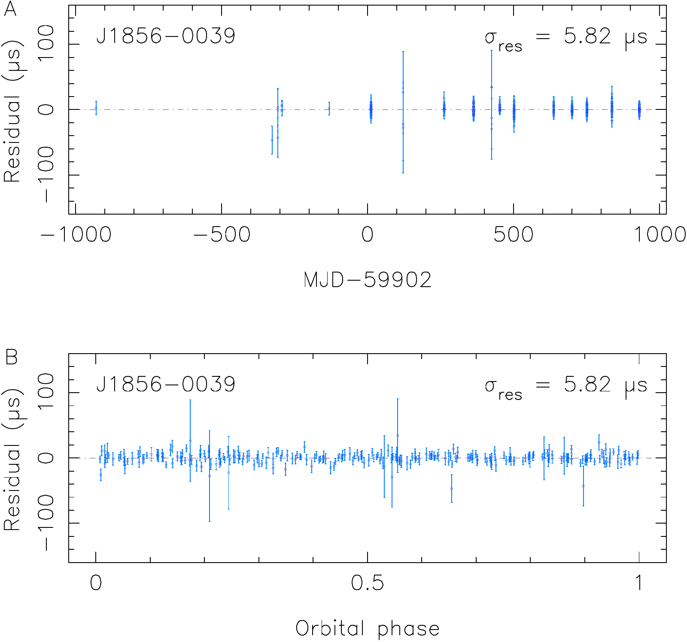
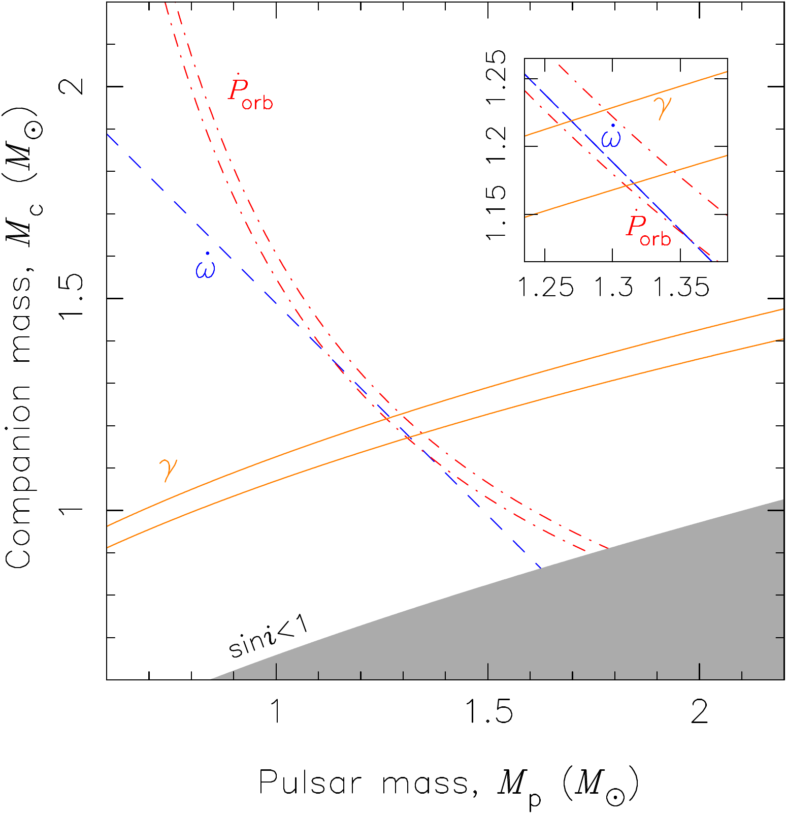
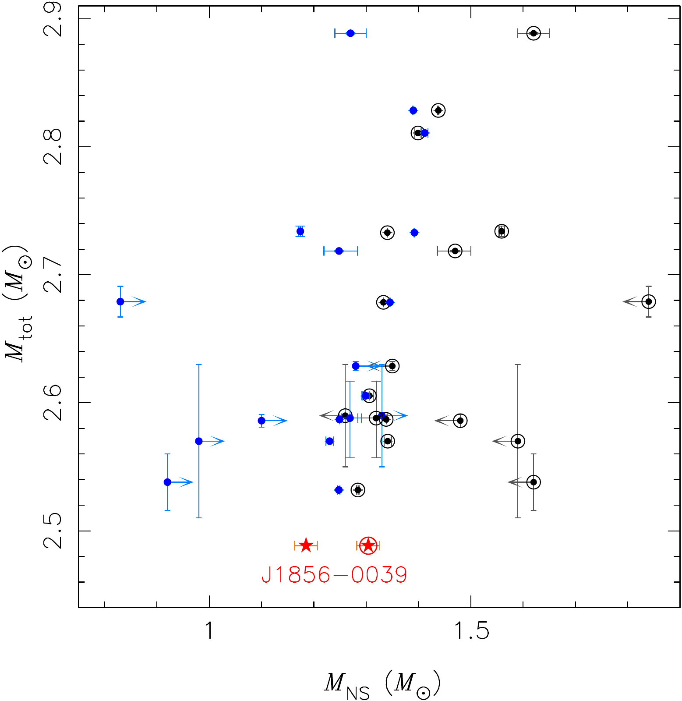
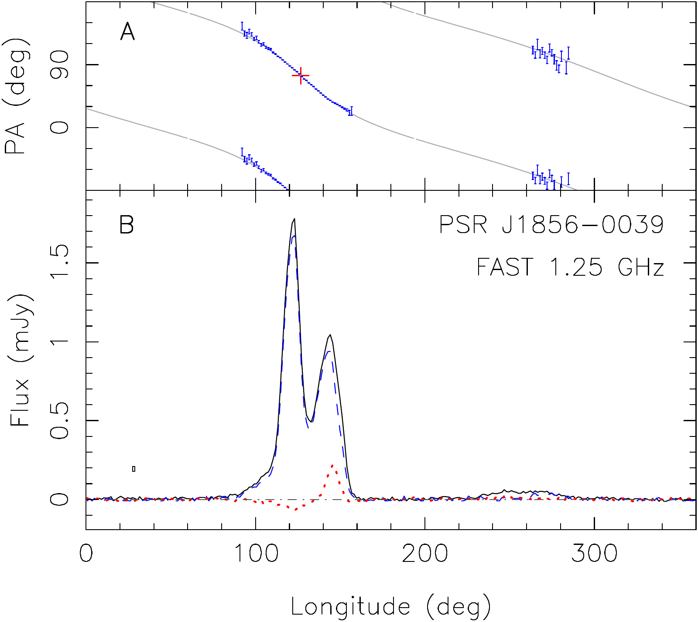

v3.13
Analyzing | Framework v3.13

> **Access Status** — Full paper: retrieved from the local arXiv v2 PDF (9 pages, the latest version, dated 16 Sep 2026), read in full, every page, with a pdftotext extraction used for searching and exact numbers · Abstract: arXiv abs page checked (v1 29 Jul 2026, v2 16 Sep 2026; journal-ref Yang et al., Phys. Rev. Lett. 137, 121401 (2026), DOI 10.1103/hmjp-htd1) · Supplementary material: none exists. The Letter has no appendix or separate supplement; Tables I–III and Figs. 1–4 are all in the main text · Figures: all four viewed from the authors' own arXiv-source files (the four relativistic-2607.27333 figure PNGs), numbers checked against the PDF captions; all four are shown below · Prior work checked on arXiv abs pages: Kramer et al. 2021 double pulsar (arXiv:2112.06795, v2), Meng et al. 2025 PSR J1946+2052 (arXiv:2510.12506, v1, the only version; its masses come from the published A&A version via a repository listing, because the arXiv abstract does not quote them), Martinez et al. 2017 PSR J1411+2551 (arXiv:1711.09804, v2), Cameron et al. 2023 PSR J1757−1854 (arXiv:2305.14733, abs page; the version list was not returned, so I saw the current abstract only), Martinez et al. 2015 PSR J0453+1559 (arXiv:1509.08805, abs page summary; version list not returned), Müller, Heger & Powell minimum NS mass (arXiv:2407.08407, v2) · Claim checks: run in Python, script `claimcheck.py` in the work directory · Analysis basis: full text.

## 1. Punchy Title & One-Sentence Hook

**The Featherweight Pair: FAST Finds the Lightest Double Neutron Star Ever Weighed, and Einstein Balances the Books Again**

A 23-millisecond pulsar whipping around another neutron star every 2.36 hours lets Chinese radio astronomers weigh the pair to five decimal places, 2.48841 solar masses in total, lighter than any double neutron star measured before. Its orbit is already shrinking at the rate general relativity's gravitational-wave formula predicts (to 1.4%), and the system is a candidate for one of pulsar timing's hardest targets: frame dragging by a spinning neutron star.

## 2. Big-Picture Context

Double neutron star (DNS) binaries are the cleanest gravity laboratories in nature. Two objects, each squeezing about 1.3 solar masses into a sphere roughly 24 km across, orbit each other with no messy tides, no mass transfer, and (in the best cases) one of them flashing a radio beacon whose ticks a large telescope can time to microseconds. Since Hulse and Taylor found PSR B1913+16 in 1974, these systems have supplied the first evidence that gravitational waves exist (the orbit shrinks as the system radiates energy), the most precise test of general relativity's gravitational-wave formula (the double pulsar PSR J0737−3039A/B, agreement to 1.3 parts in 10,000 at 95% confidence, per Kramer et al. 2021, arXiv:2112.06795v2), and a mass census of neutron stars that feeds directly into supernova theory, merger-rate estimates for LIGO–Virgo, and the nuclear equation of state.

Only about 30 DNS systems are known. Each new one brings two kinds of value. The first is **as a gravity test**: compact, eccentric orbits make the relativistic effects big enough to measure quickly. The second is **as a population point**: each system adds two neutron-star masses to a small sample and constrains how such pairs form (two supernovae, the second usually from a star stripped almost bare by its companion) and what they make when they eventually merge. The lightest end of the mass distribution matters particularly, because supernova simulations struggle to make very light neutron stars at all: a recent 3D study (Müller, Heger & Powell, arXiv:2407.08407v2) reached a record low of 1.192 solar masses and treated that as close to the floor.

This Letter reports PSR J1856−0039, the fifth DNS found by FAST's Galactic Plane Pulsar Snapshot (GPPS) survey. Five years of intermittent FAST data (17 sessions, 253 arrival times) give a phase-connected timing solution with three relativistic ("post-Keplerian") parameters measured. From those, the authors extract both masses, run one consistency test of general relativity, set a lower bound on the angle between the pulsar's spin and the orbit, estimate what the eventual merger will produce, and forecast how hard it will be to measure frame dragging (Lense–Thirring precession) in this system.

**Paper Type & Stakes:** this is an observational discovery-plus-timing Letter. It reports a new DNS system and the measurements its first five years of timing allow. The stakes are modest but real: a new record for the lightest DNS total mass, one more (not especially precise) confirmation of gravitational-wave damping, and a candidate system for future moment-of-inertia measurements.

**Prior Belief Check:** nothing here contradicts consensus. The general-relativity test passes, at a precision (1.4%) roughly 100 times looser than the best existing tests, so it is confirmatory, not competitive. The mass result is the genuinely new number. A total of 2.488 solar masses undercuts the previous lightest well-measured systems (PSR J1946+2052 at 2.531858(60), Meng et al. 2025, arXiv:2510.12506v1; PSR J1411+2551 at 2.538(22), Martinez et al. 2017, arXiv:1711.09804v2) by about 0.04–0.05 solar masses. Specialists will find this interesting rather than surprising: the DNS mass distribution was always expected to have a low tail, and the 1.185-solar-mass companion sits right where ultra-stripped-supernova models put the lightest second-born neutron stars. The Lense–Thirring and merger-product sections are forecasts and scenario estimates, not results.

**Replication & Convergence Note:** this is a single-group, single-telescope result (FAST, NAOC-led), with no independent timing yet. Independent confirmation would mean timing by another telescope, for example MeerKAT or the Green Bank Telescope; the source lies near the celestial equator, so both can see it. Their own ω̇ (periastron advance) and γ (Einstein delay) should agree with FAST's within errors. This matters less than it would for an anomalous claim, because pulsar timing is a mature, well-cross-checked technique and every number here agrees with general relativity. It matters more for the record-mass headline, which rests on one timing model fit by one team.

## 3. Necessary Background Crash-Course

### 3.1 A pulsar as a clock you can only read from far away

A pulsar is a rotating neutron star that sweeps a radio beam past Earth once per rotation, like a lighthouse. PSR J1856−0039 spins 42.75 times per second (period 23.4 ms). It is "mildly recycled": an earlier phase of accreting matter from its companion spun it up from a typical young-pulsar period of about a second. Recycled pulsars are extremely stable rotators, so you can predict when each pulse should arrive, and the deviations tell you everything that happened to the signal on the way.

The working observable is the **time of arrival (TOA)**. You fold many rotations of raw data into an average pulse profile, cross-correlate it with a template, and read off when the pulse arrived, to a precision of a few microseconds. A **timing model** then predicts every TOA from a list of parameters: spin frequency and slowdown, sky position, proper motion, interstellar dispersion, and the orbit. Fitting means adjusting the parameters until the predicted and observed TOAs agree. The leftovers are the **residuals**. A "phase-connected" solution means the model accounts for every single rotation between observations, with no ambiguity about how many turns the star made in a gap. That bookkeeping turns sparse observations into a continuous record across years.

**Worked micro-example.** The projected orbit size here is x = 0.979 light-seconds. As the pulsar swings toward and away from us, its pulses therefore arrive up to about 0.98 s early or late relative to the orbit's centre. The final residual scatter is 5.82 μs. Dividing, the timing tracks the pulsar's line-of-sight position to about 6 parts in a million of the orbit's size, roughly 1.7 km out of a projected orbit radius of about 294,000 km. That ratio is why tiny relativistic corrections become measurable.

> **Analogy:** a pulsar timing model works like a cycle-accurate simulator run against a hardware trace. You have a model that predicts the timestamp of every event (pulse); you diff it against the logged timestamps; any systematic drift in the diff tells you a parameter is wrong or a physical effect is missing. A phase-connected solution means the simulator never loses track of the cycle count, even across long gaps in the trace.

> **Breaks when:** you expect the "hardware" to be deterministic. Real pulsars have intrinsic spin noise and pulse-shape jitter, and the signal crosses a turbulent, changing interstellar plasma. There is no trace of the true clock, only a statistical fit, and some effects (distance-dependent kinematic terms, below) can only be modelled with outside information, never deduced from the timing alone.

### 3.2 Newton gets you one equation, not two masses

If gravity were purely Newtonian, timing would give you five **Keplerian parameters**: orbital period (here 0.0985 days, 2.36 h), eccentricity (0.106), projected semi-major axis x, the orientation of the ellipse (longitude of periastron), and a reference epoch. From these you can compute the **mass function**, one fixed combination of the two masses and the orbital tilt.

$$f = \frac{(M_c \sin i)^3}{(M_p + M_c)^2} = \frac{4\pi^2 x^3}{G P_b^2} = 0.1039\,M_\odot$$

**Symbol definitions:**
$M_p$ : pulsar mass (solar masses)
$M_c$ : companion mass (solar masses)
$i$ : orbital inclination, the tilt of the orbit relative to our line of sight (90° means edge-on)
$x$ : projected semi-major axis of the pulsar's orbit, in light-seconds
$P_b$ : orbital period
$G$ : Newton's gravitational constant

**What this actually means:** the right-hand side is pure measurement (orbit size and period); the left-hand side mixes three unknowns. It is one equation in three unknowns, like knowing only that a database row's checksum equals 0.1039: it tells you which combinations are allowed, not which one is real. Plug in the paper's final masses (1.304 and 1.185) and the inclination comes out at 46.8°, or equivalently 133.2°, since timing can't tell whether the orbit runs clockwise or counter-clockwise on the sky. The paper quotes 133.2° in the text and 46.8° in Table III; these describe the same tilt.

To get the individual masses you need more equations. General relativity supplies them.

### 3.3 Post-Keplerian parameters: three relativistic effects, each a function of the masses

In general relativity, the orbit departs from a Newtonian ellipse in ways that depend only on the two masses (once the Keplerian parameters are known). Each such departure is a **post-Keplerian (PK) parameter**. This Letter measures three.

**Periastron advance (ω̇, "omega-dot").** The ellipse itself slowly rotates in its plane. Mercury does this by 43 arcseconds per century from relativity. PSR J1856−0039's orbit rotates by **17.5859 ± 0.0007 degrees per year**, about 150,000 times faster than Mercury's relativistic share, because the pair is far more compact and massive. To leading order this rate depends only on the *total* mass, so it is the measurement's precision anchor: a 0.004% measurement of ω̇ gives the total mass to 0.006%.

**Einstein delay (γ, "gamma").** On an eccentric orbit the pulsar dips deeper into its companion's gravity well and moves faster at periastron, and climbs out and slows at apastron. Both gravitational redshift and special-relativistic time dilation make its clock run at a periodically varying rate. Integrated over an orbit, this shifts the pulse arrival times back and forth with amplitude γ = **0.445 ± 0.011 ms**. Because it depends on the companion's mass and the total mass in a different combination than ω̇, it splits the total into two parts, but only with 2.5% precision, which is why the individual masses come out much less precise than the total.

**Orbital decay (Ṗ_b, "P-b-dot").** The binary radiates gravitational waves, loses orbital energy, and spirals inward, so the period shortens. Measured: **Ṗ_b = (−1.284 ± 0.019) × 10⁻¹²** seconds per second.

**Worked micro-example.** −1.284 × 10⁻¹² s per s, times 3.156 × 10⁷ seconds in a year, is a period shrinkage of about 40 microseconds per year. That sounds negligible, but the effect on timing accumulates: the orbital phase drifts by an amount that grows as the square of elapsed time, so after five years the periastron passage arrives about 2 seconds earlier than a non-decaying orbit predicts. That timing offset, measured against microsecond residuals, is why five years suffice for a 1.5% measurement.

The paper's Eq. (3) gives the leading-order formulas:

$$\dot\omega = 3\left(\frac{P_b}{2\pi}\right)^{-5/3}\frac{(G M)^{2/3}}{c^2(1-e^2)},\qquad \gamma = e\left(\frac{P_b}{2\pi}\right)^{1/3}\frac{G^{2/3} M_c (M_p+2M_c)}{c^2 M^{4/3}}$$

$$\dot P_b^{GW} = -\frac{192\pi}{5}\left(\frac{2\pi G}{c^3 P_b}\right)^{5/3}\frac{M_p M_c}{M^{1/3}}\, f(e)$$

**Symbol definitions:**
$M$ : total mass, $M_p + M_c$
$e$ : orbital eccentricity (0.106)
$c$ : speed of light
$f(e)$ : an eccentricity enhancement factor, $(1 + \tfrac{73}{24}e^2 + \tfrac{37}{96}e^4)(1-e^2)^{-7/2}$, here about 1.04; eccentric orbits radiate more because the close passages dominate

**What this actually means:** each formula is a different "view" of the same two unknowns. ω̇ sees only the total mass. γ sees mostly the companion's mass. Ṗ_b sees the product of the masses (a measure of how much "quadrupole" the binary has to radiate). With three views and two unknowns, the system is overdetermined: any two fix the masses, and the third is a test.

### 3.4 The overdetermined fit as a test: the mass–mass diagram

Each measured PK parameter, with its error bar, defines a band in the plane of pulsar mass versus companion mass. If general relativity is right, all bands must cross at one point. This is the **mass–mass diagram**, and it is how every binary-pulsar gravity test is presented.

> **Concept:** three measured quantities, each predicted by general relativity as a different function of the same two masses. Two of them determine the masses; the third is then predicted with no free parameters, and comparing that prediction with its measured value tests the theory. Agreement tests only the combination "general relativity plus the assumed physics" (no extra mass loss, kinematic effects removed). Disagreement could mean new gravity physics or an unmodelled astrophysical term.

> **Vehicle:** a storage system that writes two data blocks and one parity block across three disks. Any two disks let you reconstruct the data; reading the third and comparing it with the recomputed parity tells you whether something is corrupted. A parity mismatch says "something is wrong somewhere" but not which disk failed or why.

> **Analogy:** two data disks ↔ the two PK parameters used to solve for the masses (here ω̇ and γ). Reconstructed data ↔ the two masses. Parity disk ↔ the third PK parameter (Ṗ_b). Parity check passes ↔ the three bands intersect. Parity check precision ↔ the size of the error bars; a parity check that only compares the first few bits can pass even when the low-order bits disagree.

> **Breaks when:** you treat a passing check as checking *the masses themselves*. RAID parity is defined by the same code that wrote the data; here the masses are *inferred* using general relativity, then general relativity is tested with them. That is still a real test (the third relation is independent of the first two), but it can't detect a theory that modifies all three relations in a coordinated way. Alternative theories with that property are constrained by systems with more PK parameters or with very different masses, not by a three-parameter system alone.

### 3.5 Double neutron stars: formation, lightness, and fate

A DNS forms from a massive binary that survives two supernovae. The first-born neutron star gets spun up ("recycled") by accreting from its companion; the companion, stripped of its envelope by the neutron star (the paper invokes **Case BB Roche-lobe overflow**, a late mass-transfer phase off a helium star), then explodes as a low-mass, "ultra-stripped" supernova. Such explosions tend to make light second-born neutron stars, small kicks, and low eccentricities. PSR J1856−0039 fits: the visible pulsar is the recycled first-born star (1.304 solar masses), the companion is the second-born (1.185).

Why care about lightness? A neutron star's mass at birth reflects the iron core that collapsed. The lightest possible core-collapse neutron star is set by the smallest iron core that can collapse and explode, which simulations put near 1.19–1.2 solar masses (gravitational mass). The record holder, PSR J0453+1559's companion at 1.174(4), sits at or below that floor; some authors have even proposed it might be a massive white dwarf rather than a neutron star (broader literature; I did not fetch that paper). A second, independent, cleanly-measured neutron star near 1.19 would show the floor is populated, not a fluke.

The pair will eventually merge. Gravitational-wave emission shrinks the orbit until coalescence in **82 million years**, short on galactic timescales, so systems like this one feed the population LIGO–Virgo–KAGRA detects. GW170817 had a total mass near 2.74; GW190425 near 3.4. A merger of 2.49 solar masses would be the light end of that population. Whether the remnant collapses to a black hole depends on whether its mass exceeds the maximum a (possibly spinning) neutron star can support, known as the **TOV mass** (Tolman–Oppenheimer–Volkoff), observationally about 2.2–2.4 solar masses.

**Worked micro-example (gravitational versus baryonic mass).** A neutron star's gravitational mass is less than the summed rest mass of its baryons, because gravitational binding energy is negative, about 10–15% of the total. The paper uses a fitted relation, baryonic mass = gravitational mass + 0.080 × (gravitational mass)², in solar masses. For the pulsar: 1.304 + 0.080 × 1.70 = 1.440. For the companion: 1.185 + 0.112 = 1.297. Sum: 2.737 baryonic. Subtract about 0.07 ejected in the merger (borrowed from GW170817's kilonova) → 2.667 baryonic. Invert the relation → about 2.26 gravitational. Compare with the TOV mass of about 2.3: the remnant sits right at the edge, which is why the paper hedges "probably a stable neutron star … also possible … black hole".

> **Analogy:** binding energy as compression ratio. The baryonic mass is the uncompressed file size; the gravitational mass is the stored size after the "compression" of gravitational binding. Merging two compressed files gives you a combined archive whose compressed size you can't get by adding the two compressed sizes. You have to decompress (convert to baryonic), add, subtract what's lost, and recompress (convert back).

> **Breaks when:** you assume the compression ratio is a fixed property of the codec. Here the "codec" is the unknown nuclear equation of state, and the 0.080 coefficient is a fitted average over models. The paper's own number (2.26) inherits that model uncertainty, plus the arbitrary choice of GW170817's ejecta mass, and the post-merger remnant is hot and spinning fast, not the cold, non-rotating star the relation describes.

### 3.6 Spin–orbit coupling: geodetic precession and Lense–Thirring

Two more relativistic effects matter for the paper's discussion. Neither is measured yet.

**Geodetic (de Sitter) precession.** If the pulsar's spin axis is tilted relative to the orbit's axis (misalignment angle δ), curved spacetime makes the spin axis precess around the orbital axis. For this system, the standard formula with the paper's masses gives **about 4.9° per year**, one full cycle in about 73 years (my computation, `claimcheck.py`; the paper does not quote this number). As the spin axis precesses, our line of sight cuts the emission beam at a different angle, so the pulse profile and its polarization slowly change. No change means either δ is small or not enough time has passed.

**Lense–Thirring (frame-dragging) precession.** A spinning mass drags spacetime around with it, which adds a small extra rotation to the orbit. In pulsar timing it appears as (a) an extra contribution to ω̇ and (b) a slow change in the projected orbit size x if the spin is misaligned. Its size is proportional to the pulsar's **moment of inertia** I. Moment of inertia depends on how the mass is distributed inside the star, which depends on the nuclear equation of state. Measuring I for a neutron star of known mass would be a new, clean equation-of-state constraint, and this is the long-sought prize in double-pulsar timing.

**Worked micro-example.** The Lense–Thirring piece of ω̇ for this system, with an assumed I = 10⁴⁵ g cm², is −4.07 × 10⁻⁴ degrees per year (Table III; I get −4.10 × 10⁻⁴ with my slightly different masses). The full ω̇ is 17.5859 degrees per year. So frame dragging is 23 parts per million of the total, smaller than today's measurement uncertainty (7 × 10⁻⁴, i.e. 40 parts per million). To isolate it, you need to know the "rest" of ω̇ (the part general relativity predicts from the masses) to better than 23 ppm, which means knowing the total mass from some *other* parameter to about 35 ppm. That is the crux of the paper's last section.

> **Analogy:** extracting Lense–Thirring from ω̇ is like measuring a 23-ppm performance regression in a benchmark whose baseline you can only predict from a separate model. The total runtime is measured beautifully, but to say how much of it is the regression, you need the baseline model to be good to better than 23 ppm, and the model's inputs (here, the masses from Ṗ_b) are themselves noisy and biased by environmental effects.

> **Breaks when:** you imagine the baseline as a clean, separately runnable control. There is no "Lense–Thirring off" version of the binary. Several small terms (the second-order post-Newtonian correction, frame dragging, kinematic effects from the pulsar's motion through the Galaxy) all hide inside the same ω̇, and some of them nearly cancel each other here (see the Claim Check). So the separation depends entirely on a model, not on a controlled experiment.

> **Central analogy for this paper:** three PK disks: two reconstruct, one checks parity.

## 4. Core Technical Explanation

### 4.1 From snapshot detection to a phase-connected solution

**Analyst-built concept diagram (not from the paper):**

```
FAST GPPS snapshot (2020-05-04, 5 min)
        |
        v
serendipitous re-detections -> orbit fit (Freire/BN methods)
        |   Pb = 2.36 h, e = 0.106
        v
tracking campaign 2022-2025 (17 sessions, 253 TOAs)
        |   calibrated 4-pol data -> Matrix Template Matching
        v
timing model (tempo2, DD binary model) -> residual rms 5.82 us
        |
        +--> Keplerian: Pb, x, e, omega, T0 -> mass function 0.1039
        +--> PK: omega-dot (0.004%), gamma (2.5%), Pb-dot (1.5%)
                 |
                 v
        DDGR fit: omega-dot + gamma -> M = 2.48841, Mp 1.304, Mc 1.185
                 |
                 v
        Pb-dot_obs / Pb-dot_GR = 1.009 +/- 0.014  (GR test)
                 |
                 +--> merger: tau = 82 Myr, remnant ~2.26 Msun
                 +--> forecast: Lense-Thirring needs ~50 yr + distance
```

Read it top to bottom: everything below the timing-model box is derived from the same fit, so the three branches at the bottom share all the timing systematics above them.

FAST first caught the pulsar in a 5-minute snapshot of the Galactic plane on 4 May 2020. It then turned up again in several later observations aimed at other targets (the 19-beam receiver's off-centre beams cover neighbouring sky). From these scattered detections, the authors fitted an orbit with two standard methods that use how the apparent spin period changes with orbital phase: an eccentric orbit of 2.36 hours. A dedicated 2.5-hour track on 1 December 2022 covered a full orbit and confirmed it. Table I lists all 17 sessions: three 5-minute snapshots, several 15-minute tracks, and longer tracks of 72–150 minutes from 2022 onward. Total on-source time is about 21 hours, very little by timing-campaign standards, which is a reminder of how much collecting area FAST brings.

Data reduction is standard. The raw data are folded at the predicted spin period (dspsr), cleaned and flux-calibrated (psrchive, with FAST's 16.1 K/Jy gain), averaged into four sub-bands and 5-minute chunks, and timed against a template. The dispersion measure (43.1250 pc cm⁻³, the column of free electrons between us and the pulsar) is refined from the sub-band arrival times. After the solution phase-connects, the authors re-fold everything and switch to a better TOA method: **Matrix Template Matching**, which uses all four polarization products rather than just total intensity. Because this pulsar is highly linearly polarized (Fig. 1B shows linear polarization nearly tracking total intensity), the polarization structure adds sharp features the cross-correlation can lock onto, improving TOA precision. The final timing uses the Damour–Deruelle (DD) binary model, which fits the PK parameters as free numbers without assuming any gravity theory, plus the DE440 solar-system ephemeris.



*Figure 2 (from the paper): timing residuals of PSR J1856−0039 after subtracting the best-fit model, versus date (A, days relative to MJD 59902, i.e. late 2022) and versus orbital phase (B). Weighted rms 5.82 μs.*

**What to look at:** the residuals are flat and featureless in both panels. No trend with time means the spin, orbital-decay and PK terms are absorbing everything systematic; no wave with orbital phase means the orbit model is complete at this precision. Note also the cadence in panel A: one isolated early point, a sparse 2021–2022 stretch, then roughly bimonthly sessions. The early, sparse TOAs (large error bars, mostly from short snapshots and off-centre beams) lever the long-baseline parameters such as Ṗ_b and proper motion.

The timing solution (Table II) reports the spin frequency to 15 significant figures, sky position to about a milliarcsecond, a marginal proper motion (−1.5 ± 0.5 and −6.1 ± 0.9 mas/yr), and the fitted EFAC of 0.79, a scale factor on the TOA error bars. An EFAC below 1 means the formal TOA errors were slightly *overestimated*, not underestimated, which is the reassuring direction. The derived spin-down quantities (characteristic age 568 Myr, surface magnetic field 4 × 10⁹ gauss) mark a mildly recycled pulsar. I reproduced both from the period and its derivative.

### 4.2 The three relativistic measurements and the kinematic cleanup

Before the PK numbers can be used, the authors check whether anything other than general relativity contaminates them. The main contaminant for Ṗ_b is kinematic. A pulsar moving across the sky has a line-of-sight distance that changes over time (the **Shklovskii effect**, proportional to proper motion squared times distance), and the Galaxy's gravity accelerates both the pulsar and the Sun differently. Both add an apparent Ṗ_b unrelated to gravitational waves:

$$\dot P_b^{obs} = \dot P_b^{GW} + \dot P_b^{Shk} + \dot P_b^{Gal}$$

**Symbol definitions:**
$\dot P_b^{obs}$ : the orbital period derivative the timing fit actually measures
$\dot P_b^{GW}$ : the part due to gravitational-wave emission, the one that tests general relativity
$\dot P_b^{Shk}$ : Shklovskii term from the pulsar's transverse motion (grows with distance)
$\dot P_b^{Gal}$ : term from the difference between the pulsar's and the Sun's accelerations in the Galactic potential

**What this actually means:** the clock you're reading is on a moving, accelerating platform. Before attributing any drift to the orbit, you subtract the platform's motion, and that subtraction requires knowing how far away the platform is.

The distance is poorly known. Two Galactic electron-density models convert the dispersion measure to 2.0 kpc (NE2025) or 1.3 kpc (YMW16). The paper estimates the combined kinematic term at about 1 × 10⁻¹⁵, twenty times smaller than the Ṗ_b uncertainty (1.9 × 10⁻¹⁴), and so applies no correction. My own estimate (below) comes out a bit larger, 1.4–2.1 × 10⁻¹⁵, still negligible today. The proper-motion contribution to ω̇ is about 2 × 10⁻⁶ deg/yr, 350 times below its uncertainty. So, at present precision, the measured PK parameters are clean.

### 4.3 Solving for the masses, and the test

The authors then switch to the **DDGR** model, a variant of the timing model that *assumes* general relativity: instead of fitting ω̇, γ and Ṗ_b as free numbers, it fits the total mass and companion mass directly and computes all PK parameters from them. The orbital decay gets one extra free parameter, an "excess Ṗ_b" beyond the general-relativity prediction, so that the fit itself measures any disagreement. Results:

| Quantity | Value | Relative precision |
| --- | --- | --- |
| Total mass M | 2.48841 ± 0.00015 M☉ | 6 × 10⁻⁵ |
| Pulsar mass M_p | 1.304 ± 0.022 M☉ | 1.7% |
| Companion mass M_c | 1.185 ± 0.022 M☉ | 1.9% |
| Inclination i | 133.2° ± 1.1° (≡ 46.8°) | — |
| Predicted Ṗ_b (GR) | −1.27248(13) × 10⁻¹² | — |
| Excess Ṗ_b (obs − GR) | (−1.2 ± 1.8) × 10⁻¹⁴ | — |
| Ratio obs/GR | 1.009 ± 0.014 | 1.4% |
| Coalescence time | 82 Myr | — |

*Table (reproduced from the paper's Table II and text): the key derived parameters.*

**What to look at:** the contrast between the total mass (five decimals) and the individual masses (two to three decimals). The total comes from ω̇, measured to 40 ppm; the split comes from γ, measured to only 2.5%. The two individual masses have identical errors (0.022) because they are almost perfectly anti-correlated: the total is fixed, and any mass you move from one star goes to the other.



*Figure 3 (from the paper): the mass–mass diagram. Each pair of curves bounds the ±1σ region for one PK parameter, computed assuming general relativity: periastron advance ω̇ (blue dashed, so narrow it renders as a single line), orbital decay Ṗ_b (red dash-dot), Einstein delay γ (orange solid). Grey: forbidden by the mass function (would need sin i > 1). Inset: zoom on the intersection.*

**What to look at:** this is the heart of the paper. The steep blue ω̇ line fixes the total mass (lines of constant total mass run diagonally down-right). The shallow orange γ band cuts across it and fixes where along that line the system sits. The red Ṗ_b band is the parity check: in the inset, it overlaps the blue line exactly where the orange band crosses (pulsar mass about 1.27–1.32, companion about 1.17–1.21). If the red band had passed elsewhere, general relativity, or the kinematic cleanup, would be in trouble. Notice that the red band runs nearly parallel to the blue line: Ṗ_b depends on total mass much more than on the split, which is why it makes a weak independent lever on the masses but a fine check.

The test result, Ṗ_b(observed)/Ṗ_b(GR) = 1.009 ± 0.014, means the orbit decays at the rate general relativity predicts, with a 1.4% uncertainty and a 0.6σ offset. For comparison: the double pulsar reaches 1.3 × 10⁻⁴ (95% confidence) and PSR J1946+2052 reaches 9 × 10⁻⁴ (1.00005 ± 0.00091 per Meng et al. 2025). This system is about 15× behind J1946+2052 and 100× behind the double pulsar. It is five years old; Ṗ_b precision improves roughly as (time span)^2.5, so it will tighten fast. The authors' simulation of 7000 days (19 years) of bimonthly timing at today's precision forecasts σ(Ṗ_b) = 2 × 10⁻¹⁶, a 100-fold improvement, at which point the kinematic term (about 10⁻¹⁵, distance-uncertain) becomes the limiting factor. The paper says so directly, and points to future parallax from timing (the paper calls VLBI hard because of the source's low flux density) or sub-mHz space gravitational-wave detectors as escape routes.

### 4.4 Where the system sits in the DNS population



*Figure 4 (from the paper): total mass (vertical) against each neutron star's individual mass (horizontal) for confirmed DNS systems with total-mass uncertainty below 0.1 M☉. Circled black points: first-born (usually recycled) neutron stars; blue dots: second-born. Arrows mark limits. Red stars: PSR J1856−0039 (circled) and its companion.*

**What to look at:** the red stars sit alone below the 2.5 line; every other system lies at 2.53 or above, with the pair J1946+2052 and J1411+2551 at about 2.53–2.54 just above. Horizontally, the companion (1.185) sits at the low end of the blue second-born dots; the only lower precisely measured blue point near 1.17 belongs to PSR J0453+1559. The gap between J1856−0039 and the next-lightest system, about 0.04 solar masses, is roughly 300 times the total-mass error bar, so the record is secure *given general relativity*; the masses come from GR formulas.

The companion's 1.185 is just below the 1.192 minimum from Müller et al.'s simulations. The paper calls it "consistent with" that limit. Strictly, 1.185 ± 0.022 straddles 1.192 easily (0.3σ below), so it is consistent, and also not yet a test of the floor; a 10× better γ measurement would make it one.

### 4.5 The discussion sections: geometry, merger, and frame dragging

**Emission geometry.** The polarization position angle across the pulse (Fig. 1A) follows a smooth S-curve. The **rotating vector model** (RVM) explains this as the projection of a dipole magnetic field's direction as the beam sweeps past. Fitting it gives two angles: the magnetic axis is tilted α = 114.5° ± 2.6° from the spin axis, and our line of sight is at ζ = 139.1° ± 3.2° from the spin axis.



*Figure 1 (from the paper): FAST 1.25 GHz polarization profile summed over about 13 hours. (A) Position angle of linear polarization (blue points, plotted twice 180° apart), with the best-fit rotating vector model (grey). The red cross marks the steepest-gradient point. (B) Total intensity (solid), linear (dashed) and circular (dotted) polarization.*

**What to look at:** in panel A, the smooth, well-fit S-sweep across the main pulse (longitudes about 90–160°), plus the weak interpulse-like emission near 260–290° that also sits on the curve. Points far apart in longitude, all on one curve, are what let the fit separate α from ζ at all. In panel B, linear polarization tracks total intensity closely, which is why polarization-aware TOA extraction helps.

Then the argument. If the pulsar spin were strongly misaligned with the orbit, geodetic precession would change ζ over time, changing the profile; the authors see no change over three-plus years, so they argue misalignment is small and ζ should be close to the orbital inclination i. Since ζ ≠ i in general, the misalignment must be at least |ζ − i| = 5.9° ± 3.4°. They flag the large systematic uncertainty of RVM fits for recycled pulsars.

Two caveats the paper understates. First, 5.9 ± 3.4 is only 1.7σ from zero, so the data are also consistent with near-perfect alignment. Second, the "no change in three years" argument is weak here. Geodetic precession advances the spin's azimuth by only about 15° in three years (4.9°/yr), and a δ of about 6° would then move ζ by only a degree or two, below the ±3° RVM errors. So the absence of profile change neither implies small δ nor conflicts with δ ≈ 6°; it is simply uninformative so far. (Analyst inference from my computed precession rate.)

**Merger product.** The coalescence time, 82 Myr, reproduces from Peters' formula (I get 82.0 Myr). The remnant mass estimate, about 2.26 solar masses, follows the arithmetic walked through in §3.5, and I reproduced it exactly. The conclusion "probably a stable neutron star" leans on comparing 2.26 with a TOV mass of 2.31 (+0.36/−0.21) from short gamma-ray burst modelling, an 0.05-solar-mass margin on top of an equation-of-state-dependent conversion and an ejecta mass borrowed from a different event. Honestly read, the remnant is near the threshold and the paper's hedge ("also possible … black hole") is the more accurate phrasing. The abstract's "after spin-down" wording concedes that the remnant initially spins fast enough that rotation helps hold it up.

**Frame dragging (Lense–Thirring).** Table III compares four systems, all with an assumed I = 10⁴⁵ g cm²:

| PSR | Spin (Hz) | P_b (h) | e | i (°) | ω̇_LT (deg/yr) | ẋ_LT (10⁻¹⁴ lt-s/s) |
| --- | --- | --- | --- | --- | --- | --- |
| J1946+2052 | 58.96 | 1.884 | 0.064 | 73.7 | −8.84 × 10⁻⁴ | 8 sin δ sin Φ |
| **J1856−0039** | 42.75 | 2.364 | 0.106 | 46.8 | −4.07 × 10⁻⁴ | 10 sin δ sin Φ |
| J0737−3039A | 44.05 | 2.454 | 0.088 | 89.35 | −3.77 × 10⁻⁴ | 0.18 sin δ sin Φ |
| J1757−1854 | 46.52 | 4.407 | 0.606 | 85.3 | — | ≲ 0.3 |

*Table (reproduced from the paper's Table III): expected Lense–Thirring effects. Φ is the geodetic precession phase.*

**What to look at:** the ẋ_LT column. The change in projected orbit size scales as cot i, which is near zero for edge-on orbits (J0737 at 89.35°) and large for tilted ones. J1856−0039's 46.8° tilt gives it the largest coefficient in the table, *if* the misalignment δ is non-zero. With δ = 1°, the expected rate is 1.7 × 10⁻¹⁵ lt-s/s, comparable to the forecast 19-year sensitivity (1 × 10⁻¹⁵) and to the proper-motion contamination of ẋ (also about 1 × 10⁻¹⁵). So δ of a few degrees would make it detectable; δ near zero would make it invisible. Since δ is not actually established (above), this is a conditional prospect.

The ω̇ route is harder. Eqs. (8)–(9) say: to subtract the general-relativity part of ω̇ well enough to see the frame-dragging part, you must know the total mass from Ṗ_b, which requires σ(Ṗ_b) well below 7 × 10⁻¹⁷. The authors estimate about half a century of timing plus an independent distance. Both the threshold and the time scale reproduce (Claim Check).

### 4.6 Claim check

All checks were run in Python (`claimcheck.py`, work directory) using the leading-order formulas from the paper's Eqs. (1), (3) and (6) and the Table II inputs.

**1. Total mass from ω̇ — Reproduced.** The paper claims 2.48841 ± 0.00015. Inverting the leading-order ω̇ formula with the tabulated orbit gives 2.48848, a 0.5σ difference that a full DDGR fit (which co-fits everything) easily absorbs. The paper's footnote 51 says DDGR omits the second-order post-Newtonian (2PN) term and the Lense–Thirring term in ω̇ because they cancel. I computed both: 2PN adds +4.6 × 10⁻⁴ deg/yr and frame dragging −4.1 × 10⁻⁴ (I = 10⁴⁵ g cm²), so the net 0.5 × 10⁻⁴ is 14 times below σ(ω̇), biasing M by about 10⁻⁵ solar masses, versus the 1.5 × 10⁻⁴ error. **Why it matters:** the record-mass claim rests on this number, and it stands.

**2. Individual masses and inclination — Reproduced within errors.** Solving γ = 0.445 ms with the total mass gives a companion of 1.196 and pulsar 1.293, versus the paper's 1.185 and 1.304: 0.5σ apart, consistent with DD-fit γ versus DDGR-fit masses differing by correlated fit terms. Conversely, the paper's masses imply γ = 0.440 ms (0.5σ from the fit). The γ uncertainty alone propagates to σ(M_c) = 0.022, exactly as quoted. The paper's masses with the mass function give i = 133.24°, as printed. **Why it matters:** the "one of the lightest neutron stars" claim is only as strong as γ, a 2.5% measurement.

**3. The GR test and coalescence time — Reproduced.** With the paper's masses, Ṗ_b(GR) = −1.27252 × 10⁻¹² (paper −1.27248). Ratio −1.284/−1.2725 = 1.009, with ±0.015 from the DD error bar (the paper's ±0.014 comes from the DDGR fit's 1.8 × 10⁻¹⁴ excess error; same thing). Coalescence time from Peters' eccentric formula: 82.0 Myr. The frame-dragging table entries also reproduce (ω̇_LT −4.10 vs −4.07 × 10⁻⁴; ẋ_LT coefficient 1.04 × 10⁻¹³, the table's "10"; δ = 1° gives 1.8 × 10⁻¹⁵ vs the text's 1.7).

**Internal consistency (one significant finding).** Table II quotes the GR-predicted Ṗ_b as −1.27248(**13**) × 10⁻¹², an uncertainty of 1.3 × 10⁻¹⁶. That matches what the *total-mass* error alone produces (I get 1.2 × 10⁻¹⁶), but it omits the mass-*split* error. Because the masses are unequal by 0.12, the product M_p × M_c changes to first order with the split: moving 0.022 between the stars shifts the prediction by −1.7 to +2.5 × 10⁻¹⁵, about 15–20 times the quoted error. **Why it matters:** not today, since 2 × 10⁻¹⁵ is small against the observed 1.9 × 10⁻¹⁴, and the ratio is unchanged. But the same neglect sits inside Eq. (8) ("M_p + M_c ≫ M_p − M_c"), which drives the Lense–Thirring forecast; see the sensitivity check. Minor: Table III lists i = 46.8° while the text uses 133.2° (the same tilt, but the sign of cot i, and so of ẋ_LT, flips).

**Sensitivity check — kinematic correction.** The assumption that matters is "no kinematic correction needed", which hinges on distance. My flat-rotation-curve estimate gives 1.4 × 10⁻¹⁵ (1.3 kpc) to 2.1 × 10⁻¹⁵ (2.0 kpc), up to twice the paper's "about 1 × 10⁻¹⁵", but still 10 times below σ(Ṗ_b). The current test survives unless the kinematic term were about 10 times larger, which would need a distance near 15–20 kpc or a much faster proper motion: implausible for a source with dispersion measure 43. For the future Lense–Thirring goal, the same term is the killer. The target precision (7 × 10⁻¹⁷) is about 25 times smaller than the kinematic correction itself, so the distance must be known to a few percent, and the Galactic acceleration model to similar accuracy. The paper says "independent distance measurement"; the numbers show this is the dominant requirement, not a footnote. Also, at the forecast γ precision (2 × 10⁻⁴ ms), the mass-split error neglected in Eq. (8) contributes 4 × 10⁻¹⁷ to the predicted Ṗ_b, more than half the 7 × 10⁻¹⁷ budget. So the "half a century" estimate is optimistic unless γ (or a Shapiro delay) improves faster than assumed. With σ ∝ T^−2.5 from the 19-year forecast, reaching the threshold itself takes about 28 years, a factor-3 margin about 44 years, and a factor-10 margin about 72 years. "Half a century" is a fair midpoint.

**Robustness — alternative explanation for the masses (the 2PN/LT shortcut).** The observational-paper question is whether an unmodelled term could be shifting the masses. The obvious candidate is the higher-order ω̇ physics that DDGR leaves out. I checked how far the cancellation in footnote 51 holds as the unknown moment of inertia varies: the net 2PN + LT term stays under σ(ω̇) for any I below about 2.8 × 10⁴⁵ g cm², well above realistic neutron-star values (about 1.2–1.8 × 10⁴⁵ for 1.3 solar masses). The shortcut is safe now. It stops being safe once σ(ω̇) falls by about 15×, which the authors' own forecast (2 × 10⁻⁵ deg/yr) reaches; at that point both terms must be modelled explicitly, as Meng et al. already do for J1946+2052.

### 4.7 Assumption Audit

> **Watch:** Reader likely assumes "validates general relativity at 1.009 ± 0.014" is a meaningful new constraint on gravity. The paper actually delivers a consistency check about 15 times weaker than PSR J1946+2052 and about 100 times weaker than the double pulsar, using masses that were themselves derived *assuming* general relativity. That is the standard and legitimate method (the third relation is independent of the two used for the masses), but it means the result says "nothing anomalous here at the 1.4% level", not "general relativity confirmed in a new regime". The system's mass ratio and compactness resemble J0737 and J1946, so it does not probe a new region of parameter space for theories (such as scalar–tensor gravity) whose effects depend on mass asymmetry.

> **Watch:** Reader likely assumes the five-decimal total mass means both neutron-star masses are known that well. The paper actually has the total to 6 × 10⁻⁵ but each component only to about 2%, because the split rests on the Einstein delay γ, measured to 2.5%. The "one of the lowest neutron-star masses" claim for the 1.185 companion carries ±0.022, wide enough to span from below the J0453+1559 record (1.174) to above the J1756−2251 companion (about 1.23, Ferdman et al. 2014, the paper's ref. 33; value from memory, not re-fetched). The secure record is the *total* mass; the component-mass ranking is provisional until γ improves or a Shapiro delay is measured.

> **Watch:** Reader likely assumes the spin–orbit misalignment of "at least 5.9°" is a measurement that sets up the Lense–Thirring prospect. The paper actually derives it from an RVM fit (which it calls systematically uncertain for recycled pulsars), it is only 1.7σ from zero, and the supporting "no profile change in three years" argument is weak, because geodetic precession here is only about 4.9° per year (my computation). The ẋ_LT prospect in Table III scales with sin δ, so it inherits all of this uncertainty. If δ turns out to be under 1°, the most favourable route to frame dragging in this system disappears.

> **Watch:** Reader likely assumes the merger-remnant conclusion ("will probably become a stable neutron star") follows from the measurement. The paper actually stacks a fitted baryonic–gravitational relation, an ejecta mass taken from GW170817, and a cold non-rotating conversion, then compares the result (2.26) with a TOV mass of 2.31 (+0.36/−0.21). The margin is smaller than any one of those inputs' uncertainties. The measurement fixes the *input* to the merger well; the outcome remains model-dependent.

## 5. What's Genuinely New or Clever

The genuinely new item is a number: **2.48841 solar masses, the lowest precisely measured DNS total mass**, about 0.043 below the previous record holders. It anchors the light end of the DNS mass distribution with a system that *will* merge within a Hubble time, which is exactly the population ground-based detectors sample. That matters for two reasons. First, gravitational-wave inference of neutron-star masses relies on priors drawn from the Galactic DNS population, and this extends that population's support downward. Second, the companion at 1.185 is the second precisely measured neutron star near the theoretical minimum mass. If γ tightens around that value, it gives supernova modellers an independent second data point near the floor, one that is less contested than J0453+1559's companion.

The second contribution is practical rather than conceptual: **FAST's collecting area turns a faint (peak flux under 2 mJy in Fig. 1), serendipitously found pulsar into a three-PK-parameter gravity lab in five years with about 21 hours of data**, partly by exploiting its high polarization through Matrix Template Matching. This is "new to the reader" more than "new to the field": the techniques are standard, but the efficiency is a statement about what FAST's survey is now producing (five DNS systems from GPPS).

The Lense–Thirring section is a careful forecast, and its most useful content is negative: it shows quantitatively that the ω̇ route needs about half a century *and* a few-percent distance, so for this system the realistic hope is the ẋ route, conditional on a non-trivial misalignment. That is new as an assessment for this specific system, not a new method; the framework comes from Hu & Freire (2024), which the paper cites (I did not re-fetch that paper).

**Predictive Content Check**

1. **Falsifiable handle:** the paper's masses make three sharp predictions that continued timing can falsify. (a) **Orbital decay:** Ṗ_b, once kinematically corrected, must keep matching −1.2725 × 10⁻¹²; the forecast σ of 2 × 10⁻¹⁶ after 19 years means a deviation of more than about 0.1% would become visible, limited by the about 10⁻¹⁵ distance-dependent kinematic term. (b) **Shapiro delay:** the timing does not yet detect it, but with the paper's masses general relativity predicts a range parameter r = 5.84 μs (the companion mass in time units) and shape s = sin i = 0.729. When it is detected, both must land there; a significantly different s would contradict the γ-derived mass split. (c) **Profile evolution:** geodetic precession at about 4.9°/yr (73-year cycle) predicts slow pulse-profile and polarization changes if δ ≥ a few degrees. A decade of FAST polarimetry either detects this (confirming δ and enabling the ẋ_LT route) or pushes δ toward zero (closing it). The paper itself states only the qualitative version of (c) and implies (a); (b) is my addition from the paper's masses.

2. **Formalism load:** skipped. The general-relativity formulas are doing exactly their job, converting measured timing parameters into masses and a test.

## 6. Limitations & Open Questions

**The GR test is low-precision and in an already-tested regime.** A 1.4% agreement in a system similar in compactness and mass ratio to J0737−3039 and J1946+2052 adds little constraining power on alternative gravity theories today. **(A) Consensus** — the paper itself places its result beside the 10⁻⁴-level double-pulsar and J1946+2052 tests and frames improvement as future work; there is no disagreement about the relative precision. **(paper §Introduction and §Relativistic effects)**

**Individual masses rest on a 2.5% Einstein-delay measurement.** The ±0.022 errors leave the companion's ranking among the lightest neutron stars, and its relation to the 1.192 theoretical minimum, unresolved. **(A) Consensus** — the error bars are in Table II and the propagation reproduces exactly from σ(γ); the interpretation that ranking is provisional follows directly. **(paper Table II; analyst inference for the ranking consequence)**

**Kinematic correction will dominate future tests; distance is poorly known.** The DM distances disagree (1.3 vs 2.0 kpc), my estimate of the kinematic Ṗ_b (1.4–2.1 × 10⁻¹⁵) runs up to twice the paper's rough figure, and the source is too faint for easy VLBI parallax. Below about 10⁻¹⁵ precision, the test is distance-limited, like PSR J1757−1854 (which Cameron et al. say is fundamentally limited to 0.3% by its unknown distance). **(A) Consensus** — the paper explicitly flags the need for an independent distance and the difficulty of VLBI; my recomputation only sharpens the size of the effect. **(paper §Prospects and limitations; analyst inference for the factor-of-two estimate from a flat-rotation-curve model)**

**The quoted uncertainty on the predicted Ṗ_b, and the Eq. (8) approximation, omit the mass-split error.** About 2 × 10⁻¹⁵ today versus 1.3 × 10⁻¹⁶ quoted; at forecast precision, the split still contributes about 4 × 10⁻¹⁷ against the 7 × 10⁻¹⁷ Lense–Thirring budget. **(C) Speculative** — this comes from my recomputation using the paper's masses and errors in the leading-order Ṗ_b formula; a full covariance-aware DDGR analysis might partly absorb it, and the paper's fit may already handle it internally despite the table entry. **(analyst inference)**

**The spin–orbit misalignment is not established, and the "no change in three years" argument carries little weight.** δ ≥ 5.9° ± 3.4° relies on an RVM fit with acknowledged systematics, and with geodetic precession of about 4.9°/yr, three years is too short to constrain δ from profile stability. The ẋ_LT prospect is conditional on δ. **(B) Contested** — the paper acknowledges the RVM systematic but still treats small-but-nonzero δ as the working picture; whether that picture is supported depends on how much weight one puts on RVM fits for recycled pulsars, where opinions differ. **(paper §Emission geometry for the RVM caveat; analyst inference for the precession-rate argument)**

**Merger-remnant fate is model-stacked.** The 2.26 solar-mass remnant estimate combines a fitted mass relation, a borrowed ejecta mass, and a non-rotating conversion, and lands within 0.05 of a TOV estimate with errors of +0.36/−0.21. **(B) Contested** — the TOV mass and merger-ejecta physics are actively debated; reasonable modellers would assign this system's remnant to stable NS, supramassive NS, or prompt/delayed collapse depending on equation-of-state choices. **(paper §Future merger, which itself hedges; broader literature on TOV mass)**

**Higher-order ω̇ terms will need explicit modelling soon.** The 2PN/frame-dragging cancellation that justifies leading-order DDGR holds now (net 14 times below σ), but the authors' 19-year forecast improves σ(ω̇) by 35 times, past the point where the net term matters. **(A) Consensus** — footnote 51 states the condition (net ≪ σ), and J1946+2052's analysis already shows the community treats these corrections as mandatory once they exceed the uncertainty. **(paper footnote 51; broader literature)**

**Single telescope, single team, sparse early data.** The long-baseline parameters lean on a few early short snapshots and off-centre beam detections (Table I; large early error bars in Fig. 2A). **(C) Speculative** — nothing in the residuals suggests a problem and EFAC < 1 is reassuring; I flag it only because the earliest TOAs carry the most leverage on Ṗ_b and proper motion, and independent timing would remove the concern. **(analyst inference)**

**Open questions for 12–24 months:** Does continued timing detect a Shapiro delay (which would independently check the γ-based mass split)? Does FAST polarimetry over the next few years show geodetic profile evolution? Can a timing parallax emerge over the 2030s, and does the NE2025 or YMW16 distance survive it? Will deeper GPPS processing find more DNS systems near this mass, turning a single record into a population tail?

## 7. Detailed Summary & Explanation

PSR J1856−0039 is a 23.4-millisecond radio pulsar that FAST found in its Galactic Plane survey in 2020. It orbits another neutron star every 2.36 hours on a mildly eccentric orbit, making it the fifth double neutron star from that survey. Over five years and 17 observing sessions (about 21 hours on source), the team built a timing solution that tracks every one of the pulsar's rotations, with arrival-time residuals of about 6 microseconds.

That precision reveals three effects of general relativity. The orbit's long axis swings around by about 17.6 degrees per year (the same physics as Mercury's anomalous precession, but 150,000 times faster). The pulsar's clock runs fast and slow around the eccentric orbit, shifting arrival times by about 0.45 milliseconds. And the orbit is shrinking, its period shortening by about 40 microseconds per year, as gravitational waves carry energy away. Assuming general relativity, the first two effects fix the masses: 2.48841 solar masses in total, known to six parts in 100,000, with the pulsar at 1.304 and its companion at 1.185 (each uncertain by about 0.02). The third effect then provides a test. The observed orbital shrinkage matches the predicted rate to within its 1.4% uncertainty.

The total mass is the headline. It is the lowest of any double neutron star with a well-measured mass, about 0.04 solar masses below the previous lightest systems, and the companion is among the lightest neutron stars known, close to the minimum that supernova simulations can produce. The pair will merge in about 82 million years. The authors estimate the remnant at about 2.26 solar masses, near the maximum a neutron star can support, so it might survive as a neutron star or collapse to a black hole. They also evaluate whether future timing could detect frame dragging (Lense–Thirring precession) by the spinning pulsar, which would measure the star's moment of inertia and constrain nuclear matter. One route needs about 50 years and an accurate distance. The other is promising if the pulsar's spin is tilted by a few degrees relative to the orbit, which the data hint at but do not establish.

**Why the summary is framed this way.** I separated the paper's three kinds of content: measurement (timing, PK parameters, masses), test (the 1.4% orbital-decay agreement), and forecast or scenario (merger product, frame-dragging prospects). The paper's abstract mixes all three in one breath. The measurement is solid and reproduces; the test is real but low-precision; the forecasts are reasonable, but each depends on something not yet measured (distance, spin–orbit misalignment, the equation of state). The interpretive choice that matters most is giving the total-mass record full weight while treating the individual-mass ranking as provisional, because the two rest on measurements whose precision differs by a factor of about 300.

**Where I'm least confident in this analysis:** the frame-dragging feasibility argument. My recomputation of the paper's Eq. (9) threshold and time scale relies on a simple (time span)^−2.5 scaling from one quoted simulation and on leading-order formulas. The extra error budget I identify (the mass-split term and a kinematic term up to twice the paper's figure) comes from a flat-rotation-curve Galactic model and a crude propagation, not a covariance-aware timing simulation, so the claim that "half a century" is optimistic could be wrong in either direction. I also did not independently fetch the Tauris & Janka argument about J0453+1559's companion possibly being a white dwarf, so treat that remark as background, not a checked citation.

**Revision notes:** the referee pass added the geodetic-precession rate (4.9°/yr) and its consequence for the misalignment argument, the Shapiro-delay prediction as a falsifiable handle, the moment-of-inertia range for the 2PN/LT cancellation check, explicit Fig. 3 and Fig. 4 reading notes on the parallel Ṗ_b band and the margin to the next system, and toned the hook from "confirms Einstein" to "balances the books" to match a 1.4% test.

## 8. Three Crystallized Takeaways

1. **FAST has weighed the lightest double neutron star known, 2.488 times the Sun's mass, to five decimal places**, by timing a pulsar whose orbit's slow rotation acts as a scale for the total mass. The pair will merge in 82 million years, at the light end of the collisions gravitational-wave detectors hear.

2. **Einstein's gravitational-wave formula passes again, but this is a 1.4% check, not a record test.** The orbit shrinks by about 40 microseconds per year, exactly as predicted. The double pulsar and PSR J1946+2052 test the same formula 15 to 100 times more precisely; this system's value is that it will tighten quickly, until its uncertain distance becomes the bottleneck.

3. **Measuring frame dragging here, and with it how squishy neutron-star matter is, is a long game.** One route needs about half a century of timing plus a few-percent distance; the other works only if the pulsar's spin is tilted by a few degrees from the orbit, which the data hint at but cannot yet confirm.

## 9. Shorter Summary

Astronomers using China's 500-metre FAST radio telescope have found and timed a new pair of neutron stars, PSR J1856−0039. One of the two is a pulsar spinning 43 times a second, and the pair circles each other every 2.4 hours. Five years of precise timing, about 21 hours of telescope time in total, let the team track every rotation of the pulsar to within a few millionths of a second.

That precision exposes three effects predicted by Einstein's general relativity: the orbit slowly rotates, the pulsar's clock speeds up and slows down around its oval orbit, and the orbit shrinks as the pair radiates gravitational waves. Two of these effects give the stars' masses. The total is 2.48841 times the Sun's mass, the lightest double neutron star ever weighed precisely. The pulsar weighs about 1.30 solar masses and its companion about 1.19, near the smallest neutron star that supernova explosions are thought able to make, though these individual values are uncertain by about 2%.

The third effect is a test: the orbit shrinks at exactly the predicted rate, within a 1.4% uncertainty. That agrees with Einstein but is far less precise than the best existing tests from other pulsar pairs. It will sharpen quickly as timing continues, until uncertainty in the system's distance (between about 4,000 and 6,500 light-years) becomes the limiting factor.

The two stars will merge in about 82 million years, probably leaving behind either a heavy neutron star or a black hole; the estimate sits right on the dividing line. The team also asks whether future timing could detect "frame dragging", the way a spinning star twists spacetime, which would reveal how matter behaves inside neutron stars. Their answer: possibly, but one method needs about fifty years of observations plus a better distance, and the other works only if the pulsar's spin is slightly tilted relative to its orbit, which is hinted at but unproven.

---
*Analysis generated 2026-10-03 for the Physics-Wiki pipeline (headless Claude Code, Claude Opus 5.5), Framework v3.13. Source posture: explanatory (peer-reviewed, Phys. Rev. Lett. 137, 121401). Numeric checks: `claimcheck.py`.*
