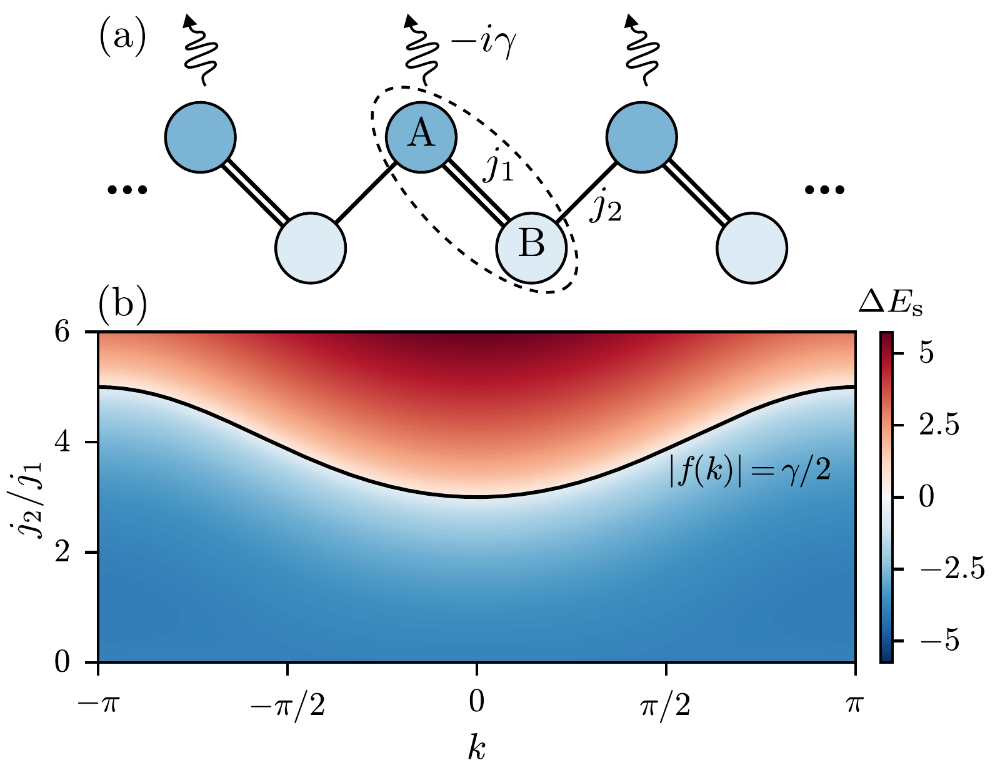
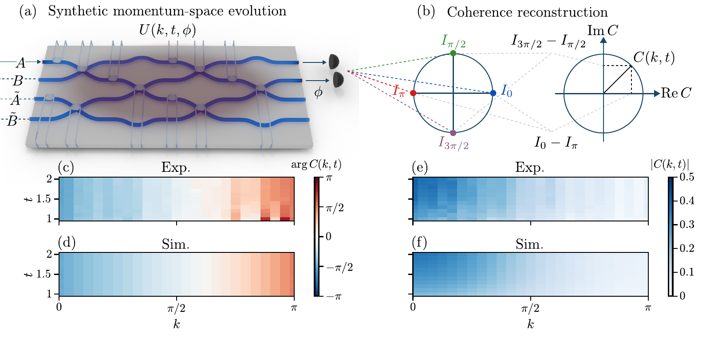
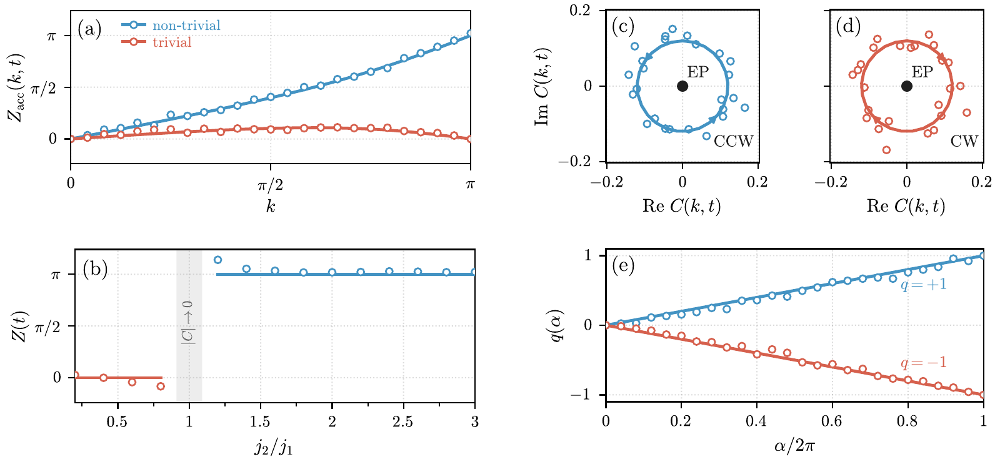
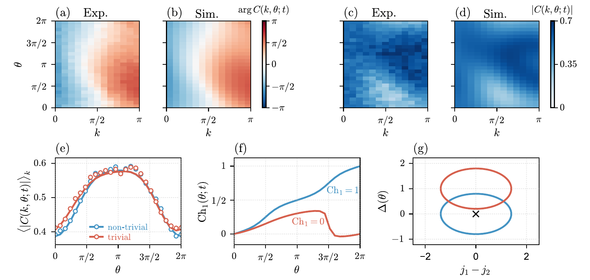

v3.15
Analyzing | Framework v3.15 | Supplemental Material not accessible

> **Access Status** — Full paper: retrieved (arXiv:2609.38352v1, the only version, 6 pages; local PDF read page by page, plus the LaTeX source `main.tex` from the arXiv source bundle) · Abstract: retrieved from the arXiv abs page (v1, 29 Sep 2026; journal-ref "Physical Review Letters 2026"; DOI 10.1103/xkht-64kc) · Supplementary material: **not read**. The separate Supplemental Material (ref. [28]: dilation details, the phase-relation proof, calibration, N-band scaling, Rice–Mele fit) is not in the arXiv source bundle, and the APS landing page returned HTTP 404 here. · Figures: all four viewed from the authors' vector files in the arXiv source (`interferometric-2609.38352_fig1`–`fig4`), with numbering checked against the PDF captions. · Analysis basis: full main text and figures; supplement-dependent points are flagged. · Numeric checks: Python (numpy), scripts `claim_check.py`, `rm_gap_check.py`, `rescale_check.py`.

---

## 1. Punchy Title & One-Sentence Hook

**Reading a Lossy Lattice's Topology One Momentum at a Time — Without Building the Lattice**

A Stockholm–Singapore–Wuhan team turns a reprogrammable silicon-photonics chip into a "momentum-space calculator" that programs a lossy two-site unit cell one wavevector at a time and reads the inter-site phase with four interference measurements, recovering a Zak phase (0 vs π), a Chern number (0 vs 1) and a ±1 winding around an exceptional point. Because those invariants are programmed in, this is a readout and fidelity demonstration, not the discovery of new topology.

## 2. Big-Picture Context

Topological band theory says some properties of a crystal are integers, computed from how the Bloch wavefunctions twist as the wavevector k sweeps the Brillouin zone (the full range of distinct wavevectors). The classic examples are the **Zak phase** of a one-dimensional chain (0 or π) and the **Chern number** of a two-dimensional band. These numbers change only if a band gap closes, and they force protected edge states at boundaries. In photonics, most demonstrations since about 2013 have seen topology through those edge states. That works, but it sees topology only through its consequences, needs large well-terminated samples, and needs a new chip for each point in a phase diagram.

Two other routes exist. One tracks wavepackets through the bulk of a real-space lattice (Zeuner et al. 2015 did this on exactly the kind of lossy SSH lattice studied here). The other reads invariants from the far-field or reflection phase of photonic crystals and metasurfaces, which gives direct momentum-space access but with a fixed geometry. Meanwhile **non-Hermitian** physics (systems with gain or loss) has become one of the busiest corners of topology. It brings **exceptional points** (EPs), where two eigenmodes merge completely, and it brings the practical problem this paper puts at its centre: strong loss kills the light. The topological information sits in the relative phase between amplitudes, and when those amplitudes decay toward zero the phase becomes unmeasurable.

The paper's answer combines three established ingredients: a programmable photonic integrated circuit (a mesh of tunable interferometers that can implement any small unitary matrix) that simulates each momentum point separately; **Sz.-Nagy unitary dilation**, which embeds the lossy two-by-two evolution in a four-by-four unitary; and **four-step phase-shifting interferometry**, which recovers the complex relative amplitude of the two sites from four intensity readings. The group demonstrates this on the non-Hermitian Su–Schrieffer–Heeger (SSH) chain and on a non-Hermitian Rice–Mele pump. The hardware builds on the same group's Klein-bottle chip (Xu et al., arXiv:2512.20273, checked at v1, the only version, submitted 23 Dec 2025), which simulated a two-band non-Hermitian system on a nonorientable parameter space.

**Paper Type & Stakes:** This is a short experimental methods Letter (accepted in *Physical Review Letters*) that demonstrates a measurement protocol on a programmable photonic simulator. At stake is whether a reconfigurable chip can become a general bench instrument for reading momentum-space invariants of lossy models, including in the regime where loss dominates, rather than a one-off fixed-geometry device per model.

**Prior Belief Check:** The results align fully with expectations, and they should: the Zak phases, Chern numbers and EP winding all follow from textbook models whose answers are known in closed form, and the experiment reproduces them. No expert would be surprised that SSH gives π for intercell coupling stronger than intracell coupling, or that a Rice–Mele loop around the gap closing pumps one unit. The contribution is the measurement pipeline, carried into the regime where the whole Brillouin zone lies past the exceptional point. Specialists will judge it a clean, incremental, platform-level advance, not a new physical effect. Two framings in the abstract deserve calibration (developed in Section 4). The "Zak phase" read out is, as the paper itself says, that of the **Hermitian parent model**. And the Chern number is obtained by **fitting** a model pump loop to the measured coherence, not by integrating measured phases directly.

**Replication & Convergence Note:** This is a single-group result on one chip, built on the same collaboration's earlier platform, with no independent reproduction yet. Independent confirmation would be another group, on a different mesh or on a qubit processor using the same dilation-plus-interferometry recipe, reading the same invariants. A stronger test would read a non-Hermitian-only invariant (such as a point-gap winding) that has no Hermitian counterpart.

## 3. Necessary Background Crash-Course

### Origins & Big Picture: where the SSH chain, the pump and the programmable chip come from

The model at the heart of this paper is older than "topological insulator" as a phrase. In 1979 Su, Schrieffer and Heeger wrote down a minimal description of **polyacetylene**, the conjugated polymer (CH)ₓ, whose carbon backbone alternates single and double bonds. Chemically you know this cold: a conjugated chain cannot keep every C–C bond equal, because a Peierls distortion lowers the energy by dimerizing the chain into short (double-like) and long (single-like) bonds. SSH modelled this as electrons hopping along a chain with two alternating hopping strengths, an intracell hop j₁ and an intercell hop j₂. The two ways of dimerizing (short bond inside the unit cell, or short bond between cells) give the same bulk energy bands but are topologically different. Where the two patterns meet, a domain wall traps a zero-energy state, the **soliton**, which carries the strange charge–spin relations that made polyacetylene famous (and helped earn Heeger, MacDiarmid and Shirakawa the 2000 Chemistry Nobel for conducting polymers). In 1989 Zak showed that a Berry phase taken across the Brillouin zone, now called the **Zak phase**, distinguishes the two dimerizations: 0 for one, π for the other.

In 1982 Rice and Mele added a staggered on-site energy Δ to the SSH chain (alternating site energies, like alternating atoms in a diatomic polymer). In 1983 Thouless showed that if you vary the chain's parameters slowly around a closed loop, a filled band moves an **integer** number of charges per cycle. That integer is a Chern number defined on the two-dimensional space of (momentum k, pump phase θ). The Rice–Mele model is the standard example: a loop in the (j₁ − j₂, Δ) plane that encircles the point where the gap closes pumps one charge per cycle, and a loop that misses it pumps none.

The non-Hermitian layer came later. Bender and Boettcher (1998) showed that some non-Hermitian Hamiltonians with parity–time (PT) symmetry still have real spectra. Optics quickly became the natural laboratory, because loss and gain are easy to engineer in waveguides. A "passive PT" lattice, with loss on one sublattice only, behaves like a PT-symmetric one after you subtract a uniform background decay. Zeuner and colleagues used exactly that structure (loss on one SSH sublattice) in 2015 to see a topological transition in the bulk of a non-Hermitian system. At strong loss such systems cross **exceptional points** (explained two subsections below).

The hardware has its own lineage. Reck and colleagues (1994) proved that any N × N unitary can be built from a mesh of beam splitters and phase shifters, and silicon photonics made such meshes reprogrammable on a chip. Separately, Sz.-Nagy's dilation theorem (1953) says any contraction, meaning a matrix that never amplifies a vector, is the corner block of a larger unitary. Quantum-computing groups (Hu, Xia and Kais 2020) turned this into a recipe for simulating open-system dynamics on unitary hardware.

This paper sits where these lines cross. It takes the oldest topological lattice model (SSH, with its chemistry pedigree) and the oldest topological pump (Rice–Mele/Thouless), adds sublattice loss strong enough to push the whole Brillouin zone past the exceptional point, and runs each wavevector as a separate four-mode unitary on a reprogrammable chip. The "system" is therefore not a material at all but a **model**, compiled to hardware one momentum point at a time.

> **Analogy:** The SSH chain is a row of memory banks paired by fast buses. Draw the pairs so the fast bus sits inside each pair, or so it crosses between pairs. Inside the row the two layouts look identical, but at the end the second layout leaves one bank with no fast-bus partner. That dangling bank is the edge state.
>
> **Breaks when:** you ask why the dangling state sits at exactly zero energy and resists disorder. That protection comes from a chiral (sublattice) symmetry that the bus picture has no slot for.

### Winding numbers and the Zak phase: counting laps around the origin

The cleanest way to see SSH topology is through one complex number per wavevector, the **coupling function** f(k) = j₁ + j₂·e^(−ik). As k runs once around the Brillouin zone, f(k) traces a circle of radius j₂ centred at j₁ in the complex plane. If j₂ > j₁, that circle encloses the origin and the phase of f winds once (winding number 1, Zak phase π). If j₂ < j₁, it misses the origin and the phase wobbles but returns (winding 0, Zak phase 0). The invariant is just "how many laps does this point make around zero."

Worked micro-example with the paper's numbers: for j₁ = 0.5 and j₂ = 1.5, f(0) = 0.5 + 1.5 = 2 (phase 0), and f(π) = 0.5 − 1.5 = −1 (phase π). Halfway around the zone the phase has already advanced by π, and by symmetry it advances another π on the way back, giving one full lap. Swap to j₁ = 1.5, j₂ = 0.5: f(π) = +1, so the phase is back at 0 at k = π, and the net lap count is zero. This is why the paper only needs to scan k from 0 to π. The model's mirror symmetry (f at −k is the complex conjugate of f at k) makes the second half a reflection of the first, so the half-zone accumulation is exactly the Zak phase, π or 0.

> **Analogy:** Think of a 16-bit hardware counter that wraps at 65,536, sampled periodically. You only ever read the low 16 bits (the phase, modulo 2π), but you can reconstruct how many times it wrapped (the winding) by unwrapping: whenever consecutive reads jump by more than half the range, assume a wrap. The wrap count is the topological integer.
>
> **Breaks when:** the counter is read while its value is undefined. A counter always has a value, but a complex number with magnitude near zero has no meaningful phase at all. When |f| or the measured signal gets small, each "read" is mostly noise, and unwrapping can insert or delete a spurious lap. That failure mode is exactly the one the paper fights.

### Non-Hermitian bands and exceptional points

Put loss γ on the A sites only. Each wavevector now has two modes with complex energies. The real part sets the oscillation frequency, and the imaginary part sets the decay rate. For the two-site cell, the complex energies are a common decay of γ/2 plus or minus the square root of (|f|² − γ²/4). That square root controls everything:

- If |f| > γ/2 (coupling beats loss), the square root is real. The two modes oscillate at different frequencies and decay at the same rate. This is the "PT-unbroken" regime.
- If |f| < γ/2 (loss beats coupling), the square root is imaginary. The two modes share a frequency but decay at different rates: one lives mostly on the lossy A site and dies fast, and the other hides on B and lives long. This is the "dissipative" or PT-broken regime the paper targets.
- At |f| = γ/2 exactly, the square root vanishes. The two eigenvalues coincide and so do the two eigenvectors. The matrix stops being diagonalizable. That is an **exceptional point**.

Micro-example: with γ = 4 the EP sits at |f| = 2. For j₁ = 0.5, j₂ = 1.5, |f| runs from 2 at k = 0 down to 1 at k = π. So the **entire** Brillouin zone lies in the dissipative regime, touching the EP exactly at k = 0. The same holds for the "trivial" pair (1.5, 0.5), since |f| has the same range. These are the paper's working parameters, and they are not mild: loss is twice the largest coupling.

> **Concept:** At an ordinary degeneracy, two eigenvalues coincide but two independent eigenvectors remain. At an EP, the eigenvalues coincide **and** the eigenvectors merge into one, so the matrix has only one eigenvector and cannot be diagonalized (it becomes a Jordan block). Circling an EP in a two-parameter space swaps the two eigenvalues, so they return to themselves only after two laps. This is the half-integer "eigenvalue vorticity" of ±1/2 that the paper contrasts with its own integer winding.
>
> **Vehicle:** A hash table with two buckets and two keys. Normally each key has its own bucket. Under a pathological hash, both keys land in one bucket and the table genuinely has one slot fewer: you cannot recover two independent entries, only one entry plus a "next" pointer chained behind it.
>
> **Analogy:** Bucket ↔ eigenvector; key ↔ eigenvalue; both keys landing in the same bucket and losing a slot ↔ eigenvectors coalescing at the EP; the chained "next" pointer ↔ the generalized eigenvector of the Jordan block.
>
> **Breaks when:** you go around the EP. A hash collision is a static fact about one configuration. It has no notion of what happens as you continuously vary the hash function around a loop, so it cannot represent the eigenvalue swap and the two-laps-to-return structure, which is the EP's defining topological feature.



*Figure 1 (from the paper): (a) the SSH chain with intracell hop j₁, intercell hop j₂ and loss on the A sites; (b) band splitting across momentum k and coupling ratio j₂/j₁ for j₁ = 0.5, γ = 4, with the black curve marking the exceptional points.*

**What to look at:** below the black curve (blue) the bands differ by decay rate, not frequency, so the system is in the dissipative regime. The curve sits at j₂/j₁ = 3 at k = 0 and rises to 5 at k = ±π. All of the paper's SSH experiments (j₂/j₁ ≤ 3) live in or on the edge of the blue region.

### Synthetic momentum space and unitary dilation

In a translation-invariant lattice each k evolves independently: the big lattice Hamiltonian splits into one two-by-two matrix per k. So the authors never build a lattice. For each k and time t they compute the two-by-two propagator, program the chip to implement it, inject light, read the output, and move on. A 25-point momentum scan becomes 25 separate chip configurations.

The chip only does unitary (lossless) operations, but the lossy propagator shrinks vectors. The **dilation** fixes this. First divide the propagator by its largest singular value (its maximum gain), so nothing grows. Then embed it as the top-left corner of a four-by-four unitary, with two "ancilla" waveguides (Ã, B̃) absorbing whatever the loss would have removed. An N-band model needs N signal and N ancilla modes.

My numerical check (`rescale_check.py`) shows what the rescaling buys. At t = 2, the raw lossy evolution keeps only 0.8–3% of the injected intensity in the signal modes. After rescaling, the signal carries 7–38% (lowest near k = π). The evolution is also strongly non-normal: the propagator's two singular values differ by a factor of about 20 at t = 1 and up to about 1,400 at t = 2. Because the rescaling factor differs at each k, absolute intensities are not comparable across k; the phase is unaffected.

> **Analogy:** A network switch must deliver every packet it receives (unitary: nothing is created or destroyed). To emulate a lossy link, you configure it to forward the "dropped" packets to a discard port nobody reads. The traffic on the live ports then looks exactly as if the link had dropped them, and the switch never actually broke conservation.
>
> **Breaks when:** you ask about the overall scale. A real lossy link loses packets in absolute terms, while here the simulation first renormalizes by the maximum gain at each k. That is equivalent to the experimenter quietly turning up the input power by a different amount at each wavevector. A physical lossy lattice cannot do that, which matters for the paper's claim to have "resolved" the amplitude-suppression problem (see the Assumption Audit).

### Phase-shifted interferometry: reading a complex number with power meters

Detectors measure intensity, not phase. To get the complex relative amplitude between sites A and B, the chip mixes the two output amplitudes on a beam splitter after adding a controllable phase φ to one arm, and measures the output intensity at φ = 0, π/2, π and 3π/2. The two differences give the real and imaginary parts of the cross term.

$$C(k,t) = \left[I_0 - I_\pi\right] + i\left[I_{3\pi/2} - I_{\pi/2}\right]$$

**Symbol definitions:**
$C(k,t)$ : the "interferometric coherence", a complex number whose phase is the relative phase of the A and B amplitudes at momentum k and time t
$I_\phi$ : detected output intensity when the reference phase is set to φ (four settings, so four chip configurations per point)
$i$ : the imaginary unit; the second bracket becomes the imaginary part

**What this actually means:** each bracket is a differential measurement. Subtracting the intensity at φ and at φ + π cancels the "common-mode" part (the individual powers |A|² and |B|², identical in both readings) and leaves only the interference term, just as a differential sense amplifier on a DRAM bit line cancels supply noise and keeps the signal. The phase of C is the topological information, and its magnitude |C| (proportional to the product of the two amplitudes) says how trustworthy that phase is.

Four settings per point is why the paper counts "100 unitaries per parameter set" for 25 k-points, and 2,500 for the 25 × 25 Rice–Mele torus. Both counts check out (25 × 4 and 25 × 25 × 4).

> **Central analogy for this paper:** a per-k coprocessor with differential phase readout.

## 4. Core Technical Explanation

Analyst-built concept diagram (not from the paper):

```
 model H(k) or H(k,theta), loss gamma, time t
          |
          v
 for each grid point (25 k's, or 25x25 (k,theta)):
   propagator P = exp(-i H t)     (2x2, lossy)
          |
          v
   rescale by max gain, dilate --> 4x4 unitary
   (signal A,B + ancilla A~,B~)
          |
          v
   append phase-phi readout; program chip
   for phi = 0, pi/2, pi, 3pi/2 (4 runs)
          |
          v
   C = (I0 - Ipi) + i (I3pi/2 - Ipi/2)
          |
   +------+----------------+-------------------+
   v                       v                   v
 SSH: unwrap arg C    SSH: arg C along     RM: fit pump loop
 over k in [0,pi]     circle around C=0    to C(k,theta), then
 -> Zak 0 or pi       -> q = +1 / -1       Chern of fitted loop
```

Read it top to bottom: everything above the split is the same hardware recipe, and the three branches are the three invariants the paper reports, each extracted from the same complex coherence C in a different way.

### Step 1 — Program the lossy SSH evolution, one momentum at a time

The authors take the two-band Hamiltonian with loss on site A.

$$H(k) = \begin{pmatrix} -i\gamma & f(k) \\ f^{*}(k) & 0 \end{pmatrix}, \qquad f(k) = j_1 + j_2 e^{-ik}$$

**Symbol definitions:**
$k$ : wavevector (crystal momentum), from 0 to 2π across the Brillouin zone
$j_1, j_2$ : intracell and intercell coupling strengths (dimensionless units in which time is measured)
$\gamma$ : loss rate on the A sublattice (the B site is lossless)
$f(k)$ : the coupling function; its winding around the origin is the SSH topology
$f^{*}$ : complex conjugate of f

**What this actually means:** the off-diagonal entries are the "wiring" between the A and B sites at this wavevector, and their phase pattern carries the topology. The −iγ entry is a leak on one site. Picture a two-node network where one node has a drain: the drain changes how fast traffic dies out, but it does not rewire which nodes connect to which.

For each k they compute the propagator at time t, dilate it to a four-mode unitary, and inject light into the A port. The working parameters are j₁ = 0.5, j₂ = 1.5 (non-trivial) or 1.5, 0.5 (trivial), with γ = 4, times t between 1 and 2, and 25 equally spaced k-points from 0 to π. As shown in Section 3, these parameters put the whole Brillouin zone in the loss-dominated regime, with the EP touching at k = 0.

### Step 2 — Read the coherence and check it against simulation

Figure 2 shows the chip layout, the four-phase readout and the first data.



*Figure 2 (from the paper): (a) four-mode programmable circuit (signal A, B; ancilla Ã, B̃); (b) how the four phase-shifted intensities build the complex coherence C; (c, d) measured and simulated phase of C over k and t for (j₁, j₂, γ) = (0.5, 1.5, 4); (e, f) measured and simulated magnitude |C|.*

**What to look at:** in (c) versus (d), the phase sweeps smoothly from about −π/2 at k = 0 to about +π/2 at k = π, a net advance of π across half the zone. In (e, f), the magnitude is largest near k = 0 and fades toward k = π, and the noisiest experimental phase pixels in (c) (bottom right, near k = π at t = 1) sit exactly where |C| is smallest.

The agreement is good: the root-mean-square phase error is 0.061π and the magnitude error is 0.019 (on a 0–0.5 scale). The residual errors concentrate where |C| is small, because a small complex number's phase is ill-conditioned. They are not "disorder" in the lattice sense: each k is a separate configuration, so the relevant imperfection is the fidelity of each programmed unitary, which the authors suggest better chip calibration models could improve.

There is a simple reason the phase tracks so cleanly. For light injected into site A, the propagator's A-to-A element stays a real number at every k and t, while the A-to-B element is a real number times −i times the conjugate of f(k). So the phase of C equals the phase of the conjugated coupling function plus a constant, in both the oscillating and the decaying regime. The paper states this and defers the proof to the supplement. My simulation (`claim_check.py`) confirms it to machine precision (differences of order 10⁻¹⁶ radians) through the full dilate-and-interfere pipeline.

This identity is both the method's strength and its main interpretive catch. The phase is an exact readout of the coupling winding however strong the loss, but what it reads is the winding of f(k), the **coupling the experimenters programmed in**. The loss γ enters only the magnitude. The paper acknowledges this with the phrase "here that of the Hermitian parent model", which the revision macros in the LaTeX source mark as a referee-requested addition.

### Step 3 — Accumulate the phase into a Zak phase

Summing the k-to-k phase increments from 0 to π gives the accumulated Zak phase. Figure 3 is the heart of the paper.



*Figure 3 (from the paper): (a) accumulated Zak phase along k for the non-trivial (blue) and trivial (red) parameter sets at t = 2; (b) Zak phase versus j₂/j₁ at fixed j₁ = 0.5, with a shaded band where |C| → 0 near the transition; (c, d) measured coherence traced around a circle enclosing C = 0, counter-clockwise and clockwise; (e) accumulated coherence winding q, reaching +1 and −1.*

**What to look at:** in (a), the blue trace climbs steadily to π while the red trace bulges and returns to 0. In (b), the circles sit on two flat plateaus at 0 and π, with the jump at j₂/j₁ = 1 and scattered points only next to the grey band. In (e), the two straight lines end at +1 and −1.

The numbers: the end-point values are 1.02π (non-trivial) and −0.0015π (trivial). Across the scan in Fig. 3(b), the plateaus average −0.025π and 1.04π. The plateau deviations (about 0.04π at most) are tiny compared with the π separation between phases, so the distinction is unambiguous. The grey band near j₂/j₁ = 1 marks where f(π) = j₁ − j₂ → 0. There the B amplitude vanishes at the zone edge and the phase cannot be read, which is the experimental face of the gap closing. The first points on either side (j₂/j₁ = 0.8 and 1.2) visibly overshoot, by roughly 0.1–0.15π.

### Step 4 — The "EP-induced coherence winding"

The second SSH result treats the zero of C as a vortex. The authors pick a closed contour, a circle drawn in the complex C-plane around C = 0, which they identify with the EP, and accumulate the phase of the measured C around it. Counter-clockwise traversal gives q = +1 and clockwise gives q = −1 (Fig. 3c–e). They stress that this integer q differs from the half-integer eigenvalue vorticity of an EP, which you would see by tracking the eigenvalues themselves around the EP in parameter space. Instead, q is a winding of the measurable coherence signal around its zero.

The main text does not say which physical parameters trace this contour; that is in the supplement I could not read. What the data show is that the hardware reproduces a programmed full-turn phase circulation with the correct handedness. The measured points scatter (radius about 0.12 ± 0.04) but stay well clear of the origin, so the winding is safe. The Claim check and Section 5 discuss how much physics this adds.

### Step 5 — Up a dimension: the non-Hermitian Rice–Mele pump

For the Chern number the authors add a pump phase θ. As θ goes around, the two couplings swing in opposite directions around a mean of 2 (amplitude 0.7), and a staggered on-site energy Δ swings around an offset Δ_c (amplitude 0.8), with loss γ = 2 on site A and readout at t = 0.25. In the (j₁ − j₂, Δ) plane the pump traces an ellipse with half-width 1.4 and half-height 0.8. With Δ_c = 0 the ellipse surrounds the origin (non-trivial); with Δ_c = 1 it is lifted clear (trivial). The grid is 25 × 25 in (k, θ), and the input is an equal superposition of A and B with a −i relative phase.

The Chern number is the number of times the Zak phase winds as θ goes once around. Physically, that is the number of unit cells a filled band moves along the chain per pump cycle, like a screw conveyor advancing a fixed number of threads per turn.



*Figure 4 (from the paper): (a–d) measured and simulated phase and magnitude of C over (k, θ) for the non-trivial pump (k from 0 to π shown); (e) momentum-averaged |C| along the cycle for both pumps; (f) accumulated Chern number along θ, ending at 1 (non-trivial) and 0 (trivial); (g) the two pump loops in the (j₁ − j₂, Δ) plane relative to the gap-closing point (cross).*

**What to look at:** in (e), both cycles keep the average |C| between 0.4 and 0.6, far from the low-coherence danger zone, so the phases are trustworthy throughout. In (f), the blue curve climbs to 1 while the red curve rises to about 0.35 and then drops back to 0 near θ = 3π/2. In (g), only the blue ellipse encloses the cross. Note that (f) is drawn as smooth lines, not data circles: it is computed from the fitted loop.

The extraction route matters. The text says a candidate Rice–Mele loop in the (j₁ − j₂, Δ) plane is specified, the coherence it predicts is computed, and the loop is fitted to the measured coherence. The Chern number in Fig. 4(f) is then that of the **fitted** loop. The fitted loops sit 0.805 (non-trivial) and 0.175 (trivial) from the gap-closing point, close to the nominal 0.8 and 0.2. The coherence data match simulation well: phase error 0.021π and magnitude error 0.030 on the full maps, and 0.008–0.009 on the averaged traces.

Why fit rather than integrate the phase directly, as in SSH? Presumably because with a staggered potential and a superposition input the clean identity of Step 2 no longer holds. The main text does not say.

### Claim check

Checks were run in Python (`claim_check.py`, `rm_gap_check.py`, `rescale_check.py`), simulating the ideal pipeline: exact propagator, rescaling by the largest singular value, Sz.-Nagy dilation (verified unitary), and four-phase readout.

**1. Zak phases π and 0 (end-points 1.02π and −0.0015π; plateaus 1.04π and −0.025π) — Reproduced.** At t = 2 with 25 k-points on [0, π], the ideal pipeline gives exactly π and 0. The phase of C equals the phase of the conjugated coupling function plus a constant, to 10⁻¹⁶. So the measured values sit within about 0.04π of ideal, consistent with the quoted 0.06π phase error. Why it matters: the topological distinction is solid, and it is precisely the winding of the programmed coupling.

**2. Chern numbers 1 and 0 — Reproduced, including with loss.** For the lossy Rice–Mele model at γ = 2, a lattice (Fukui-type) Chern computation on the right eigenvectors of the lower band gives +1.000 and 0.000, stable for grids from 60 to 240 points per side. The Hermitian parent gives the same. Both loops keep a real line gap open (minimum band separation 1.6 and 0.4), and neither touches this model's exceptional points (which need Δ = 0 and |f| = γ/2 = 1, while the non-trivial loop has |f| ≥ 1.4 where Δ = 0). Geometry: the nominal ellipses sit 0.8 and 0.2 from the origin, matching the fitted margins of 0.805 and 0.175.

**3. Bookkeeping — Reproduced.** The EP curve in Fig. 1(b) runs from j₂/j₁ = 3 at k = 0 to 5 at k = π, and the colour scale's maximum splitting is 5.74. The unitary counts (100 per SSH parameter set, 2,500 per pump cycle) match 25 × 4 and 25 × 25 × 4.

**Sensitivity — readout time.** The most influential unstated choice is t. For injection into A, the A-to-A amplitude crosses zero along a **line** in the (k, t) plane, from t = 0.50 at k = 0 (exactly at the EP, t = 2/γ) to t = 0.76 at k = π. Inside that window part of the zone has flipped sign and part has not, so the unwrapped phase picks up a spurious π. At t = 0.6 the ideal pipeline returns a Zak phase of **0 for the non-trivial chain and π for the trivial one, inverted**. The conclusion survives for any t above about 0.76 (with these parameters), so the paper's window of t from 1 to 2 is safe. But the safe window comes from knowing the model, which the paper describes only as choosing a "representative well-conditioned interval."

**Robustness (experimental: error margins).** The SSH plateaus sit about 0.04π from ideal against a π separation, so the readout margin is roughly 20 times the error. For the Chern number, the trivial loop flips to non-trivial only if the fit misplaces its centre by more than about 0.2, which is a quarter of the loop's 0.8 half-height. With a 0.02π phase error that looks comfortable, but the main text gives no fit uncertainty, so this margin cannot be turned into a confidence level.

**Internal consistency and misreadable wording (significant findings).**
- **The Chern number is a model-fit output, not a direct readout.** The abstract says the method "gives" Ch₁ = 0, 1. The text shows it is computed from a Rice–Mele loop fitted to the measured coherence (Fig. 4f has no data points). The result is reliable for this model, but the integer comes from the fitted model's geometry, so the procedure assumes the Rice–Mele family is correct. That is a weaker kind of readout than the SSH Zak phase, and nothing in the abstract signals the difference.
- **The "EP-induced" zero is not specific to the EP in the setting the main text describes.** For injection into A, the coherence vanishes along a whole line in (k, t), which passes through the EP but extends into the dissipative regime (the line above). A circle drawn around C = 0 in the complex C-plane winds once by construction. So q = ±1 shows that the chip reproduces a programmed phase circulation and its handedness. It does not by itself isolate an EP property. The supplement may define the contour in a parameter space where the zero is point-like; I could not check this.
- Minor: the Zak phase is read from the Hermitian parent's winding (stated in the text, not the abstract).

### Assumption Audit

> **Watch:** You likely assume the chip contains a lossy SSH lattice, with light hopping between many sites and leaking out. It does not. The chip is a four-waveguide interferometer reconfigured for every (k, t, φ) point: 100 configurations for one SSH Zak phase, 2,500 for one pump cycle. There is no lattice, no boundary and no physical loss on any site; "loss" is amplitude routed to ancilla waveguides by the dilation. That is a strength (no finite-size or edge effects, full reconfigurability), but it makes the experiment a hardware **simulation** of each momentum block, computed one Fourier bin at a time.

> **Watch:** You likely assume "resolving the central experimental challenge that strong dissipation suppresses the amplitudes" means the method overcomes loss physically. Two things do the work, and neither is available to a real lossy lattice. The per-k rescaling boosts the signal from 0.8–3% of the input to 7–38% in my check. And for injection into A, the loss drops out of the phase entirely. The residual weakness (small |C| near the gap closing and in the early-time window) remains, and the paper handles it by choosing parameters and times that avoid it.

> **Watch:** You likely assume "non-Hermitian topological invariants" means invariants that exist only because of the loss, such as the point-gap winding of complex eigenvalues. What is read here is the Zak phase of the Hermitian parent (the paper's words) and the Chern number of line-gapped bands (my check: identical with and without loss). Loss shapes the dynamics and the signal strength but not the integer. The one EP-flavoured quantity, q, is a winding of the measured signal around its zero, which the paper itself distinguishes from the EP's intrinsic half-integer vorticity.

## 5. What's Genuinely New or Clever

**1. Combining dilation and phase-shifted readout into one compiled unitary per point.** Each ingredient is old: Sz.-Nagy dilation is established on spin and superconducting platforms, four-step phase shifting is textbook optics, and programmable meshes are standard research tools. What is new to the field is fusing them so that a single four-by-four unitary per (k, t, φ), with the dilated evolution and the readout compiled together, delivers a phase-resolved coherence for an arbitrary lossy two-band model. A phase diagram such as Fig. 3(b) becomes a software sweep instead of a fabrication run. Compared with the group's own Klein-bottle work (arXiv:2512.20273 v1), which reconstructed complex Hamiltonians and mapped where imaginary gaps close, the step here is the **phase-sensitive readout of the evolved state**, which carries winding information directly.

**2. An identity that makes the phase loss-blind.** For light injected into the lossy site, the phase of the coherence equals the phase of the conjugated coupling function at every k and t, in both the oscillating and the overdamped regime. That turns a hard problem (extract topology from strongly decaying, non-normal dynamics) into an easy one (unwrap a phase), and it explains why the readout works across a fully dissipative zone with loss twice the largest coupling. New to the reader rather than the field: because each k is a separate run, errors cannot mix momenta the way lattice disorder does, so the simulator's error model is per-point unitary fidelity.

**Predictive Content Check**

1. **Falsifiable handle:** The paper's checkable predictions are the textbook invariants it reproduces: Zak phase 0 vs π switching at j₂/j₁ = 1, Chern number 1 vs 0 depending on whether the pump loop encloses the gap closing, and q = ±1 with traversal direction. These could have failed, through device infidelity or unwrapping errors, and did not, so the handle tests the **instrument**, not new physics. The one forward-looking claim is scalability (N signal plus N ancilla modes for N bands). It implies that a three-band lossy model with a non-Hermitian-only winding should be readable on a six-mode mesh with similar phase errors (about 0.02–0.06π). The paper does not test this. Finding: the paper reproduces known answers rather than predicting new phenomena, which is appropriate for a methods Letter.

2. **Formalism load (fires for the EP winding only):** The coherence winding q leans on a formal definition, a contour integral of the phase of C around its zero. As the main text presents it, the contour is a circle chosen in the C-plane around C = 0, so a winding of ±1 follows from the choice of contour, and reversing the traversal flips the sign by construction. Deleting the "EP" label would not change any number in Fig. 3(e). The formalism is therefore decorative in what it claims about EPs, though not in what it shows about the hardware (accurate phase circulation). The Zak and Chern machinery, by contrast, is plainly load-bearing.

## 6. Limitations & Open Questions

**The invariants read out are those of the programmed (Hermitian-parent / line-gapped) models, not non-Hermitian-only invariants.** The Zak phase is the winding of the coupling function, and the Chern number is unchanged by the loss. **(A) Consensus** — the paper itself says the Zak phase is "that of the Hermitian parent model", and it is standard that line-gapped non-Hermitian bands inherit Hermitian invariants; my recomputation from the stated parameters confirms both. **(paper, text before Eq. 3; analyst inference from recomputation with the Fig. 3 and Fig. 4 parameters)**

**The Chern number comes from a model fit, so it presupposes the Rice–Mele family.** A wrong model family, or a chip error that the fit absorbs into loop deformation, could in principle produce the right integer for the wrong reason, and the main text gives no fit uncertainty. **(B) Contested** — fitting to a parametrized model is a common and defensible practice for simulators whose target is known, but it is weaker than a model-agnostic extraction, and reasonable people will weigh that differently. **(paper, Fig. 4 caption and text; analyst inference)**

**The EP coherence winding q = ±1 does not, on the main-text description, isolate an EP property.** **(C) Speculative** — my simulation shows the zero of C for injection into A forms a line through the EP rather than a point, and a circle around C = 0 winds by construction; the supplement may define the contour differently, which I could not read. **(analyst inference)**

**The readout time window must be chosen with model knowledge.** Between t ≈ 0.50 and 0.76 (for γ = 4 SSH) the unwrapped Zak phase inverts. **(C) Speculative** — this rests on my ideal-pipeline recomputation from the paper's parameters; the paper only says the data are shown for a "representative well-conditioned interval", and phase tracking in t might rescue the early window. **(analyst inference)**

**Rescaling by the largest singular value hides absolute loss, so the "amplitude suppression" problem is solved for simulation, not for physical lossy systems.** **(B) Contested** — the dilation is a legitimate and widely used simulation tool, but whether this counts as "resolving" the experimental challenge depends on whether the target is simulating models (yes) or probing physical lossy materials (no). **(analyst inference; broader literature on dilation-based simulation)**

**Low-coherence regions remain blind spots.** Near the gap closing (j₂/j₁ ≈ 1) the Zak phase cannot be read, and the adjacent points overshoot by about 0.1–0.15π. **(A) Consensus** — the paper shades this region and explains that a vanishing |C| makes the phase ill-conditioned; it is intrinsic to any phase readout. **(paper, Fig. 3b and text on ill-conditioning)**

**Scale and calibration.** Only two-band models (four modes) are shown, and larger meshes lose per-unitary fidelity. **(A) Consensus** — mesh fidelity versus size is a known engineering limit of programmable photonics, and the paper itself names calibration models of imperfect circuits as the mitigation. **(paper, text after Fig. 2 discussion; broader literature)**

**Open questions (12–24 months):** read a genuinely non-Hermitian invariant (a point-gap winding or EP charges in a two-parameter space) with the same per-k method; run a three- or four-band model on six to eight modes; extract a Chern number directly from measured phases rather than a fit; and choose the readout time without prior model knowledge.

## 7. Detailed Summary & Explanation

The paper shows that a reprogrammable silicon-photonic chip can read topological invariants of lossy lattice models directly in momentum space, even when loss dominates. Instead of building a lattice, the authors program each wavevector's rescaled, dilated two-by-two lossy evolution onto a four-mode mesh, then interfere the two sites at four phase settings to get a complex coherence whose phase is the relative phase of the sites.

For the lossy SSH chain, with loss twice the largest coupling (the whole zone overdamped, an exceptional point at zero momentum), summing this phase across half the zone gives 1.02π for the topological arrangement and essentially zero for the trivial one, with clean plateaus across a coupling scan. Encircling the coherence's zero gives a winding of +1 or −1 by direction. A lossy Rice–Mele pump on a 25 × 25 momentum-by-pump grid (2,500 configurations) yields, through a fitted pump loop, Chern numbers 1 and 0.

**Why the summary is framed this way.** The method comes first because the invariants themselves are textbook results; the pipeline is the contribution. Three interpretive choices shape the framing. For injection into the lossy site, the measured phase is exactly the phase of the programmed coupling, independent of loss (confirmed to machine precision), so the Zak phase is the Hermitian parent's, as the authors say. The Chern number comes from a model fit. And the "EP winding" follows from the contour choice described in the main text. None of this undermines a clean experiment that reproduces every number I checked. The right takeaway is "a phase-resolved momentum-space readout that works deep in the lossy regime", not "new non-Hermitian topology observed". The method's real test comes when it is aimed at an invariant with no Hermitian counterpart.

**Where I'm least confident in this analysis:** the EP coherence winding. I could not read the Supplemental Material, which defines which physical parameters trace the circular contour in the coherence plane. My conclusion that q = ±1 is fixed by the contour choice and that the coherence zero is a line rather than an EP-specific point rests on the main-text description and on my simulation for injection into A. If the supplement uses a different input or parameter space in which the zero is genuinely point-like and tied to the EP, that criticism weakens considerably.

**Revision notes:** the referee pass added the early-time Zak-inversion finding, made the fit-based Chern extraction explicit against the abstract, quantified the rescaling boost and non-normality, corrected the overshoot near the transition (0.1–0.15π), replaced an inline formula with words, and trimmed the draft from about 8,800 to about 7,500 words.

## 8. Three Crystallized Takeaways

1. **A programmable photonic chip can act as a "momentum-space calculator" for lossy lattices.** It runs each wavevector as a separate four-waveguide configuration and reads the relative phase with four power measurements, so no physical lattice or edges are needed and a phase diagram becomes a software sweep.

2. **For light injected into the lossy site, the measured phase ignores the loss entirely.** It copies the winding of the programmed coupling, which is why the Zak phase reads 0 or π cleanly even when loss is twice the coupling. It is also why the invariant measured is the ordinary, Hermitian-parent one.

3. **This is a readout demonstration, not a new topological phase.** The Chern number comes from fitting a pump loop, the exceptional-point "winding" (as the main text describes it) follows largely from how the contour is drawn, and the real test is still to come: an invariant that only exists because of the loss.

## 9. Shorter Summary

Topological invariants, integers like the Zak phase of a chain or the Chern number of a pump, are usually seen in photonics through edge states of carefully built lattices. This paper takes another route. A reprogrammable silicon-photonic chip simulates a lossy lattice one wavevector at a time and reads the topology from the relative phase between the two sites of each unit cell.

The trick has three parts. The lossy two-site evolution at each wavevector is rescaled and embedded inside a larger lossless operation, with two extra waveguides absorbing what the loss removes. The chip is reprogrammed for every wavevector and time. And four interference measurements at different reference phases recover the complex relative amplitude.

On the lossy Su–Schrieffer–Heeger chain, with loss twice the largest coupling so that the whole momentum range is overdamped, the measured phase accumulates to π for the topological arrangement and about zero for the trivial one, with clean plateaus across a coupling scan. A second experiment, a lossy Rice–Mele pump on a 25 × 25 momentum-by-pump grid, yields Chern numbers of one and zero for loops that do and do not enclose the gap-closing point. A phase winding of plus or minus one around the signal's zero is reported as an exceptional-point signature.

My checks reproduce all headline numbers. They also show why the method works so well: for light injected into the lossy site, the measured phase exactly copies the winding of the programmed coupling, independent of loss. So the Zak phase read out is the ordinary, loss-free one (as the authors say). The Chern number comes from fitting a model loop rather than directly from the data. And at early times the readout can invert, so the measurement window must be chosen with the model in mind.

The result is a clean, single-group methods demonstration that makes momentum-space topology reprogrammable. Its real test is still ahead: reading an invariant that exists only because of the loss.

---

*Analysis: Claude (Opus 5.5), headless pipeline run, 2026-10-03 · Framework v3.15 · Posture: explanatory (peer-reviewed, accepted in PRL) · Supplemental Material not accessible · Prior-work versions: arXiv:2512.20273 checked at v1 (only version, abs page); arXiv:2004.13215 (Leykam & Smirnova) abs page fetched, but only a tool summary without a version list was seen, so the latest version is unconfirmed; arXiv:2608.27650 (Zaravashan, Gradoni & Khalily, v1, 27 Aug 2026), a related theory proposal for interferometric winding readout of a Rice–Mele band, seen via an abs-page summary only and not used in the text. Zeuner et al. 2015 and the SSH, Zak, Rice–Mele, Thouless, Reck and Sz.-Nagy originals are cited from their journal publications; arXiv versions were not checked.*
