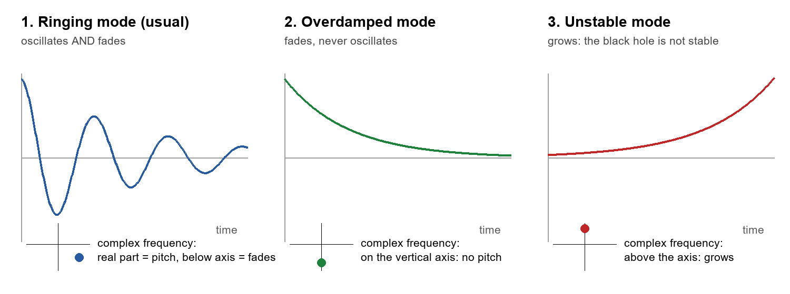
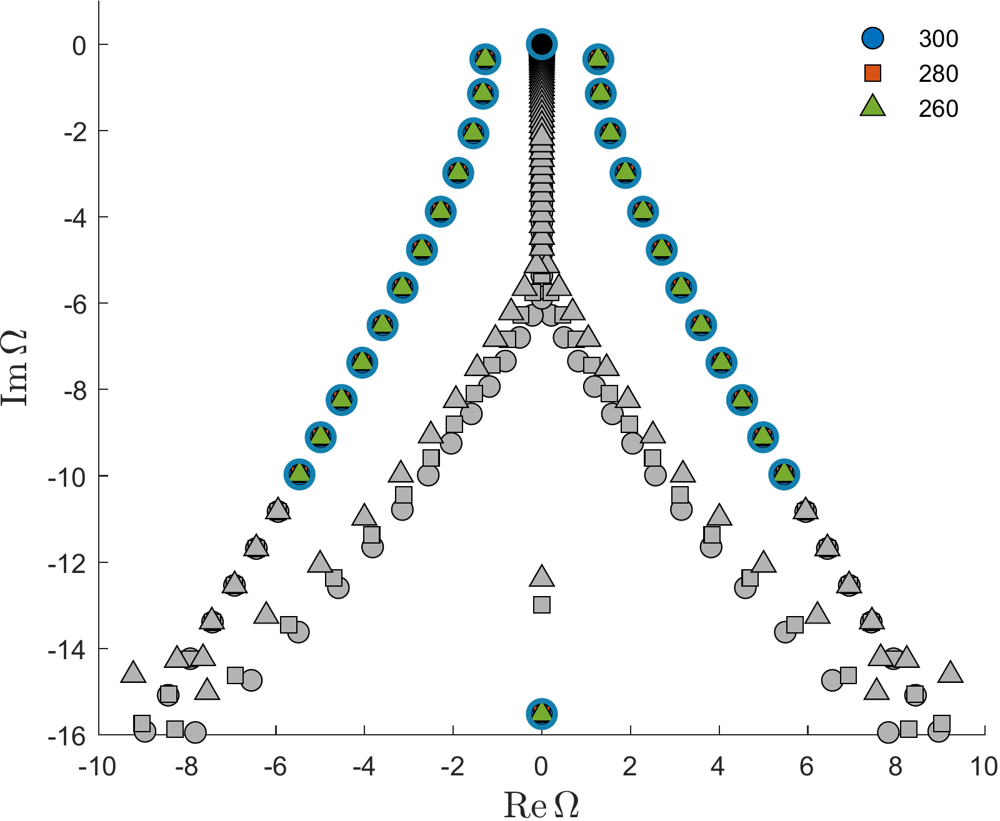
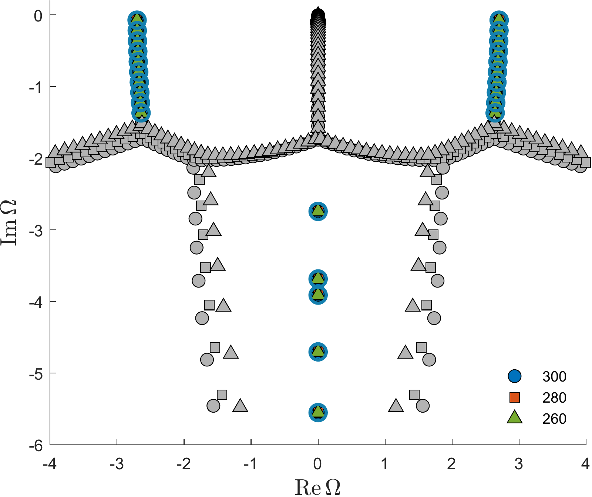
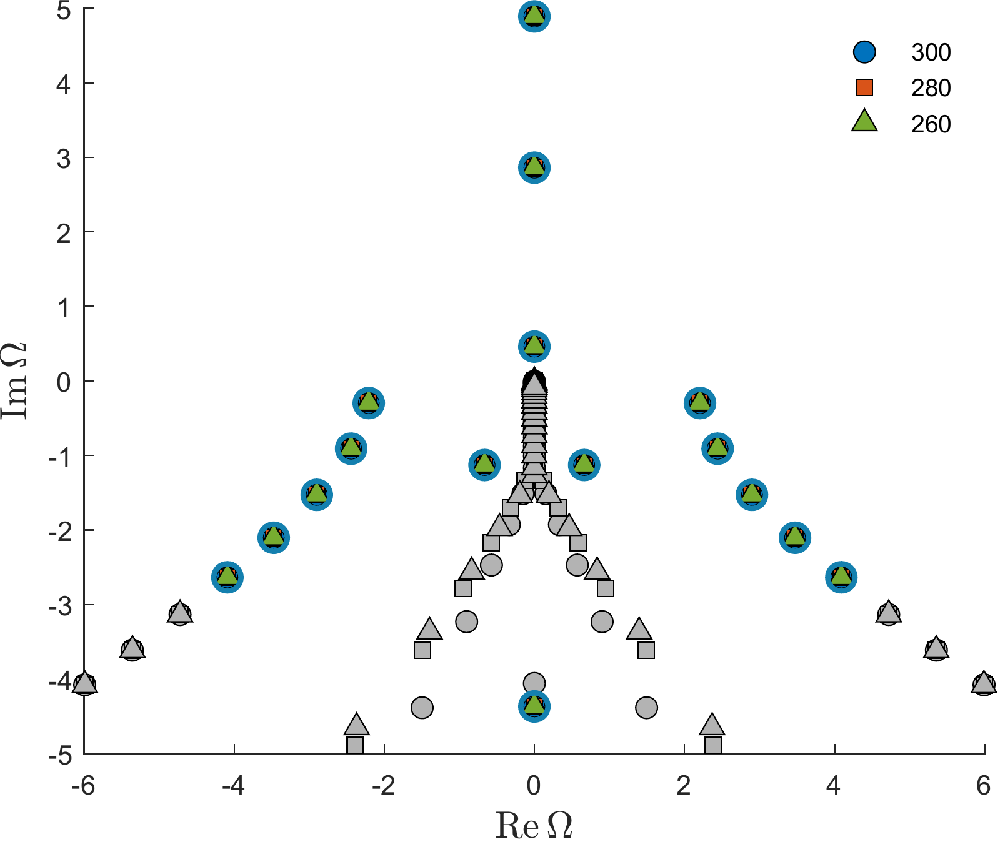

v3.16
Analyzing | Framework v3.16 | published (Phys. Rev. D 114, 044015) — explanatory posture, with several significant findings from recomputation

> **Access Status** — Full paper: arXiv:2608.06083 v1 (6 August 2026, the only version; journal reference Phys. Rev. D 114, 044015 (2026), DOI 10.1103/91q6-r3jd), read in full from the local 92-page PDF: main text, all 69 tables, all 26 figures as they appear on the pages, and Appendix A (the isospectrality proof). There is no separate supplement; the authors' Maple and Matlab code is on GitHub and was **not** inspected · Figures: the arXiv source files for Figs. 5, 6, 24 were viewed and three are shown below; the potential plots (Figs. 1–4, 10–12, 19–21) exist only as EPS in the source and were read from the PDF page images · Prior and competing work, checked on arXiv abstract pages: Konoplya & Zhidenko, arXiv:0802.0267 (v1 is the only version; Phys. Rev. D 77, 104004 (2008)); Beroiz, Dotti & Gleiser, arXiv:hep-th/0703074 (v1 is the only version; Phys. Rev. D 76, 024012 (2007)); Kodama & Ishibashi, arXiv:hep-th/0305147 (v3, latest; Prog. Theor. Phys. 110, 701 (2003)). For these I saw the current abstracts through a summarizing fetch tool (the Beroiz–Dotti–Gleiser abstract verbatim), not the full papers; statements about their contents beyond the abstracts come from my background knowledge and are flagged · Analysis basis: full text, plus independent numerical checks in Python (scripts `qnm_check.py`, `checks2.py`, `checks3.py`, `checks4.py`; explainer drawn with `explainer.py`).

## 1. Punchy Title & One-Sentence Hook

**Ringing Black Holes in Up to Twenty-Six Dimensions: a High-Precision Atlas, With Some Mislabelled Pages**

Two mathematicians tune a very-high-precision numerical "spectrum analyzer" on black holes that carry a string-theory-inspired curvature correction, catalogue thousands of ringing tones across eight different dimensionalities, and confirm a long-predicted six-dimensional instability — but the paper's two most eye-catching physical claims (that string-theory dimensions could show up in a future space detector, and that a standard approximation keeps grabbing the wrong tone) do not survive a careful recomputation.

## 2. Big-Picture Context

**What a black hole's "ringing" is.** Strike a bell and it rings at a set of tones that fade away; the tones depend only on the bell's shape and material, not on how you struck it. A black hole does the same thing when it is disturbed — after two black holes merge, for example. The fading tones are called **quasinormal modes**: "quasi" because, unlike the clean standing waves of a guitar string, every one of them leaks energy away (into the black hole and out to infinity) and so decays. Each tone is described by two numbers: how fast it oscillates and how fast it dies. Gravitational-wave detectors now hear the final "ringdown" of merging black holes, which turns these tones from a theorist's curiosity into a test of gravity itself: if Einstein's theory is wrong near the horizon, the tones shift.

**Why higher dimensions and Gauss–Bonnet.** String theory lives in ten (superstrings), eleven (M-theory) or twenty-six (bosonic strings) dimensions, and its low-energy limit adds correction terms to Einstein's theory. The simplest, best-behaved such correction is the **Gauss–Bonnet term**, a specific combination of squared curvatures. In our four dimensions it does nothing to the equations of motion; in five or more it changes them. So a black hole in five or more dimensions with a Gauss–Bonnet correction is the cleanest laboratory for asking "how would a stringy short-distance correction change black-hole ringing and stability?" These black holes have been known in closed form since 1985, and their stability and tones have been studied since the mid-2000s, mostly with an approximation method (WKB, explained below) and with direct time-domain simulations.

**What this paper does.** Batic and Dutykh merge what read like three companion studies (scalar-, vector- and tensor-type perturbations) into one long paper. They compute the tones with a Chebyshev spectral method run at 300 digits of precision, for dimensions from five up to twenty-six and for weak to very strong Gauss–Bonnet coupling, and compare with older WKB and time-domain numbers. Their headline claims: purely decaying (non-oscillating) "overdamped" modes appear at moderate coupling; higher tones reorder in non-monotonic ways; the pattern of tones in the complex plane takes on a zoo of shapes they name after glassware; an exact match between two sectors' spectra at zero coupling, proved analytically; the first numerical confirmation of a six-dimensional instability with a mass threshold; and tones "amplified" in string dimensions to the point that a future space detector could hear them.

**Paper Type & Stakes:** this is a computational theory paper — a large numerical survey plus one short analytic proof — in a well-established subfield. What is at stake is mostly reliability: whether a high-precision method changes what we thought we knew from approximations, and whether any of it touches observation.

**Prior Belief Check:** most of the physics here aligns with existing expectations rather than overturning them. Experts already knew that six-dimensional Gauss–Bonnet black holes become unstable to tensor-type perturbations at strong coupling (predicted analytically in the mid-2000s, with critical masses calculated and time-domain evolutions run within the following three years), that WKB degrades when the potential develops wells or double peaks, and that tones in units of the horizon size grow roughly in proportion to the number of dimensions. The genuinely new content is the size and precision of the catalogue, the overdamped towers (if they are real modes), and a tidy supersymmetric-quantum-mechanics explanation of the scalar–vector coincidence. The claimed detectability by a space interferometer would surprise experts — and, as Section 4 shows, it rests on a units error rather than on physics.

**Replication & Convergence Note:** the six-dimensional instability has independent support from earlier analytic work and time-domain simulations by other groups, and the low-coupling fundamental tones agree with earlier WKB and time-domain numbers to three or four digits. The new features — overdamped towers, the glassware morphologies, the strong-coupling overtone structure — come from one group and one method; independent confirmation would mean a different technique (a continued-fraction method, a time-domain fit, or a second spectral code with a different coordinate choice) finding the same purely imaginary towers at the same places. That matters because purely imaginary eigenvalues are exactly where spectral methods are known to produce artefacts.

## 3. Necessary Background Crash-Course

### Origins & Big Picture: where these black holes and their tones come from

The story starts with a question about what a gravity theory is allowed to look like. In 1938 Cornelius Lanczos noticed that a particular combination of squared curvature terms is "topological" in four dimensions: add it to Einstein's action and nothing in the equations of motion changes. In 1971 David Lovelock proved that, if you insist the field equations contain at most second derivatives of the metric (so the theory has no ghost-like runaway degrees of freedom), there is a short, finite list of allowed curvature terms in each dimension. Einstein's term is the first; the Gauss–Bonnet term (Lanczos's combination) is the second, and it only becomes active in five or more dimensions.

String theory supplied the physical motivation. When you expand string theory at low energy you get Einstein gravity plus corrections suppressed by the string length. In 1985 Barton Zwiebach, and in 1987 David Gross and John Sloan, showed that the leading correction can be chosen to be exactly the Gauss–Bonnet combination, which neatly avoids ghosts. The coupling constant of that term has units of length squared and is set by the string length — it is a tiny short-distance scale, not something astronomical.

In 1985, too, David Boulware and Stanley Deser found the black-hole solution of this theory: a higher-dimensional cousin of Schwarzschild's black hole (itself generalized to any number of dimensions by Frank Tangherlini two decades earlier). The Gauss–Bonnet term makes the metric slightly stiffer near the horizon, shrinking the horizon for a given mass. In five dimensions something dramatic happens when the coupling is large enough compared with the black hole's mass: the horizon shrinks to zero and disappears, which is why the paper's five-dimensional coupling stops at just under two on its rescaled scale.

Black-hole ringing has a parallel history. C. V. Vishveshwara saw damped ringing in 1970 by scattering waves off a Schwarzschild black hole; William Press named the tones; Chandrasekhar and Detweiler computed them soon after. For decades the workhorse tools were the WKB approximation (Schutz, Will, Iyer, later extended to high orders by Konoplya) and Leaver's continued-fraction method. In higher dimensions, Hideo Kodama and Akihiro Ishibashi showed that every gravitational perturbation of such a black hole splits into three independent types — tensor, vector and scalar, according to how it transforms on the sphere around the hole — each obeying a single wave equation. Gustavo Dotti and Reinaldo Gleiser extended this to Gauss–Bonnet gravity two years later and found the surprise: small Gauss–Bonnet black holes are unstable in five and six dimensions.

Why care about small black holes at all? In "large extra dimension" scenarios of the early 2000s, colliders might have produced microscopic black holes, and their stability decides whether they evaporate politely. The instability is confined to black holes whose size is comparable to the string length — microscopic objects, not astrophysical ones.

That last point matters for reading this paper. An astrophysical black hole is many kilometres across. If extra dimensions exist they are curled up far smaller than that, so a stellar black hole would look four-dimensional, and the Gauss–Bonnet term would do nothing to it. The higher-dimensional black holes studied here are honest physics only for objects smaller than the extra dimensions — and that sets the scale of everything they could ever ring at.

**Analogy:** think of the Gauss–Bonnet term as a firmware patch that only activates on hardware with five or more cores: on a four-core machine the code path compiles but never runs; on bigger machines it changes timing, and on small workloads (tiny black holes) its effect dominates.

**Breaks when:** you ask about the "machine size". Here the number of dimensions is not a free choice of hardware for real astrophysical black holes; if extra dimensions are compact, a large black hole effectively runs on the four-core machine no matter what.

### Tones as complex numbers

A quasinormal tone is one complex number. Its real part is the pitch; its imaginary part is the decay rate. With the paper's sign convention a decaying tone has a negative imaginary part, so plotting all tones in the plane gives points below the horizontal axis. Three cases matter for this paper, shown below.



*Analyst-built illustration (not from the paper):* left, an ordinary tone that oscillates while fading; middle, an **overdamped** tone that fades without oscillating (it sits on the vertical axis of the complex plane); right, an **unstable** tone that grows (it sits above the axis).
**What to look at:** where the dot sits in each little complex-plane sketch — every claim in the paper about "overdamped modes" or "instability" is a claim about dots landing on, or above, the vertical axis.

The lowest-lying tones form families: a **fundamental** and its **overtones**, each overtone more strongly damped. By convention the fundamental is the *least damped* tone — the one that rings longest and dominates what a detector hears. Keep this convention in mind; it becomes important in Section 4.

**Analogy:** a black hole's tone list is like a profiler's list of a program's hot loops, sorted by how long each keeps running after the input stops — the top entry is the one you actually see in the trace.

**Breaks when:** the "sort key" is ambiguous. Profilers sort by one number; tones have two (pitch and decay), and a paper may sort by pitch along a family instead of by decay. The analogy then hides exactly the ambiguity that matters below.

### The wave equation as a one-dimensional scattering problem

Each perturbation type reduces to a wave travelling along a single radial coordinate stretched so that the horizon sits infinitely far "down" and spatial infinity infinitely far "up". The black hole's geometry shows up as a **potential** — a hill (sometimes with a dip) the wave must scatter off. Tones are the frequencies at which a wave can leak out at both ends with no incoming wave from either: purely ingoing at the horizon, purely outgoing at infinity. A hill alone gives ordinary damped tones; a dip below zero, deep enough, can trap a wave that then grows instead of leaking — that is the instability.

**Analogy:** a cache-coherence protocol where a cache line can be evicted toward memory (the horizon) or toward a remote socket (infinity); the "tones" are the access patterns that drain through both exits without any refills arriving.

**Breaks when:** the dip appears. A real coherence protocol has no state that amplifies itself just by sitting in a dip; the wave equation does, which is why stability is not automatic.

### Two ways to compute tones

**WKB** treats the potential near its peak like a parabola and expands around it, much like approximating a function by its Taylor series around a maximum. It is fast and excellent for a single smooth hill and the least-damped tones; it struggles with wells, double peaks and highly damped overtones.

The **spectral method** used here instead writes the unknown wave as a sum of a few hundred Chebyshev polynomials (smooth, well-conditioned basis functions on an interval), squeezes the infinite radial line into a finite interval, and builds the "leak out at both ends" conditions into a prefactor. The wave equation then becomes a matrix eigenvalue problem, whose eigenvalues are the tones. Some eigenvalues are real tones; many are numerical debris. The authors separate them by repeating the calculation with three slightly different numbers of polynomials (up to 300) and keeping only eigenvalues that do not move — the same trick as rerunning a benchmark at three problem sizes and trusting only the timings that stay put.

**Analogy:** it is a lookup-table approach — precompute the operator on a fixed basis once, then a single dense linear-algebra call returns all tones at once, instead of hunting them one at a time.

**Breaks when:** the true answer is not a discrete list. Some wave problems have a continuous "smear" of solutions (a branch cut) along the imaginary axis; a finite matrix can only represent that smear as a dense column of eigenvalues that shift every time the matrix size changes. Telling such a column from a genuine tower of purely imaginary tones is the hard part.

### What the three sectors are

The paper's "scalar" sector is a **test scalar field** — a massless field living on the black-hole background, not a ripple of the geometry. Its "vector" and "tensor" sectors are genuine **gravitational** perturbations of the vector and tensor type in the Kodama–Ishibashi sense. The paper labels these spin zero, one and two, which is easy to misread as "scalar field, electromagnetic field, gravity"; in fact two of the three are gravity. Gravity's own scalar-type sector (the one that becomes unstable in five dimensions) is not computed.

```
Analyst-built concept diagram (not from the paper)

 Gauss-Bonnet black hole (mass, coupling, dimension 5..26)
        |
        v
 3 wave equations:  test scalar | gravity-vector | gravity-tensor
        |
        v
 squeeze radius to [-1,1], build in "leak at both ends"
        |
        v
 Chebyshev matrices (260 / 280 / 300 terms, 300 digits)
        |
        v
 eigenvalues --> keep only those stable across sizes
        |
        +--> tone tables vs WKB and time-domain values
        +--> pictures of tone patterns ("glassware")
        +--> growing tones? --> 6D instability, mass bound
        +--> zero coupling: scalar = vector (Darboux proof)
```

*How to read it:* the left-to-right flow is the authors' pipeline; the four outputs at the bottom are the four kinds of claim checked in Section 4.

> **Central analogy for this paper:** a high-resolution spectrum analyzer on a struck bell.

## 4. Core Technical Explanation

### Step 1: make the problem finite and regular

*The failure it prevents:* a spectral method on an infinite line, with solutions that oscillate wildly at both ends, converges badly or not at all.

*What the authors do:* they rescale radius by the horizon, then map the whole exterior onto a finite interval with one end at the horizon and the other at infinity. They peel off the known wild behaviour at each end (ingoing at the horizon, outgoing at infinity) as an explicit prefactor, so what remains is a smooth function that a polynomial can represent. After clearing common factors, the equation becomes a quadratic matrix eigenvalue problem in the tone.

*What it buys:* every tone comes out of one linear-algebra call, at any coupling, including strong coupling where the potential has wells and double humps that defeat WKB. Running at 300 digits removes rounding worries for deep overtones. My independent double-precision version of the same construction reproduces their fundamental tones in five dimensions at three couplings to all four quoted digits, which confirms the setup is right. (One printed formula in this step, the slope of the metric at the horizon, carries a factor-of-2 typo; their code evidently uses the correct value, since the numbers match.)

### Step 2: catalogue the tones and their patterns

*The failure it prevents:* earlier work reported mainly one or two low tones per case, so no one knew how the full tone list reorganizes at strong coupling.

*What the authors do:* for each dimension, angular quantum number and coupling, they list the fundamental and up to a dozen overtones, compare them with older WKB and time-domain values, and plot the whole stable eigenvalue cloud. They name recurring shapes — Martini glass, beer glass, "coupe à glace", bottleneck, pyramid, even a "Viking snowman".



*Figure 6, panel d (from the paper): eigenvalues for the test scalar in seven dimensions, lowest angular mode, rescaled coupling 5; blue/green/orange markers coincide when an eigenvalue is stable across the three matrix sizes, grey ones move.*
**What to look at:** the two diagonal arms of coloured dots are the converged tones; the dense grey column on the vertical axis and the grey inner arms shift with matrix size — they are numerical, not physical. The isolated coloured dot at the bottom of the axis is one of the claimed overdamped modes.

*What it buys:* a reference table that later work can test against, plus a visual vocabulary. The morphology names are descriptive, not physical: no prediction attaches to "bottleneck" versus "pyramid".

### Step 3: the overdamped towers

*The failure it prevents:* WKB, built around a hill's peak, cannot produce purely decaying tones at all, so if they exist WKB-based surveys miss them.

*What the authors do:* they report, at moderate coupling, ladders of purely imaginary eigenvalues with almost constant spacing, stable across matrix sizes, in five, six and seven dimensions, and isolated ones in higher dimensions. They fit the spacing against angular number and find a nearly linear, very weak dependence.



*Figure 5, panel b (from the paper): test scalar in five dimensions, a high angular mode, rescaled coupling 1.9, close to the five-dimensional maximum ("truncated beer glass").*
**What to look at:** the two vertical columns of converged tones near the top corners (a slowly decaying family), the converged dots on the vertical axis (claimed overdamped modes), and the grey "roof" and grey central column that move with matrix size.

*What it buys:* if real, these are a new class of slowly fading, non-ringing responses. Two things temper that. First, the spacing of these ladders is nearly independent of the coupling in each dimension and grows steadily with dimension; it does not track the horizon's surface gravity, which changes by a factor of two over the same coupling range, so the physical origin is unexplained. Second, the paper's own figures show a dense moving column on the same axis — the classic fingerprint of a branch cut. The towers start very deep in some cases (dozens of decay units down) and appear abruptly above a threshold coupling, which is unusual for physical modes. My double-precision solver could not resolve them either way (Claim check).

### Step 4: who is the fundamental?

*The failure it prevents:* if an approximation returns a higher overtone while claiming the fundamental, every comparison built on it is wrong.

*What the authors do:* in six dimensions at strong coupling, they report that sixth-order WKB "misidentifies higher overtones as the fundamental", pointing to WKB values that match their own first, third, fourth or fifth overtone.

*What it buys — and the catch:* their tables order tones within a family, not by decay rate. In those exact cases, the tone they call an overtone is the *least damped* tone in their own list, and it agrees with WKB to four digits. For the lowest angular mode at rescaled coupling 10, for example, they list as fundamental a tone that decays about a third faster than the one they call the first overtone. By the standard convention, WKB found the fundamental correctly; what the spectral method adds is a second, more strongly damped, low-pitch family that WKB cannot see. I reproduced both families independently (Claim check). That is still a useful discovery — it is just the opposite of a WKB failure.

### Step 5: the scalar–vector coincidence

*The failure it prevents:* two tables agreeing to every digit look like a copy-paste bug unless there is a reason.

*What the authors do:* at zero coupling they find that the test scalar's lowest mode (no angular dependence) and the gravitational vector mode with one unit of angular momentum have identical spectra, overtones included, in every dimension. Appendix A explains why with a trick from supersymmetric quantum mechanics: both potentials are built from one "superpotential", and the two wave operators are factorized versions of each other.

$$V_{\rm s} = W^{2} + \frac{dW}{du}, \qquad V_{\rm v} = W^{2} - \frac{dW}{du}, \qquad W = \frac{n\,f}{2r}$$

**Symbol definitions:**
$V_{\rm s}$ : potential felt by the test scalar with no angular dependence
$V_{\rm v}$ : potential for the gravitational vector perturbation with one unit of angular momentum
$W$ : the shared "superpotential"
$u$ : the stretched radial (tortoise) coordinate
$n$ : number of dimensions minus two (the dimension of the sphere around the hole)
$f$ : the metric function (zero at the horizon, one far away)
$r$ : radius

**What this actually means:** the two operators are like a matrix product AB versus BA — different matrices with the same nonzero eigenvalues. Swapping the order of two steps changes the intermediate data but not the spectrum. The superpotential here is simply the logarithmic derivative of the trivial static solution of the scalar field (a constant field), which is why the pairing exists at all.

*What it buys:* a clean explanation of a numerical coincidence, confirmed in my own solver for five, six and seven dimensions. Two caveats the paper does not state: the same algebra works in four dimensions too (it is not specific to five or more), and the vector partner here is the special one-unit-of-angular-momentum vector mode — in Einstein gravity that mode is not a dynamical wave but the linearized "add a little rotation" deformation (its wave equation's angular term vanishes, and my solver finds a static zero-frequency solution in it). Separately, the paper says the tensor sector has "no isospectral correspondence"; yet its own tables show tensor and scalar tones identical at zero coupling for every angular number from two up (for example in five dimensions), as Kodama and Ishibashi's equations predict.

### Step 6: the six-dimensional instability and its mass threshold

*The failure it prevents:* an instability predicted only analytically can hide in subtle conditions; seeing actual growing tones pins down where it starts.

*What the authors do:* in the six-dimensional tensor sector they find tones crossing onto the positive imaginary axis once the rescaled coupling exceeds about 5.4 for the lowest angular mode, with more and faster-growing tones at stronger coupling. They tie the onset to a counting bound on bound states (the Cohn–Calogero inequality: roughly, the square-root area of the negative dip limits how many trapped states fit) and convert the onset into a mass bound: the hole is unstable when its mass parameter is below about 158 times the coupling to the power three-halves.



*Figure 24, panel b (from the paper): tensor-type gravitational perturbation, six dimensions, third angular mode, rescaled coupling 20.*
**What to look at:** the three converged dots *above* the horizontal axis — tones that grow instead of decay. Everything below the axis behaves normally.

*What it buys:* a direct look at growing modes, matching the analytic prediction. I reproduced the onset and growth rates exactly. But "first numerical confirmation" overreaches: Konoplya and Zhidenko reported this instability from time-domain simulations in 2008 (their v1 abstract, the only version), and Beroiz, Dotti and Gleiser had already calculated critical masses analytically a year earlier. And the lowest angular mode is not where the instability starts: higher angular modes become unstable at weaker coupling, so the real critical mass is set by them (Claim check).

### Step 7: from dimensionless tones to hertz

*The failure it prevents:* dimensionless numbers alone do not tell an observer whether anything is detectable.

*What the authors do:* they note that tones in the twenty-six-dimensional case are tens of times larger than four-dimensional ones in their units ("amplification"), convert them to hertz with a formula that raises the solar time scale to a dimension-dependent power, and conclude that stellar-mass and supermassive black holes would ring at a few hertz down to a tenth of a hertz — the band of the planned DECIGO space detector — "a potential empirical pathway to test string theory".

*What it buys:* nothing, unfortunately — see the Claim check. The conversion is dimensionally inconsistent, and the "amplification" mostly reflects the units chosen. The physics underneath (higher-dimensional holes ring faster relative to their size) is real and known; a detectable signal is not shown.

### Claim check

Checks were run in Python (numpy only, double precision) with my own Chebyshev solver for the paper's three wave equations (`qnm_check.py`) and short follow-ups (`checks2.py`–`checks4.py`).

**Low-coupling tones — Reproduced.** My solver returns the paper's five-dimensional scalar fundamentals at zero, moderate and near-maximal coupling to all four quoted digits, and the zero-coupling value matches the known Tangherlini result after rescaling. The catalogue's anchor points are sound. (One five-dimensional entry differs in the third digit, and a seven-dimensional table entry has a decay rate that looks like a transposed digit; both minor.)

**"WKB misidentifies the fundamental" — Not reproduced (significant).** In six dimensions at rescaled couplings 10 and 20, I find both the paper's "fundamental" and the WKB tone, and the WKB tone is the least damped in each case. The paper's own tables show the same ordering. So WKB found the true fundamental; the spectral method found an additional, more damped family. The paper's criticism of WKB in this regime reverses, while the discovery of the extra family stands.

**Instability onset and mass bound — Reproduced, with a significant caveat.** The growing tones appear between couplings 5.2 and 5.4 for the lowest angular mode with exactly the paper's growth rates, and the arithmetic giving "158 times the coupling to the three-halves" checks out. But angular mode 4 is already unstable at coupling 4.4, and the angular-momentum-squared part of the potential turns negative near the horizon at about 3.5 — the large-angular-number limit where such instabilities are known to start. So the true critical mass is larger than the quoted bound (from mode 4 alone it is roughly a third larger), and the quoted coefficient also depends on how "mass" is normalized (the metric's mass parameter differs from the physical mass by a factor of about four in six dimensions).

**"S below one guarantees stability" — Not reproduced (significant).** Recomputing the Cohn–Calogero integral reproduces the paper's table, but at coupling 5.4 — where the paper itself reports an unstable tone — the integral is about 0.96, below one; mode 4 at 4.4 is likewise unstable with the integral below one. The bound is a good indicator of the threshold but not a rigorous guarantee for this full-line problem (the classic Calogero bound is a half-line result). The paper's "guaranteed analytic stability" of the vector sector, where the integral peaks near 0.8, is therefore plausible but not proven by this argument.

**Detectability in hertz — Not reproduced (significant).** I reproduce their 2.3 hertz for a ten-solar-mass hole in twenty-six dimensions, but the formula raises a quantity with units of inverse seconds to a fractional power, so the result changes if you change units: the same calculation done in milliseconds gives about 1,750 hertz. It also makes a hundred-million-fold mass increase lower the pitch only about twofold, whereas tones physically scale inversely with size. A horizon tens of kilometres across rings at kilohertz per unit of dimensionless frequency, and with compact extra dimensions such holes would not be higher-dimensional at all. The DECIGO claim has no support.

**Sensitivity check.** The headline that most depends on an input is the instability mass bound; it survives in form but its coefficient moves by tens of percent with the choice of which angular mode sets the onset, and by a factor of about four with the mass normalization — both plausible, documented choices.

**Robustness test (theory: limiting cases).** Zero-coupling limits behave as they must: scalar and vector-one spectra coincide (confirmed numerically in three dimensions), tensor equals scalar for the same angular number, and Tangherlini values are recovered. The overdamped towers I **could not check**: in double precision my solver shows only a drifting column of near-axis eigenvalues, not the paper's fixed ladders, which is neither confirmation nor refutation; it needs high precision.

### Assumption Audit

> **Watch:** Reader likely assumes "scalar, vector, tensor (spin zero, one, two)" means a scalar field, an electromagnetic field and gravity. The paper actually computes a test scalar field plus the vector-type and tensor-type parts of *gravitational* perturbations, and omits gravity's scalar-type part — the one that carries the known five-dimensional Gauss–Bonnet instability. Comparisons with four-dimensional "vector" tones in the text even mix in the electromagnetic value. So "no instability in the scalar sector" says nothing about the stability of five-dimensional Gauss–Bonnet black holes against gravitational perturbations.

> **Watch:** Reader likely assumes "fundamental mode" means the longest-ringing tone. The paper actually labels tones within a family in its strong-coupling tables, so its "fundamental" can decay faster than its "third overtone". Every statement about WKB "misidentifying" the fundamental, and about non-monotonic overtones, should be reread with that in mind.

> **Watch:** Reader likely assumes "amplified frequencies in string dimensions" is a physical boost that brings signals into a detector band. The paper actually measures tones in units of a mass-derived length that changes meaning with dimension; relative to the horizon size, tones growing with dimension is the expected large-dimension behaviour. The hertz conversion that follows is not dimensionally valid.

> **Watch:** Reader likely assumes a converged purely imaginary eigenvalue is a physical overdamped tone. The paper actually uses stability across three matrix sizes as its only test, in a problem whose figures also show a branch-cut-like column on the same axis. That makes the towers a candidate result awaiting an independent method.

## 5. What's Genuinely New or Clever

The cleverest piece is small: recognizing that the zero-coupling coincidence between the scalar monopole and the gravitational vector dipole is a supersymmetric-quantum-mechanics partnership, with the superpotential built from the constant static field. It turns a puzzling numerical match into a two-line identity and gives a template for spotting other "accidental" isospectralities. It is new to this literature as an explicit statement, though the ingredients (Darboux transformations, factorized Hamiltonians, and well-known pairings between Regge–Wheeler-type potentials) are textbook, and the partner mode is a non-dynamical one in Einstein gravity.

The more substantial contribution is infrastructure: a uniform, 300-digit spectral survey across three sectors, eight dimensionalities and coupling up to the edge of horizon existence, with comparison columns for older methods and public code. It shows convincingly that at strong coupling the tone list contains more than one family — a low-pitch, more damped family alongside the WKB-visible one — and it gives the first systematic pictures of how the eigenvalue cloud deforms. That is new to the field, even if the paper misreads the WKB comparison.

What is not new: the six-dimensional instability, its existence, and a critical mass (analytic 2005–2007, time-domain 2008); the large-dimension growth of tones in horizon units; the failure of WKB in wells and double peaks.

**Predictive Content Check:**

1. **Falsifiable handle:** the sharpest testable claims are internal to theory. (a) Purely imaginary tone towers at specific places — for example, in five dimensions at moderate coupling, a ladder starting a few dozen decay units down with a spacing of about 0.73 in the paper's units — which a continued-fraction or time-domain calculation could confirm or kill. (b) The second, low-pitch, strongly damped family in six dimensions at strong coupling, which time-domain evolution should reveal as a secondary decaying component. (c) Instability onset at the quoted couplings for each angular mode, already independently confirmed here. The observational handle — a ringdown in the DECIGO band — is not a prediction, because the units conversion behind it is invalid and astrophysical black holes would not be higher-dimensional in this way. The paper does not relabel old data; it predicts numbers, but only theoretical ones.

2. **Formalism load:** the glassware morphology classification fires this check. The names organize pictures but generate no prediction: nothing in the paper says a "bottleneck" spectrum behaves differently from a "pyramid" one in any observable or analytic way, and the transitions between them are reported, not explained. Likewise the linear regressions of tower spacing against angular number (coefficients of determination near one on three or four points spanning a few parts in a thousand) add apparent quantitative weight without a model behind them. The spectral machinery itself is load-bearing; the classification layer is decorative.

## 6. Limitations & Open Questions

> **The overdamped towers may be numerical artefacts of a branch cut rather than physical tones.** **(B) Contested** — the authors' convergence test across three matrix sizes is standard and supports them, but purely imaginary eigenvalues next to a moving branch-cut column are the classic place where that test can mislead, and no independent method was used. **(analyst inference)** — the paper does not discuss branch cuts; my double-precision check was inconclusive.

> **The WKB comparison in six dimensions at strong coupling is inverted: WKB found the least-damped tone.** **(A) Consensus** — this follows from the standard definition of the fundamental and the paper's own tables, with no judgement call involved. **(analyst inference — from recomputation of two cases with my own solver and from the paper's Tables VIII, X and XII)**

> **The hertz conversion and the DECIGO detectability claim are invalid.** **(A) Consensus** — dimensional analysis is not a matter of opinion: the formula's output depends on the unit of time chosen, and tones must scale inversely with black-hole size. **(analyst inference — from recomputation of the paper's equations 61, 98 and 130)**

> **Higher-dimensional asymptotically flat black holes of astrophysical mass are not the right model if extra dimensions are compact.** **(A) Consensus** — when a black hole is much larger than the extra dimensions it behaves four-dimensionally (or as a black string), a standard result in higher-dimensional gravity. **(broader literature)**

> **The instability mass bound uses the lowest angular mode; higher modes destabilize at weaker coupling, so the true critical mass is larger, and its coefficient depends on mass normalization.** **(A) Consensus** — that Gauss–Bonnet instabilities start at high angular number is established in the earlier literature, and I confirmed mode 4 is unstable below the quoted threshold. **(broader literature; analyst inference from recomputation)**

> **The Cohn–Calogero bound is presented as a rigorous stability guarantee but is violated by the paper's own unstable tone.** **(B) Contested** — the bound tracks the threshold well and the vector-sector margin is comfortable, so the practical conclusion may hold; but the claimed rigour does not, because the bound as applied is a half-line result used on a full-line problem. **(analyst inference — recomputed integral, paper Table LIII and Sec. VIII B)**

> **"First numerical confirmation" of the six-dimensional instability overlooks earlier time-domain and analytic work.** **(A) Consensus** — Konoplya and Zhidenko (2008) and Beroiz, Dotti and Gleiser (2007) are published, citable results on exactly this instability. **(broader literature)**

> **Gravity's scalar-type perturbations, where the five-dimensional instability lives, are not computed; the "scalar" sector is a test field.** **(A) Consensus** — the paper's equations (8)–(9) are the Klein–Gordon equation, and the five-dimensional instability is documented in the scalar-type gravitational channel. **(paper Sec. II; broader literature)**

> **The one-unit-of-angular-momentum vector partner of the isospectrality is the non-dynamical rotational mode in Einstein gravity.** **(C) Speculative** — the vanishing angular term and the static solution I found point to this, matching the Kodama–Ishibashi classification as I remember it, but I did not reread that paper in full and the authors may intend the mode only as a formal ODE. **(analyst inference)**

> **Only static, non-rotating, asymptotically flat holes; no rotating or anti-de Sitter backgrounds.** **(A) Consensus** — the authors list these as natural extensions. **(paper Sec. IX)**

**Open questions for the next 12–24 months:** Do the overdamped towers survive a continued-fraction or time-domain calculation? What sets their spacing, given that it does not track surface gravity? What is the large-angular-number instability threshold computed with the same method, and how does it compare with the 2007 critical masses? Does the strong-coupling second family show up as a secondary component in time-domain ringdown?

## 7. Detailed Summary & Explanation

The paper studies the ringing tones of black holes in five to twenty-six dimensions whose gravity includes the Gauss–Bonnet correction suggested by string theory. It treats three wave equations — a test scalar field and the vector- and tensor-type gravitational perturbations — with a Chebyshev spectral method run at 300 digits, keeping only eigenvalues that stay fixed when the number of polynomials changes. The result is a very large table of fundamental tones and overtones, compared with earlier WKB and time-domain numbers, and a gallery of eigenvalue patterns.

Four findings stand out. First, at moderate coupling the method returns ladders of purely decaying, non-oscillating eigenvalues ("overdamped" modes) with an almost constant spacing; WKB cannot see such tones. Second, at strong coupling the tone list splits into more than one family, and the authors read this as WKB misidentifying the fundamental. Third, at zero coupling the test scalar's monopole and the gravitational vector dipole share an identical spectrum, explained neatly by a supersymmetric factorization of their wave operators. Fourth, in six dimensions the tensor sector develops growing tones above a coupling threshold, which the authors connect to a bound-state counting inequality and convert into an upper bound on the black-hole mass for instability; nothing similar appears in seven or more dimensions.

The paper then argues that tones are "amplified" in string-motivated dimensions and that, in hertz, they fall into the band of the planned DECIGO detector.

The framing of this analysis separates three tiers. The method and the bulk of the catalogue are solid: I reproduced the anchor tones and the instability onset independently. The interpretation layer has real problems: by the standard definition, WKB found the fundamental correctly; the tensor sector *does* coincide with the scalar at zero coupling; the counting bound is not a rigorous guarantee; the instability's mass bound uses the wrong (least unstable) angular mode; and the vector partner of the celebrated isospectrality is, in Einstein gravity, a non-dynamical rotation mode. The observational claim fails outright: the hertz conversion is dimensionally inconsistent, and astrophysical black holes would not be higher-dimensional anyway. Treat this paper as a useful numerical reference whose headline physics claims need rereading, not as a pathway to testing string theory.

**Where I'm least confident in this analysis:** the status of the overdamped towers — the most novel claim. My double-precision solver could not resolve them, so I can say only that their behaviour (abrupt appearance, coupling-independent spacing, proximity to a branch-cut-like column) is suspicious, not that they are wrong; a 300-digit computation may genuinely see modes mine cannot. I am also relying on memory for the claim that the one-unit vector mode is non-dynamical in the Kodama–Ishibashi classification.

**Revision notes:** the referee pass added the test-scalar versus gravitational-sector distinction, the mass-normalization caveat, the tensor-equals-scalar inconsistency and the earlier time-domain confirmation, and moved the morphology names from "result" to "formalism-load" territory.

## 8. Three Crystallized Takeaways

1. A 300-digit "spectrum analyzer" mapped the ringing tones of string-inspired black holes in up to twenty-six dimensions, and its basic numbers check out — it is a solid reference table.
2. Several headline readings flip on inspection: the standard approximation (WKB) actually found the longest-ringing tone, the six-dimensional instability had been seen before, and the predicted instability mass is set by higher angular modes than the one quoted.
3. The promise that a future space detector could hear string dimensions rests on a units error; real astrophysical black holes would not ring this way at all.

## 9. Shorter Summary

When a black hole is disturbed it rings like a struck bell, with tones that fade. Those tones depend only on the black hole's geometry, so they are a way to test gravity. This paper computes the tones of black holes in five to twenty-six dimensions, in a version of gravity that includes the leading correction suggested by string theory (the Gauss–Bonnet term), using a very precise numerical method.

The authors produce a large, careful catalogue. They report purely decaying, non-ringing responses at moderate correction strength; a coincidence between two kinds of perturbation at zero correction, which they explain elegantly by factorizing the wave equations; and growing (unstable) tones in six dimensions once the correction is strong enough, which they turn into a maximum mass for unstable black holes.

An independent recomputation confirms the method's basic numbers and the six-dimensional instability. But several interpretations do not hold up. Where the paper says an older approximation keeps grabbing the wrong tone, that approximation actually found the longest-lasting tone; the paper's "fundamental" decays faster. The six-dimensional instability was already found by other groups in 2007 and 2008, and higher angular patterns become unstable before the one used for the mass limit. The counting rule offered as a rigorous stability guarantee is violated by the paper's own unstable case. And the claim that string-dimension black holes would ring in the band of a planned space detector comes from a unit conversion that gives different answers in seconds and milliseconds; in any case, astronomically large black holes would not be higher-dimensional if extra dimensions are tiny.

The purely decaying "tower" tones are the most novel result and still need an independent method to rule out a numerical artefact.

Bottom line: a valuable numerical reference whose biggest physical claims need to be read with care.

---
*Analysis by Claude (headless pipeline), 2026-10-04 · Framework v3.16 · explanatory posture (published PRD) · numerical checks in `qnm_check.py`, `checks2.py`–`checks4.py`.*
