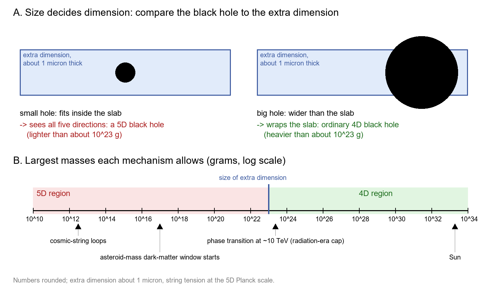

v3.16
Analyzing | Framework v3.16

**Paper:** Luis A. Anchordoqui, Alek Bedroya, Dieter Lüst, "Primordial Black Holes are 5D." arXiv:[2506.14874](https://arxiv.org/abs/2506.14874) (v1 17 June 2025; v2 3 October 2026, "publication version, typos fixed and the cosmic string argument clarified"). Published as *Physical Review D*, DOI [10.1103/g12h-93th](https://doi.org/10.1103/g12h-93th) (journal and DOI as given in the run prompt; the arXiv abstract page does not yet carry a journal-ref).

> **Access Status** — Full paper: read in full from the local arXiv v2 PDF (7 pages including references; there are no appendices and no supplementary material), cross-checked against the local full-text extraction · Abstract: read on the arXiv abs page (v2 is the current version) · Supplementary material: none exists; context from the arXiv abs pages of the comparison papers named below, with versions stated where used (read through a summarizing fetch tool, so I saw their current abstracts and version histories, not their full texts) · Figures: the paper has **no figures or tables**; the figure manifest confirms none were extracted. The one image below is an analyst-built explainer, not a paper figure; key results appear as a small Markdown table instead · Analysis basis: full text.

---

## 1. Punchy title and one-sentence hook

**Too Small to Notice the Fourth Dimension of Space: Why Every Primordial Black Hole in the "Dark Dimension" World Would Be Five-Dimensional**

If our universe hides a single extra dimension about a micron wide, as one quantum-gravity-inspired scenario proposes, then every realistic way of making black holes in the Big Bang produces holes smaller than that dimension, so they are five-dimensional objects that live longer, run colder, and might just now be popping off in bursts like the record-breaking neutrino KM3NeT caught in 2023.

---

## 2. Big-picture context

Primordial black holes are black holes that formed in the first fraction of a second after the Big Bang, not from dying stars. They have been a dark-matter candidate since the 1970s, and they appeal because they need no new particle: gravity plus a sufficiently lumpy early universe is enough. Almost every study of them makes a silent assumption, though: the holes are ordinary four-dimensional objects, with three space directions and time. In a universe with a large extra dimension, that assumption can fail. A black hole smaller than the extra dimension "sees" all the space directions, and it evaporates more slowly and at a lower temperature than a four-dimensional hole of the same mass. That changes which masses are allowed as dark matter and what evaporation signals to look for.

The extra dimension in question comes from the **Dark Dimension Scenario**, proposed in 2022 by Montero, Vafa and Valenzuela (arXiv:2205.12293, current version v3, *JHEP* 2023). It grows out of the **Swampland program**, an attempt to list the properties any low-energy theory must have to come from a consistent theory of quantum gravity. Combined with the tiny cosmological constant and tabletop gravity tests, those principles point, the proponents argue, to one extra dimension of roughly micron size, with ordinary particles stuck to a four-dimensional surface (a "brane") and only gravity and a few dark fields free to roam the fifth direction. Anchordoqui and Lüst have already written several papers asking how five-dimensional holes would evade evaporation limits.

This paper asks a prior question: do primordial black holes in this scenario actually come out five-dimensional? The authors walk through the three standard ways of making them (lumps left by inflation, violent phase transitions in the hot early plasma, and collapsing loops of cosmic string) and argue that, under quantum-gravity constraints, none can make a hole bigger than the extra dimension unless new physics sits at low energies. Along the way they derive a side result: if the ordinary particle soup was hot before a temperature of about one GeV, the extra dimension must have been growing as fast as physically possible, a "kination" phase.

**Paper Type & Stakes:** This is a short theoretical letter-length paper in speculative early-universe cosmology: order-of-magnitude scaling arguments, no simulation, no data analysis. What is at stake is a sharp, testable consequence of the Dark Dimension Scenario: a ceiling of roughly asteroid mass on any primordial black hole, which would rule out the solar-mass and planetary-mass primordial black holes that much of the field still discusses.

**Prior Belief Check.** Within the small Dark Dimension community, this result is a natural next step: once you accept a micron-size extra dimension and reject inflation, tiny early-universe black holes are expected. To the wider primordial-black-hole community it would be surprising, because mainstream work takes inflation as the default source of lumps and studies holes up to many solar masses, often linked to gravitational-wave mergers. The conclusion therefore rests almost entirely on two contested premises: the Dark Dimension itself and the Swampland-based rejection of inflationary production. Given them, the arguments are incremental; without them, the conclusion does not follow.

**Replication & Convergence Note.** This is a single-group theoretical result (the same authors wrote the earlier Dark Dimension black-hole papers), and I found no independent recheck of its scaling arguments. Confirmation would mean another group redoing the mass bounds with careful order-one factors and a worked model of the early era; observationally, a credible primordial black hole heavier than about 10²³ grams would contradict it, and short-range gravity tests could confirm or remove the micron dimension itself.

---

## 3. Necessary background crash-course

### What the Dark Dimension is and why gravity leaks into it

The scenario says space has one extra direction, curled up into a tiny loop about a micron around, roughly a hundredth of a hair's width. Ordinary matter and light are confined to a four-dimensional sheet, the brane, so we never move in the extra direction. Gravity is different: it is the shape of spacetime itself, so it spreads into the whole five-dimensional "bulk." That leakage explains, in this picture, why gravity looks so weak to us: its strength is diluted across the extra direction. The true fundamental scale of quantum gravity is then not the familiar Planck energy but a much lower **five-dimensional Planck scale**, around a billion GeV, about a hundred thousand times the collision energy of the Large Hadron Collider.

> **Analogy:** Think of a server farm where all application traffic runs over one local network (the brane), but the monitoring system (gravity) also writes into a huge shared disk array behind it (the bulk). Any one monitoring signal looks faint on the local network because most of its bandwidth disappears into the array.
>
> **Breaks when:** you ask where the leaked signal goes. The disk array stores what it receives, but gravity leaking into the extra dimension is not stored information; it changes the force law itself at distances below a micron, which is exactly what tabletop gravity experiments test.

### Kaluza–Klein gravitons and the "normalcy temperature"

Because the extra direction is a closed loop, a gravitational wave travelling around it must fit a whole number of wavelengths, just as a guitar string only rings at certain notes. Each allowed note looks to us like a separate, massive particle called a **Kaluza–Klein (KK) graviton**; the lightest has a mass set by the size of the loop, around a hundredth to a tenth of an electron-volt. A hot brane radiates these gravitons into the bulk, where they behave as dark matter; too hot a brane makes too many. Working backwards from today's dark-matter density gives a ceiling on how hot the brane can have been while the dimension had its present size: the **normalcy temperature**, about one GeV, when the universe was a few microseconds old. Above it, either the brane was never that hot, or the dimension was smaller then.

> **Analogy:** A data center whose cooling budget is fixed. Each hot rack (the hot brane) leaks heat (gravitons) into the building; given the total heat you find in the building today, you can work out the hottest the racks could have run for the whole history, assuming the building never changed size.
>
> **Breaks when:** the building itself changes. The paper's Section II is precisely about the case where the extra dimension was smaller earlier, so the "fixed building" bookkeeping no longer applies before the normalcy temperature.

### When does a black hole "feel" five dimensions?

A black hole's size grows with its mass. If the hole is much larger than the micron-size extra dimension, it wraps around the whole loop, like a long tube with the loop as its cross-section; from far away it looks like an ordinary four-dimensional black hole. If the hole is smaller than the loop, it sits inside the bulk as a little five-dimensional ball. Between the two lies a known instability, the **Gregory–Laflamme instability**: a black "tube" thinner than the loop it wraps is unstable and pinches off into five-dimensional balls, much as a thin stream of water breaks into droplets. The crossover mass, where the hole's size equals the extra dimension, is set by the dimension's size and comes out at roughly 10²³ grams, about the mass of a small asteroid. Below it, a black hole is five-dimensional; above it, four-dimensional.

The paper's main equation is just this comparison:

$$M_{\rm GL} \sim \frac{M_{\rm pl}^{2}}{M_{\rm KK}}$$

**Symbol definitions:**
$M_{\rm GL}$ : threshold mass; black holes lighter than this are five-dimensional (grams or GeV)
$M_{\rm pl}$ : the ordinary (four-dimensional) Planck mass, about 2×10¹⁸ GeV
$M_{\rm KK}$ : mass of the lightest Kaluza–Klein graviton, the inverse of the extra dimension's size (0.01–0.1 eV)

**What this actually means:** a smaller extra dimension (heavier KK graviton) lowers the threshold. The whole paper then asks one question of each formation mechanism: can it make a hole heavier than this threshold? It is like checking whether a packet can ever exceed the maximum transmission unit of a link: if no sender can produce a frame that large, every frame on the wire is a "small" frame.

> **Breaks when:** you treat the limit as a configured setting. A link's frame limit is a design choice; the crossover mass is fixed by the dimension's size, and a hole that grows past it (or shrinks below it by evaporating) changes character on its own.

### How primordial black holes are made: the horizon-mass rule

In the early universe, any region can only collapse once light has had time to cross it, so the natural mass for a new black hole is the mass contained within the **horizon**, the distance light has travelled since the Big Bang. That horizon mass grows as the universe ages and cools. A hole made at a hotter, earlier time is therefore lighter. This "horizon-mass rule" is the main tool of the paper: it converts "when did the lumps form?" into "how big can the hole be?". The faster the universe expands at a given temperature, the smaller the horizon and the lighter the holes.

> **Analogy:** a batch job that can only touch the data already copied into its working cache. Early in the run the cache holds little, so the biggest object the job can build is small; later the cache fills and bigger objects become possible.
>
> **Breaks when:** something besides the horizon limits the size. Cosmic-string loops, discussed in Section 4, are limited by the string's own tension, not only by the horizon, so they can fall far below the horizon mass.

### Kination: when a changing dimension rules the universe

The size of the extra dimension behaves, from our point of view, like a field (the radion) that can roll, slowed by cosmic expansion like a ball in syrup. There is a speed limit on how far such a field can roll as the universe grows, reached only when the field's motion carries essentially all the energy in the universe. That extreme state is **kination** (kinetic-energy domination), during which the universe expands faster at a given temperature than under radiation. Eröncel, Gouttenoire, Sato, Servant and Simakachorn (arXiv:2501.17226, current version v2, *Phys. Rev. Lett.*, 2025) showed that kination cannot last more than about 10 e-folds, roughly a twenty-thousand-fold growth in size, because small density ripples turn into radiation that would spoil the measured count of light particles.

> **Analogy:** a CPU running at its absolute maximum clock: it gets there only when every watt in the power budget goes to the core and none to anything else.
>
> **Breaks when:** you think of it as sustainable. Unlike a CPU at turbo, kination cannot be held indefinitely; it decays into radiation by itself, which is what caps its duration.

### Black holes that evaporate slowly

All black holes leak energy as Hawking radiation, at a temperature that rises as they shrink, ending in a final burst. A five-dimensional hole is bigger and colder than a four-dimensional hole of the same mass, so it evaporates far more slowly. In the Dark Dimension, a five-dimensional hole of around 10¹¹ grams can survive about as long as the universe has existed, while a four-dimensional hole needs to be thousands of times heavier to last that long. Near the end of its life a hole's temperature approaches the five-dimensional Planck scale, about a billion GeV, which is why the authors link these holes to ultra-high-energy neutrinos.

> **Analogy:** a radiator's cooling rate depends on its surface. A five-dimensional hole of a given mass has, in the relevant sense, a cooler, larger surface, so it sheds heat slowly, like a large heat sink running only lukewarm.
>
> **Breaks when:** you look at the endpoint. A heat sink cools toward room temperature; a black hole gets hotter as it shrinks, so the slow start ends in a fast, hot finale.

### Origins and big picture: how primordial black holes would come to be

Primordial black holes were first proposed by Zel'dovich and Novikov in 1967 and developed by Hawking in 1971 and Carr soon after. The idea is simple: the early universe was almost perfectly smooth, but not quite. If some patch was denser than average by a large enough margin, then when the horizon grew to encompass that patch, its own gravity would win over the outward push of the hot plasma, and the whole patch would fall in at once. Because the horizon mass grows with time, holes born at one second would weigh tens of thousands of suns, while holes born far earlier would be far lighter, down to the mass of a mountain. There is no stellar evolution, no supernova, and no mass gap involved; the only inputs are the lumpiness and the timing.

The hard part is the lumpiness. The ripples imprinted by inflation and seen in the cosmic microwave background are about one part in a hundred thousand, far too gentle to make black holes. So every production story needs a special ingredient. In **inflationary models**, the field driving inflation must slow down or hit a feature at just the right moment to boost ripples on one scale by a factor of thousands. In **phase-transition models**, the hot plasma changes state violently (a first-order transition, like supercooled water suddenly freezing), and during the transition the plasma briefly loses its pressure, so patches that would otherwise bounce back can collapse instead. In **cosmic-string models**, a symmetry breaking leaves behind thin tubes of trapped field energy; a loop of string that happens to shrink inside its own black-hole radius collapses directly.

Once formed, these holes would sit in the cosmic web like any cold dark matter, clumping in galaxy halos. The light ones evaporate: four-dimensional holes lighter than about a billion tonnes would be gone by today, and those somewhat heavier would still be radiating gamma rays we have not seen, which rules them out as most of the dark matter. Heavier holes are limited by gravitational microlensing of stars, by their effects on the microwave background, and by gravitational-wave merger rates. What survives is an "asteroid-mass window" from about 10¹⁷ to 10²³ grams, where holes could still be all of the dark matter.

The Dark Dimension changes this story in two places. First, holes lighter than its threshold are five-dimensional, so the gamma-ray limit, which assumes four-dimensional evaporation, weakens: the holes are colder and, if they wander into the bulk, may radiate mostly into hidden channels. Second, this paper argues that the production stories themselves only make holes below the threshold. The threshold sits right at the top of the asteroid window, so in this world the window would be the whole story: no planetary- or solar-mass primordial holes, and no primordial origin for the black holes LIGO and Virgo see merging.

The Dark Dimension itself has its own origin story. Large extra dimensions were proposed by Arkani-Hamed, Dimopoulos and Dvali in 1998 to explain why gravity is weak. The 2022 Swampland version reached a single micron-scale dimension by a different route: a conjecture that a very small vacuum energy must come with a tower of light particles whose mass is set by that energy, combined with existing limits that leave room for only one extra dimension of that size. So the vacuum energy of the cosmos, black-hole formation in the first microsecond, and tabletop tests of Newton's law at a few microns are all tied to one number, the size of the extra dimension.



*Analyst-built illustration (not from the paper): panel A compares a black hole to the micron-size extra dimension; panel B places the largest masses allowed by the paper's arguments on a log scale against the crossover between five- and four-dimensional holes. Values come from the analyst's recomputation in claimcheck.py.*

**What to look at:** in panel B, every production mechanism lands on the left (five-dimensional) side of the vertical line; the cosmic-string ceiling misses it by about ten powers of ten, while the phase-transition cap at about 10 TeV sits right on the line, which is why that case needed the extra kination argument.

*Analyst-built concept diagram (not from the paper):*

```
 Dark Dimension (1 extra dim ~ 1 micron)
        |
        v
 KK-graviton overproduction limit -> "normalcy" ~ 1 GeV
        |
        v
 Hot brane before 1 GeV? -> dimension must grow at max
 speed (kination), lasting <= ~10 e-folds (start <~20 TeV)
        |
        +--> inflation lumps: rejected (Swampland)
        +--> phase transitions: horizon mass < threshold
        |      above ~1 TeV; no SM first-order transition
        |      below -> all 5D
        +--> string loops: tension <= 5D Planck scale
               -> mass ~1e12 g << 1e23 g threshold -> 5D
        |
        v
 All PBHs 5D; string PBHs can live ~ age of universe
        -> possible KM3NeT neutrino source
```

Read it top to bottom: one number (the size of the dimension) fixes the cooling history, which caps the horizon mass, which caps every mechanism below the crossover mass.

**Central analogy for this paper:** a link with a hard frame-size limit.

The extra dimension acts like a maximum frame size: any black hole "frame" smaller than it is five-dimensional, and the paper's job is to show that no early-universe "sender" can emit a frame big enough to exceed it.

---

## 4. Core technical explanation

The paper has a simple logic. Fix the size of the extra dimension, which fixes the crossover mass between five- and four-dimensional holes. Then, for each mechanism, find the largest black hole it can produce, using quantum-gravity bounds wherever a parameter would otherwise be free. If every maximum is below the crossover, every primordial black hole is five-dimensional.

### Step 1: what the universe could have looked like before one GeV

**The failure it prevents.** The normalcy temperature only tells you the brane cannot have been hot above about one GeV *if the extra dimension already had its present size*. Without knowing the earlier history, any statement about black holes formed at higher temperatures would be guesswork.

**What the authors do.** They allow a hotter brane earlier, provided the extra dimension was smaller then (heavier KK gravitons are harder to make), and ask how much smaller it must have been at each temperature to avoid too much dark matter. They compare that with how fast the dimension could possibly have grown, given the rolling-field speed limit. The two requirements scale with temperature in exactly the same way, so only maximum-rate growth, kination, can (just) meet both. A radiation-dominated universe above one GeV would overproduce KK gravitons.

**What it buys.** A definite picture: either the hot brane only appeared near one GeV, or it existed earlier during a kination era. Because kination can last only about 10 e-folds, that era could have started no hotter than roughly twenty thousand times the normalcy temperature, about 20 TeV. Every later step uses this split.

### Step 2: black holes from phase transitions

**The failure it prevents.** A violent transition in the hot plasma could, in principle, make holes as big as the horizon. If it happened late enough, the horizon would hold far more than the crossover mass and the holes would be ordinary four-dimensional ones.

**What the authors do.** They cap the hole mass by the horizon mass. Above about 10 TeV they use the gentlest possible expansion (radiation alone), which gives the largest horizon; even that horizon holds less than the crossover mass. Below that they use the faster kination expansion from Step 1, so horizons are smaller still, and the horizon mass stays below the crossover for any transition hotter than roughly a TeV. A four-dimensional hole would need a violent transition below that, in the range where colliders have tested the Standard Model thoroughly and found none.

**What it buys.** Phase-transition holes are five-dimensional unless new physics hides below a TeV. My recomputation puts the exact crossover between about 300 and 600 GeV, depending on the dimension's size, which agrees with the paper's "order TeV."

### Step 3: why the QCD transition does not rescue large holes

**The failure it prevents.** The one transition we know happened at low temperature is the QCD transition, when quarks and gluons became protons and neutrons, around 150 MeV. Black holes formed there would weigh about a solar mass, firmly four-dimensional.

**What the authors do.** They note that lattice calculations show the QCD transition is a smooth crossover. In a first-order transition the plasma's pressure response collapses; in a crossover it only softens. Softening helps pre-existing lumps collapse but cannot create them.

**What it buys.** QCD-era holes would need lumps from elsewhere, in practice inflation, which the paper has already rejected. The step is correct as far as it goes, but its force rests entirely on that rejection (see the Assumption Audit).

### Step 4: black holes from collapsing cosmic-string loops

**The failure it prevents.** String loops are not tied to a sound-speed collapse, and a heavy enough string could in principle make heavy holes at any epoch, including late ones.

**What the authors do.** They focus on strings made when an axion-like symmetry breaks. The string's energy per length scales with the square of the symmetry-breaking scale, which, with an extra dimension, cannot exceed the five-dimensional Planck scale. A loop cannot be larger than the horizon, so the hole mass is capped by maximum tension times horizon size. For loops made above one GeV, with the shrinking-dimension history of Step 1, the cap is the same whenever the loop formed: around 10¹² grams, about ten powers of ten short of the crossover. After normalcy the cap rises as the universe cools, reaching the crossover only for strings formed below about 10 keV. The v2 revision closes that door: a symmetry breaking at such a low temperature implies an axion coupling to photons far too strongly to have escaped laboratory and astrophysical searches.

**What it buys.** The paper's strongest result: string-loop holes are five-dimensional by an enormous margin, whatever the epoch. Because these holes are also the heaviest that form before normalcy, they set the longest possible lifetimes, which feeds Step 5.

### Step 5: how long the holes live, and the KM3NeT neutrino

**The failure it prevents.** Knowing that holes are five-dimensional is not useful observationally unless you know whether any survive today or are evaporating now.

**What the authors do.** A five-dimensional hole's lifetime rises as the square of its mass. Putting in the largest string-loop hole from Step 4 gives a lifetime ceiling of about 10¹³ years, roughly a thousand times the age of the universe, so somewhat lighter holes would be finishing now. Phase-transition holes live far longer: they would only be evaporating today if formed hotter than kination could have started.

The authors then lean on a separate proposal by Anchordoqui, Halzen and Lüst (arXiv:2505.23414, current version v3, *Phys. Rev. D*, 2025) that the final burst of such a hole could explain the roughly 220 PeV neutrino KM3NeT recorded. A hole drifting in the bulk would radiate mostly into hidden channels, explaining the missing gamma rays. Airoldi and collaborators (arXiv:2505.24666, current version v2, accepted in *Phys. Rev. Lett.*) objected that a nearby exploding hole should also have produced many lower-energy neutrinos and gamma rays in the preceding hours; their current abstract concludes the minimal four-dimensional explosion picture is disfavored. The authors answer only by citing an older mechanism in which neutrinos taking "shortcuts" through the extra dimension produce a sharp line with suppressed low-energy events.

**What it buys.** A concrete phenomenological hook (late-time bursts from string-loop holes), and a clean statement that phase-transition holes are effectively stable. The KM3NeT link is a consistency argument borrowed from earlier work, not something this paper computes.

The paper's results reduce to one small table (my rounded recomputation, using an extra dimension of about a micron):

| Mechanism | Largest hole it can make | Crossover to 4D | Verdict |
| :-- | :-- | :-- | :-- |
| Inflationary lumps | not computed (rejected on Swampland grounds) | about 10²³ g | excluded by assumption |
| Phase transition hotter than about 10 TeV | below about 10²³ g | about 10²³ g | 5D (marginal at 10 TeV) |
| Phase transition, about 1 to 10 TeV (kination) | well below 10²³ g | about 10²³ g | 5D |
| String loops, formed above 1 GeV | about 10¹² g | about 10²³ g | 5D by about 10 powers of ten |
| String loops, formed below 1 GeV | rises as the universe cools | about 10²³ g | 5D unless formed below about 10 keV |

*Table (analyst summary of the paper's Sections III–IV; the paper has no tables or figures).* **What to look at:** the second column never reaches the third, except through a door (a late string-forming transition) that axion searches have closed.

### Claim check

I ran the checks in Python (`claimcheck.py` in the work directory) as order-of-magnitude recomputations from the paper's own formulas and standard values of the Planck mass, Hubble constant and dark-matter density.

**Normalcy temperature of about one GeV — Reproduced.** The paper's formula gives 0.4 to 0.8 GeV across its range of extra-dimension sizes. The numerical coefficient it uses for today's dark-matter density is about two and a half times too large, which shifts the result by only a quarter, so the starting point holds.

**String-loop holes are five-dimensional — Reproduced, with a large margin.** The largest loop hole comes out near 10¹² grams against a crossover near 10²³ grams. The "below 10 keV" escape route also reproduces (4 to 9 keV with the exact prefactor). This is the paper's most robust claim.

**String-loop lifetime of about 10¹³ years — Reproduced as a ceiling.** I get 10¹³ to 10¹⁴ years. It is an upper limit that is reached only when the string tension sits at the five-dimensional Planck scale, the loop spans the whole horizon, and the dimension grows at the maximum rate, all at once. "Lifetimes comparable to the age of the universe" therefore describes the heaviest possible case, not a typical one.

**Phase-transition lifetime — Partly reproduced; misprint found.** The paper's conclusion that such holes only evaporate by today if formed above about 10⁷ GeV reproduces exactly (I get 9 million GeV). But the numerical prefactor printed in its lifetime formula (Eq. 22) is wrong by more than fifty powers of ten: the paper's own expression evaluates to about 10¹⁰² Planck times per unit, not 10⁴⁹. Read literally, the printed number would make a hole formed at one GeV evaporate within about a month, the opposite of the paper's conclusion. Since the stated threshold follows from the correct value, this is a typographical error that does not change the conclusion, but anyone reusing Eq. 22 would be badly misled.

**Sensitivity: the size of the extra dimension.** Every comparison runs through the crossover mass, which scales with the dimension's size. The string conclusion survives unless the dimension were about a million times smaller than a micron, which would no longer be the Dark Dimension. The phase-transition conclusion is more delicate: it rests on there being no violent transition in the few-hundred-GeV to TeV window, and at about 10 TeV the radiation-era horizon mass sits right at the crossover.

**Robustness (theoretical limits and approximations).** Three probes. (1) Axion strings carry a known logarithmic boost to their tension, a factor of order a hundred; including it lengthens the lifetime ceiling to around 10¹⁸ years but leaves the holes deep in five-dimensional territory. (2) If the universe were radiation-dominated at high temperature instead of kination-dominated, phase-transition holes would be heavier but still could only evaporate by today if formed above the five-dimensional Planck scale, which is impossible; the "effectively stable" conclusion strengthens. (3) A significant interpretive point about Step 1: the "radiation domination is ruled out" result compares two estimates that scale with temperature in exactly the same way, so the verdict is decided by order-one factors the paper does not track (the dark-matter coefficient above, the coefficient in the field's speed limit, the graviton emission prefactor). The robust statement is weaker than the text suggests: a hot brane above one GeV is only marginally viable even under kination, which makes the paper's own alternative (no hot brane before about one GeV) at least as plausible.

**Internal consistency.** Two wording slips, both in Section II: the kination-duration limit is described as implying a start temperature "above about 10 TeV," but an upper limit on duration implies a start temperature *at most* about 20 TeV, as Section V correctly says ("universal upper limit for the beginning"); and the text says the KK mass at earlier times was "smaller" than today's when the argument requires it to be larger (a smaller dimension). Neither changes a conclusion, but the first changes how a reader would picture the early-universe timeline.

### Assumption audit

> **Watch:** The title reads as if every primordial black hole is five-dimensional by some deep principle. **The paper actually says:** within the Dark Dimension, the standard mechanisms cannot make a hole heavier than about 10²³ grams, once inflationary production is set aside on Swampland grounds and no violent transition occurs below a TeV. The title is really a mass ceiling. If inflation could produce large lumps after all (the Swampland objection is debated), holes of any mass would be back on the table, and the QCD-era argument in Step 3 would fall with it.

> **Watch:** The reader may assume the paper shows these holes exist, make up the dark matter, or explain the KM3NeT event. **The paper actually says:** its conclusion holds "regardless of their abundance"; it computes no abundance and no neutrino flux. The KM3NeT connection is carried over from a separate paper by two of the same authors, plus an appeal to an older neutrino-shortcut mechanism to answer the objection that lower-energy neutrinos should have accompanied the burst. Whether any holes form at all is left open.

> **Watch:** The reader may take the kination era as a result of the paper. **The paper actually says:** kination is the only way to have a hot brane above one GeV, if there was one. The conclusions section explicitly allows an alternative in which radion oscillations would overfill the universe, so the ordinary hot plasma was created only around one GeV, with no kination era; in that case only string loops make holes, and they are still five-dimensional. The kination era is a conditional, and my Claim check suggests it is a marginal one.

> **Watch:** "Lifetimes comparable to the age of the universe" sounds like a typical prediction. **The paper actually says:** this is an upper bound reached only when several separate bounds are saturated at once. Most string-loop holes, if they form, would be lighter and gone long ago; only the heaviest possible ones would be finishing now, so a population evaporating today requires an extra, unstated tuning of the mass distribution.

---

## 5. What's genuinely new or clever

The cleverest move is turning a question about *what black holes are like* into one about *what the early universe can build*. Earlier Dark Dimension papers assumed five-dimensional primordial holes and asked how they would evade limits; this paper shows the assumption is forced, by checking every mechanism against one yardstick (the crossover mass). The five-dimensional nature becomes a derived property of the scenario rather than an extra choice, which is new to the field.

The second idea, also new to the field, is applying a quantum-gravity bound to cosmic strings: with a large extra dimension, an axion string's energy scale cannot exceed the five-dimensional Planck scale, far below the usual ceiling. That one bound caps string-loop holes near 10¹² grams and makes the string result robust by a wide margin. The v2 addition, closing the late-string loophole with axion-photon coupling limits, neatly links black-hole formation to laboratory axion searches.

The third, more modest contribution is the pre-normalcy argument: a hot Standard Model brane above one GeV would need the extra dimension to be growing at the maximum possible rate. It is a neat consistency constraint on the early history, although, as the Claim check shows, it hangs on order-one factors.

What is *not* new is the physics of each ingredient: Gregory–Laflamme instability (1993), horizon-mass formation, string-loop collapse (Hawking 1989), and five-dimensional evaporation are all standard. The novelty is assembling them under Swampland constraints.

**Predictive Content Check.**

1. **Falsifiable handle.** Within the Dark Dimension Scenario, the paper predicts that **no primordial black hole heavier than roughly 10²³ grams exists** (about the mass of a small asteroid, or a ten-billionth of a solar mass). Any convincing detection of a heavier primordial hole would contradict it, unless one reinstates inflationary production: for example a sub-solar-mass black-hole merger in LIGO–Virgo–KAGRA data (which stars cannot make), or a microlensing population of planetary-mass dark objects shown to be black holes. A second handle concerns the dimension itself: short-range gravity tests reaching about a micron would confirm or remove the premise. The KM3NeT link is a reinterpretation of an already-observed event, not a prediction; it would become one only with a flux or event rate, which the paper does not give.

---

## 6. Limitations and open questions

> **The conclusion depends on rejecting inflationary black-hole production.** The paper sets inflation aside because its potentials are "in tension with" Swampland conjectures, notably trans-Planckian censorship. **(B) Contested** — the Swampland conjectures are not theorems, many cosmologists regard them as unproven, and inflation remains the standard model of the early universe; if it can make large lumps, four-dimensional holes return. **(paper §I; broader literature)**

> **The Dark Dimension itself is a hypothesis.** The whole analysis assumes one extra dimension of about a micron, motivated by Swampland conjectures. **(B) Contested** — the scenario is consistent with current tabletop and astrophysical bounds, but its foundations are conjectural and debated, and experiments have not yet reached the micron scale needed to test it directly. **(broader literature)**

> **The kination argument rests on order-one factors.** The claim that radiation domination above one GeV overproduces gravitons compares two estimates with identical temperature scaling, so the verdict turns on prefactors the paper does not track, and kination itself only just escapes. **(C) Speculative** — this is my reading from recomputing the paper's Eqs. 2–7; a careful calculation with the exact emission rate and moduli coefficients could tip it either way. **(analyst inference)**

> **Printed lifetime formula for phase-transition holes is off by more than fifty powers of ten.** The conclusion drawn from it is correct, but the printed prefactor is not. **(A) Consensus** — recomputing the paper's own expression with standard constants gives the corrected value unambiguously, and that value, not the printed one, reproduces the paper's stated threshold. **(analyst inference, from recomputation of the paper's Eq. 22 in claimcheck.py)**

> **No abundance, mass function, or signal rate.** The paper shows what *kind* of holes would form, not how many, so it cannot say whether string-loop holes evaporating today are numerous enough to see. **(A) Consensus** — the paper says plainly that its conclusion is independent of abundance, and any observational claim needs that missing number. **(paper §I and §V)**

> **The KM3NeT connection is fragile.** It relies on a separate paper's flux argument, and the main objection (missing lower-energy neutrinos and gamma rays before the event, per Airoldi et al., v2, accepted in *Phys. Rev. Lett.*) is answered only by citing a 2005 sterile-neutrino shortcut mechanism, without a computation. The KM3NeT event itself is in mild tension with IceCube's non-detection of similar events. **(B) Contested** — several groups have proposed competing interpretations of the event, and none is established. **(paper §V; broader literature)**

> **Cosmic-string modeling is schematic.** Loops are capped at the horizon size and string tension at the five-dimensional Planck scale, ignoring loop-size distributions, the logarithmic tension boost of global strings, and the tiny fraction of loops that collapse. **(A) Consensus** — these are standard simplifications for an upper-bound argument; the five-dimensional conclusion survives them by a wide margin, the lifetime estimate does not. **(analyst inference)**

> **Whether holes stay on the brane is not modeled.** The "invisible evaporation" story needs holes in the bulk, but the paper does not say whether a hole formed from brane matter drifts off the brane. **(C) Speculative** — earlier Dark Dimension papers may treat this; I did not review them. **(analyst inference)**

**Open questions for the next 12–24 months:** a coefficient-level treatment of the pre-normalcy era; a mass function and abundance for string-loop holes; a computed burst spectrum for bulk versus brane holes; and whether sub-solar-mass merger searches already test the ceiling.

---

## 7. Detailed summary and explanation

The paper asks whether primordial black holes, if they exist in a universe with one micron-size extra dimension, are ordinary four-dimensional holes or five-dimensional ones. The answer turns on a single yardstick: a black hole smaller than the extra dimension is five-dimensional, and the crossover happens near 10²³ grams, roughly a small asteroid. The authors then check each standard way of making primordial holes against that yardstick.

Inflation is set aside on Swampland grounds. For the rest, the key is the early thermal history. A hot brane radiates gravitons that act as dark matter, so it cannot have been hot above about one GeV with today's extra-dimension size; if it was hot earlier, the dimension must have been smaller and growing as fast as allowed (kination), starting no hotter than about 20 TeV. Under that history, phase-transition holes formed above about a TeV are lighter than the yardstick, and no known Standard Model transition below that is violent enough (the QCD transition is a smooth crossover). Axion-string loops are capped far lower, near 10¹² grams, because the string's energy scale cannot exceed the five-dimensional Planck scale; a late string network that could beat this is excluded by axion searches. So all primordial holes are five-dimensional.

Five-dimensional holes evaporate slowly. The heaviest string-loop holes could live up to about 10¹³ years, so lighter ones could be finishing now; the authors suggest that one such burst might explain the 220 PeV KM3NeT neutrino, especially if the hole sits in the bulk and its gamma rays never reach us. Phase-transition holes would almost all outlive the universe.

I framed the analysis around the mass ceiling because that is what the paper delivers: a robust bound for string loops, a narrower one for phase transitions, and a premise-dependent one overall, since rejecting inflation does much of the work. I separated what the paper computes (masses, lifetime ceilings) from what it imports (the KM3NeT interpretation), and reported two recomputation findings: a misprinted lifetime prefactor, and the marginal, order-one character of the "no radiation domination before one GeV" argument.

**Where I'm least confident in this analysis:** the pre-normalcy argument in Step 1, specifically whether the field's speed limit (and the one-third power linking field distance to the KK mass) is the right coefficient for this geometry; the paper defers this to a citation I did not read, and because the radiation-domination verdict is decided at order one, my "marginal" reading could be wrong in either direction. This paper was also a plausible lite-mode candidate (a short single-argument theory paper); headless runs always produce the full analysis.

**Revision notes:** the referee pass added the QCD-crossover step and its dependence on rejecting inflation, made the lifetime "ceiling, not typical value" point explicit in both Claim check and Audit, moved per-paragraph numbers into the summary table, and fixed the explainer's panel overlap.

---

## 8. Three crystallized takeaways

1. **In a world with a micron-wide extra dimension, primordial black holes have a size limit.** No standard early-universe mechanism can make one heavier than about a small asteroid, so they would all be five-dimensional, as long as inflation is not the source.

2. **Five-dimensional black holes are slow burners.** The heaviest ones made by collapsing cosmic-string loops could still be evaporating today, which the authors tie (speculatively) to the record 220 PeV neutrino KM3NeT caught in 2023.

3. **The prediction is checkable.** Find a primordial black hole heavier than an asteroid, for example in a sub-solar-mass black-hole merger, and this version of the Dark Dimension is in trouble, unless inflation is allowed back in.

---

## 9. Shorter summary

Primordial black holes, formed from dense patches of the newborn universe, are a long-standing dark-matter candidate. Nearly all studies treat them as ordinary black holes. This paper asks what happens in the "Dark Dimension" scenario, a quantum-gravity-inspired proposal in which space has one hidden extra direction about a micron across and gravity leaks into it.

A black hole smaller than that extra dimension behaves as a five-dimensional object; the crossover is at roughly the mass of a small asteroid. The authors check the standard ways of making primordial black holes. They set aside inflation, arguing it conflicts with quantum-gravity conjectures. Violent phase transitions in the early plasma can only make big holes if they happen at low energies where none is known; at higher energies the universe was too young to hold enough mass. Collapsing loops of cosmic string are capped far lower, because the string's energy cannot exceed the low quantum-gravity scale the extra dimension implies. So every primordial black hole is five-dimensional.

Five-dimensional holes evaporate slowly. The heaviest ones from string loops could live roughly a thousand times the current age of the universe, so somewhat lighter ones might be exploding now. The authors suggest one such explosion could explain the extremely energetic neutrino seen by the KM3NeT telescope in 2023, but they do not compute rates.

The core argument is simple and, for string loops, robust by a wide margin. It depends heavily on two contested premises: that the extra dimension exists and that inflation did not seed the black holes. A recheck found a misprinted number in one lifetime formula (the conclusion is unaffected) and showed that the paper's claim about an early "kination" era rests on order-one factors. The clearest test: any primordial black hole heavier than an asteroid would contradict this picture.

---

*Analyzed by Claude (headless pipeline), 2026-10-05, Framework v3.16, explanatory posture (peer-reviewed in Phys. Rev. D per the run prompt) with extra weight on predictive content because the premises are speculative. Checks: claimcheck.py; explainer: make_explainer.py.*
