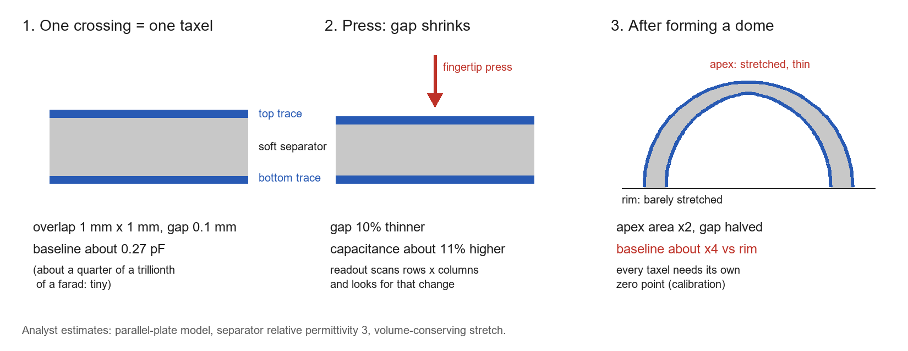
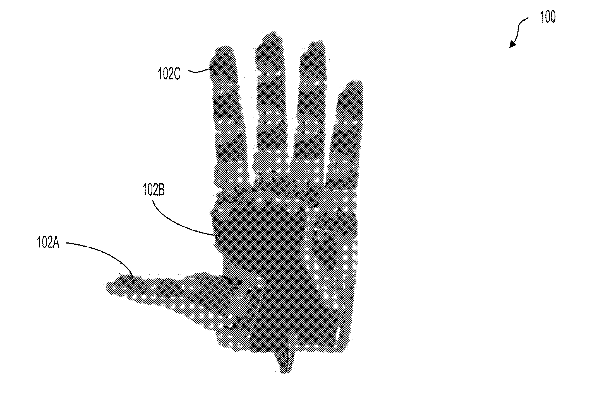
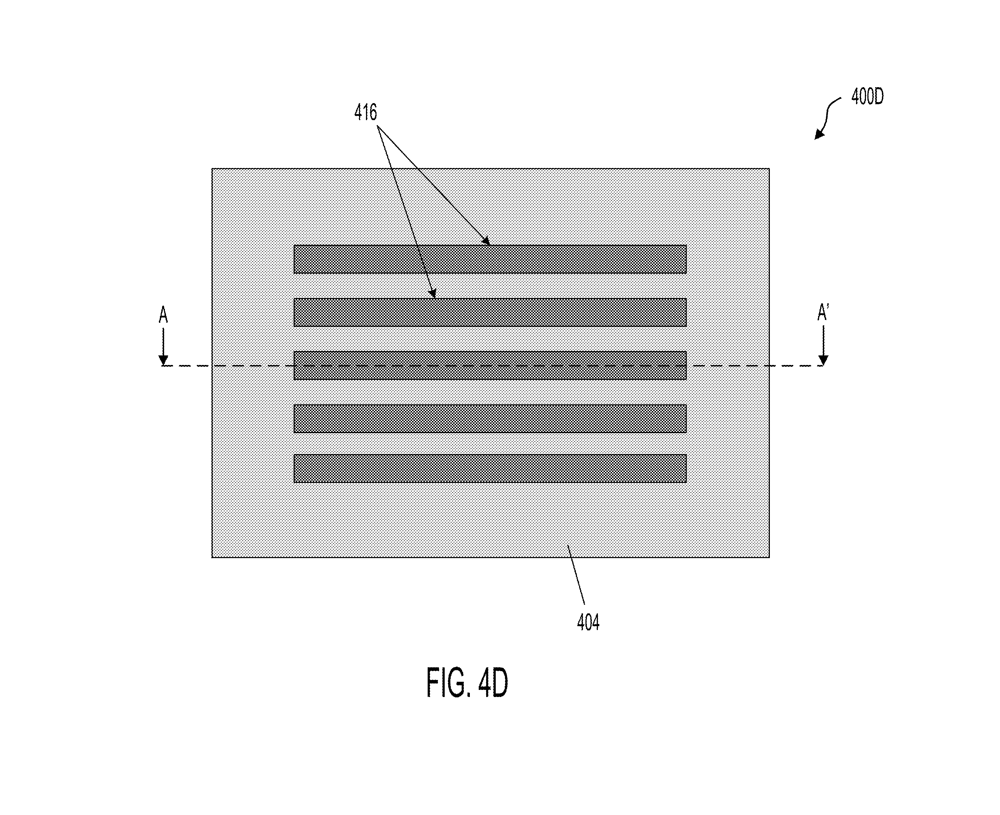
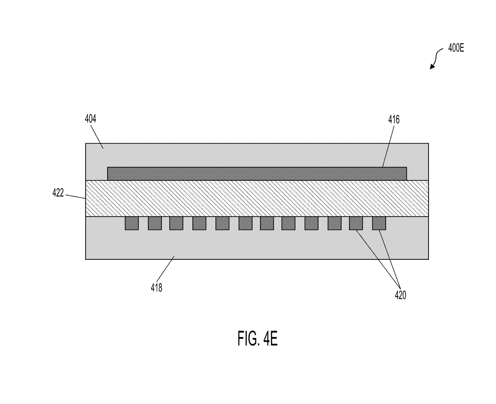
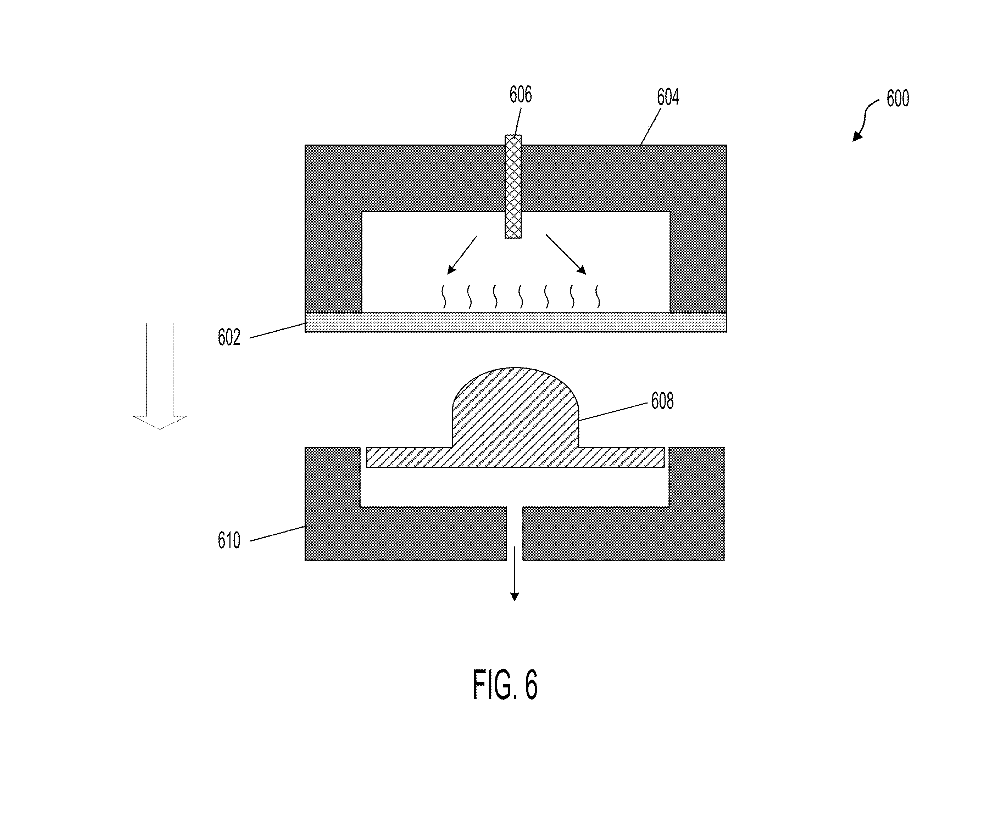
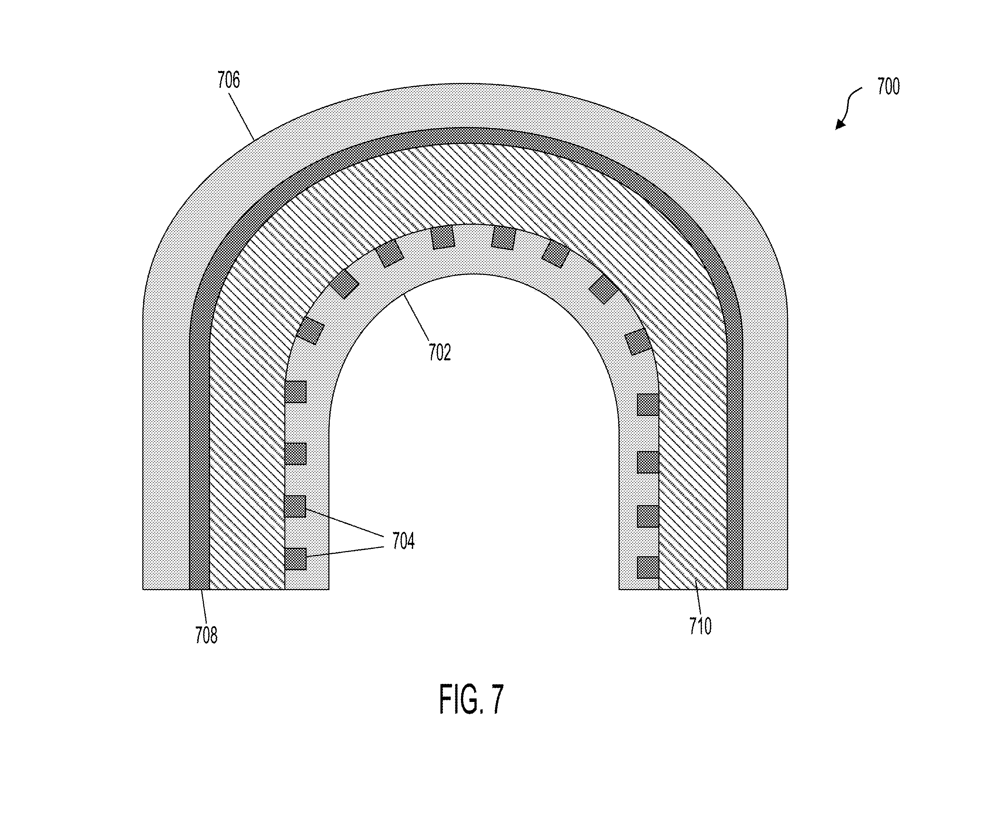
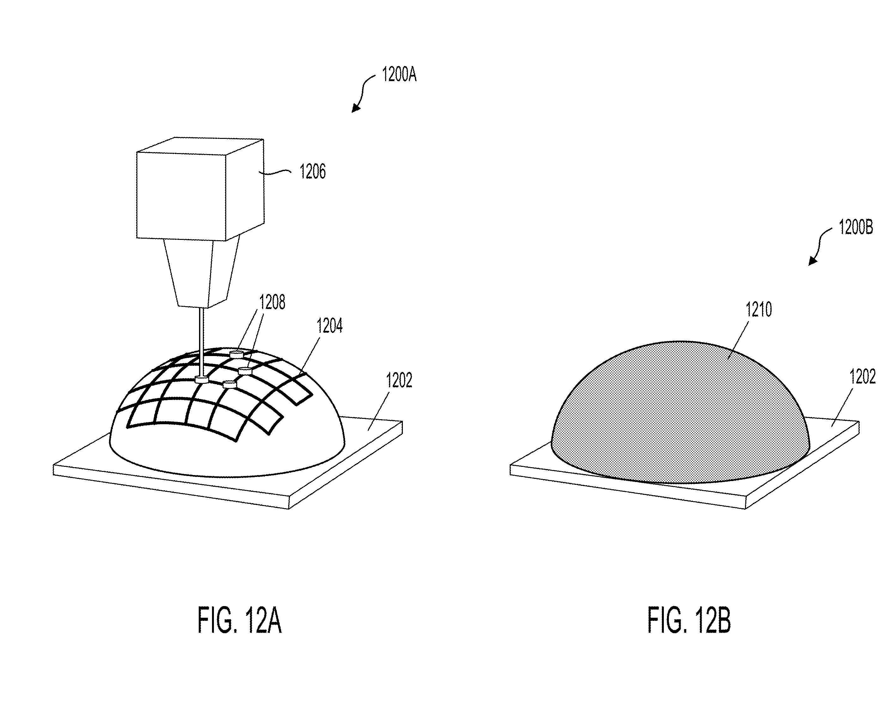

v3.16-P
Analyzing | Framework v3.16-P | scanned PDF read visually; status and family data partial

> **Access Status** — Full document: local PDF supplied by the pipeline (28 scanned pages, no text layer), read visually page by page, all text legible; no passage was unreadable · Claims: all 20 read · Drawings: all 15 sheets viewed (FIGS. 1–12B) · Status & family data: front-page data read from the PDF; Google Patents had no page for the publication on 8 Oct 2026 (404, publication day); USPTO Patent Center (file history) was not accessible to this run; web searches on 8 Oct 2026 found no PCT or foreign counterpart · Analysis basis: full document. Figures: key drawings cropped from the 300-dpi scanned page images (`figures/pdfimages/`) with Python/Pillow and rotated upright; one analyst-built explainer picture drawn with Pillow. Numeric checks ran in Python (`checks.py` in the work directory). Prior-art papers cited here are journal articles; I found no arXiv versions of them, and I saw them only through abstracts and tool summaries, not full text (flagged where used). The one arXiv paper cited (Digit 360, arXiv:2411.02479) was checked on its abs page: v1 of 4 Nov 2024 is the only version.

| **Field** | **Value** |
| :-- | :-- |
| Number & kind | US 2026/0310299 A1 (A1 = published application, not a granted patent) |
| Title | Three-Dimensional Soft Compliant Array Tactile Sensor with Multi-Modal Sensing and Scalable Manufacturing Methods |
| Assignee / applicant | Tesla, Inc., Austin, TX (US) |
| Inventors | Hung Sheng Lin, Nitin Sitaraman, Yi Quan Xiong, Mohammed Al-Rubaiai, Ruoyu Xu, Siddharth Rupavatharam, Jeremy Eichhorn, Jessica Wei, Jooyeun Ham, Yongguo Lee, Gaurav Chandra, Sagar Nagsandra Rangaswamaiah (12) |
| Priority date | 4 Apr 2025 (US provisional 63/783,580) |
| Filing date | 11 Sept 2025 (application 19/326,524) |
| Publication date | 8 Oct 2026 |
| Jurisdiction | US |
| Status | Pending, published application; examination state not retrieved (Patent Center not accessible, checked 8 Oct 2026) |
| Family & continuations | The provisional above; no PCT, foreign counterpart or continuation found (web search, 8 Oct 2026, low confidence on publication day) |
| CPC classes | G06F 3/016 (tactile and force-feedback input/output); G06F 3/014 (hand-worn input devices); G06F 3/0446 (capacitive touch sensing with a grid of crossing electrodes); G06F 2203/04103 (manufacturing of touch-sensitive devices) |
| Claims | 20 in total; independent claims 1 (method: build flat stack, then form it), 10 (method: form the substrate first, then build on it), 19 (apparatus: a thermoformed stack) |
| Links | patents.google.com/patent/US20260310299A1 (not yet live on 8 Oct 2026); USPTO Patent Public Search, publication US 2026/0310299 A1 |

## 1. Bake the Circuit, Then Bend It: Tesla's Recipe for Curved Robot Skin

Tesla's application claims two manufacturing routes to a curved, touch-sensitive "skin" for robot fingers and palms: print a crossing grid of conductors on soft plastic sheets and heat-mould the sandwich to shape, or mould the plastic first and print onto the curve. It is a recipe for making the part, not a demonstration that the part works or that Optimus uses it.

## 2. Big-Picture Context

A robot hand that cannot feel is a hand working blindfolded at exactly the wrong moment. Cameras see an object until the fingers close around it; after that the fingers themselves block the view, and the robot must guess whether the grip is slipping, crushing, or barely touching. Tactile sensors fill that gap by reporting where and how hard something presses on the skin. The hard part is not the sensing principle, which is decades old; it is putting a dense grid of sensing points onto a surface that is curved in two directions at once (a fingertip, the heel of a palm) without the conductors cracking, the sensing points drifting, or the cost exploding.

The usual answers each have a pain point. Flat flexible circuit sheets bend around a cylinder but cannot wrap a dome without wrinkling, the way paper cannot wrap a ball. Tiles of small rigid sensors leave gaps and multiply wiring. Camera-in-gel fingertips are bulky. Outside robotics, curved car dashboards with touch buttons are already printed flat and then heat-formed.

**Patent Type & Stakes.** This is an unexamined manufacturing-process application, with one apparatus claim, covering ways to make conformal tactile sensor arrays. What's at stake is a cheap, repeatable way to cover curved robot parts with touch sensing, not a new sensing principle.

**Prior Belief Check.** The approach follows mainstream practice and refines it modestly. Crossing-grid tactile arrays are textbook; thermoforming printed circuits is an established industrial process; plating onto already-curved plastic is standard for phone antennas; academic groups have already thermoformed sensor films into fingertip shapes. The filing adds the combination applied to robot skin, in two step orders. Practitioners would not be surprised; it reads as an incremental manufacturing filing, which is the normal case.

**Filing & Prosecution Note.** This is a published application, not a grant. It appeared on the normal schedule, about a year and a half after the provisional, which suggests Tesla did not ask for early publication. I could not see the file history, so whether an examiner has acted is unknown; the face of the document lists no cited references. No foreign or PCT counterpart turned up on publication day. The claims are Tesla's opening position, and examination usually narrows claims this broad.

## 3. Necessary Background Crash-Course

### How to read this patent

The **claims** at the end are the legal fence: they alone define what is protected. The **description** and drawings teach the idea and give **embodiments**, worked examples that illustrate but do not limit. An **independent claim** stands on its own and sets the widest scope; each **dependent claim** refers back to one and adds features, which narrows it. "Comprising" means "including at least these steps or parts", so adding extra steps does not escape a claim. A **published application** like this one is a request, not a right; granted claims can look quite different. A **limiting term** is the word in a claim that a competitor would have to avoid to stay outside it.

**Analogy:** The claims are a function's signature and contract; the description is the example code in its documentation. Callers are bound by the contract, not by what the examples happen to do.

**Breaks when:** you ask who enforces the contract. A compiler checks signatures mechanically; claim boundaries are decided by examiners and courts reading words, so the edge is fuzzy and moves during prosecution.

### Origins & Lineage

Why does a robot need skin at all? Human grasping leans on touch far more than people notice. Experiments in which volunteers' fingertips are numbed show them fumbling simple tasks such as striking a match: they grip too hard or too soft and miss early slip. The fingertip carries a dense population of pressure, vibration and stretch receptors, and the nervous system uses them as a fast feedback loop that corrects grip force within a fraction of a second, long before vision registers anything. A robot hand without that loop faces three failure modes: it crushes fragile objects, it drops slippery ones, and it gropes blindly once its own fingers hide the object from the cameras.

Engineers have attacked the problem for about half a century, roughly in four families. **Discrete force sensors** in each fingertip measure total force but not where contact is. **Grids of pressure-sensitive points** came next: two layers of conductor strips crossed at right angles, separated by a material whose electrical behaviour changes under pressure, each crossing read like a memory cell. Pressure-mapping mats and early robot skins of the 1980s and 1990s used this architecture, exactly the one this patent uses. **Camera-based fingertips** (a soft gel with a camera behind it) offer very high resolution but are bulky and power-hungry. **Bio-inspired fingertips** combine pressure, vibration and temperature in a fluid-filled core.

The weakness of the grid family has always been geometry. A grid printed on a flat sheet works well on flat or gently bent surfaces. A fingertip is a dome, and a flat sheet cannot cover a dome without stretching, because a sphere's surface simply has more area near its rim than a flat disc of the same radius would allow. That is why most robot hands put flat sensor pads on finger pulps and left the tips, sides and palm edges blind or covered by tiles.

The lineage of this patent's answer runs through two industries that met this geometric problem earlier. **In-mould electronics** grew out of automotive and appliance interiors from the 2010s onward: designers screen-print stretchable silver ink onto a plastic sheet while flat, heat-form the sheet into a curved panel, and get touch buttons on a curved dashboard with no wiring harness behind them. Ink makers and touch-panel companies patented that route years ago, including methods that pre-distort the flat pattern so electrodes end up the right size after stretching. **Moulded interconnect devices** came from the phone industry: a laser draws a pattern on an already-moulded plastic part that contains a special additive, the drawn lines are then plated with copper, and the result is an antenna that follows the phone's curved shell. Pad printing (a soft silicone stamp that rolls ink onto curved objects, the same method that prints logos on golf balls) and robotic dispensing of conductive paste are the other "print onto the curve" tools.

Academic labs then joined the two threads to tactile sensing. A Japanese group in 2017 thermally moulded a transistor array on a polymer film into the shape of a real human fingertip. A KAIST group in 2021 thermoformed a stretchable film with liquid-metal conductors, including a fingertip-shaped touch sensor, using pre-distorted patterns. This patent sits squarely in that lineage: it takes the grid sensor from the first family, the print-then-form route from in-mould electronics, and the form-then-print route from moulded interconnect devices, and applies them together to robot hands and palms. Its contribution, if any, lies in the combination and the specific step orders it claims, not in any single ingredient.

### Concept 1: How a crossing grid senses pressure

Two layers of parallel conductor strips sit on either side of a thin, soft separator, with the top strips running across the bottom ones. Each place where a top strip crosses a bottom strip forms a tiny sensing point, often called a **taxel** (a "tactile pixel"). Two physical effects can turn pressure into an electrical change. In the **capacitive** version the separator is an insulator: the two crossing strips form a miniature parallel-plate capacitor, and pressing the skin squeezes the separator, bringing the plates closer and raising the capacitance. In the **resistive** (piezoresistive) version the separator is a soft rubber loaded with conductive particles: squeezing it pushes the particles into better contact, so the resistance between the crossing strips drops.

The readout is the part the reader already knows from hardware. Electronics drive one row at a time and listen on every column, just as memory is addressed by word line and bit line. Because every row meets every column, a few dozen wires can read several hundred taxels, which is the whole reason this architecture dominates.



*Analyst-built illustration (not from the patent):* a single crossing at rest, the same crossing pressed, and the effect of stretching the stack over a dome. The numbers are analyst estimates from a simple parallel-plate model; the patent gives none.
**What to look at:** the signal is a small change on a tiny capacitance, and forming the dome changes the resting value by far more than a press does, so every taxel needs its own zero point.

**Analogy:** A crossing grid is a DRAM array turned into a pressure map: each crossing is a cell, rows and columns are word and bit lines, and the controller scans the array to read the image.

**Breaks when:** you look at the cells. DRAM cells are identical by lithography; taxels on a hand-sized, heat-formed sheet differ from each other because forming stretches some more than others, so the "array" needs per-cell calibration that memory never does.

### Concept 2: Thermoforming and why a heated sheet can be bent but not cracked

A **thermoplastic** is a polymer made of long, unlinked chains. Below its **glass transition** temperature the chains are frozen and the sheet is stiff; above it, chain segments slide past each other and the sheet behaves like warm toffee, stretching over a mould and keeping the new shape when cooled. **Thermoforming** is exactly that: clamp, heat, push onto a mould by pressure or vacuum, cool, release. Cross-linked thermosets such as cured silicone cannot do it.

The catch is geometry again. Covering a dome means the sheet must gain area, so it stretches and thins, most at the top. Anything printed on it stretches too. A printed silver line is a crowd of flakes in a little binder; stretch it far and the flakes separate, resistance climbs, and eventually the line cracks.

**Analogy:** Thermoforming a printed sheet is like resizing a bitmap non-uniformly: the pixels in the middle get stretched more than those at the edges, and fine lines can break up.

**Breaks when:** you try to "undo" it. A bitmap can be resampled losslessly by keeping the original; a formed sheet's thinning and ink damage are physical and permanent, which is why serious in-mould designs pre-distort the flat pattern to compensate.

> **Central analogy for this patent:** a printed memory array, heat-stretched onto a dome.

## 4. How It Works and What Is Claimed

### 4.1 How it works

**The physics in one paragraph.** Everything rests on the crossing-grid sensor from Concept 1: two conductor layers, one soft separator, pressure read as a change in capacitance or resistance at each crossing (¶ [0034]). The description never specifies a separator thickness, a taxel pitch or a force range; it says only that the separator's thickness sets the resting capacitance or resistance (¶ [0069]). The invention is about getting that sandwich onto a curved surface. The inventors describe two orders of operations, which the flow charts FIG. 3 and FIG. 8 lay out.

```
Analyst-built concept diagram (not from the patent)

 Route A: build flat, then form        Route B: form first, then build
 (FIG. 3, claims 1-9, 19-20)           (FIG. 8, claims 10-18)
 +---------------------------+         +----------------------------+
 | flat plastic sheet        |         | mould plastic to 3D shape  |
 +---------------------------+         +----------------------------+
              |                                      |
              v                                      v
 +---------------------------+         +----------------------------+
 | print or etch-and-fill    |         | draw traces on the curve:  |
 | conductor strips          |         | dispense, laser + plate,   |
 +---------------------------+         | or pad print               |
              |                        +----------------------------+
              v                                      |
 +---------------------------+                       v
 | add separator + second    |         +----------------------------+
 | patterned sheet = stack   |         | dispense or coat separator |
 +---------------------------+         +----------------------------+
              |                                      |
              v                                      v
 +---------------------------+         +----------------------------+
 | heat-form stack on mould  |         | add second layer that      |
 +---------------------------+         | follows the curve          |
              |                        +----------------------------+
              +-------------+  +-----------------------+
                            v  v
              trim, mount on backing, cover, connect
```

Read it as two pipelines that converge: Route A does all patterning while flat and pays for it with stretching; Route B never stretches the conductors but must pattern on a curve.



*FIG. 1 (from the patent): a robotic hand (100) with sensors on the thumb (102A), the palm (102B) and the index finger (102C).*
**What to look at:** the sensors wrap the fingertip and cover most of the palm, which are the curved regions a flat sheet cannot cover. The drawing is a schematic of an embodiment, not a product photo.

**Step 1 — Choose a formable sheet (¶ [0047]–[0048]).**
*Failure it prevents:* a substrate that cannot be reshaped traps the sensor in a flat geometry. *What the inventors describe:* a thin thermoplastic film (polyurethane, polyester or polyimide), optionally surface-treated so ink sticks, pre-cut with alignment holes. *What it buys:* a sheet patterned flat on ordinary printing equipment and later softened and reshaped. The polyimide entry is odd (see §4.4).

**Step 2 — Put the conductor strips on it, flat (FIGS. 4A–4D, 5A–5E; ¶ [0050]–[0066]).**
*Failure it prevents:* without patterned conductors there are no rows, columns or crossings. *What the inventors describe:* screen printing conductive ink through a stencil (FIGS. 4A–4D), or laser-cutting channels into the sheet, filling them with conductive paste (silver, carbon, copper or a liquid gallium–indium alloy), laminating a cover with contact openings and attaching a flexible circuit board (FIGS. 5A–5E). *What it buys:* screen printing is cheap and fast; buried channel conductors are better protected and may stretch more gracefully, at the cost of more steps.



*FIG. 4D (from the patent): top view of the sheet (404) with printed conductor strips (416); the dashed line marks the cut shown in FIG. 4E.*
**What to look at:** these strips are one half of the grid; the other half runs across them on the second sheet.

**Step 3 — Make the sandwich (FIG. 4E; ¶ [0067]–[0070]).**
*Failure it prevents:* one layer of strips cannot form crossings, and two layers touching directly would short. *What the inventors describe:* a second sheet with its own strips, and between the two a separator, either an insulating soft material for the capacitive version or a pressure-sensitive conductive rubber or foam for the resistive version, bonded together by adhesive, lamination or heat. The two sheets are aligned so that strips cross at the intended sensing points. *What it buys:* a complete, testable, flat sensor before any forming.



*FIG. 4E (from the patent): cut along one strip, showing the top sheet (404) with that strip (416), the separator (422), and the bottom sheet (418) with the crossing strips (420) seen end-on.*
**What to look at:** each small square facing the long strip across the separator is one crossing, so one taxel.

**Step 4 — Heat-form the stack (FIGS. 6–7; ¶ [0071]–[0075]).**
*Failure it prevents:* a flat stack cannot cover a fingertip. *What the inventors describe:* a heater housing clamps the stack, softens it above the glass transition, presses it onto a fingertip-shaped mould and lets it cool (FIG. 6); compression moulding and vacuum forming are alternatives; the part is then trimmed and mounted. *What it buys:* the grid is made flat in one pass and shaped in one pass, the scalable part of the story, provided the conductors and separator survive the stretch.



*FIG. 6 (from the patent): heater housing (604) with heat source (606) holding the stack (602) above the fingertip-shaped mould (608) on its base (610); the arrow at the bottom marks an opening, presumably for vacuum.*
**What to look at:** the stack is formed as one piece over a dome; the material over the dome top stretches most.



*FIG. 7 (from the patent): formed sensor with lower sheet (702), its strips (704) seen end-on, separator (710), upper strip (708) and upper sheet (706).*
**What to look at:** the drawing shows the grid and separator keeping uniform spacing around the bend. That is the hoped-for result, drawn, not measured; real forming thins the material unevenly.

**Step 5 — Or form first, then build on the curve (FIGS. 8–12B; ¶ [0076]–[0093]).**
*Failure it prevents:* stretching cracks printed conductors and thins the separator unevenly. *What the inventors describe:* mould the base plastic to its final shape first (thermoforming, injection or compression moulding, casting, machining), then draw conductors on the curve with a computer-guided paste nozzle (FIG. 9), a laser that activates additive-loaded plastic followed by plating (FIGS. 10A–10B), or pad printing (FIGS. 11A–11B). The separator is then dispensed, possibly as dots at crossings (FIG. 12A), and a conforming second layer goes on top (FIG. 12B). *What it buys:* conductors never stretch, so they are what was drawn; the price is slower, serial patterning on a 3D surface and harder alignment of the top layer.



*FIGS. 12A–12B (from the patent): a dispensing head (1206) deposits separator material (1208) onto a pre-formed dome (1202) already carrying a conductor grid (1204); a second layer (1210) then covers it.*
**What to look at:** the separator dots sit at grid crossings, so the separator can be placed only where taxels are. Note that the grid drawn on a single layer would short its own rows and columns if taken literally; it is a schematic.

**Step 6 — Mount, protect, connect (FIG. 2; ¶ [0037]–[0045]).**
*Failure it prevents:* a bare sensor would tear, wear out, or have no path to the electronics. *What the inventors describe:* bond or overmould the formed sensor onto a hard or soft backing, add a foam or polyurethane or silicone protective cover, and connect it through zero-insertion-force connectors, conductive film or solder to a flexible circuit board. *What it buys:* a replaceable, protected sensor shell. Nothing is said about how many wires leave the fingertip or what readout chip is used.

### 4.2 The claims in plain English

*These are the claims as filed; examination often narrows them.*

**Claim 1 (method; Route A).** In plain English: (a) provide a first sheet of substrate material; (b) form a set of conductive regions on it; (c) put a separator layer between that sheet and a second sheet carrying its own conductive regions, making a stack; (d) form the stack into a target three-dimensional shape. To fall inside it, you build a two-electrode-layer sandwich and then shape it. Nothing requires the separator to be soft or pressure-sensitive, requires heat, or requires the regions to cross. *Assessment:* very broad. The real limiting term is the order: layers are stacked **before** the stack is formed into 3D.

**Claim 10 (method; Route B).** In plain English: (a) form the first substrate into the target 3D shape; (b) then form conductive regions on it; (c) put separator material over at least part of those regions; (d) attach a second substrate with conductive regions to the separator, the second substrate "conforming to" the first's shape. To fall inside it, you shape the base before patterning. *Assessment:* also broad. Its limiting term is the opposite order, forming **before** patterning. Together claims 1 and 10 fence both possible orders.

**Claim 19 (apparatus).** In plain English: a sensor made of a stack of a first substrate layer with conductive regions, a separator, and a second substrate layer whose conductive regions are "isolated from" the first set by the separator, where the stack "is thermoformed to conform to a target 3D structure." To fall inside it, you sell a two-layer sensor stack that was thermoformed into shape. *Assessment:* the only product claim, and narrower than claim 1: it requires **thermoforming** of the **stack**, so a Route B product, whose stack was never thermoformed, arguably falls outside it. "Isolated" is the other limiting term (§4.4).

**Dependent claims, grouped by what they add:**

- **Substrate materials (claim 2):** choose the first substrate from thermoplastic polyurethane, polyester (PET) or polyimide.
- **Flat patterning routes for Route A (claims 3–8):** conductive ink (3), screen printed through a stencil (4); laser-cut or etched channels filled with conductor (5–6) under a cover layer with openings (7); a flexible circuit board connected to the conductors (8).
- **How the stack is formed (claim 9):** thermoforming over a mould. This is the claim-1 version of the thermoforming limitation that claim 19 carries.
- **Route B details (claims 11–18):** thermoforming the base (11); 3D dispensing of traces (12); laser activation plus plating (13–14); pad printing (15); dispensed separator (16); a dielectric layer covering the traces (17); mounting on a backing (18).
- **Sensing type (claim 20):** the separator is a dielectric (capacitive) or piezoresistive (resistive) material.

Every dependent claim names a well-known process; none adds a dimension, material grade, ink stretch limit or sensing performance.

### 4.3 Spec vs claims

| What the description shows | What the claims cover |
| :-- | :-- |
| A five-fingered robot hand with thumb, palm and finger sensors (FIG. 1); "skin" for humanoid robots, autonomous vehicles (¶ [0035], [0041]) | No claim mentions a hand, robot or vehicle; the 3D target shape is unconstrained |
| Capacitive and resistive versions as alternatives (¶ [0034]) | Claim 20 recites "one of" the two; no claim recites two sensing modes together |
| Specific inks (silver flake, silver nanoparticle, carbon, copper, gallium–indium) and plating metals | No ink or metal is claimed |
| Protective cover layer, overmoulding, connectors, alignment by optical registration (¶ [0037], [0045], [0066]) | Only a flexible circuit board (claim 8) and a backing (claim 18) are claimed |
| Trimming after forming; plasma surface treatment | Not claimed |

Two misreadings to avoid. First, nothing about hands, Optimus or humanoids is protected; FIG. 1 is an illustration. Second, the protective cover, the specific inks, and the "skin over a whole robot" use are described but unclaimed, so they are natural material for a later continuation if Tesla wants narrower, more defensible claims.

### 4.4 What this patent does and does not establish

**What it establishes and what it doesn't.** The document shows that, as of 4 April 2025 (to the extent the provisional supports it), Tesla described two step orders for making two-layer tactile arrays on curved plastic parts, with the specific embodiments of FIGS. 1–12B, and that it claimed them broadly. It does **not** establish that any such sensor was built, that it senses usefully after forming, that it survives repeated grasping, that it is cheaper than alternatives, that the claims are novel (no examination is visible), or that Tesla uses or will use it.

**Headline numbers.**
- *Sensing performance (taxel count, spacing, force range, sensitivity, response time):* **Not stated.** The most important missing number is the force sensitivity after forming, because that is what decides whether a heat-formed thermoplastic separator works at all (see Sensitivity below).
- *Durability (grasp cycles, abrasion, temperature):* **Not stated.** For a fingertip that is the second most important gap.
- *Materials list — polyimide as a thermoformable substrate (¶ [0047], claim 2):* **Stated, questionable.** Common polyimide films keep their stiffness to temperatures where other plastics decompose, and they are not thermoformed in ordinary practice; special thermoplastic grades exist, but the patent does not name one. Polyurethane and polyester are routine choices.
- *The only number in the document* is a plus or minus 10 percent definition of "about" (¶ [0094]), which no claim uses.

**Sensitivity — the separator has two incompatible jobs.** The approach works unless the separator cannot be both formable and soft. A capacitive taxel only responds if a fingertip-scale press noticeably squeezes the separator. My Python estimate (analyst inference, `checks.py`): a soft silicone-like layer compresses about a hundred times more under the same light press than a stiff thermoplastic film, so a thin, stiff, formable separator would give a signal near the noise. Route A therefore needs a separator that is both heat-formable and very soft (a soft thermoplastic elastomer or a foam, which the patent mentions only as options), or a microstructured layer, which it does not describe. Route B sidesteps the conflict by dispensing the separator after forming. This is plausible to solve, since soft thermoplastic elastomers exist, but it is the hinge, and the document is silent on it.

**Internal consistency — significant findings.**
1. *Title vs claims (title; claims 1, 10, 19–20):* the title promises "multi-modal sensing" and "scalable manufacturing methods". Neither is claimed or demonstrated. The description offers capacitive **or** resistive sensing as alternatives (¶ [0034], claim 20 "one of"), never two modes in one sensor, and gives no throughput, yield or cost. A reader skimming headlines would believe a multi-modal sensor is protected; it is not.
2. *"Isolated" vs piezoresistive (claims 19 and 20; ¶ [0070], [0091]):* claim 19 requires the second set of conductors to be "isolated from" the first "by the separator material," and claim 20 then allows that separator to be piezoresistive, which works precisely by conducting current between the layers. Either "isolated" means only physically separated, or claim 20's resistive branch contradicts its parent. This changes what claim 19 covers and is the kind of term an examiner or court would have to construe.
3. *Claim 19 excludes Route B products:* the only product claim requires the stack to be thermoformed, while half the description (FIGS. 8–12B) makes sensors whose stack is never thermoformed. The apparatus protection is therefore narrower than the disclosure suggests.

Cosmetic: FIG. 5E labels two different layers "514" while ¶ [0065] names the second one 516; ¶ [0009] describes a fabrication method "performed by one or more processors coupled to non-transitory memory", a software-patent boilerplate that fits oddly here.

### 4.5 Assumption Audit

> **Watch:** Reader likely assumes the patent describes the Optimus fingertip sensor. The patent actually never names Optimus or any product; FIG. 1 shows a generic five-fingered hand, and the claims cover any curved part.

> **Watch:** Reader likely assumes "multi-modal" in the title means the sensor measures several things at once, such as pressure plus vibration or temperature. The patent actually offers one sensing effect per sensor, capacitive or resistive, chosen by the separator material.

> **Watch:** Reader likely assumes the thermoformed sensor is protected however it is made. The patent actually claims the product only when the stack was thermoformed (claim 19); the form-first route is protected only as a method (claim 10), and only if granted.

> **Watch:** Reader likely assumes FIG. 7's evenly spaced layers show what forming achieves. The drawing actually shows an idealized schematic; forming a dome thins the stack most at the top, which the patent never discusses.

## 5. What's Genuinely New — Novelty & Prior Art

**The one or two distinguishing ideas.** (1) Applying the print-flat-then-thermoform route of in-mould electronics to a full two-layer crossing-grid tactile array for robot skin (claims 1, 9, 19). (2) Claiming, in the same filing, the mirror-image route of moulding first and building the two-layer array on the curve (claim 10). New to a reader who follows robot hands; much less new to the field of printed and moulded electronics.

**Cited references.** The application's face lists none, which is normal for a published application. I could not access the file history to check for an information disclosure statement (checked 8 Oct 2026). Google Patents' machine-generated "similar documents" were not available because the page was not yet live.

**Likely prior art** (my search, 8 Oct 2026; all predate the 4 Apr 2025 priority date unless noted):

| Reference | Date | What it shows | Bears on |
| :-- | :-- | :-- | :-- |
| Apple, US 2021/0089170 A1, "Spherical or highly curved touch-sensitive surfaces" (Google Patents, status listed as granted) | priority 25 Sept 2019 | A flat touch-sensor panel with an electrode pattern on a flexible substrate is thermoformed into a spherical shape, with the flat pattern pre-distorted from a strain map so electrodes end up equal in area | Claims 1, 9, 19: thermoforming a patterned touch sensor into 3D |
| Sun Chemical, US 10,544,317 B2, thermoformable conductive inks and process for a thermoformed device | priority 14 Oct 2014; granted 28 Jan 2020 | Printed conductive layers that survive thermoforming in layered printed devices | Claims 3–4, 9 |
| Choi et al., *Science Advances* 7(42), 13 Oct 2021, doi:10.1126/sciadv.abj0694 (KAIST) | 2021 | Pre-distorted patterns on a thermoplastic-elastomer film with liquid-metal conductors, thermoformed onto 3D moulds, including a fingertip-shaped capacitive touch sensor | Claims 1, 9, 19 for the fingertip case; seen via abstract and a press summary only |
| Sakai et al., *Nanoscale Research Letters*, 2017 | 2017 | A transistor array on a polymer film thermally moulded into the shape of a real fingertip, used to read touch-induced strain | Thermoformed tactile array on a fingertip shape |
| Laser direct structuring of moulded parts; pad printing; robotic dispensing (broader literature) | 1990s–2010s | Standard ways to put conductors on already-curved plastic | Claims 10–15 |

Independent, not prior art: a KAIST/ETRI group published thermoformed tactile sensors on 14 May 2025 (*Science Advances*, doi:10.1126/sciadv.adv0057), about six weeks after Tesla's priority date. It shows the idea was converging in academia at the same time; I saw only its abstract.

**What's genuinely new.** What remains is the pairing of a two-layer pressure grid (soft dielectric or piezoresistive separator) with each step order on robot-hand shapes, plus dispensing the separator only at crossings on a pre-formed part (FIG. 12A, claim 16). I found no document showing a two-layer, separator-based pressure grid thermoformed as a stack; the Apple and KAIST work comes close, but I read only summaries, and theirs may be single-layer touch sensors rather than pressure sensors. That distinction may be where novelty survives.

**Obviousness risk (assessment, not a legal conclusion).** In my assessment claims 1 and 10 as filed are at serious risk: each reads as a known sensor architecture combined with a known forming or patterning order, and the Apple filing alone covers most of claim 1's steps. Claim 19 is the most defensible; a likely outcome is narrowing to a specific pressure-sensing separator, the buried-channel conductors (claims 5–7), or the crossing-only separator dots.

**Testable Content Check.**
1. *Observable handle:* teardown photos of a Tesla fingertip or palm showing a one-piece curved shell with a crossing grid of printed or plated lines, with thinned or wavy traces at the tip (Route A) or laser-plated copper traces (Route B). Demo footage cannot tell this construction from flat flex sensors folded around a fingertip, so the manufacturing route has **no external handle short of a teardown**.
2. *Claim-language load:* stripped of "providing", "defining a set of" and "coupling", claim 1 says "make a two-layer electrode sandwich and shape it", close to a textbook description of in-mould electronics with "tactile" added; claim 10 says "shape the plastic, then add electrodes and a separator". Neither carries specific content beyond step order; claim 19's "thermoformed" carries a little more.

## 6. Product Fit & Competitive Context

*Assessment, not reporting.*

**Where it would sit.** In a humanoid such as Optimus, this belongs to the hand's tactile layer: a curved sensing shell over fingertips, finger pads and palm, under a protective skin, wired through a flexible circuit to readout electronics in the hand or forearm. It would replace flat pads or discrete force sensors and feed the grasp-control loop that limits grip force and catches slip. Reported designs that move the hand's actuators into the forearm (Basenor and The Decoder reports on the newer Optimus hand, checked 8 Oct 2026) free fingertip volume for exactly such a thin shell. **(C) Speculative.** **(analyst inference)**

**Feasibility, manufacturability, cost.**
- *Physics at product scale.* Hands see millions of contacts, sweat, grit and impacts. Route A's stretched conductors are the weakest link: in my Python estimate, forming a flat disc into a full hemisphere stretches it about 40 percent in each direction on average (more at the top), doubling a trace's resistance from geometry alone; a shallow finger-pad dome stretches roughly 10 percent. **(B) Contested** — in-mould inks handle moderate stretch, but deep fingertip domes are at the edge. **(analyst inference)**
- *Manufacturability.* Route A fits high volume: screen printing, lamination and thermoforming are fast batch processes with automotive supply chains. Route B's dispensing and pad printing are per-part steps; laser structuring plus plating is proven at phone volumes. Layer alignment is the yield risk in both. **(A) Consensus.** **(broader literature)**
- *Cost.* No basis for a number. Drivers: one forming tool per part shape, per-taxel calibration after forming, and yield loss from cracked traces.

**Will they use it? — Evidence Ladder.**

| Level | Evidence found (checked 8 Oct 2026) | Reading |
| :-: | :-- | :-- |
| E0 | This published application, priority 4 Apr 2025 | Tesla thought the routes worth protecting |
| E1 | Non-provisional filed about five months after the provisional (normal); no PCT, foreign filing or continuation found | No sign of extra investment yet; early, so absence means little |
| E2 | None found. Inventor roles not confirmed (search returned nothing on 8 Oct 2026); no job postings naming thermoformed tactile sensors found | — |
| E3 (general, not this construction) | Tesla's Optimus Gen 2 video (13 Dec 2023, as reported by Not a Tesla App) claimed "tactile sensing on all fingers" with Tesla-designed sensors; a Nov 2024 hand update mentioned a soft protective layer that preserves tactile sensing and integration "by year's end" (The Decoder, 28 Nov 2024) | Tesla hands have tactile sensing of some kind; nothing public shows how it is built |
| E4 | None | — |

**Counter-signals:** none found, and none expected so early. One weak lead: an Italian news piece in April 2026 discussed "the Tesla patent that makes Optimus sensitive"; I could not open it (403), so I cannot say whether it covers this family or another filing.

**Highest evidence for this construction: E0 (borderline E1).** Tesla demonstrably pursues fingertip tactile sensing (E3 for the general capability), but there is no evidence that this thermoformed construction is in development or in any product.

**Competitive context.**
Figure AI's Figure 03 (announced 9 Oct 2025) has in-house fingertip tactile sensors reported to detect about 3 grams (Notebookcheck and Designboom, Oct 2025); its construction is not public. Sanctuary AI fitted its eighth-generation Phoenix with fingertip sensors of seven cells per finger pad, sensitive to about 5 millinewtons (BusinessWire, 26 Feb 2025). Meta's Digit 360 research fingertip (arXiv:2411.02479, v1 of 4 Nov 2024, the only version) goes the optical route, with a camera-based multimodal sensor of very high resolution in a finger-shaped package. Against these, Tesla's filing is the only one of the four that discloses a manufacturing route for large-area, curved coverage of palm and fingers. Competitors' public claims are about sensitivity; Tesla's document is about coverage and process, and says nothing about sensitivity. Public evidence does not let anyone rank them on performance.

## 7. Limitations & Open Questions

> The document gives no sensing performance at all: no taxel count, spacing, force range or sensitivity, before or after forming. **(A) Consensus** — any tactile-sensing practitioner would require these numbers to judge a sensor, and the absence is plain on the page. **(patent ¶ [0034], [0069])**

> The separator must be heat-formable and yet soft enough to compress under a light touch, and the patent never shows a material that does both. **(B) Contested** — soft thermoplastic elastomers and foams might satisfy both, but whether they keep stable, low-drift behaviour after a forming cycle is an open engineering question. **(analyst inference)**

> Forming stretches the stack unevenly, so taxels near the dome top get a different resting value and sensitivity from those at the rim; my estimate puts the resting capacitance there at several times the rim value for a deep dome. The patent never mentions calibration or pre-distorting the flat pattern, which Apple's earlier filing treats as essential. **(A) Consensus** — non-uniform thinning in thermoforming is basic process physics. **(broader literature; analyst inference for the size)**

> Durability of printed conductors on a fingertip that flexes, rubs and gets hit is not addressed. **(A) Consensus** — fatigue cracking of printed silver on flexed surfaces is a well-known failure point. **(analyst inference)**

> Wiring and readout are left open: how many lines leave each fingertip, where the readout chip sits, and how crosstalk is suppressed (in passive resistive grids, current sneaks through neighbouring cells). **(B) Contested** — the grid limits wire count, but crosstalk handling varies by design. **(broader literature)**

> Claims 1 and 10 are exposed to prior art in thermoformed touch panels and in-mould electronics and will likely be narrowed; claim 19's "isolated from" wording also needs construction. **(B) Contested** — my prior-art search was quick and relied on summaries; an examiner may find closer or weaker references. **(analyst inference; claims 19–20)**

**What to watch over the next 12–24 months:** a first office action and how claims 1 and 10 are narrowed; any continuation claiming the protective cover, specific inks, or separator dots; a PCT or foreign filing; teardown photos of an Optimus hand; job postings for thermoforming, in-mould electronics or laser direct structuring in Tesla's Optimus team.

## 8. Detailed Summary & Explanation

**Summary.** Tesla's application US 2026/0310299 A1 tackles a geometric problem: tactile grids are easy to make flat, but fingertips and palms are domes. The sensing physics is the classic crossing grid, two layers of conductor strips around a soft separator, each crossing reading pressure as a change in capacitance (insulating separator) or resistance (pressure-sensitive rubber). In Route A the sensor is printed flat (screen printing or filled laser-cut channels), laminated into a stack and heat-formed over a fingertip mould. In Route B the plastic is moulded first and conductors are drawn on the curve by nozzle, laser-plus-plating or pad printing, then the separator is dispensed and a second layer added. Claims 1 and 10 cover the two orders broadly; claim 19 covers a thermoformed two-layer stack; dependent claims add well-known process choices. There is no performance data, no dimension, and no evidence a sensor was built. Prior art in thermoformed touch panels, thermoformable inks and academic fingertip sensors covers much of the ground. Evidence of use reaches only the filing itself.

**Why it is framed this way.** I treat this as a manufacturing-process patent because all the claimed content sits there; the sensing principle is borrowed whole. I read the two method claims as a deliberate pincer over both step orders, which makes the breadth strategic rather than careless. I hold the product verdict at E0 although Tesla clearly builds tactile hands, because nothing public ties this construction to them. The most useful technical point is one the patent never makes: the separator must be soft enough to sense yet formable enough for Route A, and forming makes every taxel different. Route B plausibly exists because those problems are real.

**Where I'm least confident in this analysis:** the prior-art and obviousness assessment, because I read the closest references (the Apple filing, the KAIST papers) only through abstracts and tool summaries and could not see whether any of them thermoformed a two-layer, pressure-sensing stack, which is exactly the point on which the novelty of claim 19 turns; the file history, which might list better references, was also out of reach.

**Revision notes:** the referee pass added the claim 19 versus Route B scope gap, the "isolated" versus piezoresistive inconsistency, the polyimide formability flag, the Apple pre-distortion prior art, and cut competitor detail and number density in Section 4.

## 9. Three Crystallized Takeaways

1. Tesla has filed a recipe, not a result: print a pressure-sensing grid on plastic sheets and heat-bend it onto a fingertip, or mould the fingertip first and print on the curve, with no data showing either works.
2. The hard physics hides in the soft middle layer: it must survive being heat-stretched yet still squash under a feather-light touch, and stretching makes every sensing point read differently.
3. Tesla's robot hands do have touch sensing, but nothing public shows they are built this way; this filing proves interest, not use.

## 10. Shorter Summary

Tesla's patent application US 2026/0310299 A1, published 8 October 2026 and still unexamined, describes how to make touch-sensitive "skin" for curved robot parts such as fingertips and palms.

The sensor itself is a familiar design: two layers of conductive strips laid across each other, with a soft layer between them. Each place where strips cross acts as a tiny pressure sensor, because pressing the soft layer changes how electricity passes between the strips, either by storing more charge or by conducting better. Electronics scan the grid row by row, the way a computer reads memory.

The filing's real subject is manufacturing. One route prints the whole sensor flat and then heats the sandwich and presses it over a fingertip-shaped mould. The other moulds the plastic first and then draws the conductors directly onto the curved surface with a dispensing nozzle, a laser and plating bath, or a rubber printing stamp. Tesla claims both orders broadly, plus a sensor made by the first route.

What's missing matters more than what's there. The document gives no sensitivity, resolution, durability or cost figures, and no evidence that a sensor was built. It does not address two physical tensions: the soft middle layer must be heat-formable yet soft enough to register light touch, and stretching over a dome makes every sensing point behave differently, so each would need calibrating. Similar ideas already exist in curved car-dashboard touch panels, a 2019 Apple filing on thermoformed spherical touch sensors, and academic fingertip-shaped sensors, so examination will probably narrow the claims.

Tesla's Optimus hands are publicly described as having fingertip tactile sensing, but nothing public shows how those sensors are built. This filing shows that Tesla wanted to protect these manufacturing routes, not that it uses them.

*Self-check: words=7194 · display_eq=0 · inline_symbols_s1_4=0 · max_numbers_per_paragraph=2 · origins=590 · s4.4=611 · s10=291 (counted with code, `selfcheck.py`; word count includes the bibliographic table, diagram and captions; soft miss of the 6,500 aim, under the 7,500 cap)*
