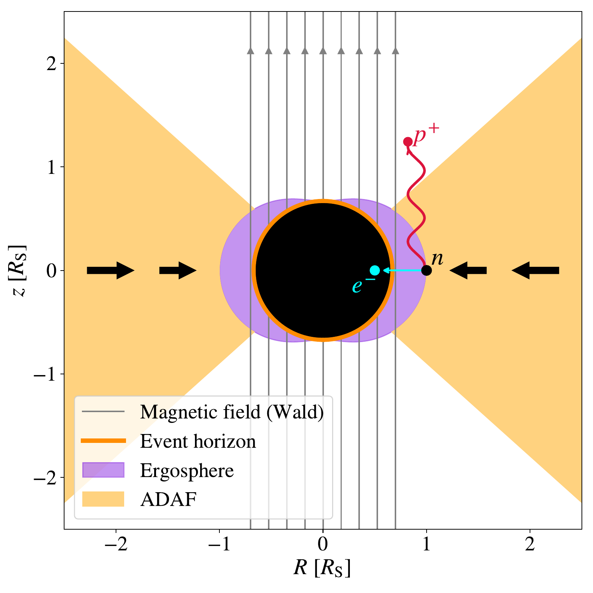
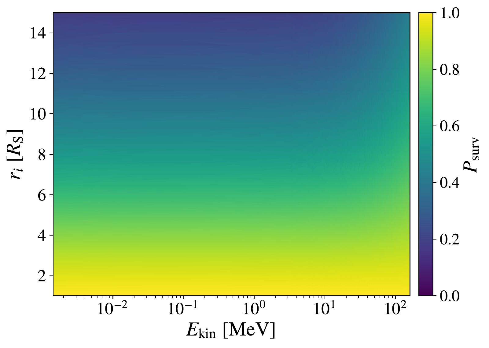
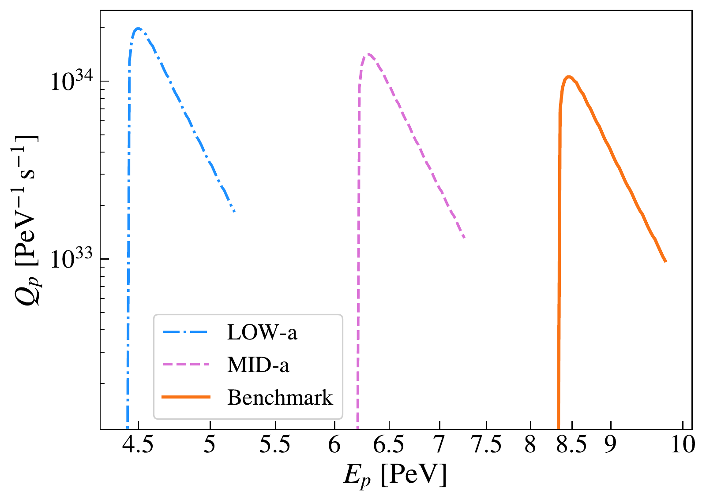
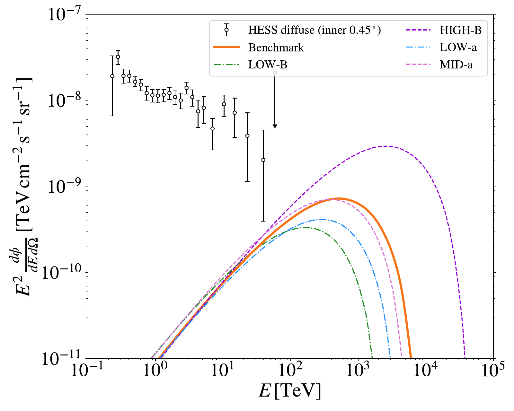
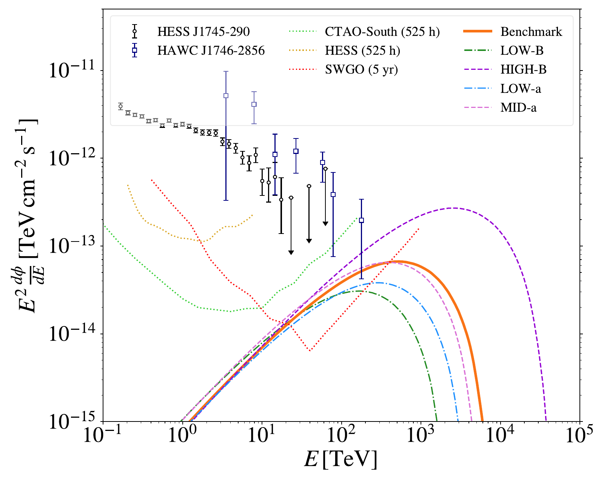
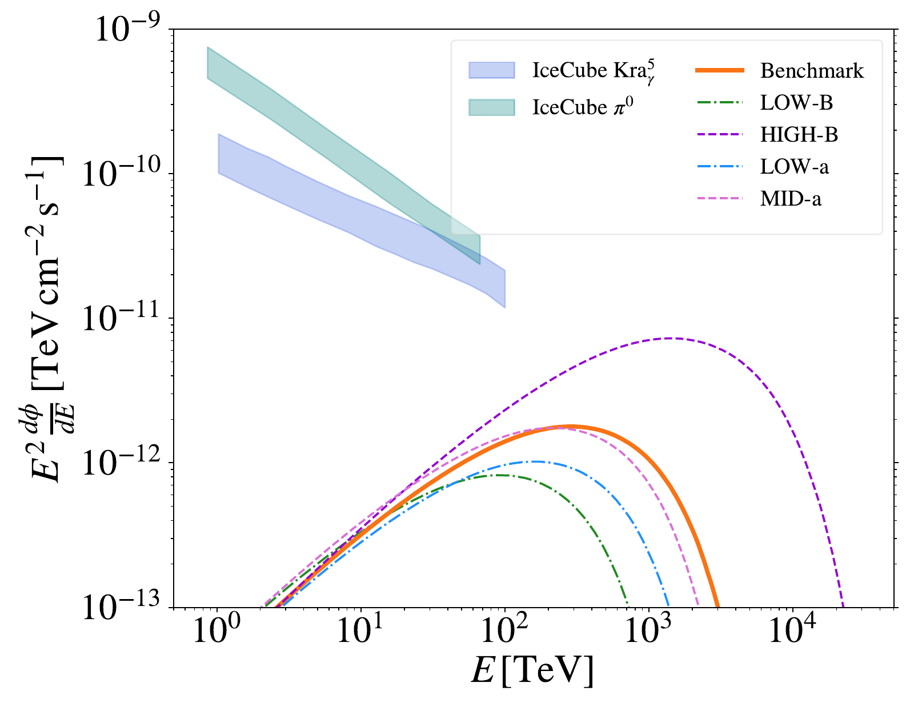
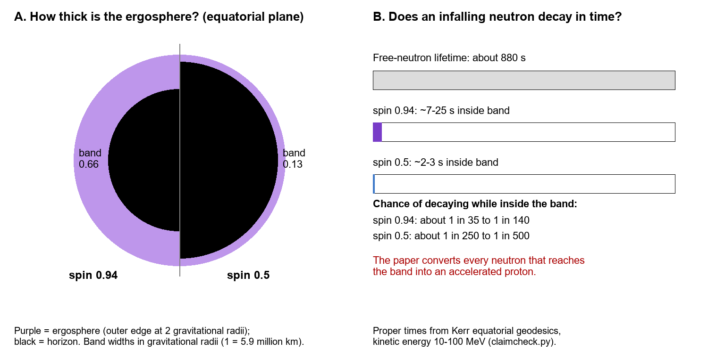

v3.16
Analyzing | Framework v3.16 | preprint, adversarial posture

> **Access Status** — Full paper: the arXiv v1 PDF (3 Sep 2026, the only version, 27 pages), read in full, including both appendices; the text extraction was used only for searching · Abstract: arXiv abs page (v1, no journal reference) · Supplementary material: none separate; the appendices are in the PDF · Figures: all 12 viewed from the authors' arXiv source files; Figs. 4, 5, 8 (left), 10 (both panels) and 11 embedded, plus one analyst-built explainer · Prior work checked on arXiv abs pages through a web tool that returns summaries, not raw text: Oh & Park arXiv:2406.04764 (latest v2, 11 Jul 2024; Phys. Rev. D 110, 023015; I also saw a tool summary of the v2 full text, not the text itself), H.E.S.S. arXiv:1603.07730 (v1 only; Nature 531, 476), HAWC arXiv:2407.03682 (latest v2, 5 Sep 2024), Dayem et al. arXiv:2607.12664 (v1 only; marked accepted in Nature). Other works the paper cites (e.g. Tursunov et al. 2020) were not checked and are mentioned only as the paper describes them · Numerical checks: Python (`claimcheck.py`; explainer drawn with `explainer.py`) · Analysis basis: full text.

---

## 1. Punchy Title & One-Sentence Hook

**The Galaxy's Black Hole as a Cosmic-Ray Gun — Right Voltage, Wrong Head Count**

A team argues that neutrons boiled off the hot gas around Sgr A* decay just outside the horizon, letting the black hole's spin, through its magnetic field, fling protons to the energies of the Milky Way's most energetic cosmic rays. The energy arithmetic holds up, but the predicted signal assumes that every neutron reaching the right spot decays during the few seconds it spends there.

## 2. Big-Picture Context

Cosmic rays show a famous bend in their energy spectrum near a thousand trillion electron-volts (one PeV), called the "knee." Something in the Milky Way must accelerate protons at least that far. Astronomers call such a source a PeVatron. Supernova remnants were the default candidate for decades, but gamma-ray data increasingly suggest that they fall short. In 2016 H.E.S.S. reported diffuse gamma rays from the central few hundred light-years of the Galaxy. The emission traced the dense gas there and showed no cutoff, and the team linked the accelerator to the central black hole, Sgr A*. HAWC later saw a point-like source at the same position extending beyond a hundred trillion electron-volts, again with no cutoff.

What is missing is a convincing mechanism that turns a famously dim black hole into a PeV accelerator. Sgr A* weighs about four million Suns, yet it shines at roughly a hundred-millionth of its theoretical maximum. One candidate comes from general relativity itself: a spinning black hole stores rotational energy that infalling particles can tap. Roger Penrose showed how in 1969, and the paper uses the magnetic version of his process. Earlier work (Tursunov and collaborators; Oh & Park in Phys. Rev. D) proposed that neutrons made in Sgr A*'s hot gas could decay near the horizon and seed it.

This paper rebuilds that chain from start to finish. It computes neutron energies directly from the nuclear reaction that makes them and tracks the neutrons along curved-spacetime paths around a spinning hole. It then computes how much energy the protons gain and follows the protons into the dense gas of the Galactic Center to predict gamma rays and neutrinos for current and future telescopes.

**Paper Type & Stakes:** this is an unreviewed theoretical and phenomenological astrophysics preprint. It chains a model of the accretion flow, nuclear kinematics, spinning-hole particle paths, an idealized magnetic field and cosmic-ray transport into multimessenger predictions. If it holds up, the Galactic Center PeVatron would be the first observed case of energy extraction from a black hole's spin.

**Prior Belief Check:** experts accept that black-hole spin energy can be extracted; the standard jet-launching mechanism for active galaxies (Blandford–Znajek) does exactly that. Particle-by-particle magnetic Penrose acceleration to PeV energies in Sgr A* is a minority proposal, because it needs the vacuum electric field near the hole to survive in a plasma that most magnetosphere specialists expect to short it out. The paper's neutron refinements are incremental improvements on Oh & Park. Under the adversarial posture, the load-bearing core has to earn its place. The energy scale does; the flux normalization, as Section 4 shows, does not.

**Replication & Convergence Note:** at least two other groups have worked on the general scenario, but this paper's specific numbers come from a single calculation that no one else has re-derived. Independent confirmation would mean a recomputation of the proton rate that includes the probability that a neutron actually decays inside the ergosphere, and, observationally, a CTAO or SWGO spectrum of the Galactic Center showing the predicted hump near a PeV.

## 3. Necessary Background Crash-Course

### A spinning black hole and its ergosphere

A spinning black hole drags spacetime around with it. Far away the drag is negligible. In a zone just outside the horizon, called the **ergosphere**, it becomes irresistible: nothing can stand still relative to the distant stars. In the equatorial plane the ergosphere's outer edge sits where a non-spinning hole's horizon would be (the Schwarzschild radius). The inner edge is the real horizon, which shrinks as spin rises, so faster spin means a thicker ergosphere band. The property that matters is energy bookkeeping: inside the ergosphere, energy as measured from far away can go negative. A particle that falls in on such a path *lowers* the hole's total energy, and the hole's rotation pays the difference.

**Analogy:** the ergosphere is an airport moving walkway that runs faster than anyone can walk. You still choose your direction relative to the walkway, but relative to the terminal you are carried along.

**Breaks when:** you ask about negative energy. No walkway can drive a passenger's energy below zero as seen from the terminal; the ergosphere can, and that is the whole point of the next concept.

### The Penrose process and its magnetic upgrade

> **Concept:** a particle enters the ergosphere and splits. One fragment takes a negative-energy path into the hole; energy conservation then hands the other fragment *more* energy than the original particle had, and the hole spins down slightly. The gravity-only version is inefficient and needs the fragments to fly apart faster than half the speed of light. In the magnetic version the spinning hole twists a surrounding magnetic field and creates an electric field. If a neutral particle splits into two opposite charges, that electric field can push one charge onto a negative-energy path and give the other a large boost. The voltage across the region limits the boost, not the particle's starting energy, so "efficiency" (energy out divided by energy in) can reach millions.

> **Vehicle:** a hydroelectric dam. A slug of water arrives at the intake with a little kinetic energy. Inside, a valve splits it: half goes down a drain and the other half shoots out through a nozzle fed by the full height of the reservoir. The jet's energy is set by the reservoir height, not by the intake speed.

> **Analogy:** intake water ↔ the neutral neutron arriving at the ergosphere; the valve ↔ neutron decay into a proton and an electron; the drain ↔ the electron's negative-energy path into the horizon; reservoir height ↔ the voltage created by the spin twisting the field; the exit jet ↔ the escaping proton.

> **Breaks when:** you ask what keeps the reservoir full. A dam's head stays up because the walls hold the water. The hole's voltage holds only in a vacuum; in a real plasma, mobile charges stream along the field lines and cancel it. The dam picture has no slot for "the water itself drains the head," and that is the main physical objection to this family of models.

### Where the neutrons come from

Sgr A* is fed far below its capacity, so its gas never cools into a thin disk. It forms a puffy, very hot flow that carries its heat inward instead of radiating it, called an **advection-dominated accretion flow (ADAF)**. Near the hole the ions reach about a trillion kelvin, hot enough that protons striking helium nuclei knock neutrons loose at tens of MeV. The gas is so thin that a newborn neutron almost never hits anything, so it follows a pure gravity path: some escape, and many fall inward toward the ergosphere. A free neutron lives about fifteen minutes before decaying into a proton, an electron and an antineutrino.

**Analogy:** the hot flow is a reactor core with no moderator. Neutrons leave at their birth energy along gravity-bent straight lines instead of slowing down and thermalizing.

**Breaks when:** you picture shielding or a containment vessel. Nothing reflects the neutrons back; birth direction, energy and gravity alone set their fate.

### From PeV protons to gamma rays and neutrinos

Magnetic fields scramble a proton's direction, so a proton cannot be traced back to its source. When it hits gas it makes pions. Neutral pions decay to gamma rays and charged pions to neutrinos, and both fly straight to Earth carrying about a tenth of the proton's energy. PeV protons therefore show up as gamma rays of a few hundred TeV. The **Central Molecular Zone (CMZ)**, a dense ring of molecular gas a few hundred light-years across around the Galactic Center, is the natural target. The paper treats the protons as diffusing — random-walking through tangled magnetic fields — before they collide.

**Analogy:** the protons are packets with forged headers; you locate the sender only through the debris they throw off on hitting a dense router farm (the CMZ).

**Breaks when:** the random-walk step grows as large as the router farm itself. At PeV energies it nearly does, so the protons stream rather than wander (see the Claim check).

### Origins & Big Picture: how Sgr A* and its surroundings got this way

Every large galaxy hosts a central black hole. The leading picture is that each grew from a seed — the remnant of an early massive star or a directly collapsed gas cloud — through billions of years of gas accretion and mergers. Sgr A* is a modest member of the class: millions of Suns, against billions for the giants in elliptical galaxies. Its history leaves two fingerprints that this paper relies on.

The first is **spin**. Gas arriving with a consistent sense of rotation spins a hole up, while chaotic feeding from random directions and mergers tends to spin it down. The Event Horizon Telescope's images of Sgr A*, compared against large libraries of simulations, favored fairly high spin. The paper adopts a benchmark close to maximal. That is a modeling preference, not a measurement. A recently reported star, S301, which passes close enough to feel the hole's frame dragging, may eventually turn it into one (Dayem et al.).

The second is **magnetic flux**. Infalling gas drags magnetic field lines with it, and in a starved flow those lines can pile up on the horizon until their pressure pushes back on the gas. Event Horizon Telescope modeling favors this "magnetically arrested" state too. The polarized ring indicates fields of tens to hundreds of gauss — refrigerator-magnet strength stretched over a region larger than Mercury's orbit. Spin plus trapped flux is the combination that powers jets in other galaxies, which makes Sgr A* a natural place to ask whether its spin energy is being tapped.

The environment matters as well. Winds from a cluster of massive young stars about a light-year away feed Sgr A* today. Very little of that gas reaches the hole, which is why it is so dim. Around it, the Galaxy's central bar has funneled tens of millions of Suns' worth of dense molecular gas into the CMZ. That gas turns the Galactic Center into a superb gamma-ray screen: any PeV protons leaking out light it up. There are also signs that Sgr A* was much brighter in the past — X-ray echoes off nearby clouds from a few centuries ago, and the giant Fermi bubbles from millions of years ago — so treating today's accelerator as steady is itself an assumption.

The paper's chain stitches these pieces together. The feeding history sets a dim, hot, magnetically clogged flow that makes neutrons. The growth history sets a fast spin, which gives a thick ergosphere and a large voltage. The Galaxy's bar fills the CMZ with gas that turns escaping protons into visible gamma rays.

**Analogy:** Sgr A* today is a large data center throttled to idle: the power plant (spin) and the high-voltage bus (trapped flux) are in place, but almost no load (gas) arrives.

**Breaks when:** you assume an idle data center draws no power. A hole with trapped flux can still drive a weak outflow from spin alone. Whether Sgr A* has a jet at all is unsettled, as the paper notes.

> **Central analogy for this paper:** neutrons as water through a spin-powered dam.

```
Analyst-built concept diagram (not from the paper)

 hot flow, ions near 1e12 K, inner ~15 Schwarzschild radii
      | proton + helium nucleus -> neutron (+ light helium)
      v
 neutron spectrum from reaction kinematics
      | remove neutrons fast enough to escape gravity
      v
 neutrons that survive the trip to the ergosphere
      | [paper assumes ALL of these decay inside it]
      v
 decay: electron -> horizon, proton -> out along field
      | energy gain = spin x field voltage
      v
 protons at ~3-55 PeV, power ~1e37-1e38 erg/s
      | diffuse into CMZ gas, collide
      v
 gamma rays (~100 TeV-1 PeV) and neutrinos at Earth
```

Read it top to bottom: each arrow is a step in Section 4, and the bracketed assumption is where the Claim check finds the problem.

## 4. Core Technical Explanation



*Figure 4 (from the paper): a spinning black hole (black) inside its ergosphere (purple), surrounded by the hot flow (orange) and a uniform magnetic field (gray); a neutron decays into an electron that falls in and a proton that escapes upward along the field.*
**What to look at:** the purple band is where the decay must happen. It is thin compared with the region that makes the neutrons.

### Step 1 — Fixing the gas around the hole

**Failure it prevents:** without a definite density and temperature profile, the neutron production rate is unconstrained. **What the authors do:** they adopt the standard self-similar model of a hot, starved flow. They set the accretion rate from Event Horizon Telescope modeling (about a hundred-millionth of a Sun per year) and choose textbook values for viscosity and magnetic pressure. The flow extends inward to the ergosphere's outer edge. **What it buys:** proton densities of a few million per cubic centimeter and ion temperatures near a trillion kelvin at the inner edge (Fig. 1). The printed density formula has a sign slip in its exponent, but the plotted profiles use the correct value.

### Step 2 — Neutron energies from the reaction itself

**Failure it prevents:** earlier work assumed that neutrons share the ions' thermal energy distribution, which is unjustified because neutrons barely interact after birth. **What the authors do:** they build the neutron energy distribution from the measured angle-and-energy pattern of the proton-on-helium breakup, transformed from the laboratory frame to colliding hot ions (Appendix A). They then discard neutrons fast enough to climb out of the hole's gravity. **What it buys:** compared with the thermal shortcut, the spectrum has up to ten times fewer fast neutrons at the top end, and correspondingly fewer escape (Figs. 2–3). This is the paper's cleanest genuine improvement.

### Step 3 — Which neutrons reach the ergosphere alive?

**Failure it prevents:** neutrons born far out may decay before arriving, and spin bends their paths. **What the authors do:** for each birth radius and energy they launch many neutrons in random directions on exact spinning-hole free-fall paths. They add up the time on each neutron's own clock and convert it into a survival probability using the fifteen-minute lifetime. **What it buys:** a survival map (Fig. 5) and an arrival spectrum at the ergosphere dominated by the innermost flow.



*Figure 5 (from the paper): probability that a neutron survives to the ergosphere, by kinetic energy (horizontal) and birth radius (vertical), at high spin.*
**What to look at:** the yellow bottom band — inner-flow neutrons arrive almost intact. The map answers "does it get there?", not "does it decay once there?", and the Claim check turns on that gap.

### Step 4 — How much energy does the proton gain?

**Failure it prevents:** without a field model, the electric boost is undefined. **What the authors do:** they use Wald's exact solution for a uniform magnetic field aligned with the spin axis of a spinning hole in vacuum. Spin twists the field into an electric field; with this alignment, the electron falls in and the proton escapes. They place every decay at the ergosphere's equatorial outer edge. **What it buys:** a closed-form gain in which only the electric part survives:

$$E_p \;\approx\; E_n\left(1 + \frac{e\,B\,G M\,a_*}{2\,m_p c^4}\right)$$

**Symbol definitions:**
$E_p$ : energy of the escaping proton
$E_n$ : total energy of the parent neutron, about 1 GeV including rest mass
$e$ : the proton's charge
$B$ : magnetic field strength near the hole (gauss)
$G M / c^2$ : the hole's gravitational radius, about 6 million km for Sgr A*
$a_*$ : spin as a fraction of the maximum (0 to 1)
$m_p c^2$ : proton rest energy

**What this actually means:** the second term in the bracket is a voltage divided by the proton's rest energy. A field of about a hundred gauss, spread across the hole and twisted by fast spin, drops a proton through roughly ten thousand trillion volts, so the proton gains several PeV whatever the neutron's arrival speed. Calling this an "efficiency of ten million" is correct bookkeeping but misleading physics — like rating a hydro plant by dividing its output by the intake water's kinetic energy.

### Step 5 — Proton spectra and power

**Failure it prevents:** a single energy number cannot be turned into fluxes. **What the authors do:** they map the neutron arrival spectrum onto a proton spectrum by multiplying every neutron energy by the same gain factor, then integrate to get a proton power. **What it buys:** narrow proton spectra from a few to tens of PeV, carrying roughly ten thousand to a hundred thousand Suns' worth of power (Fig. 8, Table II).

| Scenario | Spin | Field (gauss) | Max proton energy (PeV) | Proton power (erg/s) |
| --- | --- | --- | --- | --- |
| LOW-B | 0.94 | 30 | 2.9 | 3 × 10³⁷ |
| Benchmark | 0.94 | 100 | 9.8 | 9 × 10³⁷ |
| HIGH-B | 0.94 | 560 | 55 | 5 × 10³⁸ |
| LOW-a | 0.5 | 100 | 5.2 | 5 × 10³⁷ |

*Table (trimmed from the paper's Tables I–II; MID-a, between LOW-a and Benchmark, omitted).*
**What to look at:** the maximum energy scales directly with field times spin; the power changes much less, because the same protons are just shifted to higher energy.



*Figure 8, left panel (from the paper): accelerated-proton rate per unit energy for three spin values at fixed field.*
**What to look at:** each spectrum is a narrow sliver, and the faster-spin curve sits lower. The paper attributes this to frame dragging trapping particles. In the calculation, the same number of protons is simply spread over a wider energy range, so the peak drops by the same factor that the width grows. That is a change-of-variables effect, not trapping physics.

### Step 6 — Turning protons into gamma rays and neutrinos

**Failure it prevents:** the proton spectra at the source cannot be observed. **What the authors do:** after a size-times-field sanity check that places Sgr A* among PeV-capable sources (Fig. 9), they inject the protons steadily from a point. The protons diffuse at the rate inferred from local cosmic rays through uniform CMZ gas, and standard interaction tables give the pion-decay gamma rays and neutrinos. A denser, layered gas model covers the inner 30 light-years. **What it buys:** hump-shaped spectra peaking between a few hundred TeV and a few PeV and falling steeply below (Figs. 10–11) — the predicted fingerprint.



*Figure 10, left panel (from the paper): predicted CMZ gamma-ray brightness per unit sky area for the five scenarios, against the H.E.S.S. diffuse measurement.*
**What to look at:** the curves peak above the energies where H.E.S.S. has data, so "below but close" means they approach the highest-energy points from beneath. After the correction in the Claim check, each curve drops by one to two orders of magnitude.



*Figure 10, right panel (from the paper): predicted gamma rays from the inner region against the measured central sources (H.E.S.S., HAWC) and sensitivity curves for H.E.S.S., CTAO-South and SWGO.*
**What to look at:** the detectability claims rest on the colored curves crossing the red SWGO line near a PeV and sitting a factor of two to three under the green CTAO line. That margin is far smaller than the rate correction.



*Figure 11 (from the paper): predicted neutrino flux for each scenario against IceCube's diffuse Galactic-plane models (shaded).*
**What to look at:** even as published, the predictions sit well below the bands, and the bands describe the whole plane, not the center.

### Step 7 — Can telescopes see it?

**Failure it prevents:** a prediction without an observing handle is untestable. **What the authors do:** they overlay sensitivity curves for H.E.S.S. and CTAO-South (long exposures) and for five years of the planned SWGO. **What it buys:** the headline that SWGO could probe every scenario and that CTAO comes within a factor of two to three. The authors rightly caution that sensitivity curves assume power-law spectra, which this hump does not follow.

### Claim check

*Checks run in Python (`claimcheck.py`); verdicts below, workings omitted.*

**Efficiencies and maximum energies — Reproduced.** Plugging Sgr A*'s mass and each scenario's field and spin into the paper's gain formula reproduces every entry of Table II. The PeV energy scale follows directly from the assumed vacuum voltage.

**Proton rate from the neutron rate — Reproduced as computed, but physically incomplete (significant finding).** Dividing the arrival spectrum in Figure 6 by the gain factor reproduces the height of Figure 8 and the quoted Benchmark power. So the paper turns *every* neutron that reaches the ergosphere into an accelerated proton, with no factor for whether it actually decays during its brief passage. I integrated the time on a neutron's own clock along free-fall paths crossing the equatorial ergosphere. At spin 0.94 the crossing takes roughly 7 to 25 seconds against a fifteen-minute lifetime, so only about 1 in 35 to 1 in 140 neutrons decay inside. At spin 0.5 the band is five times thinner, and only about 1 in 250 to 1 in 500 do. Unless something holds neutrons in the band, the proton rate, power, gamma-ray flux and neutrino flux are all overstated by roughly 40–140 times at high spin and 250–500 times at low spin. Maximum *energies* are unaffected. After the correction, neither the claim that SWGO can probe every scenario nor the claim that CTAO falls short by only a factor of two to three survives: the curves fall one to two orders of magnitude below both sensitivity lines. The spin ordering of the rates also flips, making low spin the weakest case. From a tool summary of Oh & Park's v2 text, which I could not verify line by line, they appear to divide the number of neutrons present in the zone by the lifetime, which would include this factor automatically.



*Analyst-built illustration (not from the paper):* left, the equatorial ergosphere band at two spins; right, the time an infalling neutron spends in the band against its lifetime.
**What to look at:** the colored sliver on each bar is the share of neutrons that decay in time to be accelerated.

**Gamma-ray flux given the proton power — Partly reproduced.** A one-line estimate (time spent in the CMZ times the collision rate, with about a sixth of the energy going to gamma rays) matches Figure 10 in order of magnitude. Mine comes out a few times higher, depending on whether the CMZ is treated as a sphere or a flattened disk, so the transport step is not where the problem lies.

**Sensitivity — the vacuum voltage.** The proton energy scales directly with whatever voltage survives. The PeV claim holds unless plasma screens away more than about 90 percent of the vacuum value in the Benchmark case. In a plasma-filled, magnetically arrested flow, near-complete screening outside thin gaps is the standard expectation, so this is a real threat. The energy budget points the same way. The published Benchmark power is about 15 times a standard spin-powered jet-power estimate for the same field and spin. The proton current would also drain the hole's induced charge, which sustains the voltage, in under a minute. The decay correction brings the power back under the jet-power estimate, but the vacuum premise stays unproven.

**Robustness — are the approximations valid where the result is claimed?** Two choices described as conservative are not. Under the paper's own gain formula the voltage factor rises outward across the ergosphere, so placing every decay at the outer edge picks the *largest* gain available inside it. Decays spread across the band would smear each proton spectrum over about a factor of two in energy and blur the sharp-edged shape offered as the fingerprint. Also, at PeV energies the diffusion step length is comparable to the CMZ radius, so the protons stream rather than diffuse. That changes the gamma-ray flux by less than a factor of two, which is small next to the decay correction.

**Minor:** the exponent sign in the density formula (Eq. 4) and the advection value in the Fig. 1 caption differ from the values actually used; neither affects the results.

### Assumption Audit

> **Watch:** the reader likely assumes that an "efficiency of ten million" means the black hole multiplies the neutron's energy. The paper actually adds a fixed voltage drop, set by field, spin and decay location, and quotes it as a ratio to a GeV-scale input. Because the paper multiplies instead of adding, its proton spectrum is a stretched copy of the neutron spectrum. Physically, it should be a near-fixed energy smeared by where each decay happens.

> **Watch:** the reader likely assumes, as the abstract implies, that "neutrons reaching the ergosphere" and "neutrons undergoing the magnetic Penrose process" are the same population. The paper's survival calculation stops at arrival. Only a few percent of arriving neutrons decay before crossing the horizon, and that is the difference between a borderline-detectable source and an undetectable one.

> **Watch:** the reader likely assumes that the field model is a fitted description of Sgr A*'s magnetosphere. The paper actually uses an idealized vacuum solution and argues it is a fair local approximation in a tiny region. In the same breath it invokes a magnetically arrested flow, which means dense plasma and strong currents — precisely the conditions that normally screen the electric field the mechanism needs.

> **Watch:** the reader likely assumes that "consistent with H.E.S.S. and HAWC" means the model fits those data. Wherever data exist, the predictions sit below every measured point, and they peak where there are no data. The comparison establishes non-exclusion, not support.

## 5. What's Genuinely New or Clever

The genuine contribution is the **neutron front end**. The authors derive the neutron energy spectrum from the actual angle-and-energy pattern of the helium-breakup reaction, transformed into the frame of hot colliding ions, instead of assuming a thermal distribution. The result — fewer fast neutrons, and gravitational escape several times lower than the thermal shortcut predicts — reaches beyond this paper. Models of lithium production on X-ray binary companions and of the neutron-capture gamma-ray line in hot flows have used the same shortcut. That is new to the field, not just to the reader.

The second improvement is **tracking neutron survival on exact spinning-hole paths** with each neutron's own clock, rather than on non-spinning ones. It is a real refinement, though modest in effect because the useful neutrons are mostly born close in.

The rest is packaging: one end-to-end chain from neutron production through acceleration and transport to gamma rays and neutrinos, compared against H.E.S.S., HAWC, IceCube, CTAO and SWGO. That scaffolding is useful. Its weakest link is the step that turns arrivals into decays, which the paper does not discuss at all.

### Predictive Content Check

1. **Falsifiable handle:** the paper predicts a Galactic Center gamma-ray spectrum that rises steeply and peaks between a few hundred TeV and a few PeV, then turns over sharply, with a matching neutrino hump. The peak energy should track field times spin: about a hundred TeV for the weak-field case and several PeV for the strong-field case. A center spectrum that stays a straight power law through a PeV, or turns over at tens of TeV, would contradict it. The amplitude makes a poor handle: after the decay correction, a CTAO or SWGO non-detection is the expected outcome, and a detection at the published level would itself need another explanation. The shape is the sturdier handle, though the smearing from decay location softens even that.

2. **Formalism load:** fires on the field model. The spinning-hole-plus-uniform-field machinery is load-bearing for the energy, since it fixes the voltage. But it carries an untested premise — no plasma screening — that the formalism itself cannot check. The careful neutron-trajectory calculation, by contrast, is real work whose output (the arrival rate) is never converted into the quantity the conclusion needs (the decay rate).

## 6. Limitations & Open Questions

**The proton rate omits the probability that a neutron decays inside the ergosphere, so every flux is overstated by one to two orders of magnitude, and by more at low spin.** **(C) Speculative** — this comes from my recomputation of crossing times on spinning-hole free-fall paths compared with the neutron lifetime, and from matching the paper's figures; the authors may have a retention mechanism or normalization they did not describe, though the arithmetic is simple and holds within about a factor of two. **(analyst inference)**

**The vacuum field solution ignores plasma screening of the electric field that supplies the energy.** **(B) Contested** — magnetic Penrose authors argue that an induced charge and its field persist near the hole, while force-free and plasma-simulation studies of black-hole magnetospheres generally find the field along magnetic lines shorted out except in thin gaps. **(broader literature)**; the paper discusses field geometry (§VI) but not screening.

**The Benchmark proton power exceeds a standard jet-power estimate for the same field, and the proton current would discharge the hole's induced charge in under a minute.** **(C) Speculative** — these are order-of-magnitude recomputations with the paper's own parameters and a textbook jet-power formula, which signal tension rather than prove a violation. **(analyst inference)**

**Every decay is placed at the ergosphere's outer edge, which gives the largest gain inside it, so the energies are upper values and the narrow spectral fingerprint is an artifact of that choice.** **(A) Consensus** — the authors themselves note that decays elsewhere lower the efficiency, and the factor-of-two spread follows from their own formula. **(paper §VI)**, with the fingerprint consequence **(analyst inference)**

**Spin and field strength are model-dependent; the spin in particular is a simulation-library preference, not a measurement.** **(A) Consensus** — acknowledged by the authors and broadly agreed in the field. **(paper §VI)**

**Only one neutron-producing reaction is kept, and the helium supply is not depleted self-consistently.** **(A) Consensus** — stated by the authors; probably a modest effect next to the issues above. **(paper §VI)**

**Transport assumes the local diffusion rate, uniform gas and isotropic injection, although the paper also says the protons escape along the spin axis.** **(A) Consensus** for the transport uncertainty, which the authors flag; the beaming-versus-isotropy inconsistency and the near-streaming regime are my additions. **(paper §VI)** and **(analyst inference)**

**A steady state is assumed for a source with evidence of past outbursts.** **(C) Speculative** — the paper does not discuss variability, and a time-varying accelerator would loosen the link between today's emission and today's black-hole state. **(analyst inference)**

**Open questions for the next 12–24 months:** recompute the fluxes with the in-ergosphere decay probability; follow test particles inside a magnetically arrested plasma simulation to measure how much voltage actually survives; and design a CTAO Galactic Center analysis for hump-shaped rather than power-law spectra.

## 7. Detailed Summary & Explanation

The paper builds the most detailed version yet of an attractive idea: the Galaxy's central black hole as the long-sought PeV cosmic-ray accelerator, powered by its own spin. Hot, starved gas around Sgr A* makes free neutrons when protons shatter helium nuclei. Some neutrons fall into the ergosphere, where the hole's spin drags everything along. A neutron that decays there splits into an electron and a proton. In a magnetic field twisted by the spin, the electric field sends the electron into the hole on a negative-energy path and flings the proton out with a boost set by the voltage across the region — a few to tens of PeV for plausible fields and high spin. Those protons strike the dense gas of the Central Molecular Zone and make gamma rays and neutrinos. The authors predict a hump-shaped gamma-ray spectrum peaking at hundreds of TeV, just below current data, and they argue that SWGO could detect it and that CTAO comes close.

The real improvements are at the front end. Computing neutron energies from the reaction's own kinematics shows that the usual thermal shortcut overproduces fast neutrons and overstates how many escape. Following neutrons on exact spinning-hole paths refines who reaches the ergosphere.

The analysis separates the *energy* claim from the *rate* claim, because they stand on different footings. The energy claim comes from a vacuum voltage formula. It reproduces exactly and is only as good as the premise that plasma does not short the voltage out — contested, but an honest premise to explore. The rate claim depends on how many neutrons actually decay in the ergosphere, and here the paper turns every arriving neutron into an accelerated proton. Neutrons cross the ergosphere in seconds but live a quarter of an hour, so only a few percent at high spin, or a few tenths of a percent at lower spin, decay in time. Correcting for this removes the detectability headline and flips the spin trend. It also resolves a separate energy-budget tension, in which the published proton power exceeded what spin-powered jets can supply for the same field. Two smaller points add to the caution. The narrow spectral shape comes from putting every decay at one maximally favorable radius. The published spin trend in the proton spectra is a change of variables, not frame-dragging physics.

The reader should take away that magnetic Penrose acceleration remains a viable *energy* mechanism for PeV protons near Sgr A*, provided the vacuum field survives, and that the neutron front end is a genuine upgrade. As calculated, though, the mechanism is very unlikely to make a significant or detectable contribution to the Galactic Center gamma-ray signal, unless something keeps neutrons in the ergosphere far longer than free fall allows.

**Where I'm least confident in this analysis:** the size of the decay correction rests on my own free-fall crossing-time estimates (equatorial paths, a few representative energies and angular momenta). Neutrons that skim the band on grazing paths, bounce back out, or enter at high latitude could stay longer, and the authors may intend a normalization I could not find. That the correction is large is robust; its exact factor is not. My reading of how Oh & Park handled the same step rests on a tool summary of their text.

**Revision notes:** the referee pass added the change-of-variables reading of Figure 8, the point that decay at the outer edge maximizes rather than conserves the gain, the beaming-versus-isotropy inconsistency and the steady-state limitation; it also cut parameter detail and about a thousand words of repetition.

## 8. Three Crystallized Takeaways

1. On paper, a spinning black hole in a magnetic field acts like a giant battery: a neutron that decays just outside the horizon can send its proton out with the energy of the Galaxy's most extreme cosmic rays — provided the surrounding plasma does not short the battery out.

2. The catch is timing. A free neutron lives about fifteen minutes but crosses the black hole's "can't-stand-still" zone in seconds, so only a few percent decay where they need to. Counting all of them inflates the predicted gamma-ray and neutrino signals by something like fifty to several hundred times.

3. The durable contribution is upstream: computing neutron energies from the nuclear reaction itself shows that the usual "assume they're thermal" shortcut overstates fast neutrons and their escape, a fix that carries over to other hot-accretion problems.

## 9. Shorter Summary

The search for the Milky Way's "PeVatron" — whatever accelerates protons to a thousand trillion electron-volts — keeps pointing at the Galactic Center, where gamma-ray telescopes see high-energy emission that traces the dense gas and shows no sign of running out of energy. This preprint proposes that the central black hole, Sgr A*, does the accelerating by tapping its own spin.

In the proposed chain, very hot, thin gas around the hole knocks neutrons out of helium nuclei, and some of those neutrons fall into the ergosphere, the region just outside the horizon where spin drags everything around. A neutron that decays there releases an electron and a proton. The spinning hole twists the magnetic field into an electric field that pulls the electron in and throws the proton out with an enormous boost. The protons then hit the dense gas near the Galactic Center and make gamma rays and neutrinos. The authors predict a hump-shaped gamma-ray spectrum peaking at hundreds of TeV that, they argue, next-generation observatories could detect.

The paper genuinely improves the neutron part of the story by computing neutron energies from the nuclear reaction instead of assuming they are thermal, and its energy numbers check out. Two problems remain. The boost requires an electric field to survive in a plasma that would normally neutralize it. And the paper treats every neutron that reaches the ergosphere as decaying there. Neutrons cross that zone in seconds but live about fifteen minutes, so only a few percent decay in time, and fewer still at lower spin. Correcting for this lowers the predicted signals by roughly fifty to several hundred times, which puts them out of reach of the planned telescopes.

Bottom line: the mechanism can plausibly reach the right energies, but the claim of an observable signal does not survive a basic decay-timing check.

---
*Analysis: Claude (Opus 5.5), headless pipeline run, 9 Oct 2026 · Framework v3.16 · Posture: adversarial (unreviewed preprint, v1).*
