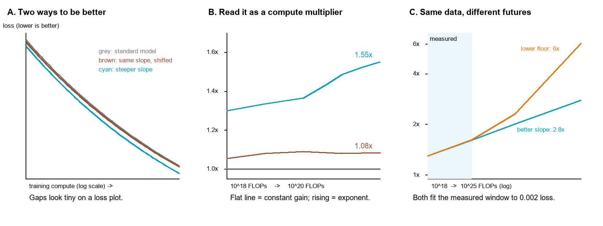
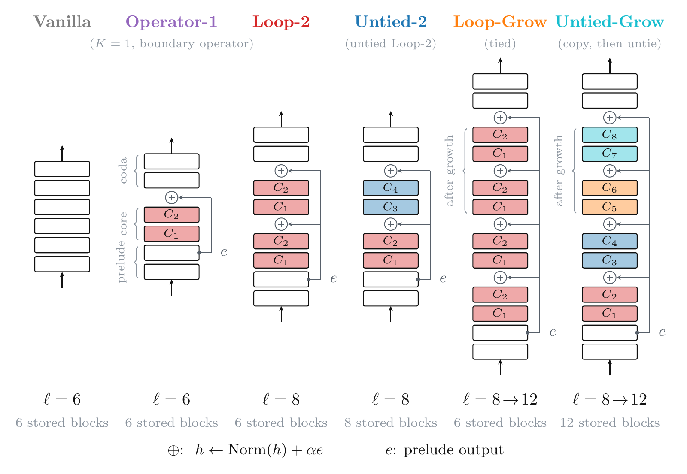
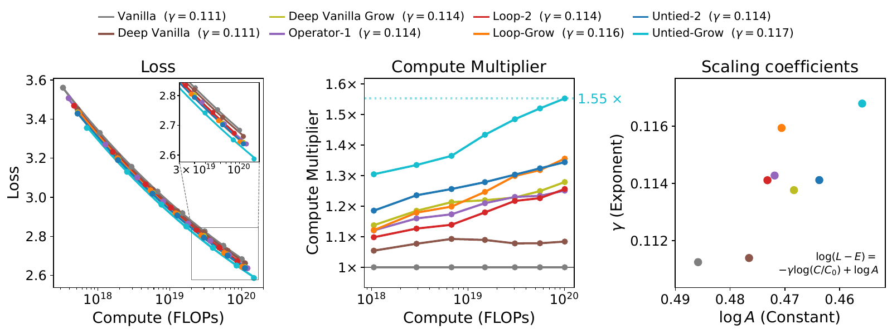
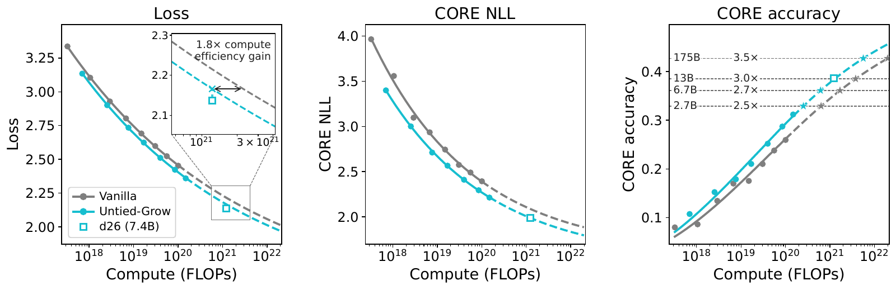
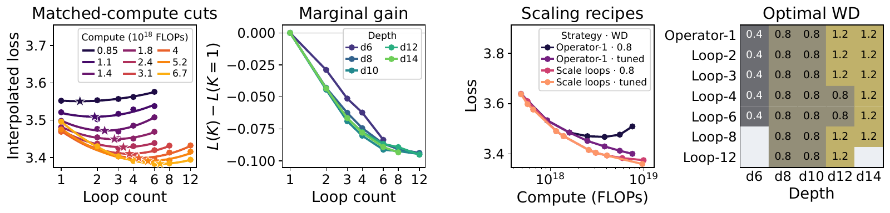
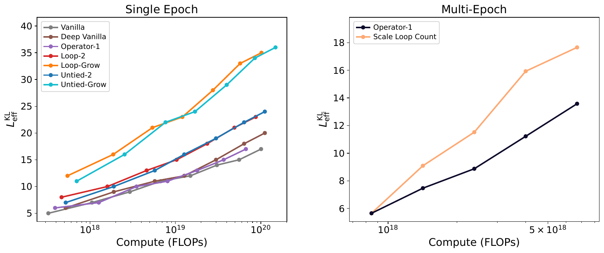

v3.16
Analyzing | Framework v3.16 | adversarial posture (unreviewed preprint)

# Deeper When It Counts: Can Model Growth and Looping Bend a Language-Model Scaling Law?

**Paper:** Zixi Chen, Akshay Vegesna, Samip Dahal, Andrew Gordon Wilson, "How Model Growth, Recursion, and Boundary Operators Influence Scaling Exponents," arXiv:2609.19107 (cs.LG), v2 of 17 Sep 2026 (v1 16 Sep 2026). New York University and Q Labs. Code: github.com/qlabs-eng/scaling-exponents. No journal reference.

> **Access Status** — Full paper: read in full from the local arXiv v2 PDF (44 pages, Appendices A–D included) · Abstract: from the PDF, checked against the arXiv abs page (v2 is the latest version; no journal-ref) · Supplementary material: none separate; comparison papers checked on their arXiv abs pages (version history plus a tool summary of the current abstract, not full texts): Prairie et al. arXiv:2604.12946 (v1, only version), Schwethelm et al. arXiv:2604.21106 (v3), Wang et al. arXiv:2609.01343 (v3), Du et al. arXiv:2405.15319 (v2), Geiping et al. arXiv:2502.05171 (v2), Liew & Kato arXiv:2510.06548 (v2) · Figures: all viewed; embeds are the authors' arXiv source files for paper Figs. 1, 3, 4, 5, 6 (the pipeline file `_fig2` is the paper's Fig. 1; the paper's Fig. 2 was not converted, so I viewed a crop of the page render and do not embed it, since Figs. 3 and 5 carry its data) · Analysis basis: full text.

## 1. Deeper When It Counts

**Hook:** A small team claims that two cheap changes to how a transformer stacks its layers — adding depth partway through training, and renormalizing the signal between repeated blocks — make the payoff from extra compute grow *faster*, not just start higher, which runs against a decade of "architecture only moves the constant" folklore.

## 2. Big-Picture Context

Language-model training runs on an empirical rule: loss falls as a power law in training compute. Two numbers describe the rule. One sets the height of the curve (how good the model is at a given budget); the other sets its slope (how fast it improves as budgets grow). Practitioners call them the constant and the exponent. Almost every published improvement — better data filtering, initializations, most architecture tweaks — has lowered the curve without steepening it. The difference matters: a constant gain saves the same fraction of compute at every scale, while a slope gain saves a fraction that keeps growing.

Exceptions exist — transformers beat recurrent networks on slope, mixture-of-experts advantages widen with scale — and recent work from the same research circle argued that a modern optimizer only shows its full advantage when its hyperparameters scale correctly with size. This paper applies that "tune it properly and look again" logic to architecture. It asks whether three depth-related changes — re-using a block of layers several times (looping), adding layers partway through training (growth), and a small normalize-and-reinject step between blocks (the boundary operator) — change the slope once each variant gets its own compute-optimal recipe.

Their answer is a qualified yes. On fresh web text, variants with growth or the boundary operator show a compute advantage over a standard transformer that widens across the two decades of compute measured; the best needs about one and a half times less compute at the top of the range. One larger model, trained beyond the fitted range, lands slightly better than forecast. And when training repeats a small dataset many times, the best number of loops rises with compute, because looping adds depth without adding stored weights that overfit.

**Paper Type & Stakes:** This is an empirical machine-learning scaling study — a family of controlled training ladders with per-architecture tuning, plus one extrapolation run — whose stake is whether cheap architectural changes can earn compute savings that compound with scale, which would change how frontier pre-training budgets get spent.

**Prior Belief Check:** The claim cuts against the mainstream working assumption, which the paper states fairly: architecture moves the constant, not the exponent. Experts will find the *direction* plausible rather than shocking — depth-stacking growth already sped training at one or two sizes, and the "curse of depth" literature already argued that deep transformers waste layers — but the claim that these fixes change the exponent, with a growth model's advantage widening from roughly 1.3 to 1.55 times, is new and will surprise people who treat slope as set by data and task. The exponent differences are small in absolute terms; reframing them as compute multipliers makes them look large. Calibrated reading: a credible, carefully controlled small-scale result, not yet a law at frontier scale.

**Replication & Convergence Note:** This is a single-group result (one lab, one training seed per ladder point) with no independent replication; nearby independent work is consistent in part — Schwethelm et al. (arXiv:2604.21106, v3) find tied recurrence worth less than fresh parameters at matched compute, matching this paper's finding that weight sharing alone does not steepen the slope, and Wang et al. (arXiv:2609.01343, v3) report compute savings for a looped mixture-of-experts design — but nobody has tested growth's slope claim. Confirmation would be a second lab training both a standard transformer and the growth variant, each separately tuned, to at least ten times this compute, with the multiplier still rising.

## 3. Necessary Background Crash-Course

### What a scaling law is, and the two ways to beat one

A scaling law here is a fitted curve of validation loss (how surprised the model is by held-out text, lower is better) against training compute, counted in floating-point operations (FLOPs). For each compute budget, there is a best way to split it between a bigger model and more training tokens; the curve traced by those best splits is the "compute-optimal frontier." The paper fits it with one equation, the only one this analysis needs:

$$L(C) = E + A\left(\frac{C}{C_0}\right)^{-\gamma}$$

**Symbol definitions:**
$L$ : validation loss of the best model you can train with this budget (nats per token)
$C$ : training compute (FLOPs)
$C_0$ : a reference compute where the standard model was tuned (a fixed unit, not fitted)
$E$ : the irreducible loss, the floor no model reaches (fitted once, on the standard transformer, and shared by all variants)
$A$ : the constant, which sets the height of the curve above the floor
$\gamma$ : the exponent, which sets how fast the gap above the floor shrinks as compute grows

**What this actually means:** the loss is a floor plus a reducible part that shrinks as a power of compute. Lowering the constant shifts the reducible part down by a fixed fraction — the same program on a faster clock. Raising the exponent makes it shrink faster with each doubling — a quadratic algorithm swapped for an n-log-n one. On a loss plot, both look like tiny gaps between nearly parallel curves.

The paper's key reading device is the **compute multiplier**: at a given loss, how many times more compute does the standard model need than the variant? A constant improvement gives a flat multiplier; an exponent improvement gives one that rises with scale. The picture below shows the conversion and previews a caveat from the Claim check.



*Analyst-built illustration (not from the paper):* (A) schematic loss curves for a standard model, a same-slope shifted variant, and a steeper variant, using laws shaped like the paper's; (B) the paper's measured multipliers for the "deeper but same recipe" control (flat) and the best growth variant (rising), read from Fig. 3; (C) two different laws that both fit the growth variant's measured window to within 0.002 loss — one with a better slope, one with the same slope but a lower floor — and how their multipliers diverge when extrapolated.
**What to look at:** panel B is the paper's headline in one glance (flat versus rising line); panel C shows that the rising line by itself does not tell you *why* it rises.

> **Concept:** Two independent ways a variant can beat a baseline on the compute-optimal frontier: a constant improvement (the same compute ratio at every scale) or an exponent improvement (a compute ratio that grows with scale). A third possibility, a lower irreducible floor with the same exponent, also produces a rising ratio; the paper rules it out by assumption, fitting one floor for all variants.

> **Vehicle:** Speeding up a program. A faster clock or a better compiler makes it a fixed factor quicker on every input size. A better algorithm (lower complexity class) makes the advantage grow with input size, without limit.

> **Analogy:** Constant improvement ↔ the faster clock. Exponent improvement ↔ the better complexity class. Compute multiplier ↔ the speedup ratio measured at each input size.

> **Breaks when:** you treat the exponent as exact. An algorithm's complexity class is a provable asymptotic fact; a scaling exponent is a slope fitted over two decades of compute, with an assumed floor, from single training runs. The vehicle has no slot for "a rising speedup that might really be a lower floor" or "a slope that bends beyond the measured range."

### Depth, the residual stream, and the curse of depth

A transformer is a stack of identical-looking blocks. Each block reads a running vector for every token (the **residual stream**), computes an update, and adds it back. In the common design, each block normalizes its *input* before working, but the running vector itself is never renormalized, so it keeps growing as blocks add to it. Late blocks then write updates that are a shrinking fraction of a large vector and barely change the model's prediction. Researchers call this the **curse of depth**: deep models carry layers that cost compute but do almost nothing.

One way to measure it is the logit lens: decode the residual stream after each block as if it were the final output, and find the block after which the decoded prediction stops changing much. The paper calls the count of blocks before that point the **KL effective depth** (named for the divergence measure used to compare predictions). It is a proxy for the quantity the authors actually care about, **computational depth** — the number of blocks that meaningfully shape the prediction.

> **Analogy:** The residual stream is a running total in a register that every pipeline stage adds its delta to. Once the total is large, a late stage's small delta barely moves it, so late stages burn cycles for little effect. The boundary operator rescales the register back to unit size before each pass and adds back a copy of the original input, so each stage's delta counts at full weight again and every stage still sees the request it is working on.

> **Breaks when:** you think of the register as holding one number. The residual stream is a high-dimensional vector, and a late block can change its *direction* in ways that matter even when its update is small; the curse is a statistical tendency measured by proxies like the logit lens, not a hard arithmetic limit.

### Looping, untying, and growth

A **looped** transformer applies the same core block of layers several times in one forward pass, sharing its weights across passes — the same code called in a loop. An **untied** model executes the same number of passes but gives each pass its own copy of the weights — the loop unrolled with specialized code in each iteration. Untying costs memory but not arithmetic, so a looped and an untied model with the same pass count do identical compute per token. **Model growth** starts training with fewer passes and switches to more partway through: in the tied version the same core simply runs more times; in the untied version the trained core is copied and the copies then train separately.

> **Analogy:** Growth is tiered compilation: run a cheap version first and promote to a heavier one only once the workload has shown it needs it. Early in training a network is learning simple patterns that a shallow model handles fine, so paying for full depth from step one wastes compute.

> **Breaks when:** you assume the promoted version runs the same "program." Copying the core gives the deeper model a sensible starting point, but the copies then diverge and learn different functions; growth changes what the network becomes, not just how fast it gets there.

### Origins and big picture: how scaling laws, looping, and growth came to be

The scaling-law program began with Kaplan and colleagues at OpenAI in 2020, who showed that language-model loss follows smooth power laws in model size, data, and compute over many orders of magnitude. Their recipe favored very large models trained on relatively little data. In 2022 the "Chinchilla" study from DeepMind re-fit the laws with better-tuned learning-rate schedules and found that model size and data should grow together, at roughly a fixed number of training tokens per parameter. That correction carries a lesson this paper leans on: a badly tuned recipe does not just make every model a bit worse, it bends the measured curve, so scaling conclusions depend on getting the recipe right at every size. The lesson resurfaced with optimizers, which looked marginal until their hyperparameters were scaled properly.

The received view settled on a division of labor: data and task set the exponent; architecture and training tricks set the constant. The move from recurrent networks to transformers, and mixture-of-experts models, were rare enough to count as exceptions.

Looping has a separate lineage. The Universal Transformer proposed re-applying one block repeatedly as a bias toward step-by-step computation. Recent work revived it to spend extra passes at inference time — "thinking longer" without emitting more tokens (Geiping et al.) — and to build small recursive reasoning models that punch above their size on puzzles. Those studies cast looping as a way to save parameters or buy test-time accuracy, not to train more efficiently for a fixed budget. Independent compute-matched studies this year mostly found that sharing weights across passes costs loss when compute, not parameter count, is the binding constraint.

Model growth comes from the economics of training ladders. Labs train many sizes, each from scratch, so the compute spent on the smaller ones is thrown away. Net2Net showed how to initialize a bigger network from a smaller one, and Du et al. found that stacking copies of trained blocks partway through training reached the same loss with markedly less compute at a few target sizes. Liew and Kato found the benefit shrinks the longer the base model was pretrained, hinting that *when* to grow matters.

This paper joins the three threads. It treats growth not as recycling but as putting depth where the network can use it, treats looping as a cheap way to grow, and re-asks the exponent question with the Chinchilla-era lesson applied: tune every variant separately, then compare frontiers. The pressure behind it is the data wall — high-quality text grows far more slowly than compute, so labs will increasingly repeat data and look to architecture for gains.

### How the study fits together

*Analyst-built concept diagram (not from the paper):*

```
 One prelude-core-coda transformer family
   |
   +--> axis 1: boundary operator on/off  (same params, same FLOPs)
   +--> axis 2: core weights shared vs untied (same FLOPs)
   +--> axis 3: fixed passes vs grow 2 -> 4 passes mid-training
   |
   v
 Per-architecture recipe: base tuning, tokens/param,
 growth timing, learning-rate rule
   |
   v
 Compute-optimal ladders, ~1e18 -> 1e20 FLOPs, fresh web text
   |
   +--> fit floor (standard model only) + slope per family
   +--> compute multiplier vs standard model: flat or rising?
   |
   v
 Checks: one 7.4B run at 8x compute | downstream benchmark
         | multi-epoch repeated-data regime | logit-lens depth
```

Read it top to bottom: one network family, three switches each isolated by a matched pair, a separate recipe per variant, then the multiplier test and the checks.

> **Central analogy for this paper:** Constant-factor speedup versus better algorithmic complexity.

## 4. Core Technical Explanation

### Step 1 — Build one family so each change is isolated

**The failure it prevents:** comparing architectures that differ in several ways at once, so a slope difference cannot be pinned on any one change.

**What the authors do:** every model is the same three-stage network: a few "prelude" blocks embed the input, a "core" of blocks runs some number of times, and a few "coda" blocks produce the output. Three switches are each isolated by a pair matched in parameters or arithmetic. The standard transformer (Vanilla) versus the same model with the boundary operator isolates the operator. A two-pass looped model versus its untied twin isolates weight sharing. Each of those versus its growth version, which doubles the core passes mid-training, isolates growth. Deeper plain controls, with and without growth, separate "more depth" from "the operator."

**What it buys:** a difference in slope between a matched pair can be attributed to one switch.



*Figure 1 (from the paper): six variants at the smallest size; red and blue boxes are core passes, the circled plus is the boundary operator (normalize the stream, add back the prelude output), and braces mark passes switched on at growth.*
**What to look at:** the tied variants store the same blocks as the standard model while executing more, whereas the untied ones store a separate copy for every pass.

### Step 2 — Give every architecture its own compute-optimal recipe

**The failure it prevents:** a mistuned baseline or variant whose bad recipe bends its curve and fakes (or hides) an exponent difference.

**What the authors do:** they run the same four-stage procedure for each family. They tune all base hyperparameters at a small size, one at a time over two rounds; fit the best tokens-per-parameter ratio at several budgets (it stays constant with scale, as in the Chinchilla study, slightly higher for looped and grown models); pick when to grow (somewhere between halfway and four-fifths of the way through training); and fit a rule for shrinking the learning rate as models grow. They also show the stakes: giving the boundary-operator model the standard model's recipe erases its exponent gain and leaves only a constant one.

**What it buys:** they can argue that the remaining differences reflect architecture, not tuning. Their robustness check — adding scaling rules for two more hyperparameters changes the multiplier by at most about 3% — supports this, though only on the standard model.

### Step 3 — Fit the ladders and read the multipliers

**The failure it prevents:** reading slope differences off nearly parallel loss curves, where the eye cannot separate a better constant from a better exponent.

**What the authors do:** they train each family's ladder from roughly a hundred million to under two billion stored parameters, spanning two decades of compute. They fit the floor once, on the standard model, then fit each family's constant and slope with that shared floor. Separately, without any fit, they interpolate how much compute each variant needs to match the standard model's loss at each budget.

**What it buys:** the multiplier panel makes the slope story visible, and the fitted exponents give it a number.



*Figure 3 (from the paper): left, loss against compute for eight compute-optimal ladders; middle, compute multiplier over the standard model; right, each family's fitted exponent (up is steeper) against its constant (right is better).*
**What to look at:** the middle panel — the deeper plain control stays flat, the boundary-operator and two-pass models rise gently, and the untied growth model (cyan) rises fastest to the dotted line at the top of the measured range.

Four results come out, each from a matched pair:

- **The boundary operator raises the slope.** Matched in parameters and arithmetic, the operator model's advantage rises from about 1.12 to 1.25 times across the ladder, and the operator does the same for a deeper plain model. Normalizing alone, injecting alone, or skipping the injection before the final blocks each recover only part of the gain.
- **Growth raises the slope.** The untied growth model differs from its fixed two-pass twin only by doubling passes mid-training, and its edge over that twin widens. Growth without the operator shifts things similarly, so the two gains add.
- **Untying moves only the constant.** Untied models sit a near-fixed factor above their tied twins, so sharing weights costs a fixed fraction of compute but keeps growth's slope gain.
- **A deeper, narrower shape moves only the constant.** The deeper plain control sits a flat few percent above the standard model, so "more layers" alone does not change the slope.

| Variant (paper name) | What changes vs. standard | Multiplier at the top of the ladder | Type of gain |
|---|---|---|---|
| Deeper plain control (Deep Vanilla) | narrower, deeper shape | about 1.08× | constant |
| Boundary operator (Operator-1) | normalize-and-reinject only | 1.25× | exponent |
| Looped, two passes (Loop-2) | operator + shared core run twice | about 1.25× | exponent (from operator) |
| Untied, two passes (Untied-2) | operator + two separate cores | 1.34× | exponent + constant |
| Tied growth (Loop-Grow) | two → four passes, shared core | about 1.35× | exponent |
| Untied growth (Untied-Grow) | two → four passes, copied cores | 1.55× | exponent + constant |

*Table (from the paper's Fig. 3 and its Section 4): multipliers over the standard model at the largest common budget, the top of the ladder.*
**What to look at:** the rows that say "exponent" are the ones whose multiplier *rose* across the ladder; the last column is the paper's classification, which rests on the shared-floor fit.

The fitted exponents differ by about one part in twenty between the standard and best variant. That sounds trivial, but compounded over many decades of compute it becomes the widening multiplier.

### Step 4 — Test the law outside its fitted range

**The failure it prevents:** a slope fitted over two decades that bends or flattens just past the measured range.

**What the authors do:** they rerun the standard and untied-growth ladders on the educational subset of the same web corpus, fit laws there, then train one held-out untied-growth model of 7.4 billion parameters at about eight times the largest fitted compute. They also forecast downstream performance on CORE, a suite of 22 standard benchmark tasks scored above chance, through a per-task chain from compute to answer likelihood to accuracy.

**What it buys:** a genuine out-of-sample check on the growth model's own law. The run lands slightly *below* its forecast loss, and its benchmark score lands within a hair of its forecast.



*Figure 4 (from the paper): left, validation loss with fits (solid) and extrapolations (dashed), square marking the held-out 7.4B run; middle, benchmark answer likelihood; right, benchmark accuracy with GPT-3 reference levels.*
**What to look at:** in the left inset the square sits below the cyan dashed forecast, and the arrow marks the forecast gap to the grey (standard-model) dashed line — a gap between two *extrapolations*, since no standard model was trained at that budget.

The held-out run scores about the same on CORE as an external estimate for the 13-billion-parameter GPT-3 model, which used roughly twenty times more compute. The authors call this indicative only: different training data, a different evaluation pipeline, and a five-year-old baseline.

Using the fitted laws, they project the growth model's advantage at about 1.8 times at the held-out run's budget, widening to 2.7 times at a frontier-scale budget.

### Step 5 — Change the regime: repeated data

**The failure it prevents:** conclusions drawn only on endless fresh data, when real pre-training increasingly repeats data and overfits.

**What the authors do:** they fix a pool of 100 million unique tokens, train every model for ten passes over it, and grid over model size and loop count (one to twelve passes) with the boundary-operator family, sweeping weight decay (the standard brake on overfitting).

**What it buys:** a clean contrast. Every fixed-loop ladder eventually overfits and turns upward, but more loops push the turn later, so the best loop count climbs from about one to about seven across the budgets. Spending extra compute on loops beats spending it on a bigger model, even with weight decay retuned at every size, by about 2.2 times in compute. An untied control with the same depth but more weights does not win, so weight sharing, not depth alone, helps here.



*Figure 5 (from the paper): first, interpolated loss against loop count at fixed compute, stars marking optima that shift right as compute grows; second, gain from looping at fixed depth; third, scaling loops versus scaling model size; fourth, best weight decay by depth and loop count.*
**What to look at:** the stars marching right in the first panel, and the near-constant columns in the fourth — the best brake setting tracks stored weights, not executed passes.

### Step 6 — Interpret through computational depth

**The failure it prevents:** a list of empirical wins with no account of why they change the slope rather than the height.

**What the authors do:** they propose that compute spent on depth is wasted in two ways — blocks that run but do not change the prediction (the curse of depth), and blocks paid for from step one that the network only needs late in training — and that both wastes grow with scale because compute-optimal models get deeper. The boundary operator attacks the first; growth attacks the second. They measure KL effective depth along the ladders as evidence.

**What it buys:** a testable story. Growth models reach roughly twice the standard model's effective depth at the top of the ladder; the untied two-pass model beats a deeper plain model that executes the same blocks; and making models wider without deeper turns the operator's slope gain into a constant one, as the story predicts.



*Figure 6 (from the paper): logit-lens effective depth against compute for single-pass ladders (left) and for repeated-data runs (right).*
**What to look at:** the three bands on the left — one-pass models lowest, two-pass in the middle, growth models highest — and how tied and untied curves coincide, so weight sharing does not change effective depth.

### Claim check

Checks ran in Python (`claimcheck.py` in the work directory) on numbers quoted in the paper or read off its figures; the explainer picture comes from `explainer.py`.

**Exponents versus measured multipliers — Partly reproduced.** If both laws share a floor, the exponent pair the paper reports implies the best variant's multiplier should grow by about a quarter across the ladder; the measured, fit-free multipliers grow by about a fifth. Direction and rough size agree, but the fit-free data imply an exponent gap about a fifth smaller than the fitted one. The qualitative conclusion stands; the quoted exponents slightly overstate it.

**Extrapolated advantage — Reproduced (arithmetic).** From the educational-corpus exponents, a shared floor, and the measured advantage at the ladder's top, the projected advantage is 1.8 times at the held-out run's budget and 2.7 times at a frontier budget, matching the paper. With the slightly smaller gap implied by the measured multipliers, the frontier figure drops to about 2.4 times.

**Bookkeeping — Reproduced.** The largest model's parameter counts (about 5 billion before growth, 7.4 billion after), its compute (within about 6% of the quoted value by a simple count), small-model parameter counts, and GPT-3 13B's compute (about nineteen times the held-out run's) all check out.

**Sensitivity — the shared floor.** The exponent numbers depend on a floor fitted on the standard model alone and imposed on every variant. Re-fitting synthetic curves shaped like the paper's with any shared floor across a wide plausible range keeps the best variant steeper, with the gap moving by up to about a factor of two either way. So the *sign* survives any shared floor. The *label* does not: a law with the standard model's slope and a slightly lower floor fits the growth variant's measured window to within about 0.002 loss — about the size of the paper's own run-to-run noise and tuning-adoption threshold. Over two decades, "better exponent" and "lower floor" cannot be told apart from these data. Both predict a widening advantage, so the practical claim holds; they diverge sharply in extrapolation (the explainer's panel C).

**Robustness (computational study: out-of-sample extrapolation).** The held-out run is the one test beyond the fitted range. It landed 0.03 loss below its own forecast. Using the paper's educational-corpus slope and floor, that miss is worth roughly one and a half times in compute — about two-thirds of the forecast gap between growth and standard models at that budget. The miss favors the paper, but it shows the extrapolation is not precise enough to *validate* an exponent difference of this size, and no standard-model control was trained at that budget.

**Internal consistency — two significant findings.**
1. *The headline "20 times less compute than GPT-3" mixes in much more than architecture* (abstract and Section 4.3 versus Appendix C.1 and Fig. 18b). The architecture accounts for about 1.8 times at that budget; switching to the educational corpus alone is worth about 1.5–1.6 times at matched accuracy; the rest comes from five years of data, optimizer, and recipe progress. The paper's body says the comparison is indicative, but the abstract places it next to the architecture claim, where readers will credit the architecture.
2. *The validation run is a one-sided test* (Section 4.3, Fig. 4). The "1.8 times" at 7.4B compares two extrapolated curves; only the growth model was actually trained there, and its forecast error is comparable to the claimed advantage (above).

Minor, one line: Appendix B.5 says the optimizer "may not be as effective as Adam for deeper networks," although its own Fig. 16f shows it ahead at every scale (only the margin shrinks); and Table 2's caption ("allocates all four cores from the start") reads differently from the text's "starts at 5B."

### Assumption audit

> **Watch:** Reader likely assumes the held-out model's "twenty times less compute than GPT-3" measures the architecture's advantage. The paper actually shows an architecture advantage of about 1.8 times at that budget — itself a ratio of two extrapolations — while better data and a modern training stack supply most of the rest, against an externally estimated GPT-3 score the authors call indicative. Read it as "a modern recipe is very efficient," not as a growth-model result.

> **Watch:** Reader likely assumes "changes the scaling exponent" means a measured change in the asymptotic law. The paper actually measures a slope over two decades of compute, with the irreducible floor fitted only on the standard model and shared. The robust, fit-free fact is the rising compute multiplier; whether it reflects a steeper slope, a lower floor, or a slope that later converges back cannot be settled from this range. The quoted tiny fit error holds the floor fixed and ignores seed-to-seed noise.

> **Watch:** Reader likely assumes looping itself is the efficiency trick, since the abstract anchors on looped transformers. The paper actually finds that on fresh data, sharing weights never improves the slope and costs a fixed factor: the slope gains come from the boundary operator and from growth. Looping matters in two narrower ways: it lets growth happen without adding weights, and it wins outright only in the repeated-data regime, where stored weights are what overfit.

> **Watch:** Reader likely assumes KL effective depth measures how much computation the network uses. The paper actually treats it as a proxy: it only records where the decoded prediction settles within a threshold, and it misses unused blocks in the middle. The computational-depth story is offered as a hypothesis consistent with the measurements, not a demonstrated mechanism.

## 5. What's Genuinely New or Clever

The cleverest move is methodological: **matched-pair ladders with per-architecture compute-optimal recipes, read through compute multipliers instead of loss curves.** Earlier growth and looping studies reported gains at one or two target sizes, or compared looped and standard models with one shared recipe. Here each of three switches is isolated by a pair matched in parameters or arithmetic, and each family gets its own recipe through the same four-stage procedure. That lets the paper show something earlier work could not: untying and deeper shapes produce flat multipliers, while growth and the boundary operator produce rising ones. They also demonstrate the failure mode they are guarding against — an inherited recipe turns an exponent gain into a constant one — which is a useful warning for anyone running architecture comparisons. New to the field, not just to the reader.

The second insight is **reframing growth as depth scheduling rather than checkpoint recycling.** Model growth was justified by reusing the compute spent on smaller models. The authors set that aside and argue that a fixed-depth model pays for depth it cannot use early in training, a waste that grows with model depth and therefore with budget. Tied looping turns this into a parameter-free schedule: run the same core more times later. Paired with the repeated-data finding that the best loop count rises with compute while the best weight decay tracks stored weights, it gives a coherent picture in which "depth you execute" and "weights you store" are separate budgets that the compute-optimal recipe should set separately.

**Predictive Content Check:**

1. **Falsifiable handle:** The paper makes forward predictions that could come out wrong. First, a properly tuned standard transformer trained at the held-out run's budget (about 10^21 FLOPs on the educational corpus) should need about 1.8 times the growth model's compute to match its loss; a gap stuck at the ladder-top value (about 1.6 times) or shrinking would sink the exponent claim. Second, the advantage should keep widening toward about 2.7 times at a frontier budget. Third, in repeated-data training the best loop count should keep rising beyond seven passes. Fourth, the mechanism predicts that widening without deepening turns slope gains into constant gains, and that staged growth (two, then four, then six passes) steepens the slope further. These are real predictions, not relabels; the first has simply not been run yet.
2. **Formalism load:** Skipped — the paper's math is plain curve-fitting doing its job.

## 6. Limitations & Open Questions

> **The rising multiplier cannot distinguish a steeper exponent from a lower floor over the measured range.** A same-slope, lower-floor law fits the best variant's ladder to within the paper's own noise level, and the two readings diverge widely in extrapolation. **(B) Contested** — the shared floor is standard practice in Chinchilla-style fits, but floors are poorly constrained, and many would insist a slope claim needs per-family floors or a wider compute range. **(analyst inference — from refitting synthetic curves built from the paper's quoted exponents and figure-read losses)**

> **Only two decades of compute, ending near 10^20 FLOPs, roughly five orders of magnitude below frontier runs.** **(A) Consensus** — the paper itself notes that small-scale gains can fade, and nobody disputes that a two-decade slope is a weak basis for a frontier forecast. **(paper §2, §4.3; broader literature)**

> **The validation run checks only the growth model's own law; no standard model was trained at that budget, and the forecast miss is comparable in compute terms to the claimed advantage.** **(B) Contested** — the authors read "landed slightly below" as success (it does favor them); a strict reader wants the matched control and a forecast tighter than the effect. **(analyst inference — from Fig. 4 and the paper's educational-corpus slope; paper §4.3 states the design)**

> **Single seed per ladder point; residual recipe drift remains.** The paper's drift table shows statistically significant leftover drifts in the standard model's tuned recipe (for example the residual multiplier), and learning-rate exponents are set to one decimal place. Each drift costs a small fraction of the architecture gap at the swept sizes, but nothing shows it stays small at the top of the ladder, where a slightly mistuned baseline would flatter the variants. **(C) Speculative** — the authors' robustness check argues against a large effect, and I am flagging a risk, not showing one. **(analyst inference, from paper Table 8 and Fig. 16a)**

> **Slope shifts of this size also come from things that make models worse.** In the appendix, the older optimizer shows a slightly *steeper* fitted slope than the newer one while being worse at every scale, and untuned constant recipes produce far larger slope differences. A small slope difference alone is weak evidence of a structural win; the paper's case rests on variants being better *and* steeper. **(B) Contested** — the authors use this to motivate careful tuning; sceptics read it as evidence that slopes this fine are fragile. **(paper App. B.2, B.5, Figs. 15c, 16f)**

> **Fixed batch size, tokenizer, context length, and hardware; no joint batch-size scaling.** **(A) Consensus** — the paper states this scope limit, and batch size is known to interact with compute-optimal recipes. **(paper App. C.5)**

> **The computational-depth explanation rests on a proxy that misses mid-network waste.** **(B) Contested** — the logit lens is widely used, but how well it tracks useful computation is debated; the paper calls it a proxy. **(paper §6)**

> **Downstream evidence is noisier than the loss evidence.** Benchmark-matched multipliers jump between checkpoints, and the forecast uses a filtered task subset plus fitted conversion curves. **(A) Consensus** — the paper says so and calls the filtered score a post-hoc sensitivity analysis. **(paper App. C.3–C.5)**

> **Open questions for the next 12–24 months:** Does the multiplier keep rising when an independent lab trains both models with tuned recipes at ten to a hundred times this compute? Do staged growth schedules keep steepening the slope? Does growing context length, expert count, or width work the same way, as the authors suggest? How does the boundary operator interact with optimizer choice at depth? **(analyst inference, partly from paper §7)**

## 7. Detailed Summary & Explanation

The paper asks whether an architecture change can steepen a language model's compute scaling curve, not just lower it. The authors put every model into one three-stage family — a few input blocks, a core that can run several times, a few output blocks — and isolate three switches: a normalize-and-reinject step between core passes (the boundary operator), shared versus copied core weights, and doubling the core passes partway through training (growth). Each family gets its own tuned recipe, because inheriting the standard model's recipe can hide a slope gain.

On fresh web text across two decades of compute, the boundary operator and growth each make the compute advantage over a standard transformer *widen* with scale, while sharing weights or making the model deeper and narrower only shift it by a fixed factor. The best variant — untied growth plus the operator — needs about one and a half times less compute than the standard model at the top of the range. One larger growth model, trained well beyond the fitted range, lands slightly better than its forecast and matches an external estimate of a GPT-3 model's benchmark score with a small fraction of its compute, though better data and modern training supply most of that ratio. When training repeats a small dataset, looping wins outright: the best loop count rises with compute, because extra passes add depth without adding stored weights that overfit. The authors explain all of this as recovering wasted depth.

The analysis frames the result as "constant-factor speedup versus better algorithmic complexity" because that distinction is the paper's whole claim, and because it exposes the caveat. The rising multiplier is the solid, model-free observation. Calling it an exponent change assumes a shared floor, and over this range a lower floor fits just as well; the one extrapolation run favors the paper but misses its forecast by about as much as the claimed advantage, with no matched control. Take away a credible, carefully controlled demonstration of widening gains at small scale, and treat the frontier-scale projection as a hypothesis awaiting a larger, independent test.

**Where I'm least confident in this analysis:** the floor-versus-exponent sensitivity test uses synthetic curves built from the paper's quoted exponents and losses I read off the figures, not the authors' run data, so the exact "fits within 0.002 loss" and "worth about one and a half times in compute" figures could shift by tens of percent; the qualitative degeneracy is robust, its size is not. I also relied on tool summaries of the comparison papers' arXiv abstract pages, not their full texts, so my placement of this result against Schwethelm et al. and Wang et al. is abstract-level only.

**Revision notes:** referee pass converted the GPT-3 comparison into a reported significant finding, added the one-sided-validation finding and its compute-equivalent size, moved model-name digits out of prose, cut a second equation, and added the optimizer-slope caveat from Appendix B.5 to Section 6.

## 8. Three Crystallized Takeaways

1. **Some architecture changes may give gains that grow with scale, not just a fixed head start:** adding depth partway through training and renormalizing between repeated blocks made a transformer's compute advantage widen across the range tested, while sharing weights or simply going deeper did not.
2. **"Grow depth when the network can use it" is the core idea:** a model trained at full depth from step one pays for layers it is not ready to use, and that waste grows as models get deeper — so scheduling depth, like scheduling compute, is part of the recipe.
3. **The evidence is solid at small scale and a forecast beyond it:** the widening gap is real over two decades of compute, but whether it is a true slope change or a lower floor, and whether it reaches the projected near-threefold savings at frontier scale, still needs a larger, independent test against a properly tuned standard model.

## 9. Shorter Summary

Language models improve predictably as training compute grows, following a power law with two knobs: one sets how good a model is at a given budget, the other how fast it improves as budgets grow. Conventional wisdom says architecture tweaks only turn the first knob. This preprint from New York University and Q Labs argues that some can turn the second.

The authors build one family of transformers in which a core block of layers can run several times, then test three changes one at a time: a small step that renormalizes the signal and re-adds the input between passes, sharing versus copying the core's weights, and doubling the number of passes partway through training ("growth"). Each variant gets its own tuned recipe. Across a hundredfold range of compute, the renormalizing step and growth both make the advantage over a standard transformer widen with scale; the best version needs about one and a half times less compute at the top of the range. Sharing weights only costs a fixed factor. One larger 7.4-billion-parameter growth model, trained at eight times the biggest tested budget, lands slightly better than predicted. When training repeats a small dataset, running the shared core more often beats making the model bigger, because extra passes add depth without adding weights that memorize.

The authors explain this as using depth better: deep transformers waste late layers, and full depth early in training is paid for before it is useful.

Caveats matter. The study covers only small budgets, roughly a hundred thousand times below frontier runs, with one training run per point. The widening gap could reflect a lower loss floor rather than a steeper slope, and the two readings predict very different futures. The single large validation run had no matching standard-model run, and the headline "twenty times less compute than GPT-3" mostly reflects better data and modern training. It is a careful, promising result that a larger independent test should check.

---
*Analyzer: Claude (headless Claude Code run) · 2026-10-09 · Framework v3.16 · posture: adversarial (unreviewed preprint, no journal reference) · Claim-check scripts: `claimcheck.py`, `explainer.py` in the run's work directory.*
