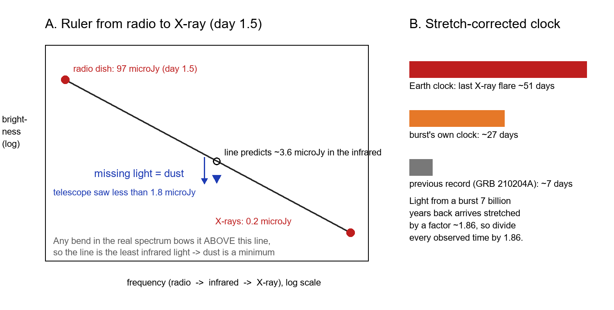
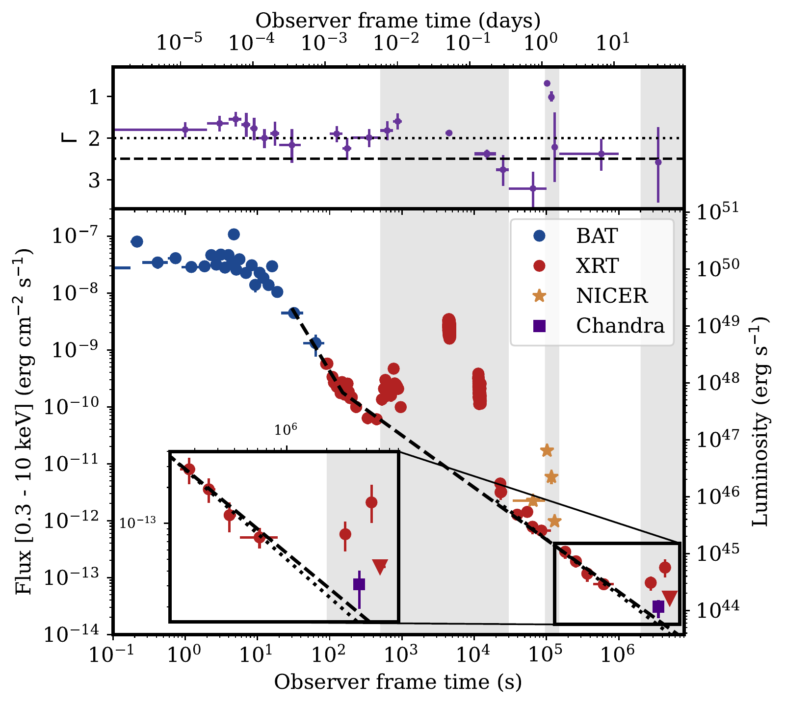
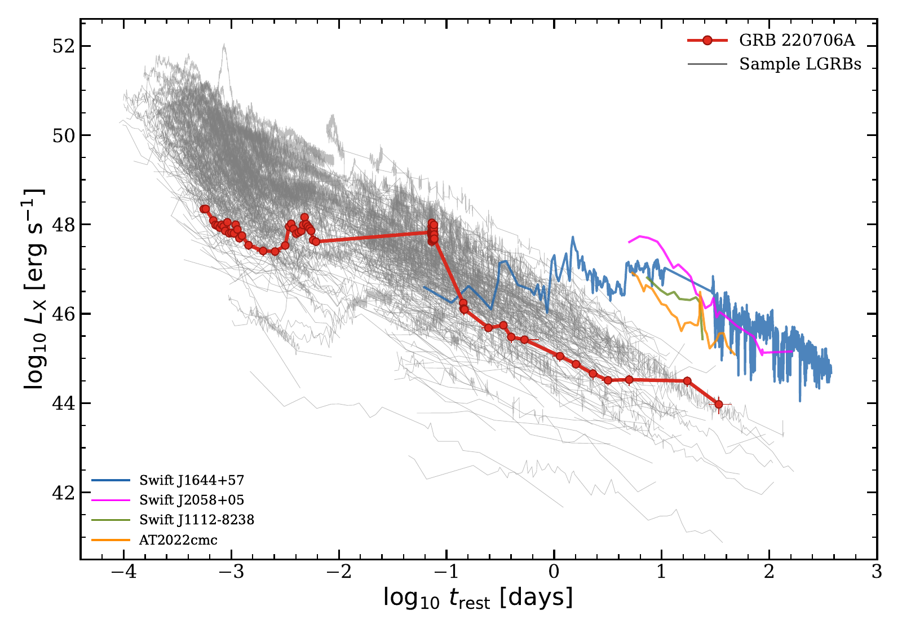
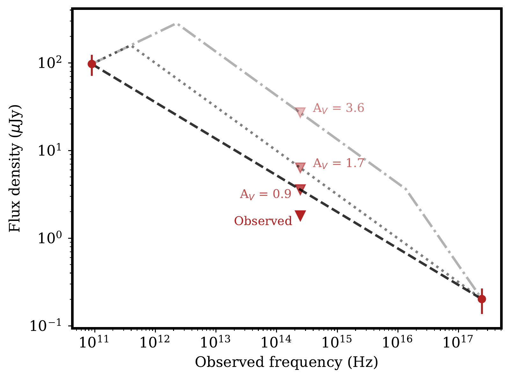
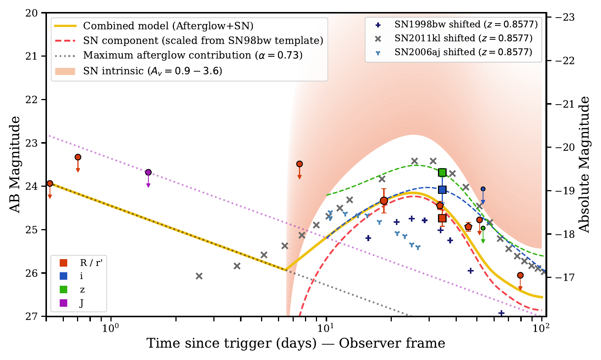

v3.16
Analyzing | Framework v3.16 | adversarial posture (unreviewed arXiv preprint)

> **Access Status** — Full paper: local arXiv v1 PDF (36 pages; v1 is the only version on the abs page, checked 2026-10-09), read in full, including Methods, Extended Data Table 1, Appendix B (Supplementary Tables 1–3, Supplementary Figure B1) and references · Abstract: from the PDF and the arXiv abs page · Supplementary material: bundled in the PDF as Appendix B · Figures: all six viewed as files rendered from the arXiv source and checked against the PDF captions; Figs. 2–5 embedded, plus one analyst-built explainer · Prior work, checked on arXiv abs pages (current abstracts, read as fetch-tool summaries, not full papers): Kumar et al., GRB 210204A (arXiv:2204.07587 v1, only version; MNRAS 513, 2777); Greiner et al., SN 2011kl (arXiv:1509.03279 v1, only version; Nature 523, 189); Zhang et al., burst durations (arXiv:1310.2540 v2, latest; ApJ 787, 66); Levan et al., GRB 250702B (arXiv:2507.14286 v1, only version); Villar et al., star–compact-object mergers (arXiv:2607.07819 v1, only version) · Analysis basis: full text · Posture: no journal reference, so adversarial.

## 1. Punchy Title & One-Sentence Hook

**A Dead Star's Engine That Kept Coughing for a Month**

A gamma-ray burst whose light left its galaxy about seven billion years ago seems to have kept its central engine sputtering out X-ray flares for nearly four weeks of its own time, three to four times longer than any burst before it, and it may have left behind an unusually bright supernova; but both headline claims rest on a handful of faint data points that deserve a hard look.

## 2. Big-Picture Context

Long gamma-ray bursts are the brightest explosions in the universe, and for two decades the field has had a working story: a massive, fast-spinning star stripped of its hydrogen collapses, its core forms a black hole or an ultra-magnetized spinning neutron star, and that "central engine" launches a jet through the star at nearly light speed. The engine runs only while it has fuel, which for the compact stars usually blamed means minutes. The jet's crash into surrounding gas makes a fading "afterglow" for days to months, and a supernova usually appears about two weeks later.

A small group of "ultra-long" bursts does not fit this tidy picture. Their emission lasts hours rather than minutes, which a compact stripped star cannot easily feed. Astronomers have argued for over a decade about whether these bursts come from a different kind of star (a puffy supergiant, a star swollen by violent pulsations) or are just the long tail of normal bursts; Zhang and colleagues found the evidence for a separate population inconclusive once selection effects were included. The best-studied example, GRB 111209A, came with an unusually bright supernova, SN 2011kl, which Greiner and colleagues argued was powered by a magnetar. The day-long repeating burst GRB 250702B (Levan and colleagues) reopened the debate, with several groups proposing that a black hole tore a star apart.

This paper adds GRB 220706A. In gamma rays it looked ordinary. In X-rays it kept flaring: a bright flare about an hour in, another after more than a day (caught by NICER on the space station), and, the headline, two late Swift detections at roughly one and one-and-a-half months that sit above the expected fading afterglow. Corrected for cosmic time stretching, the last flare came about 27 days after the burst in its own frame. The team also found a faint optical transient weeks later and argued, after correcting for heavy dust, that it is a supernova at least as bright as SN 2011kl and possibly "superluminous".

**Paper Type & Stakes:** this is an observational, single-event discovery paper in high-energy astrophysics, combining X-ray, optical, infrared and radio follow-up of one burst. The stakes are whether some burst engines really run for weeks, which would rule out the standard compact progenitor for this event and narrow the options to very extended stars, magnetars, or interaction with surrounding material.

**Prior Belief Check:** the claim complicates rather than contradicts the consensus. Experts accept that X-ray flares mark continued engine activity and that ultra-long bursts are hard to power with compact stars, so the direction of the result is not shocking. What would surprise specialists is the time scale: flares at weeks in the rest frame have no precedent (the previous record, GRB 210204A, had optical flares at about a week, per Kumar and colleagues), and no standard engine model naturally produces them. The authors themselves partly defuse the surprise by noting that almost nobody observes bursts that late, so the record may say more about coverage than about the universe. The supernova claim is incremental: a bright supernova with an ultra-long burst echoes SN 2011kl, and the "superluminous" label depends heavily on an uncertain dust correction.

**Replication & Convergence Note:** this is a single-team analysis of a single event with no independent confirmation; the Swift data are public, so an independent re-reduction of the two late Swift detections (and a second ultra-long burst followed in X-rays for weeks, ideally with an imaging telescope such as Chandra at each epoch) is what would turn "a month-long engine" from a ~4σ hint into a measurement, and a spectrum of the next such supernova would settle whether the optical bump is a supernova at all.

## 3. Necessary Background Crash-Course

### What makes a gamma-ray burst, and what is the "engine"?

When the iron core of a massive star runs out of fuel, it collapses in about a second into a black hole or a neutron star. If the star was spinning fast, the infalling gas cannot fall straight in; it piles up in a hot spinning disk around the new object. Feeding that disk, or tapping the spin of a newborn magnetar, powers twin jets that drill out through the star. The gamma rays come from inside the jet while the engine runs, so the gamma-ray duration is a rough readout of how long the engine stays on, and that in turn depends on how much of the star is still falling in.

**Analogy:** think of the engine as a CPU fed by a job queue: the star's infalling layers are the queue, and the jet output is the CPU load. The moment the queue empties, the load drops to zero.

**Breaks when:** you ask what refills the queue. A CPU's queue is filled by outside clients; a collapsing star's is fixed at collapse by the star's size and density. Engine duration is therefore a fingerprint of the star's size, which is why a month-long engine is a strong claim about the progenitor.

### Afterglow versus flares: the cooling curve and the spikes

The jet also slams into the surrounding gas and drives a shock that glows by synchrotron radiation (light from electrons spiralling in magnetic fields). That afterglow fades smoothly: on a log–log plot of brightness against time it is a straight line or a few joined straight lines, and its slope and color are tied together by simple rules, so an observer can check whether a stretch of light curve is "just afterglow".

X-ray flares are sudden brightenings on top of that line that rise and fall quickly compared with the time since the burst. A smooth shock cannot easily do that, so the standard reading is that the engine coughed again. Most flares end within about the first quarter-hour.

**Analogy:** the afterglow is a heatsink cooling after a heavy job: a smooth, predictable decay. A flare is a CPU spike on top of that cooling curve; if you see one, something is still running.

**Breaks when:** the spike could come from outside the processor. In a burst, the jet hitting a dense shell of gas thrown off by the star before it died can also brighten the afterglow, with no new engine activity. The paper's argument against this rests on how narrow the late flares are (Section 4).

### Measuring how long a burst lasts

The usual duration counts the time over which a gamma-ray detector collects the middle 90% of the photons, so a faint tail below the detector's sensitivity simply does not count. The authors instead use an "engine-duration" measure from earlier work: the last time the combined gamma-ray plus X-ray light curve shows the very steep drop that marks the engine switching off. It is computed automatically for hundreds of Swift bursts, so this one can be ranked against them.

**Analogy:** the gamma-ray duration is like timing a job by when its CPU usage drops below the profiler's sampling threshold; the engine-duration measure is like timing it by the last log line the process writes.

**Breaks when:** the process writes log lines long after the profiler stopped sampling. That is exactly this paper's situation; the automatic engine-duration measure for this burst is about 16 hours, and the month-long claim comes from late, hand-checked X-ray points that the automatic measure does not include.

### Cosmic time stretching

Light from a distant burst arrives stretched by the expansion of the universe. For this host galaxy, whose light set out about seven billion years ago, every interval is stretched by a factor of about 1.86, so the last flare's fifty-one Earth days become about four weeks for the burst itself (Panel B of the explainer below). The paper's "record" comparisons all use the burst's own clock, the only fair way to compare bursts at different distances.

**Analogy:** a video replayed at about half speed: every event takes longer on playback than when it was recorded.

**Breaks when:** you ask about brightness and color too; the stretch also shifts light to redder wavelengths, so the optical filter on Earth sees ultraviolet light from the source, which matters for the supernova estimate.

### Dark bursts and the dust ruler

Some afterglows are much fainter in visible light than their X-rays predict; these are "dark bursts", and dust in the host galaxy is the usual culprit, since it absorbs blue and ultraviolet light far more than X-rays or radio waves.

The authors put a floor on the dust with a neat trick. A synchrotron spectrum between radio and X-ray is a straight line on a log–log plot, or straight segments that get steeper toward high frequency. Draw a straight ruler from the radio detection to the simultaneous X-ray detection: any real bend bows the spectrum above that ruler, never below. The ruler therefore gives the least infrared light the afterglow could have had; if the telescope sees even less, the shortfall is dust, and it is a minimum.



*Analyst-built illustration (not from the paper):* Panel A draws the straight line between the paper's radio and X-ray points at day 1.5 and shows that the infrared upper limit falls below it; Panel B converts the Earth-frame flare time to the burst's frame and compares it with the previous record. **What to look at:** in Panel A, the gap between the circle on the line and the blue triangle is the minimum dust; in Panel B, the orange bar is the quantity the paper calls a month-long engine.

**Analogy:** you monitor a network link at both ends and know the loss profile can only be steeper at the far end. A straight-line interpolation between the two monitors gives the least traffic that should reach the middle router; if the middle router logs less, packets were dropped there.

**Breaks when:** dust does not just remove light; it removes blue light more than red light, so the amount you infer depends on an assumed "dust law" (how absorption varies with color). Different galaxies have different dust laws, and the paper assumes the Milky Way's.

### Supernovae that ride along with bursts

Most nearby long bursts show a broad-lined Type Ic supernova: the stripped star's debris, heated by radioactive nickel, peaks about two weeks after collapse and fades over a month or two. SN 1998bw, the first one found, is the standard template that astronomers scale up or down to fit. "Superluminous" supernovae are a rare class roughly ten times brighter, too bright for radioactivity alone and often blamed on a magnetar spinning down inside the debris.

**Analogy:** fitting the supernova is like fitting a known benchmark trace to a noisy production log: you take a reference workload profile, stretch or scale it, and ask whether the log follows it.

**Breaks when:** the log has only a handful of samples. With four or five optical detections, many different shapes fit, including shapes that are not supernovae at all, which the authors acknowledge.

### Origins & Big Picture: how does a star become an ultra-long burst?

Start with a star of a few tens of solar masses. It burns hydrogen for a few million years, then helium, then heavier elements in ever-faster stages, building an onion of shells around an iron core. For a normal long burst, three things must happen before the core collapses. The star must lose its hydrogen envelope, through winds or a companion stripping it, leaving a compact Wolf–Rayet star only a few times the Sun's radius that a jet can drill through. The core must keep a lot of spin, which favors stars poor in heavy elements, whose weaker winds carry away less angular momentum. And the collapse must leave enough spinning material to form a disk. Bursts turn up preferentially in small, star-forming, metal-poor galaxies, which fits.

For a compact Wolf–Rayet star, the outer layers fall onto the disk within minutes, so the engine shuts down within minutes. That matches the typical long burst. It cannot easily feed an engine for hours, let alone weeks. The time to empty the queue scales with the star's size: roughly, the free-fall time grows as the radius to the power of one and a half. A star a hundred times wider takes about a thousand times longer to fall in. That is why ultra-long bursts point toward much bigger stars.

Several candidate stars have been proposed. A blue supergiant that kept some hydrogen is tens to a hundred times the Sun's radius, enough for hours of fallback, but its envelope should choke the jet and leave hydrogen in the supernova. Very massive stars can undergo "pulsational pair instability": the core becomes unstable, flings off shells in repeated violent pulses, and leaves a hugely puffed-up envelope; such stars could make luminous supernovae and surround themselves with old shells for a jet to hit later. A newborn magnetar offers a different clock: it stores energy in its spin and leaks it out over days, whatever the star's size.

Two alternatives avoid a collapsing star. A star straying too close to a black hole can be torn apart by tides (a tidal disruption event); a few such events launch jets and shine in X-rays for months, and this burst sits at its galaxy's center, where a big black hole lives. Or a compact object can spiral into a companion star and merge, a picture Villar and colleagues recently proposed to link ultra-long bursts with luminous fast blue optical transients.

GRB 220706A tests these stories at a new point on the timeline. The paper uses its weeks-long X-ray activity to argue for a very extended progenitor or something exotic, and its supernova to argue for a collapsing star rather than a tidal disruption.

**Analogy:** progenitor size is like the depth of a pipeline: a short pipeline (compact star) drains in a few cycles after the input stops; a very deep pipeline (supergiant) keeps emitting results long after.

**Breaks when:** the pipeline has a separate reservoir. A magnetar is a flywheel, not a deeper pipeline; it can keep the output going regardless of the star's size, which is why the paper has to test magnetars separately.

```
Analyst-built concept diagram (not from the paper):

  Swift trigger (gamma rays ~1.5 min: looks ordinary)
        |
        v
  X-ray light curve:  afterglow line  +  flares on top
        |                                   |
        |                     flares at 1 hr, 1 day, ~1 and ~1.5 mo
        v                                   v
  afterglow slope/colour -> constant-density gas, electrons OK
        |                                   |
        |                   late flares ~2.8 sigma each above line
        v                                   v
  radio + X-ray ruler -> dust at least ~1 mag      "engine on at
        |                                          ~27 days (own
        v                                          clock)"
  optical bump at 2-7 weeks, scaled SN 1998bw fit       |
        |                                               v
        v                               free fall? magnetar? shells?
  dust-corrected peak: at least SN 2011kl-bright    tidal disruption?
                                                        |
                                                        v
                                   extended star most natural; all
                                   options strained
```

How to read it: the left column is the supernova chain (afterglow model, dust floor, scaled template) and the right column is the engine chain (late flares, then candidate power sources); both chains meet at the progenitor question.

> **Central analogy for this paper:** CPU spikes on a cooling heatsink curve.

## 4. Core Technical Explanation

### Step 1: Pin down where and how far

**The failure it prevents:** a late flare or optical bump means nothing if it belongs to the wrong galaxy. **What the authors do:** they locate the X-ray source with Chandra, the radio source with NOEMA and the Very Large Array, and the optical transient by subtracting deep host images taken years later. All coincide with a faint galaxy whose hydrogen and oxygen emission lines fix its distance; a galaxy just to the north lies much closer and is unrelated. **What it buys:** a firm distance and the stretch factor that converts every Earth time into the burst's own time.

### Step 2: Is this an ultra-long burst at all?

**The failure it prevents:** calling an event "ultra-long" from an ad hoc reading of one light curve. **What the authors do:** they run the automatic engine-duration measure on this burst and on about five hundred other Swift bursts with good data. GRB 220706A comes out eighth longest, ahead of the archetypes GRB 111209A and GRB 130925A, at about 16 hours on Earth's clock. **What it buys:** an objective placement in the ultra-long group, independent of the late flares. Note what it does not buy: that automatic measure stops at hours, so the "month-long" claim stands on separate evidence.

### Step 3: Separate the afterglow line from the flares

**The failure it prevents:** mistaking ordinary afterglow wiggles for engine activity. **What the authors do:** they fit the X-ray light curve, with all the obvious flaring epochs masked, using one or two straight-line segments on a log–log plot. The afterglow fades at a steady rate from about a day to two weeks. They check that the slope and the X-ray color agree with the textbook synchrotron rules for a jet running into gas of constant density, with the electrons' energy spread at a normal value. **What it buys:** a baseline line to extrapolate forward, against which late points can be called "excess". Everything at weeks depends on this extrapolation.



*Figure 2 (from the paper):* the combined Swift gamma-ray (blue) and X-ray (red) light curve, with NICER (stars) and Chandra (purple square); grey bands mark flaring epochs excluded from the afterglow fit; the dashed and dotted lines are two afterglow fits; the top panel shows the X-ray "color" (photon index, harder spectra plotted higher). **What to look at:** the inset at the bottom right. The two red points at about one and one-and-a-half months sit above the dashed line, the purple Chandra point between them sits close to it, and the red triangle marks the last non-detection. This inset is the heart of the paper.

### Step 4: Show the flares are real and late

**The failure it prevents:** a hot pixel, a nearby source or an automated binning choice faking a late brightening. **What the authors do:** they re-bin the late Swift data by hand, keeping the two observations that contain photons as separate points instead of letting the pipeline merge them with later empty ones, and they find no hot pixels or contaminating sources. Swift's blind source search picks up one of the two detections but not the other, which they attribute to shorter exposure and higher background. Against the extrapolated afterglow line, the two Swift points sit about 2.8σ high and the Chandra point between them only about 1.5σ high. **What it buys:** a claim that the engine was still active around four weeks in the burst's frame, with a brighten–fade–brighten pattern too fast for a shock in smoothly varying gas.

The earlier flares are better measured. The bright flare about an hour in has high counts, and its spectrum curves over at a few keV, more like engine emission than afterglow. The NICER flare after a day is already unusually late by ordinary standards.

### Step 5: Put the X-ray afterglow in context

**The failure it prevents:** over-reading one burst without comparing it with the population or with jetted tidal disruptions. **What the authors do:** they plot this burst's X-ray luminosity against time in its own frame, over more than three hundred long bursts with known distances and four jetted tidal disruption events.



*Figure 3 (from the paper):* X-ray luminosity against rest-frame time on log scales; grey lines are Swift long bursts, red is GRB 220706A, coloured lines are jetted tidal disruption events. **What to look at:** the red track sits at the faint edge of the grey bundle and runs with it, well below the coloured tidal-disruption curves at the same times. Note also that the late red track is a smooth shelf: this panel appears to use the automatically binned light curve, so the flare–dip–flare structure from Figure 2 does not show here.

Two points follow. The afterglow is underluminous for most of its life. And the event looks like a burst, not a jetted tidal disruption, whose X-rays are ten to a hundred times brighter at comparable times; that is the main empirical argument against the tidal disruption reading.

### Step 6: Measure the dust floor

**The failure it prevents:** treating the missing optical afterglow as an intrinsically faint event and so underestimating the supernova's brightness. **What the authors do:** they note that the earliest optical limit is far fainter than the X-rays predict, so the burst is "dark". Then they build the radio-to-X-ray ruler at day 1.5 (Panel A of the explainer), from a NOEMA millimeter detection, the Swift X-rays and an infrared upper limit. The limit sits below the ruler, so dust must dim it: at least about one magnitude in the visual band, meaning light dimmed more than twofold. If the spectrum has the shallowest slope theory expects, the floor roughly doubles; an empirical scaling from the gas absorbing the X-rays gives a much larger value. **What it buys:** a dust range that the supernova estimate inherits.



*Figure 4 (from the paper):* flux density against frequency at 1.5 days. The red circles are the NOEMA and X-ray detections; the solid triangle is the observed infrared limit; the fainter triangles show where that limit moves after removing three amounts of dust; the lines are three possible afterglow spectra. **What to look at:** the solid "Observed" triangle sits below even the straight dashed line, so some dust is required; the higher lines need more.

### Step 7: Find and size the supernova

**The failure it prevents:** calling a late optical bump a supernova without testing whether afterglow alone could explain it. **What the authors do:** after host subtraction, they detect a faint transient between roughly three and seven weeks on Earth's clock, about ten times brighter than the extrapolated afterglow. They fit the red-band points with an afterglow (slope fixed from the X-ray model) plus a scaled SN 1998bw template with its time-scale held fixed. The best fit needs a supernova about half a magnitude brighter than SN 1998bw, measured in the burst's ultraviolet. **What it buys:** a supernova estimate that dust correction then makes very bright.

At this distance, the red filter on Earth sees ultraviolet light from the source, where dust bites hardest (about one and a half times harder than in the visual band). The minimum dust therefore makes the peak at least as bright as SN 2011kl; the "shallowest spectrum" floor pushes it into the superluminous range.



*Figure 5 (from the paper):* host-subtracted magnitudes on Earth's clock (left axis apparent, right axis absolute before dust correction); the yellow line is the afterglow-plus-supernova fit, the red dashed line the supernova part, the shaded band the dust-corrected supernova range; crosses and other symbols show three known burst supernovae moved to this distance. **What to look at:** the red points with error bars rise well above the dotted afterglow line, and the green and blue squares at a single epoch give the only colour information. The pink band shows how far the dust correction can push the true brightness.

The authors flag the key caveat themselves: the optical rise begins during a gap in X-ray coverage, and the optical peak lines up roughly with the late X-ray flaring. The "supernova" could instead be optical light from the late flares, mimicking a supernova's rise and fall.

### Step 8: What could keep the engine on?

**The failure it prevents:** declaring a new engine class without testing the existing ones. **What the authors do:** they test the options in turn. **Fallback onto a black hole:** to feed the engine at four weeks, the outer layers must take that long to fall in. Using the free-fall time,

$$t_{\mathrm{ff}} = \frac{\pi\, r^{3/2}}{\sqrt{2GM}}$$

**Symbol definitions:**
$t_{\mathrm{ff}}$ : time for a shell of gas to fall from rest onto the center (seconds)
$r$ : starting radius of the shell (cm)
$M$ : mass enclosed inside that radius (grams)
$G$ : Newton's gravitational constant

**What this actually means:** the infall time grows faster than the radius itself, so doubling the star's size nearly triples how long the engine can be fed. It is like a pipeline whose drain time grows faster than its depth. For a ten-solar-mass star, the authors need a radius of about a hundred and fifty times the Sun's, which means a supergiant. They then note the catch: if a supernova blew the star apart, its envelope is no longer falling in freely, so this estimate undercuts itself.

**Pulsational pair-instability stars** could explain both the size and a luminous supernova, but nobody has modelled flares this late from them. **Magnetars** can be tuned to match, but only by hiding the smooth energy plateau a magnetar should produce beneath the flares, or with an energy split between burst and supernova unlike GRB 111209A. **A jet hitting old shells of gas** would remove the need for a late engine, but such flares should last about as long as the time since the burst, while these rise and fall within about a third of that. **Tidal disruption** fits the nuclear position, but the X-rays look like a burst, not a jetted disruption. **What it buys:** a ranked shortlist with no clear winner; the event most resembles GRB 111209A and SN 2011kl.

### Step 9: An odd line in the NICER spectrum

**The failure it prevents:** missing a possible spectral signature of the engine. **What the authors do:** at the peak of the day-one NICER flare they find a bump near 2.5 keV on Earth (about twice that in the burst's frame) that an added emission line fits much better (Supplementary Figure B1). NICER cannot image, so its background cannot be measured independently; the authors cannot rule out an artifact, call any physical reading speculative, and note that line claims in burst spectra have a poor track record. **What it buys:** a flagged curiosity, not a result.

### Claim check

Checks were run in Python (`claimcheck.py` in the work directory) from the paper's quoted inputs, plus a flat standard cosmology for distances.

**Latest engine activity at about 27 days in the burst's frame — Reproduced (arithmetic), weakly supported (data).** The last Swift detection at about 4.4 million seconds converts to 27.4 days in the burst's frame, and the margin over GRB 210204A (rest-frame delay 6.7 days in arXiv:2204.07587 v1) is about 20.5 days, matching the paper. The arithmetic is fine; the evidence underneath is thin (see the significant finding below).

**Minimum dust of about one visual magnitude — Reproduced.** Redrawing the radio-to-X-ray line and applying a Milky Way dust law at the infrared limit's rest-frame wavelength gives a floor of about 0.95 magnitudes, and the early optical-to-X-ray darkness test also reproduces. This floor is what makes the supernova bright, so it carries the second headline.

**Dust-corrected supernova peak — Reproduced, with a caveat.** The half-magnitude template scaling, the ultraviolet dust conversion and the resulting peaks of about −20.3 and −21.5 reproduce. Taken literally, the upper dust value of 3.6 magnitudes would make the peak about −24.6, brighter than any known supernova by well over a magnitude. The paper shades that whole range in Figure 5 without saying that its upper part is physically implausible for a supernova; in practice the upper dust estimate and the supernova reading cannot both be right.

**Supergiant radius from free fall — Reproduced.** A ten-solar-mass star needs a radius of about 160 solar radii to keep feeding at 27 days, consistent with the paper's "about ten to the thirteenth centimeters".

**Sensitivity check.** The dust floor depends most on the NOEMA millimeter flux, which is only a 3.7σ detection (the team normally requires 5σ). Dropping that flux by one standard deviation lowers the floor to about 0.75 magnitudes, and the floor disappears only if the true flux is about four times lower than measured. So the floor survives unless the millimeter detection is mostly noise, which is unlikely but not excluded. The X-ray flux at that epoch moves the floor between roughly 0.6 and 1.2 magnitudes across its error bar.

**Robustness test (alternative engine).** A vanilla magnetar spin-down, with the paper's parameter range, fades to a luminosity three to fifteen times below the observed late X-ray level by 27 days, and fades smoothly rather than flaring. That supports the authors' view that a magnetar needs fine-tuning here.

**Internal consistency (significant findings).**

*The month-long engine rests on two faint points.* The two late Swift detections each sit about 2.8σ above the extrapolated afterglow, and the Chandra point between them only about 1.5σ above. Combined as independent excesses, that is roughly a 4σ case, and only if the afterglow keeps falling on the same line for another month. A gentle flattening of the afterglow, a cross-calibration offset between Swift and Chandra, or a small look-elsewhere allowance would weaken it further. The paper quotes these σ values in its Results section, but the title and abstract present the month-long engine as an observation. A reader should treat it as a roughly 3–4σ hint built on low-count data.

*Figure 3 does not show the late flares.* Its late-time curve is a smooth shelf ending in one merged bin, apparently the automatically binned light curve that the Methods say merges the flare observations with later empty ones. The text's claim that late flaring makes this burst "one of the brightest events" is not visible in that figure.

*Optical calibration.* Near-simultaneous red-band magnitudes from the VLT (day 33.7) and the GTC (day 34.5) differ by about half a magnitude, roughly 2.8σ; filter differences may explain part of it, but a shift of that size moves the supernova peak by a comparable amount. Minor: the formula for the afterglow decay in Methods §3.5.1 has a sign typo (the authors' own numbers use the standard minus-sign form).

### Assumption Audit

> **Watch:** reader likely assumes "month-long engine" is a measured engine duration, like the 16-hour figure used to rank the burst. The paper actually says the formal engine-duration measure stops at hours; the month-long claim comes from two hand-binned late Swift points, each about 2.8σ above an extrapolated afterglow line, with a Chandra point between them that is consistent with no flare. It is an interpretation of faint excesses, not a duration someone measured.

> **Watch:** reader likely assumes the supernova was confirmed, as SN 2011kl was with a spectrum. The paper actually says it fits four or five optical points with a scaled template whose time-scale is fixed, and it raises the alternative that the bump is optical light from the late X-ray flares. "Likely supernova" in the abstract is the right strength; "luminous" depends on dust.

> **Watch:** reader likely assumes "consistent with superluminous supernovae" means the event exceeded the superluminous threshold. The paper actually says the peak is −20.25 or brighter at the minimum dust, which is below the usual −21 threshold. It crosses only for the higher dust floor that assumes the shallowest theoretical spectrum, and it is measured in the source's ultraviolet, not in the band where the threshold is defined.

> **Watch:** reader likely assumes the tidal disruption alternative is ruled out. The paper actually disfavors it from the X-ray luminosity and the similarity to GRB 111209A, while conceding the burst sits at its galaxy's nucleus.

## 5. What's Genuinely New or Clever

The genuinely new thing is observational persistence. Almost nobody keeps pointing X-ray telescopes at a burst for six or seven weeks. The team did, with hand-rebinned Swift data and a well-timed Chandra visit, and found activity, if real, three to four times later than any previous burst in its own frame. Even if the late excesses prove marginal, the paper makes a case new to the field: the apparent "end" of a burst engine has been set by when observers stop looking. The narrowness argument is also neat: flares from a shock hitting denser gas should last about as long as the time since the burst, and these brighten and fade within about a third of that, pointing back to the engine.

The second clever move is the dust floor from a straight ruler between radio and X-ray. The technique is not new, but using a millimeter detection to set a model-light minimum on dust and carrying it into the ultraviolet, where the supernova is measured, turns an unknown correction into a one-sided bound. New to the reader more than to the field: synchrotron spectra can only bow above the straight line, so the line is a floor. A smaller plus is Figure 3, which tests the tidal disruption alternative directly against the burst population, a question the GRB 250702B debate has made pressing.

### Predictive Content Check

**Falsifiable handle:** the paper implies that other ultra-long bursts followed in X-rays for weeks should show late flares at luminosities like those here (tens of billions of Suns), rising and falling within a fraction of the elapsed time; an imaging X-ray telescope seeing only a steady afterglow decline at those epochs in several such bursts would undercut the "month-long engine" class. For this event, a reprocessing of the public Swift data that finds the late excesses below about 2σ would remove the headline. The supernova claim predicts a broad-lined, hydrogen-poor spectrum and a host dust content of at least about one visual magnitude, which future spectroscopy of the host (for example, emission-line ratios that trace dust) could test. Mostly, the paper reinterprets a single dataset; its discussion of engines ranks existing models rather than predicting new numbers.

## 6. Limitations & Open Questions

**The late flares are statistically marginal.** Two Swift points about 2.8σ above an extrapolated afterglow, with a Chandra point between them consistent with no flare, add up to roughly 4σ under favorable assumptions. **(B) Contested** — the authors inspected the images carefully and present detections, but a referee could reasonably call the combined evidence a hint. **(analyst inference)** from recombining the paper's quoted significances (paper §1.2) in `claimcheck.py`.

**The afterglow baseline is extrapolated a month beyond its fit.** Any flattening (energy injection, a structured jet, a density change) shifts the late baseline. **(B) Contested** — single power laws often hold for weeks, but breaks are common, and the paper's own broken fit gives a slightly different slope. **(analyst inference)**

**The supernova is photometric only, with a fixed-shape template.** No spectrum exists; only one epoch has colour information; the template's time-scale is fixed rather than fitted; and the optical peak coincides with the late X-ray flaring, so the bump could be flare light. **(A) Consensus** — supernova identifications without spectra are standard caveats, and the authors raise the flare alternative themselves. **(paper §1.4)**

**The dust correction dominates the supernova's luminosity.** The minimum dust raises the peak by about 1.4 magnitudes, and the upper estimate by about 5.7, which would make it brighter than any known supernova; the range is therefore wider than physically allowed for a supernova, and the dust law (Milky Way type) is assumed. **(A) Consensus** for the dependence on dust, which the paper states; **(C) Speculative** for my point that the upper end is implausible, since it rests on comparing with the brightest known supernovae. **(paper §1.3–1.4; analyst inference)**

**The dust floor depends on a 3.7σ millimeter detection.** The NOEMA point is below the team's usual 5σ bar, though it holds when fixed to the radio position. **(B) Contested** — the authors justify accepting it, and my sensitivity check shows the floor survives modest downward shifts; it fails only if the detection is mostly noise. **(paper §3.3.1; analyst inference)**

**No engine model is fit to the late flares.** The discussion is qualitative: free fall undermines itself once a supernova happens, pair-instability stars are untested at these times, magnetars are fine-tuned, and shell interaction is argued against with one width ratio. **(A) Consensus** — the paper says each option is strained. **(paper §2.1)**

**Figure 3 and the photometry have consistency issues** (pipeline-binned late data; a half-magnitude offset between two telescopes). **(C) Speculative** — my reading of the figure and table; the authors may have unstated reasons. **(analyst inference)**

**The NICER line cannot be separated from background.** **(A) Consensus** — the authors say so, and the community treats burst line claims skeptically. **(paper §3.5.3)**

**Selection: late coverage is rare.** The "record" partly reflects that almost no burst is observed this late. **(A) Consensus** — stated by the authors. **(paper §2.1, §3.4)**

**Open questions for the next one to two years:** a reanalysis of late Swift data for all ultra-long bursts; weekly imaging X-ray follow-up of the next ultra-long event; host spectroscopy to measure the dust directly; and engine models that produce narrow flares at weeks.

## 7. Detailed Summary & Explanation

GRB 220706A looked normal in gamma rays. Its X-ray light curve, followed by Swift, NICER and Chandra for about seven weeks, was not: a strong flare about an hour in, another after a day, and two late Swift detections at one and one-and-a-half months above the expected fading afterglow. With the host galaxy's distance fixed by its spectrum, the last flare falls at about four weeks in the burst's own frame, roughly three weeks later than the previous record.

The team builds the case in layers. An automatic engine-duration measure places the burst among the longest Swift bursts, in the ultra-long group. A clean afterglow segment, matching standard synchrotron rules, gives a baseline to extrapolate. Compared with hundreds of other bursts, the X-ray afterglow is faint and looks like a burst rather than a jetted tidal disruption.

The optical afterglow is missing, so this is a "dark" burst; a straight line from a millimeter detection to the X-rays sets a floor of about one magnitude of host dust. Weeks later a faint optical transient appears, and a scaled SN 1998bw template fits it. After dust correction it peaks at least as bright as SN 2011kl, the luminous supernova of the archetypal ultra-long burst, and possibly in superluminous territory.

The authors then ask what kept the engine on. Fallback from a supergiant could, but a supernova would blow that material away; pair-instability stars are unmodelled this late; magnetars need fine-tuning; shell collisions give broad flares, not narrow ones; a tidal disruption fits the nuclear location but not the X-ray brightness. They conclude that the event most resembles GRB 111209A and SN 2011kl, and that some ultra-long bursts may need engines active for weeks.

**Why I frame it this way:** the title promises a month-long engine and a luminous supernova; both are interpretive layers on a few faint measurements. Under the adversarial posture for an unreviewed preprint, the summary keeps the observations (late X-ray excesses, a dark afterglow, a faint optical bump) separate from the readings (engine at four weeks, superluminous supernova). The observations are careful and the reasoning sound, but the headline is weaker than the title suggests. Take away that this is a strong candidate for the latest engine activity ever seen, that the supernova is plausible but unconfirmed with a brightness set mainly by dust, and that burst engines may run longer than anyone has been watching.

**Where I'm least confident in this analysis:** the significance of the late X-ray flares. My "roughly 4σ" comes from combining the paper's quoted per-point significances as if independent, without the raw counts, the authors' exact error treatment for low-count bins, or the uncertainty of the extrapolated afterglow line; a proper reanalysis of the public Swift and Chandra data could move this in either direction, and that number is the one the whole "month-long engine" headline depends on. I am also reading Figure 3's binning from its appearance and the Methods text rather than from the plotted data.

**Revision notes:** the referee pass added the significance framing of the late flares to the Claim check and Section 6, the implausibility of the upper dust value for a supernova, the Figure 3 binning issue, the ultraviolet-versus-threshold point in the Assumption Audit, and trimmed numbers from the Section 4 walkthrough.

## 8. Three Crystallized Takeaways

1. A gamma-ray burst that looked ordinary in gamma rays seems to have kept its engine flickering in X-rays for about four weeks of its own time, three to four times longer than any burst before it, but that claim rests on two faint detections a few sigma above the expected fade.
2. The burst's optical light was hidden by dust; once you correct for at least the minimum dust, a faint late bump becomes a supernova at least as bright as the famous one that came with the archetypal ultra-long burst.
3. The bigger lesson is about watching longer: almost nobody observes bursts weeks after they go off, so "how long can a burst engine run?" may have been answered by when telescopes stopped looking.

## 9. Shorter Summary

GRB 220706A is a gamma-ray burst from a galaxy whose light left about seven billion years ago. In gamma rays it lasted about a minute and a half, which is normal. Follow-up in X-rays told a different story: flares an hour after the burst, again after a day, and two faint late detections at about one and one-and-a-half months that sit above the expected fading glow. Correcting for the stretching of time by cosmic expansion, the last flare happened about 27 days after the burst in its own frame, roughly three weeks later than the previous record.

Flares are usually read as the central engine (a black hole or a fast-spinning magnetic neutron star) switching back on. An engine active for weeks would rule out the compact stripped stars thought to make most long bursts, and point to very extended stars, unusual magnetars or other exotic sources. The authors test each option and find all of them strained; a puffed-up giant star is the most natural.

The optical afterglow was missing, a sign of heavy dust in the host galaxy. By drawing a straight line in the spectrum from a radio detection to the X-rays, the team sets a minimum on that dust. A faint optical bump weeks later fits a scaled version of a standard burst supernova; after the dust correction it is at least as bright as the luminous supernova seen with the archetypal ultra-long burst, and possibly in the "superluminous" class.

Caveats matter. Each late X-ray detection is only about 2.8 sigma above the expected fade, so the month-long engine is a hint rather than a measurement. The supernova has no spectrum, could partly be flare light, and its brightness depends heavily on the uncertain dust. This is one team's analysis of one event, and the paper is not yet peer reviewed.

The lasting message is practical: burst engines may run far longer than anyone has watched for, and the next ultra-long burst deserves weeks of imaging X-ray follow-up.

---

*Analysis by Claude (Opus 5.5), headless run, 2026-10-09 · Framework v3.16 · Posture: adversarial (unreviewed arXiv v1 preprint) · Claim-check script: `claimcheck.py`; explainer drawn with `explainer.py` (work directory).*
