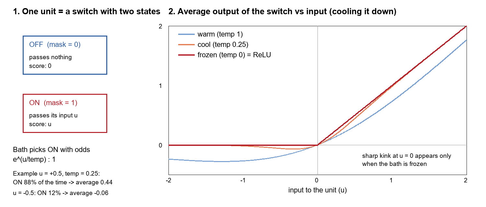
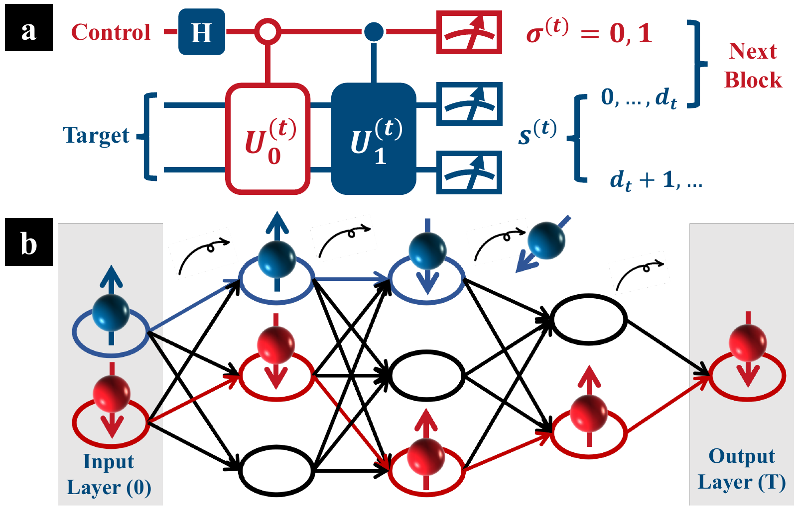
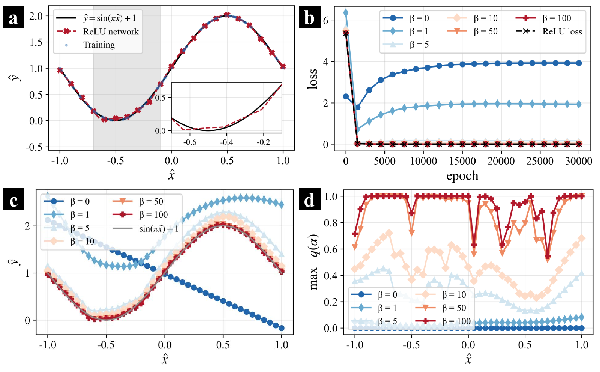
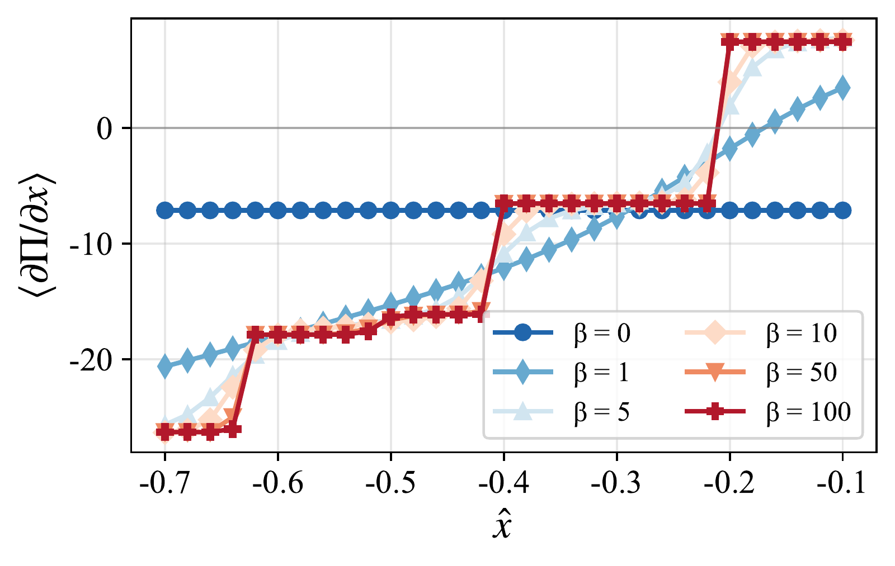

v3.16
Analyzing | Framework v3.16 | adversarial posture (unreviewed single-author preprint)

**Paper:** Junxu Li, "Exact Realization of Deep ReLU Computation in a Microscopic Statistical-Mechanical System," arXiv:2609.22965v1 [quant-ph; cross-list math-ph] (submitted 19 Sep 2026). Northeastern University, Shenyang. No journal reference.

> **Access Status** — Full paper: read in full from the local arXiv v1 PDF (18 pages: 7-page main text plus 11 pages of Supplementary Materials SI–SIII, all pages read; v1 is the only version on the arXiv abs page as of 2026-10-09) · Abstract: retrieved from the arXiv abs page (v1; comments field says "7 pages, 3 figures", i.e. it counts the main text only) · Supplementary material: included in the same PDF and read in full; no separate supplement, no code release, no press coverage found · Figures: all three viewed as the author's own files from the arXiv source (figures/exact-2609.22965_fig1–3.png), checked against the captions in the PDF; one analyst-built explainer drawn with Pillow · Prior work checked on arXiv abs pages: Zhang, Naitzat & Lim, *Tropical Geometry of Deep Neural Networks*, arXiv:1805.07091 (v1 is the only version; ICML 2018); Fiat, Malach & Shalev-Shwartz, *Decoupling Gating from Linearity*, arXiv:1906.05032 (v1 only); Lakshminarayanan & Singh, *Neural Path Features and Neural Path Kernel*, arXiv:2006.10529 (latest v2, June 2021; NeurIPS 2020); Wright et al., *Deep physical neural networks…*, arXiv:2104.13386 (v1 only; Nature 2022). For these I saw the abs-page listing and abstract (via a summarizing fetch tool), not the full texts. Nair & Hinton (ICML 2010, rectified linear units in restricted Boltzmann machines) is not on arXiv; I rely on its well-known content, not a re-read. · Analysis basis: full text. Claim checks run in Python (`check_relu_statmech.py`, `check_relu_statmech_2.py`; explainer drawn by `draw_explainer.py`, all in the work directory).

## 1. Punchy Title & One-Sentence Hook

**Freezing a Bank of Switches: A Deep ReLU Network Rebuilt as the Cold Limit of a Hand-Built Ensemble**

The paper shows, correctly, that if you put every on/off gate of a ReLU network into a heat bath with a carefully designed score and then cool it to absolute zero, the gates freeze into exactly the pattern the network itself would compute — a tidy exact identity, but one whose "physics" (temperature, phase transition, quantum circuit, fermions) is mostly a relabeling of an optimization the network already performs.

## 2. Big-Picture Context

A ReLU network is the workhorse of modern deep learning: each unit adds up its weighted inputs and passes the sum on if it is positive, or outputs zero if it is not. That one-sided clipping is the only non-linear step. Because it is a hard switch, the whole network behaves like a giant lookup over switch settings: for every input, some set of units is on, the rest are off, and given that set the network is just a product of matrices — a purely linear map. The input space is therefore carved into many polygon-shaped regions, each with its own linear formula, and the network's output is a patchwork of flat facets glued at creases. Counting and characterizing those regions has been an active machine-learning theory topic for a decade.

The paper asks whether this piecewise-linear behaviour can be derived as the emergent behaviour of a physical system defined "from below" — a configuration space, a probability distribution with a temperature, an energy-like score — rather than written in as a rule. Its answer is to build such a system: the configurations are all possible on/off masks for every unit, the score of a mask is computed from signed "traffic" flowing through the open units, and the probability of a mask follows the usual Boltzmann rule. The author proves that as temperature goes to zero the ensemble collapses onto a single mask — the network's actual activation pattern — so every averaged observable equals a rescaled copy of the network's hidden states, output, and loss. The same mathematics is then dressed in two physical costumes: a cascade of quantum circuit blocks with post-selection, and spin-carrying particles hopping across a layered lattice.

The paper also claims that the creases of the network (where one linear region meets another) are "first-order phase transitions" of this system: at zero temperature, the slope of the score jumps exactly where the network changes region.

**Paper Type & Stakes:** this is a short theoretical construction paper (a Letter-length main text plus a proof-heavy supplement) that maps a known computation onto a statistical-mechanics ensemble and proves the mapping exact. What is at stake is interpretive, not empirical: whether ReLU's piecewise linearity gains a genuine physical origin story, or whether the paper re-encodes a known optimization in thermodynamic vocabulary.

**Prior Belief Check:** experts in either field will not find the core identity surprising. That a hard switch is the zero-temperature limit of a two-state unit in a heat bath is textbook material: the rectified linear unit itself entered deep learning through Nair and Hinton's work on Boltzmann machines, where it appeared as the limit of noisy binary units, and the smooth "softplus" function is literally the free energy of an on/off unit. Tropical-geometry work has also shown that ReLU networks are max-of-linear-functions objects, which is exactly the zero-temperature limit of a log-partition function. The genuinely new element here is narrower: a single joint ensemble over all masks of a deep network whose ground state is provably the forward-pass pattern, layer after layer. That is a modest, correct technical construction. The paper's stronger interpretive claims — that this is a physical origin of ReLU and that creases are first-order phase transitions — are, in my reading, mostly relabeling, and the paper does not engage the prior work that would make that clear.

**Replication & Convergence Note:** this is a single-author preprint with no independent check; I reproduced the central theorem numerically by brute-force enumeration (see the Claim check), which is the theory analogue of replication, but no other group has examined it, and an independent reading of the quantum-circuit supplement would be the most valuable confirmation because that is where I found an error.

## 3. Necessary Background Crash-Course

### ReLU networks are linear maps behind a mask

Think of a ReLU network as a stack of matrix multiplies with a gate after each one. For a given input, each gate is either open (the unit's value passes through unchanged) or closed (it outputs zero). Once you know which gates are open — the activation pattern, or mask — the network is completely linear: you could precompute one matrix for that mask and apply it in one shot. Change the input enough and some unit's sum crosses zero, a gate flips, and you are in a different linear region with a different matrix. The paper's whole construction treats the mask as the system's "configuration" and asks what physical rule could pick the right mask.

> **Analogy:** a ReLU network is like a compiled program with branches, where each branch condition is "is this partial sum positive?" Once the branch outcomes are fixed, the program is straight-line linear code; the mask is the branch trace.
>
> **Breaks when:** you try to choose the branch trace independently of the computation. In a real program the trace is determined on the fly by the data; in this paper the mask becomes a free variable sampled from a distribution, and the right trace has to be recovered by an optimization — which is exactly where the construction's design choices hide.

### Boltzmann weights, temperature, and why "zero temperature" means "take the maximum"

Statistical mechanics assigns each configuration a probability that grows exponentially with its score (physicists usually say "decreases with its energy"; here the paper uses a score to be maximized). Temperature sets how sharp that preference is. At high temperature every configuration is about equally likely; as temperature drops, the best-scoring configuration dominates; at exactly zero temperature only the maximum survives. This is the same "softmax with a temperature knob" that every machine-learning engineer knows: turn the temperature down and softmax becomes argmax.

A second point matters for this paper: the "temperature" here is not a property of any heat bath. The paper derives the Boltzmann rule by maximizing uncertainty about the mask subject to a fixed average score, and the inverse temperature appears as the bookkeeping multiplier on that constraint. Nothing in the physical setup sets its value.

> **Analogy:** the temperature is the softmax temperature in a sampling routine. High temperature means "sample masks almost uniformly"; zero temperature means "always return the top-ranked mask".
>
> **Breaks when:** you read it as a thermometer reading. A softmax temperature is a knob you set; a physical temperature is set by an environment, and its scale has physical meaning. In this paper the scale is arbitrary (the Claim check shows it shifts by large factors under a harmless rescaling).

The explainer below shows the simplest possible case: a single unit with two states. Off contributes nothing; on passes its input and scores that input. A heat bath picks "on" with odds that grow exponentially with the input. Warm, the average output is a smooth curve; frozen, it becomes exactly the ReLU kink.



*Analyst-built illustration (not from the paper):* a single on/off unit in a heat bath; left, the two states and a worked example; right, the unit's average output against its input at three temperatures. **What to look at:** the warm curve is smooth and even dips below zero, the cooler curve hugs ReLU more closely, and only the frozen curve has the sharp corner at zero input — the whole paper is a deep, multi-layer version of this panel.

(For the single unit, the warm curve is the smooth "swish" shape and its log-partition function is the familiar softplus. The paper never notes this; it is my observation, and in the deep ensemble the units are coupled, so the warm network is not simply swish applied unit by unit.)

### First-order transitions versus level crossings

A first-order phase transition is a sudden jump in some property (density, magnetization) as a control knob passes a critical value — ice to water at fixed pressure. In the strict sense it requires an infinite system: a finite system's averages are always smooth at any non-zero temperature. What a finite system can do at exactly zero temperature is a **level crossing**: two configurations swap places as the best one, and any property that differs between them jumps.

> **Analogy:** a level crossing is like a router whose best path flips from link A to link B the moment B's cost drops below A's. The route jumps instantly, but nothing collective happened — two candidate paths just traded rank.
>
> **Breaks when:** you want the collective features of a true phase transition — latent heat that grows with system size, coexistence of phases, hysteresis, universal behaviour. A two-path routing flip has none of them, and neither does the paper's crease.

### Signed numbers from probabilities: the sign-bit trick

Probabilities are never negative, but network weights are. The paper handles this the way a quantum or Monte Carlo practitioner often does: carry an extra sign bit on each "particle" and count up-sign particles minus down-sign particles. The signed quantity the paper calls a population imbalance is just that difference, divided by the number of shots. To fit inside probabilities, every weight matrix must also be shrunk by a rescaling constant, which the paper undoes at the end.

> **Analogy:** two's-complement bookkeeping on unsigned hardware counters — keep a "positive" counter and a "negative" counter and report the difference.
>
> **Breaks when:** you ask about cost. Each layer's shrink factor multiplies, so the signal you are trying to read out shrinks layer by layer while the counting noise does not; reading a deep network's output this way needs a rapidly growing number of shots.

### Origins & Big Picture: how physics and neural networks got entangled

There is no physical "system" here with a formation history; the system is a construction. So this subsection covers how the problem arose and where this paper sits in a long two-way traffic between statistical physics and neural computation.

The first direction ran from physics to networks. In the early 1980s Hopfield showed that a network of binary neurons with symmetric connections behaves like a magnet with an energy function: stored memories are low-energy valleys, and recall is the system rolling downhill. Amit, Gutfreund and Sompolinsky then imported spin-glass theory to compute how many memories such a network can hold before the valleys merge into a glassy mess — a genuine phase transition, in the large-network limit, with a sharp capacity threshold. The Boltzmann machine followed: a network whose units flip randomly at a temperature, so the network samples configurations from a Boltzmann distribution and learning means reshaping that distribution. Its restricted version (one hidden layer, no connections within a layer) became a building block of early deep learning.

The rectified linear unit came out of exactly this lineage. Nair and Hinton asked what happens if a Boltzmann-machine hidden unit is replaced by many binary copies with staggered thresholds; the sum behaves like a smooth softplus, which they approximated by a hard rectifier with noise. So ReLU already has a statistical-mechanics origin story — one this paper cites only as the definition of ReLU.

The second direction ran from networks to physics-style analysis: the statistical mechanics of learning (typical-case generalization curves, often with sharp transitions), mean-field theories of wide networks, and "jamming" pictures of the loss landscape. In parallel, machine-learning theorists studied the geometry of ReLU networks directly: counting linear regions (depth makes their number grow exponentially), and showing that a ReLU network is a tropical rational function — built from "max" and "plus" — which is precisely what a log-sum-exp (a free energy) turns into at zero temperature. Gated-linear-network work made the "linear map behind a mask" picture explicit, separating the gate pattern from the linear values and writing the output as a sum over open input-to-output paths, which is the same path sum this paper writes in fermion language.

A third, more recent thread asks the engineering question: can a physical system — optics, mechanics, electronics — do the network's computation? Physical neural networks trained with backpropagation through real hardware are the flagship example.

This paper tries to sit at the junction of all three: a partition function (direction one), whose zero-temperature limit reproduces the piecewise-linear structure studied in direction two, realized on paper by quantum circuits and particle transport (direction three). Its contribution, read fairly, is a clean exact construction for arbitrary depth. Its weakness, read adversarially, is that it does not use any of the existing bridges — softplus as free energy, tropical geometry as zero-temperature algebra, gated-path decompositions — to calibrate how much of its result was already known in other words.

> **Central analogy for this paper:** annealing a gate mask under a layer-priority score.

## 4. Core Technical Explanation

The construction has five moves. The diagram lays them out; the steps below explain each.

*Analyst-built concept diagram (not from the paper):*

```
 trained ReLU net (weights, biases) + input
        |
        v
 [1] fold bias into matrix; split + and - parts; shrink to fit
        |
        v
 [2] signed traffic: particles with a sign bit hop layer to layer
        |
        v
 [3] mask = which sites are open; score = priority-weighted
     signed traffic through open sites (earlier layers weigh 2x more)
        |
        v
 [4] Boltzmann ensemble over all masks at "temperature"
        |  cool to zero
        v
 [5] only best mask survives == ReLU activation pattern
        |
        v
 averaged observables == rescaled hidden states, output, loss
```

Read it top to bottom: the network's weights go in, a scoring rule over masks is built from them, and cooling selects the mask the forward pass would have produced.

### Step 1: turning the network into pure matrix products

**The failure it prevents:** a probability-based machine can only move non-negative amounts around and cannot add a constant bias. **What the author does:** append a constant "1" to every layer's vector so the bias becomes an ordinary matrix column (the standard homogeneous-coordinates trick from graphics), split each weight matrix into its positive and negative parts, and divide by a rescaling constant large enough that each part fits inside a valid probability-moving operation. The input is also rescaled so its entries sum to at most one, letting it be read as a probability distribution over sites with a sign bit. **What it buys:** every layer becomes a signed, shrunken linear map that a sampling process can, in principle, implement; the shrink factors are recorded and multiplied back at the end.

### Step 2: the circuit block and the hopping particles

**The failure it prevents:** without a sign mechanism, the positive and negative weight parts cannot be combined. **What the author does:** each block flips a fair coin on a control bit (a Hadamard gate followed by measurement does exactly this), applies one of two unitaries depending on the coin, measures the target register, and records the sign. The signed count of shots landing on each site is the "population imbalance". Shots landing outside the network's sites are discarded. The author then re-describes each shot as a spin-half particle hopping from column to column of a layered lattice, its spin recording the sign (Fig. 1b).



*Figure 1 (from the paper):* (a) one circuit block — coin on the control, controlled unitaries on the target, measurement of both; (b) the same process drawn as spin-carrying particles hopping across layers, some escaping. **What to look at:** every wire ends in a measurement; nothing coherent is carried from one block to the next, so the "quantum" block acts as a classical random hop with a sign bit, and the "fermions" never meet each other.

**What it buys:** a concrete sampling procedure whose average signed counts equal the rescaled linear network for any fixed mask. It is worth being clear that this layer of the paper is classical in effect: only the squared transition amplitudes matter, and the particles are independent, so neither interference nor Pauli exclusion plays a role.

### Step 3: masks and the priority-weighted score

**The failure it prevents:** a linear sampler alone cannot clip negatives; something must choose which units to switch off. **What the author does:** introduce a binary open/closed flag for every site — the mask — so a closed site blocks all traffic through it. For a given mask, the score adds up, layer by layer, the signed traffic through each layer's open sites, each site's contribution multiplied by how much traffic could still flow downstream from it, and each layer multiplied by a priority weight that doubles for every layer closer to the input. The author motivates the doubling as counting the unrecorded coin outcomes of later blocks.

**What it buys:** this is the paper's real engine. Because each earlier layer's weight is at least as large as all later layers' contributions combined (that is the content of the supplement's Lemma 1, a two-sided bound proved by induction), the best mask can be found greedily: first set layer one's flags to maximize its own term, then layer two's given layer one, and so on. And maximizing a layer's term site by site means "open this site if its incoming signed traffic is positive, close it if negative" — which is precisely the ReLU rule.

> **Analogy for the priority weights:** a sort key where earlier layers are the high-order bits. A one in a higher bit beats any pattern of lower bits, so the sort settles the top bits first.
>
> **Breaks when:** the "bits" are real numbers rather than zeros and ones. The doubling only guarantees dominance because Lemma 1 also bounds how big the downstream terms can get; change the downstream weights or the doubling and the guarantee goes away (the Claim check tests exactly this).

### Step 4: the Boltzmann ensemble over masks

**The failure it prevents:** without a probability rule over masks, there is no "temperature" and no statistical mechanics. **What the author does:** maximize the uncertainty over masks subject to a fixed average score, which gives the standard exponential weighting. This is the paper's one equation that carries the main result:

$$q(\alpha) = \frac{1}{Z}\, e^{\beta \sum_{t=1}^{T} 2^{T-t}\, \pi^{(t)}(\alpha)}$$

**Symbol definitions:**
$q(\alpha)$ : probability of the mask $\alpha$ (the full list of open/closed flags for every site in every layer)
$Z$ : the partition function, the sum of the exponential over all masks, which normalizes the probabilities
$\beta$ : inverse temperature — the multiplier on the score constraint; large means cold
$T$ : number of layers; $t$ : the layer index
$2^{T-t}$ : the layer-priority weight, doubling for each layer closer to the input
$\pi^{(t)}(\alpha)$ : the signed traffic through layer $t$'s open sites, weighted by downstream throughput

**What this actually means:** each mask is a candidate branch trace for the network, and its probability is a softmax of a priority-weighted score. Turning the temperature down turns the softmax into an argmax. In systems terms, it is simulated annealing whose objective function the author has written down from the network's own weights and the specific input.

**What it buys:** a partition function, and with it the vocabulary of averages, free energies and transitions. Note that the score depends on the input: each input defines a different energy landscape.

### Step 5: the zero-temperature theorem and the numerical demo

**The failure it prevents:** a mapping that only holds approximately, or only for shallow networks, would not justify the word "exact". **What the author does:** prove (Theorem 1) that as the temperature goes to zero, the ensemble condenses onto the unique best mask, that this mask is the network's activation pattern at every layer, and that the averaged signed traffic equals the network's hidden states and output after multiplying back the shrink factors; the squared-error loss follows. The demonstration is a small network with one input, two hidden layers of six units, and one output, trained to fit a shifted sine wave (the shift keeps the target positive, because this network clips its output layer too).



*Figure 2 (from the paper):* (a) the trained network versus the target, with an inset showing the flat facets; (b) training-time loss of the ensemble at several inverse temperatures versus the network's own loss; (c) the ensemble's output across the input range; (d) the probability of the single most likely mask. **What to look at:** in (c), the hottest curve is a straight line — averaging over all masks equally gives a purely linear model — and the cold curves lie on the sine; in (d), the top mask takes nearly all the probability when cold, except in sharp dips near region boundaries where two masks score almost the same.

**What it buys:** a visual check that the theorem behaves as claimed. The paper reads the cold curves as "condensation"; I read them as softmax sharpening into argmax, with the dips marking near-ties.

### The "phase transition" claim

**The failure it prevents:** without an observable that jumps, there would be no physics-style handle on the creases. **What the author does:** plot the average slope of the score with respect to the input across part of the input range (Fig. 3). At high temperature it is flat; as the system cools it develops steps; the steps line up with the creases of the network. **What it buys:** an attractive picture, but a structurally guaranteed one: for a fixed mask the score is a straight line in the input, the coldest ensemble picks the top line at each input, and the top of a set of straight lines has a kink exactly where the winner changes — which, by Theorem 1, is where the network's mask changes.



*Figure 3 (from the paper):* average slope of the score versus input at six inverse temperatures. **What to look at:** the coldest curve is a staircase whose risers sit at the network's region boundaries; warmer curves are smoothed staircases — the expected softmax blur of a level crossing in a finite system, not the size-sharpened jump of a thermodynamic transition.

### Claim check

All checks were run in Python by brute-force enumeration of every mask (`check_relu_statmech.py`, `check_relu_statmech_2.py`), using random networks built to the paper's recipe.

**Theorem 1 (best mask equals ReLU pattern; hidden states and output reproduced) — Reproduced.** On three random architectures of different depth and width, and two hundred random inputs each, the top-scoring mask matched the forward-pass activation pattern at every layer, and the rescaled cold-limit output matched the network output to machine precision in every case. I also re-derived Lemma 1's induction by hand and found it sound. The core mathematical claim holds.

**Condensation threshold ("from moderately cold on, the two losses coincide") — Partly reproduced.** The ensemble does converge to the network output, but how cold it must be is not physical: it scales with the arbitrary rescaling constants. Doubling the constant in every layer of the three-layer test network shrank the score gap between the best and second-best masks about eightfold, so the needed inverse temperature rose by the same factor. Near region boundaries the gap shrinks toward zero, so no finite temperature condenses everywhere — the dips in Fig. 2d. The paper's specific temperature values therefore carry no meaning beyond its own normalization.

**Fig. 3 steps coincide with linear-region boundaries — Reproduced, but true by construction.** Sweeping the input across a test network, every slope jump of the coldest score coincided with a change of activation pattern, and every pattern change produced a jump. As argued above, this follows from the score being linear in the input for each fixed mask; it does not require any collective physics.

**Sensitivity — the layer-priority doubling.** This is the most influential design choice, so I replaced the doubling with equal layer weights. In a deeper test network the best mask then disagreed with the network's hidden-layer pattern for about a quarter of inputs (the output happened to survive there); in another network the equal-weight score produced exact ties between masks. The conclusion survives only if each earlier layer is weighted at least as heavily as the paper's doubling guarantees. That makes the doubling — motivated in the paper as a degeneracy count — the hand-chosen ingredient that delivers ReLU.

**Robustness — limiting cases.** At infinite temperature the ensemble averages every mask equally, which halves each hidden unit's traffic and yields a purely linear model; this matches the straight hot curve in Fig. 2c. For a single unit the construction reduces to the textbook two-state switch whose cold limit is ReLU (explainer above). Both limits behave correctly.

**Internal consistency — one significant finding.** The supplement's quantum-circuit embedding does not implement the matrix it claims. It builds a unitary whose top-left block *is* the shrunken weight matrix (amplitudes), but the circuit's statistics use the *squared* magnitudes of those entries as transition probabilities. My numerical test confirms the circuit as written realizes the entry-wise squared matrix, whose entries differ from the intended ones by up to a quarter (in units where the largest allowed entry is one) in a random example — so the hidden states it would produce are wrong. A fix exists: encode the square roots of the entries with a larger isometry, which requires each column of the shrunken matrix to sum to at most one rather than the spectral-norm condition the paper states. Separately, the factors of two and four in the rescaling (supplement versus main-text Eq. 4) do not agree. Neither problem touches the statistical-mechanics theorem, which only needs non-negative matrices, but the "physical realization" as written is incorrect.

### Assumption Audit

> **Watch:** a reader likely assumes "without prescribing a neural-network activation function" means ReLU emerges from generic physics. **The paper actually says:** the score is built from the network's own weights, the specific input, a downstream-throughput factor, and a layer-priority weight chosen so that its maximum decomposes greedily into "open if positive". ReLU is not imposed as a formula, but it is engineered into the score; the sensitivity test shows that swapping the priority weights breaks the correspondence. "Emerges" here means "is the argmax of an objective designed to have it as argmax".

> **Watch:** a reader likely assumes "temperature" and "first-order phase transition" carry their thermodynamic meaning. **The paper actually says:** the inverse temperature is a Lagrange multiplier with no physical scale (its required size moves with arbitrary rescaling), the configuration space is finite, and the "transition" is a zero-temperature swap of which mask scores highest as the input is varied — a level crossing. There is no large-system limit, no latent heat that grows with size, and no collective ordering.

> **Watch:** a reader likely assumes "cascaded quantum operations" and "fermionic transport" mean quantum resources are used. **The paper actually says:** every block is measured completely before the next, only squared transition amplitudes enter, and the particles never interact; the process is a classical random walk with a sign bit. And the Boltzmann distribution over masks is not produced by the circuit at all — it is a mathematical ensemble layered on top, with no mechanism that would make nature sample masks with those weights.

> **Watch:** a reader might assume the construction offers a new way to compute or train a network. **The paper actually says:** nothing about cost. Evaluating the ensemble means scoring every possible mask (a number that doubles with every unit), and the cold limit just returns the mask a forward pass computes directly; the circuit readout also needs a shot count that grows with the product of the rescaling constants.

## 5. What's Genuinely New or Clever

The one real trick is the **layer-priority score that makes a joint optimum over every mask of a deep network collapse into a greedy, layer-by-layer one**. A naive score — total signed traffic through open sites — couples the layers: closing a unit early can change what is worth opening later, so the best global mask need not be the forward-pass mask. The author fixes this by weighting each layer's contribution, scaled by the downstream throughput, with a factor that doubles towards the input, and proves (Lemma 1) that this weighting keeps every downstream coefficient non-negative and dominated by the upstream ones. Once that holds, the joint maximum factorizes and each unit independently chooses "open if my incoming traffic is positive". It is the familiar lexicographic-priority idea from scheduling and sorting, applied to an exponential family. That is new to the field as far as I can tell, though modest: it is the minimal device needed to lift the single-unit two-state-switch picture to arbitrary depth without approximation.

A second, smaller point is the **sign-bit bookkeeping** that lets a probability-moving process carry signed weights; this is standard in quantum-simulation and quasi-probability Monte Carlo practice, so it is new to the reader rather than to the field. What is *not* new, despite the framing: ReLU as the zero-temperature limit of a statistical unit (Nair and Hinton's lineage), max-of-linear structure as the cold limit of a log-partition function (the tropical-geometry view), and the decomposition of a ReLU network into gates plus linear paths (gated-linear and neural-path work). The paper does not cite the latter two threads.

**Predictive Content Check:**

1. **Falsifiable handle:** none in the empirical sense — the paper relabels rather than predicts. Theorem 1 is a mathematical identity that can be (and here was) checked; the "phase transition" is guaranteed by construction. The nearest thing to a testable statement would be a physical device — the circuit cascade — reproducing a network's hidden states from measured signed counts; but the circuit as written in the supplement implements the wrong matrix, the paper builds no device, and the Boltzmann weighting over masks has no physical source. The paper's closing suggestion — designing architectures "from physical principles" — is not developed into any prediction about which architectures would work better.

2. **Formalism load (fires — the paper leans on structure without an empirical handle):** strip out the quantum circuit, the fermions, and the maximum-entropy derivation, and nothing changes in Theorem 1: it is a statement about a softmax over binary masks with a specific score built from non-negative matrices. Those three layers are costume. The load-bearing parts are the mask variable, the downstream-throughput factor, and the doubling priority weight, plus Lemma 1. The "first-order phase transition" label is also decorative: the jump is the generic kink of a maximum over straight lines.

## 6. Limitations & Open Questions

> **The "physical origin" claim is circular in a specific sense: the score that selects ReLU is assembled from the network's weights, the input, and a hand-chosen layer priority.** **(B) Contested** — a sympathetic reader can argue that any exact mapping must encode the network somewhere and that the priority weight is justified as a degeneracy count; a skeptical one notes that the weighting is exactly what is needed to make the argmax greedy, and that removing it breaks the result (my sensitivity test). **(analyst inference; the construction itself is in paper §IV and Supplement SIII)**

> **The "first-order phase transition" is a finite-system level crossing, and the temperature has no physical scale.** **(A) Consensus** — standard statistical mechanics reserves "phase transition" for non-analytic behaviour in the large-system limit, which this finite ensemble cannot have at non-zero temperature; and the Claim check shows the needed inverse temperature shifts many-fold under arbitrary rescaling. **(broader literature; recomputation finding — analyst inference from brute-force enumeration)**

> **The supplement's quantum embedding implements the entry-wise squared weight matrix, not the weight matrix, and its factor-of-two bookkeeping disagrees with the main text.** **(A) Consensus** — this is a checkable error: the dilation places the matrix in the amplitudes while the readout uses probabilities, and the numerical test confirms the mismatch; a fix (square-root encoding with column sums at most one) exists but is not in the paper. **(analyst inference — recomputation from Supplement Eqs. S13–S17 and S25–S27)**

> **No quantum or fermionic resource is used; the "quantum operations" reduce to a classical sign-carrying random walk.** **(A) Consensus** — measurement after every block removes all coherence, and non-interacting particles without exclusion effects are classical walkers; this follows directly from the paper's own equations. **(analyst inference from paper §II–III and Supplement SII)**

> **Cost is ignored: the ensemble has one configuration per possible mask, doubling with each unit, and the circuit readout's signal shrinks with the product of the per-layer rescaling constants.** **(A) Consensus** — exponential configuration counts and shot-noise scaling are elementary; for a modest deep, wide network my estimate runs to astronomically many shots for percent-level precision. The paper makes no efficiency claim, but its "computational architectures from physical principles" outlook needs this addressed. **(analyst inference; recomputation in `check_relu_statmech.py`)**

> **Ties and dead units are not handled.** When a unit's input is exactly zero, or when nothing downstream of a unit carries traffic, two masks score the same and the cold ensemble does not condense onto one; the averaged hidden state then sits halfway. **(C) Speculative** — these are measure-zero or benign cases for the output, but the theorem's "unique configuration" wording overstates; a referee might consider it a footnote. **(analyst inference from Lemma 1, whose lower bound becomes zero in exactly these cases)**

> **The paper does not engage the closest prior work** — softplus as a free energy, ReLU's Boltzmann-machine origin, tropical geometry as zero-temperature algebra, gated-path decompositions. **(B) Contested** — how much of this a short Letter should cite is a judgment call, but without it a reader cannot tell what is new. **(analyst inference; prior works checked on their arXiv abs pages, listed in the Access Status)**

**Open questions for the next 12–24 months.** Can any physical process — a driven dissipative system, an annealer — actually sample masks with this score, and at what cost? Is there a natural physical meaning for the finite-temperature ensemble (a "warm" network), and does training at finite temperature regularize like dropout, which also averages over masks? Does the priority-weight trick extend to other piecewise-linear activations (leaky ReLU, max-pooling), and is there a weaker weighting that still suffices? And can the linear-region-counting literature be restated as counting ground states across inputs, giving any new bound?

## 7. Detailed Summary & Explanation

The paper takes a trained ReLU network and builds a statistical ensemble whose configurations are all possible on/off masks for the network's units. First it rewrites each layer as a signed, rescaled matrix by folding in the bias, splitting weights into positive and negative parts, and shrinking them to fit inside probabilities. It then describes how a cascade of circuit blocks — a coin flip on a sign bit, one of two unitaries, a measurement — moves signed "traffic" from layer to layer, and redraws the same process as spin-carrying particles hopping across a layered lattice. Each mask closes some sites, blocking traffic. The score of a mask adds up the signed traffic through open sites, weighted by how much can still flow downstream and by a layer priority that doubles towards the input. A Boltzmann rule turns scores into probabilities.

The main theorem says that in the zero-temperature limit the ensemble collapses onto one mask — the network's actual activation pattern — so averaged signed traffic equals the network's hidden states and output (after multiplying back the shrink factors), and the averaged squared error equals the training loss. A small sine-fitting network illustrates the collapse as the system cools, and a slope plot shows steps at the network's region boundaries, which the author calls first-order phase transitions.

I framed the summary around two separations. The first is between what is proven and correct — the theorem, which I reproduced exactly by enumerating every mask — and what is interpretive. The second is between load-bearing machinery (the mask, the downstream factor, the doubling priority and the lemma that makes the optimum greedy) and costume (the quantum circuit, the fermions, the maximum-entropy derivation, the phase-transition label). The reader should take away that the paper contains a neat exact construction, the deep generalization of the textbook fact that a two-state switch frozen in a heat bath behaves like ReLU, but that it does not give ReLU a physical origin in any sense stronger than "ReLU is the argmax of an objective one can write down". Its quantum-circuit realization, as printed, implements the wrong matrix.

**Where I'm least confident in this analysis:** the strength of the "circularity" judgment. I treat the layer-priority weighting as hand-chosen because removing it breaks the result in my tests, but the author's motivation — that the doubling counts the unrecorded coin outcomes of later blocks — might be developed into a principled derivation from the circuit's own statistics; I could not reconstruct such a derivation from the paper, and a reader who can would be justified in upgrading the paper's interpretive claim. I am also relying on summarizing tool outputs for the prior-work abstracts, so the novelty boundary against the gated-network and tropical-geometry literature rests on their abstracts, not their full texts.

**Revision notes:** the referee pass added the sensitivity test on the priority weighting, the amplitude-versus-probability finding in the supplement, the cost limitation, the tie/dead-unit caveat, and trimmed numbers out of the Section 3–4 prose.

## 8. Three Crystallized Takeaways

1. **The math is right:** if you score every possible on/off pattern of a deep ReLU network the way this paper does and cool the system to absolute zero, it freezes into exactly the pattern the network computes — I checked it by brute force.

2. **The physics is mostly costume:** the "temperature" is a softmax knob with no physical scale, the "phase transition" is just two candidate patterns trading first place, and the "quantum circuit" is a classical random walk with a sign bit — whose printed version actually implements the wrong matrix.

3. **The real idea is a priority rule:** weighting earlier layers twice as heavily as later ones is what makes the global best pattern equal the layer-by-layer ReLU pattern — the deep version of the old fact that a two-state switch in a frozen heat bath behaves like ReLU.

## 9. Shorter Summary

This single-author preprint asks whether the piecewise-linear behaviour of ReLU neural networks — the way each unit either passes a positive signal or outputs zero — can be derived from statistical physics rather than written in by hand.

The author treats every possible on/off pattern of the network's units as a configuration of a physical system. Each pattern gets a score built from signed "traffic" flowing through the open units, with earlier layers weighted twice as heavily as the next. Patterns are then given Boltzmann probabilities at a temperature. The main theorem proves that as the temperature goes to zero, only one pattern survives — the network's own — so the system's averages reproduce the network's hidden values, output and loss exactly. The paper also dresses the process as quantum circuit blocks and as spin-carrying particles hopping between layers, and calls the network's creases first-order phase transitions.

I reproduced the theorem by checking every pattern on several random networks: it holds. But the interpretation is thinner than the framing. The score is assembled from the network's own weights and a hand-chosen layer priority, and removing that priority breaks the result, so ReLU is engineered into the objective rather than emerging from it. The temperature has no physical scale, and the "phase transition" is just two candidate patterns swapping first place in a finite system. The circuits measure after every step, so nothing quantum is used, and the supplement's circuit construction mixes up amplitudes and probabilities, so as printed it implements the wrong matrix.

What remains is a modest, correct construction: the deep, exact version of the textbook fact that a two-state switch frozen in a heat bath behaves like ReLU. It makes no testable prediction and offers no computational advantage, and it does not engage the prior work — on Boltzmann-machine origins of ReLU, on the max-plus geometry of ReLU networks, or on gate-pattern decompositions — that would show how much was already known.

---
*Analysis by Claude (Opus 5.5), headless pipeline run, 2026-10-09 · Framework v3.16 · adversarial posture (unreviewed preprint) · Source: arXiv:2609.22965v1.*
