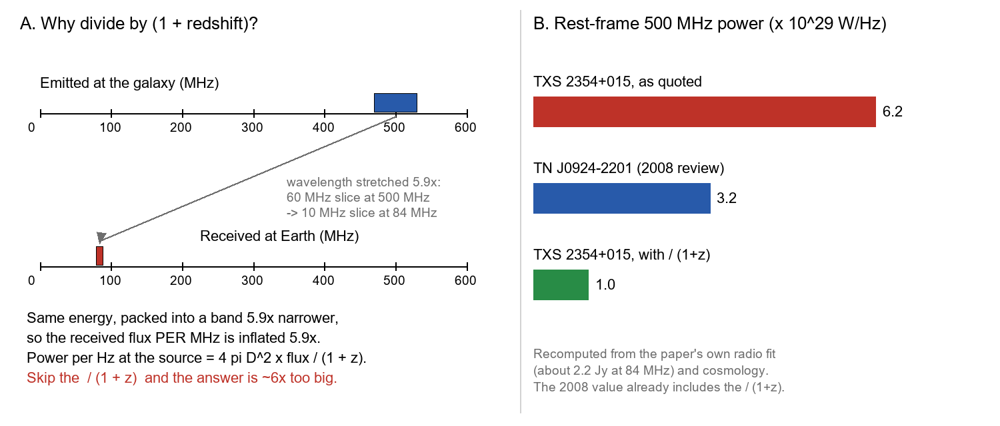
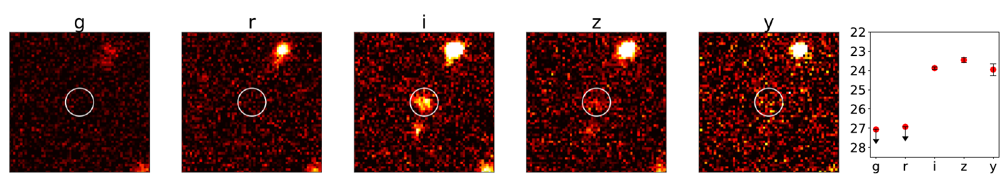
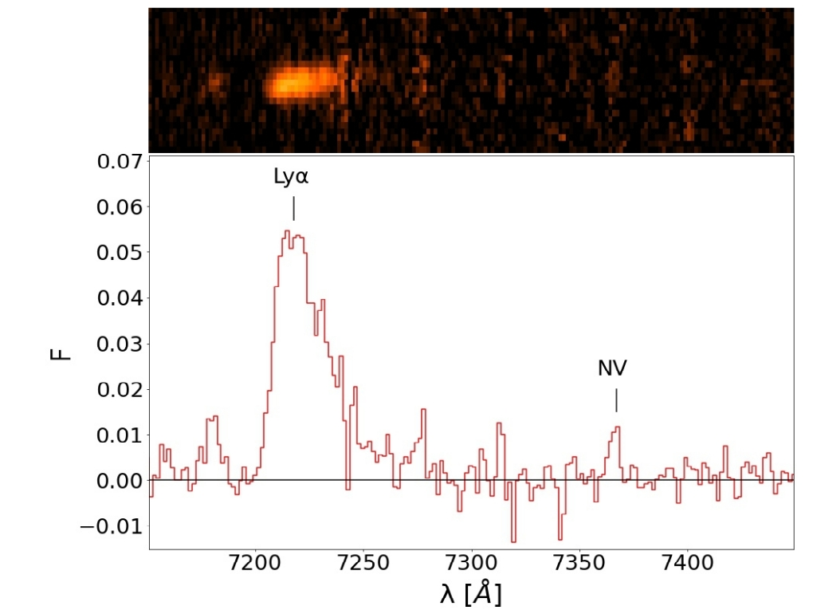
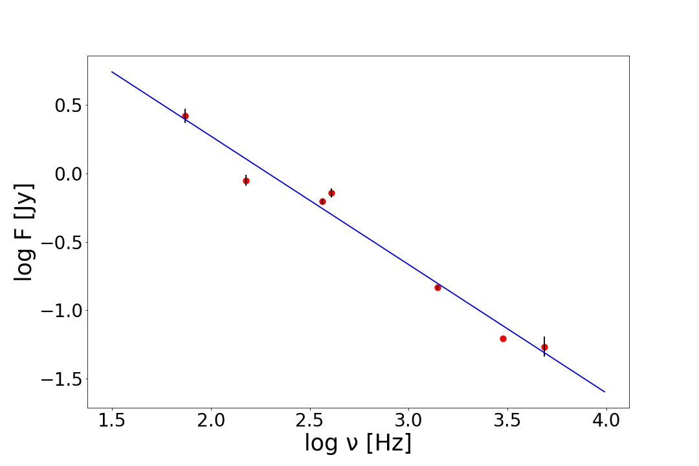

v3.16
Analyzing | Framework v3.16 | headline "most powerful" claim not reproduced in the claim check

> **Access Status** — Full paper: retrieved (local arXiv v1 PDF, 5 pages, read in full, with the pdftotext extraction as a search backup; v1 is the only version listed on the arXiv abs page, comments "A&A, in press", no journal-ref yet) · Abstract: retrieved from the PDF and the arXiv abs page · Supplementary material: none exists; figures viewed directly from the arXiv source files (Fig. 1 cutouts and photometry, Fig. 2 both spectrum panels, Fig. 3 slit profile, Fig. 4 radio spectrum and VLASS image) · Comparison papers checked on arXiv: Capetti et al. 2025 pilot study (arXiv:2504.17572, v1 only, abs page), Miley & De Breuck 2008 review (arXiv:0802.2770, v1 only; compendium table pages read directly from the PDF), van Breugel et al. 1999 on TN J0924−2201 (astro-ph/9904272, v1 only; pages 1–4 read directly), Saxena et al. 2025 on the revised TGSS J1530+1049 redshift (arXiv:2511.13650, latest v3 of 23 Mar 2026, abs page summary only), Endsley et al. on COS-87259 (arXiv:2206.00018, latest v2 of 23 Jan 2023, abs page summary only) · Analysis basis: full text.

## 1. Punchy Title & One-Sentence Hook

**A Radio Monster From the First Billion Years — Real Discovery, Overstated Crown**

An Italian-led team used a simple colour trick to find a dust-hidden radio galaxy whose light left it when the Universe was about a tenth of its present age, and the discovery itself looks solid — but the headline claim that it is "the most powerful radio galaxy known" rests on a radio-power calculation that appears to be missing a standard factor of about six, which would drop it from first place to around fifteenth.

## 2. Big-Picture Context

Powerful radio galaxies are galaxies whose central supermassive black hole drives twin jets of near-light-speed plasma far beyond the host. The jets heat and push the surrounding gas, shutting down star formation and keeping cluster gas from cooling — "feedback" that galaxy-formation simulations need to match the real galaxy population. The distant ones also act as signposts: they sit in the most massive galaxies of their era, often in forming galaxy clusters.

The awkward fact is that we know very few of them. The standard 2008 review listed fewer than forty radio galaxies from the first two billion years of cosmic history, and only two from the first one and a quarter billion. A handful were added later, and one of the most distant claims has since been revised much closer. Meanwhile, several lines of evidence — the counts of jets pointed straight at us, the X-ray background, and this team's own earlier work — suggest that most early radio-loud black holes are hidden behind dust and gas. If so, the visible quasars are a small, unrepresentative sliver, and the hidden "radio galaxies" are the main population.

The classic way to find distant radio galaxies is to pick radio sources whose brightness falls very steeply with frequency, called ultra-steep-spectrum sources, and then take spectra. That works, but it only finds one kind of object. This team instead starts from low-frequency radio sources and keeps those whose optical counterpart vanishes in the bluer filters of a deep Japanese imaging survey — the signature that intervening hydrogen has eaten the light, which happens only for very distant objects. Their pilot study used this to confirm four radio galaxies at redshifts below 4. This paper is the first result of pushing the same method to redshift 5.

**Paper Type & Stakes:** this is a short observational discovery paper (five pages, accepted by Astronomy & Astrophysics): one spectrum of one candidate, plus archival radio data. The stakes are modest for the discovery — one more radio galaxy near redshift 5 — and higher for the two superlatives in the title and abstract: second-most-distant radio galaxy known, and most powerful radio galaxy known.

**Prior Belief Check:** the discovery fits comfortably with mainstream expectations. A radio galaxy near redshift 5 is rare but not surprising, and finding one whose radio spectrum is not ultra-steep supports a view the field has been moving toward for a decade, that the steep-spectrum filter misses many of these objects. The "most powerful" claim, if true, would be genuinely notable to specialists, because the previous record holder has stood since 1999. That is exactly why it deserves the hardest look — and the claim check below finds that it does not survive a standard recalculation. So the honest calibration is: incremental, confirmatory discovery; overstated superlative.

**Replication & Convergence Note:** this is a single-group result from one VLT spectrum, with one strong line and one faint supporting line; nobody has independently observed the source. Independent confirmation would be a near-infrared spectrum showing the carbon and helium lines expected from a radio galaxy at this distance, or an ALMA detection of the cold-gas line routinely used to pin redshifts at this epoch. The redshift is very likely right; the power ranking needs an independent recalculation, which anyone can do from the published radio fluxes.

## 3. Necessary Background Crash-Course

### Hidden engines: radio galaxies versus quasars

A radio-loud active galaxy has three parts that matter here: a feeding black hole surrounded by a hot, brilliant disc of infalling gas; a doughnut or cocoon of dust and gas around it; and a pair of jets that punch out far beyond the galaxy and inflate radio-emitting lobes. If we happen to look down a clear line of sight to the disc, we see a quasar: a point of light that outshines the whole host galaxy. If dust blocks the view, we see only the host galaxy's starlight, glowing gas lit by the hidden engine, and the radio jets, which pass through dust untouched. That second case is a radio galaxy.

**Analogy:** think of a data centre in a windowless building. A visitor who looks in through an open loading dock (a quasar) sees the racks blazing with status lights and can learn little about the building. A visitor outside a closed building (a radio galaxy) sees only the exhaust plumes from the cooling towers, which are unmistakable from a distance, and the building's outline. The closed building is actually easier to study as a building, which is why astronomers prize radio galaxies for studying hosts.

**Breaks when:** you ask whether the closure is fixed. In the data centre, a door is open or shut. In this paper's picture, early radio-loud black holes may be wrapped in a whole bubble of dusty gas, not just a doughnut, so the "closed" view may be the default for most of them rather than an accident of viewing angle — a population fact the analogy cannot express.

### The disappearing-colour trick

Neutral hydrogen gas between us and a distant galaxy absorbs almost all light bluer than a particular ultraviolet line of hydrogen, the Lyman-alpha line. Because the Universe expands, everything the galaxy emits is stretched to longer, redder wavelengths by the factor "one plus the redshift". So the absorption edge moves redward with distance. Near redshift 5, it lands between the red and the near-infrared filters of a camera: the galaxy is invisible in the green and red images and suddenly appears in the redder ones. Astronomers call such objects "dropouts" — here, "red-filter dropouts".

**Analogy:** imagine a shipping company that, at every border it crosses, strips off the cheapest items in each crate, and the price cut-off rises with each border. Open a crate, see where the cheap goods stop, and you know roughly how many borders the crate crossed. The camera filters are a few coarse price brackets; finding nothing in the two cheapest brackets and plenty in the next one dates the crate.

**Breaks when:** something mimics the missing cheap goods. A nearby galaxy that is simply very red (old stars or heavy dust) can look like a dropout in coarse filters. The colour trick is a pre-selection, never proof; only a spectrum settles it, which is what this paper provides.

### Emission lines, line strength, and stretching

The Lyman-alpha line is the brightest line of distant radio galaxies, because the hidden engine and young stars ionise huge clouds of hydrogen that then glow at this wavelength. Two features distinguish it from impostor lines. Its blue side is chopped off by hydrogen in front of the galaxy, so the line looks lopsided, with a sharp blue edge and a long red tail. And it is often very strong compared with the faint starlight underneath, a ratio measured as the "equivalent width": the width, in wavelength units, of a slice of the underlying starlight that would carry as much light as the line.

The catch is that equivalent width stretches with redshift, like every other wavelength. A value measured in the observed spectrum is larger than the value in the galaxy's own frame by the factor one plus redshift — here about six. One small example: an observed width of about 900 ångström, the number in this paper's abstract, is about 150 ångström in the galaxy's frame, an ordinary value for a radio galaxy.

### How radio brightness changes with frequency

Radio lobes shine by synchrotron emission: electrons spiralling in magnetic fields. Their brightness typically falls as a straight line on a log–log plot of brightness against frequency. The steepness of that line, the "spectral index", says how fast the brightness drops. Ordinary powerful radio sources have an index near one; "ultra-steep" sources are steeper than about 1.3 (some authors use one as the cut). Steep sources were the classic hunting ground for distant radio galaxies, partly because redshift slides the steeper, high-frequency part of the spectrum into the observed band.

### Turning brightness into power: the factor everyone must remember

To compare radio galaxies at different distances, astronomers convert the observed brightness into power emitted per unit frequency at a fixed reference frequency in the galaxy's own frame (500 megahertz is the standard for distant radio galaxies). Two corrections are needed. First, light emitted at the reference frequency arrives at a frequency about six times lower, so you read the brightness off the spectrum there. Second, the stretching also squeezes a given chunk of emitted frequencies into a band about six times narrower when it arrives. The same energy in a narrower band means the brightness per megahertz looks six times higher than it would without the squeeze, so the calculation must divide by "one plus redshift" to undo it.

This is the single concept the whole claim check turns on, so here it is as a picture.



*Analyst-built illustration (not from the paper):* left, a slice of emission at the galaxy arrives squeezed into a band about six times narrower, so the per-megahertz flux is inflated by the redshift factor and must be divided back out (D is the luminosity distance); right, the paper's quoted power, the long-standing record holder, and the value recomputed from the paper's own radio fit with the division included.
**What to look at:** the green bar — with the standard division, this galaxy sits at about a third of the record holder, not twice it.

The corresponding equation is the standard one:

$$P_{500} = \frac{4\pi D_L^{2}\, S_{\nu}(\nu_{\rm obs})}{1+z}, \qquad \nu_{\rm obs} = \frac{500\ {\rm MHz}}{1+z}$$

**Symbol definitions:**
$P_{500}$ : power emitted per hertz at 500 MHz in the galaxy's own frame (W/Hz)
$D_L$ : luminosity distance, the distance that makes the inverse-square law work in an expanding universe (m)
$S_{\nu}(\nu_{\rm obs})$ : measured flux density per hertz at the observed frequency (W m⁻² Hz⁻¹)
$z$ : redshift; $1+z$ is the stretch factor, about 5.9 here
$\nu_{\rm obs}$ : the observed frequency where the rest-frame 500 MHz light now arrives (about 84 MHz)

**What this actually means:** it is a units-conversion audit for a compressed file. Packet data that arrives compressed sixfold looks six times "denser" per byte than the original; to get the original data rate you must undo the compression ratio. Forgetting the division by one plus redshift is like reporting the compressed density as the raw throughput.

### Origins & Big Picture: how a radio monster forms in the first billion years

At redshift 4.95 we see this galaxy as it was about 1.2 billion years after the Big Bang, when the Universe was under a tenth of its present age. Building something this energetic so early is a race against time.

The story starts with seed black holes, either remnants of the first massive stars or larger objects formed by the direct collapse of gas clouds. These seeds sit at the centres of the densest dark-matter clumps, which grow fastest by pulling in gas along cosmic filaments and by merging with neighbours. Gas that falls toward the centre fuels both a burst of star formation and the black hole. To reach the billions of solar masses that powerful radio sources usually require, a black hole must swallow gas at close to its maximum sustainable rate for most of the available time — something like a server farm running at full load for its entire service life without downtime.

That rapid feeding comes with heavy shrouding. The same inflowing gas that feeds the black hole also forms dust from the first generations of stars, so in this epoch the black hole is often cocooned. This is the "bubble of dusty gas" picture the paper adopts: the disc's ultraviolet and visible light is absorbed, while the jets drill straight through. If correct, most early radio-loud black holes appear as radio galaxies rather than quasars, and the radio galaxies are the main population, not a curiosity.

Why some black holes launch powerful jets and others do not is still open; black-hole spin, the magnetic field carried in with the gas, and the feeding rate all play a role. Once launched, the jets do two things this paper touches. They light up vast clouds of hydrogen around the host — the giant glowing Lyman-alpha nebulae, often tens of thousands of light-years across and lined up with the radio jets. And they deposit energy into the surrounding gas, which eventually helps shut down star formation in the host.

Where do these systems end up? The host galaxies of distant radio galaxies are among the most massive galaxies of their time, and they often sit in overdense regions full of smaller star-forming galaxies — protoclusters, the ancestors of today's galaxy clusters. The standard expectation is that today they are the giant elliptical galaxies at the centres of clusters: dead, red, and enormous, with their black holes now mostly quiet.

This paper measures three pieces of that picture for one object: its distance (and so its age), the brightness and size of its glowing hydrogen, and the power of its radio emission, plus a rough hint about the host's mass from infrared light. It does not measure the black hole's mass, the cocoon, or the environment. The single most sensitive number for placing it in the population — its radio power — is also the one that the claim check below finds to be miscalculated.

**Central analogy for this paper:** a closed data centre's exhaust plume seen from afar.

```
Analyst-built concept diagram (not from the paper)

 Low-frequency radio sky (TGSS, 150 MHz)
   20,642 sources in the optical survey area, >30 mJy kept
        |
        v
 Sharper radio positions (VLASS, 3 GHz)  -> pinpoint host
        |
        v
 Optical match within 1.5" in deep HSC images
        |
        v
 Colour cut: gone in g and r, present in i  -> "r-dropout"
        |
        v
 VLT FORS2 spectrum (~40 min): lopsided line at 7220 A
   + faint second line at 7368 A  -> redshift 4.946
        |
        +--> Lyman-alpha size, strength vs radio
        |
        v
 Archival radio fluxes 74 MHz - 4.8 GHz -> slope ~0.94
        |
        v
 Rest-frame 500 MHz power: quoted 6.2e29 W/Hz
   (recomputed with /(1+z): ~1.0e29 W/Hz)
```

Read it top to bottom: each box removes the main failure of the previous one, and the last box is where the headline number comes from — and where the analysis below parts ways with the paper.

## 4. Core Technical Explanation

### Step 1 — Finding the right galaxy for a blurry radio source

**The failure it prevents:** the low-frequency radio survey sees the sky with a blur about 25 arcseconds wide, which covers dozens of faint galaxies; matching it directly to optical images would pick the wrong host most of the time.

**What the authors do:** they start from the low-frequency survey, because distant sources with steep-ish spectra are brightest there, keep sources brighter than a modest flux cut inside the footprint of the deep Japanese Subaru survey, and then use the sharper VLA Sky Survey at a higher frequency to locate the radio emission to about an arcsecond. Only optical sources within 1.5 arcseconds of a sharp radio position go forward.

**What it buys:** a candidate list where the radio source and the optical galaxy almost certainly belong together. For this object, the optical and sharp radio positions agree to about 0.2 arcsecond, consistent with ordinary measurement errors.

### Step 2 — The colour pre-selection

**The failure it prevents:** taking spectra of thousands of radio sources is impossibly expensive; most are at modest distances.

**What the authors do:** they keep only optical counterparts that vanish in the green and red filters but appear in the near-infrared i band and beyond, using colour criteria from earlier dropout surveys. Galaxies faint enough to be undetected in some bands are allowed through if their colour limits still fall in the right region.

**What it buys:** a short list of redshift-5 candidates. This source is a clean case (Fig. 1): nothing in the two bluest filters, a clear detection in the next one, and a jump of more than three magnitudes — over a factor of fifteen in brightness — across the break.



*Figure 1 (from the paper): 10×10 arcsecond cutouts of the field in the five Subaru filters, with the target circled; at right, its measured magnitudes (arrows are upper limits; fainter is lower on the plot).*
**What to look at:** the circle is empty in g and r and filled in i, z and y — the "dropout" signature. The bright object to the upper right is the star-like "pivot" source the observers used to point the telescope; keep it in mind for the infrared discussion later.

### Step 3 — The spectrum and the lopsided line

**The failure it prevents:** a colour dropout can be faked by a nearby red galaxy; only a spectral line fixes the distance.

**What the authors do:** they take a long-slit spectrum with the FORS2 spectrograph on the VLT, about forty minutes in good seeing. The sky glows strongly at these wavelengths (left panel of Fig. 2), so they subtract a nearby patch of sky. A single strong line remains near 7220 ångström.

**What it buys:** the line has the Lyman-alpha fingerprint — a sharp blue edge and a long red tail — and its width corresponds to gas moving at about a thousand kilometres per second, typical of radio galaxies. The paper quotes an equivalent width of about 900 ångström; as Section 3 explained, that is the observed-frame value, about 150 ångström in the galaxy's frame.



*Figure 2, right panel (from the paper): the two-dimensional spectrum (top) and the extracted one-dimensional spectrum (bottom) after sky subtraction, wavelength in ångström; flux in units of 10⁻¹⁶ erg s⁻¹ cm⁻² Å⁻¹.*
**What to look at:** the strong lopsided peak near 7220 ångström, steep on the left and trailing on the right, and the small bump marked "NV" near 7368 ångström. Note that the NV bump is about the same height as several noise spikes elsewhere in the spectrum — which is why the authors ran the test in Step 4.

### Step 4 — A second line to lock the redshift

**The failure it prevents:** a single line can still be misidentified; for example, an oxygen line from a galaxy at redshift about one.

**What the authors do:** they identify the faint bump as the stronger member of a pair of lines from highly ionised nitrogen, which sits just redward of Lyman-alpha in radio galaxy spectra. Because the bump falls on a bright sky line, they test it: they extract spectra at 244 other positions along the slit and find none with a similar bump.

**What it buys:** the nitrogen line gives a redshift of 4.946, and Lyman-alpha falls where that redshift predicts. The nitrogen detection is modest — about a 4σ bump, meaning noise alone would produce it rarely but not never — but the identification does not depend on it. The colour break by itself rules out a nearby oxygen-line galaxy, which would have shown up in the blue filters.

### Step 5 — How big is the glowing hydrogen?

**The failure it prevents:** treating a compact line source as a giant nebula, or vice versa.

**What the authors do:** they measure the line's extent along the slit (Fig. 3, not shown): its profile is about twice as wide as a point source in the same conditions, so the glowing gas is resolved, about 6 kiloparsecs (some 20,000 light-years) across. They note that the slit was set almost at right angles to the radio jets, whereas the brightest gas usually lines up with the jets.

**What it buys:** a lower limit on the nebula's size, and a plausible reason why both the size and the total line flux are underestimated. The host galaxy also looks slightly extended in the i-band image, but the authors correctly caution that the line itself contributes to that image.

### Step 6 — The radio spectrum

**The failure it prevents:** relying on a single radio frequency, which cannot tell you the spectral shape needed to compute rest-frame power.

**What the authors do:** they collect fluxes from seven frequencies between 74 megahertz and 4.8 gigahertz from archives and fit a straight line in log–log space (Fig. 4).

**What it buys:** a single power law fits well over a factor of sixty in frequency, with a slope of about 0.94 — not ultra-steep. The source is barely resolved in the sharpest radio image, stretched along the jet direction over roughly 15 kiloparsecs (about fifty thousand light-years) after removing the blur.



*Figure 4, left panel (from the paper): logarithm of flux density in janskys against logarithm of frequency in megahertz (the axis label says Hz, but the values are in MHz — a cosmetic slip); the line is the best power-law fit.*
**What to look at:** the points scatter around a single straight line with no turnover at low frequency, so the flux needed for the rest-frame power, just right of the leftmost point, is a short, safe interpolation — about 2.2 janskys.

### Step 7 — From flux to power, and the ranking

**The failure it prevents:** comparing raw brightness between sources at different distances, which would rank nearby sources as more powerful.

**What the authors do:** they read the spectrum where the galaxy's reference-frequency light now arrives, convert it to power, and report a value about twice that of the top entry in the 2008 review's compendium, TN J0924−2201. They conclude that this source is the most powerful radio galaxy known.

**What it buys — and where it goes wrong:** the method is the right one, but the number does not reproduce. With the paper's own spectrum and cosmology, the standard formula gives about one-sixth of the quoted power, and the quoted value is recovered almost exactly if the division by one plus redshift is left out. Details are in the claim check.

### Step 8 — Hints about the host

**The failure it prevents:** none here; this is exploratory.

**What the authors do:** they note a faint detection in the WISE infrared survey and, after arguing that strong oxygen-line emission probably contaminates that band, still convert it into a host mass of roughly two trillion suns using an assumed light-to-mass ratio for a 100-million-year-old stellar population. They also compare the measured line strength with the radio-based prediction from their earlier sample.

**What it buys:** an order-of-magnitude statement that the host could be very massive, which the authors themselves call highly uncertain. A younger stellar population would cut the mass about tenfold. The Lyman-alpha flux sits about five times below what the radio brightness predicts, within the scatter of their reference sample.

### Key numbers at a glance

| Quantity | Paper's value | Meaning |
| --- | --- | --- |
| Redshift | 4.946 | light emitted ~1.2 billion years after the Big Bang |
| Lyman-alpha line strength (observed frame) | ~900 Å | about 150 Å in the galaxy's frame |
| Radio spectral slope | 0.94 | not ultra-steep |
| Rest-frame 500 MHz power, quoted | 6.2 × 10²⁹ W/Hz | claimed record |
| Same, recomputed with standard formula (analyst) | ~1.0 × 10²⁹ W/Hz | about a third of the 2008 record holder |

### Claim check

Checks were run in Python (scripts `claimcheck.py` and `kcorr_check.py` in the work directory), using the paper's own fluxes, table values and cosmology, plus the 2008 compendium table and the 1999 discovery paper of TN J0924−2201.

**Redshift — Reproduced.** The nitrogen line's wavelength gives the quoted 4.946, and Lyman-alpha peaks within about ten ångström of the predicted position. The Lyman-alpha peak alone would give a slightly lower value; that difference is irrelevant to any conclusion.

**Rest-frame radio power — Not reproduced (significant finding).** The paper's own power-law fit gives about 2.2 janskys at 84 megahertz. With the paper's cosmology, the standard conversion including the division by one plus redshift gives about 1.0 × 10²⁹ W/Hz, six times below the quoted 6.2 × 10²⁹. Leaving out that division gives 5.8 × 10²⁹, within a few percent of the quoted value, so the omission is the most likely cause. With the division included, matching the quoted number would need a flux of about 14 janskys at 84 megahertz, five times the measured 74-megahertz flux — impossible for this spectrum. The comparison value is not affected the same way: rebuilding TN J0924−2201's power from its published 4.85-gigahertz flux and steep slope reproduces the 2008 compendium's value only when the division is included; without it, that source would come out three to seven times higher. On a like-for-like basis, therefore, the new source is about three times less powerful than TN J0924−2201 and falls below about fifteen entries in the 2008 table. What this changes: the title, the abstract's final sentence, and the paper's main superlative. What it does not change: the redshift, the radio galaxy identification, or the source's status as one of the most powerful and most distant radio galaxies known.

**Lyman-alpha luminosity — Not reproduced (significant finding).** The tabulated line flux and the paper's cosmology give about 2.4 × 10⁴³ erg/s, twelve times below the 3.0 × 10⁴⁴ in Table 2. The paper's own arguments use flux ratios, so they are unaffected, but anyone reusing Table 2 would place this nebula at an extreme luminosity it does not have.

**Radio slope — Partly reproduced.** An unweighted straight-line fit to Table 3 gives the quoted 0.94. Weighting each point by its quoted error gives about 1.06, and with those errors a single power law is a poor statistical fit (the 150 and 400-megahertz points scatter). The conclusion "not ultra-steep" survives the strict 1.3 definition, but the weighted slope would meet the looser cut of one that the paper itself mentions.

**Sensitivity check.** The most influential input for the ranking is the conversion to rest-frame power. Changing the spectral fit (weighted, unweighted, extra error floor) moves the 84-megahertz flux by at most about 25%, which is tiny next to the factor of six. The "most powerful" claim survives only if every comparison source was also computed without the division — which the TN J0924−2201 reconstruction indicates was not done.

**Robustness — alternative explanations and contamination.**
- *Line is really low-redshift oxygen* → would show starlight in the blue filters → the source is undetected there, and the break exceeds three magnitudes. Ruled out.
- *Chance alignment of an unrelated radio source* → would show a positional offset → the 0.2-arcsecond agreement makes the odds about one in a billion per galaxy. Ruled out.
- *Continuum level and line strength* → if the spectrum's faint starlight level were right, the near-infrared photometry should match it → the survey magnitudes imply starlight about five times brighter than the spectrum's red continuum, and the line supplies only about a tenth of the i-band light. So the 900-ångström observed line strength may be overstated by up to about five times, and the paper's remark that the line strength "is similar to the filter width" does not match its own numbers. Identification still stands on the line shape, the break and the nitrogen line.

**Internal consistency, other items (one line each).** The Discussion first says the Lyman-alpha flux is five times below the radio prediction, then cites "agreement" with that prediction as support; both readings fit within the stated scatter. The abstract and text label the nitrogen line with the wavelength of a helium line (1640 instead of 1240 ångström), and rest-frame ultraviolet wavelengths are normally vacuum, not air — both cosmetic.

### Assumption Audit

> **Watch:** Reader likely assumes "most powerful known radio galaxy" means a like-for-like comparison against the record holder. The paper actually compares a value that appears to omit the redshift bandwidth factor with a 2008 value that includes it; recomputed consistently, the new source is about a third as powerful as TN J0924−2201 (analyst recomputation; see Claim check).

> **Watch:** Reader likely assumes the abstract's "equivalent width of about 900 ångström" is the line strength in the galaxy's own frame, which would be extreme. The paper's number is measured in the observed spectrum, which is about six times stretched; in the galaxy's frame it is about 150 ångström — ordinary for radio galaxies — and the photometry suggests it may be lower still.

> **Watch:** Reader likely assumes "second most distant radio galaxy" means the second most distant radio-emitting active black hole known. The paper means it in the classic sense of powerful radio galaxies: it correctly excludes TGSS J1530+1049, now revised to redshift 4.0 (Saxena et al., arXiv:2511.13650 v3), but does not mention fainter radio-loud hidden black holes at higher redshift, such as COS-87259 at redshift 6.85 (Endsley et al., arXiv:2206.00018 v2), whose radio power is thousands of times lower. The ranking is defensible only with that qualifier.

> **Watch:** Reader likely assumes the host mass of about two trillion suns is a measurement. The paper actually derives it from a single faint infrared detection that it itself argues is contaminated by line emission, with an assumed stellar age; the authors label it "plagued by several large uncertainties", and the WISE beam is wide enough to include part of the bright pivot source 4.4 arcseconds away (analyst inference).

## 5. What's Genuinely New or Clever

The main contribution is the selection route paying off at redshift 5. Combining a low-frequency radio catalogue, sharper radio positions and a deep colour-dropout cut finds a powerful radio galaxy whose spectrum is not ultra-steep — a kind of object the classic steep-spectrum route would have skipped. Together with the team's pilot sample and two earlier dropout-selected discoveries, it strengthens the case that steep-spectrum selection sees only part of the population. That is new to the field in the sense of being a fresh, clean data point, not a new idea; the argument has been building for over a decade.

The second, smaller piece of craft is the null test for the faint nitrogen line: re-extracting spectra at 244 positions along the slit and showing that none produces a comparable bump at that wavelength. It is a simple, transparent way to calibrate a marginal feature sitting on a sky line, and it is more convincing than a quoted signal-to-noise ratio alone.

For the reader, the most useful lesson is new to the reader rather than the field: near redshift 5, one bookkeeping step — the division by one plus redshift — is worth a factor of six.

**Predictive Content Check**

1. **Falsifiable handle:** the identification makes clean predictions. A near-infrared spectrum should show triply ionised carbon near 9,210 ångström and ionised helium near 9,750 ångström, at strengths typical of radio galaxies. A slit placed along the radio axis should find a larger and brighter Lyman-alpha nebula — perhaps up to the factor of five needed to reach the radio-based prediction. A JWST spectrum should show strong oxygen emission from ionised gas; if the paper's expected level was extrapolated from its radio power, it is probably too high, so a lower value would not refute the source's nature. The ranking claim is falsifiable right now, from the published fluxes, and on this check it fails.

## 6. Limitations & Open Questions

**The headline power and the "most powerful" ranking do not survive a standard recalculation.** Using the paper's own fit and cosmology, the rest-frame 500 MHz power is about 1 × 10²⁹ W/Hz, not 6.2 × 10²⁹, and the record holder's catalogued value is consistent only with the standard formula. **(C) Speculative** — this comes from recomputation of the paper's Table 3 fluxes and fit, plus a reconstruction of TN J0924−2201's value from its 1999 discovery paper; the paper does not show its formula, so a convention I have not identified could in principle explain the gap, though no standard convention does. **(analyst inference)**

**The Lyman-alpha luminosity in Table 2 is about twelve times too high for the quoted flux.** **(C) Speculative** — recomputed from the tabulated flux and the stated cosmology; likely a transcription or units slip, but I cannot see the authors' working. **(analyst inference)**

**The line strength and the continuum level are uncertain by up to about five times.** The spectrum's faint red continuum is about five times below the level implied by the survey magnitudes. **(C) Speculative** — from comparing the paper's Table 1 photometry with its spectroscopic continuum; slit losses, blending and photometric method could each contribute. **(analyst inference)**

**The nebula's size and total line flux are underestimated because the slit lay almost perpendicular to the radio jets.** **(A) Consensus** — the paper states this explicitly, and jet-aligned Lyman-alpha nebulae are well established. **(paper §5)**

**The redshift's precision rests on one faint line sitting on a sky line.** **(A) Consensus** — the paper acknowledges this and tests it; the redshift is secure to about a tenth of a percent from Lyman-alpha alone, so only the last decimal depends on the nitrogen line. **(paper §3)**

**The host mass is essentially unconstrained.** It depends on a contaminated infrared point and an assumed stellar age; a younger population lowers it about tenfold. **(A) Consensus** — the paper says so itself. **(paper §5)** Blending with the nearby pivot source in the wide infrared beam adds risk. **(C) Speculative** — not discussed in the paper; inferred from the 4.4-arcsecond separation and the survey's resolution. **(analyst inference)**

**One object cannot test whether Lyman-alpha saturates at the highest radio powers, and a corrected radio power weakens the motivation for invoking saturation at all.** **(B) Contested** — the authors call for a larger sample (paper §5), while the second half follows from my recomputation and others may weigh the line deficit differently. **(paper §5; analyst inference)**

**A single power law is a statistically poor fit at the quoted errors.** **(B) Contested** — low-frequency catalogue fluxes carry calibration offsets of order 10–20% that the tabulated errors may not include, so many radio astronomers would accept the fit as adequate; the effect on the conclusions is small either way. **(analyst inference)**

**Open questions for the next 12–24 months:** a near-infrared or millimetre redshift confirmation; a slit or integral-field observation along the radio axis; higher-resolution radio imaging to measure the lobe structure and age; and — most cheaply — a corrected power and ranking.

## 7. Detailed Summary & Explanation

The paper reports the first redshift-5 result of a search for distant radio galaxies that combines low-frequency radio surveys with a colour-dropout cut in deep Subaru imaging. Out of about twenty thousand radio sources in the survey footprint, the team keeps those with sharp radio positions matching a faint galaxy that vanishes in the green and red filters. One candidate, the radio source TXS 2354+015, gets a VLT spectrum. That spectrum shows a single strong, lopsided emission line with the shape expected for hydrogen's Lyman-alpha line, plus a faint second line from ionised nitrogen that passes a careful null test. Together they place the galaxy at redshift 4.946, so we see it as it was about 1.2 billion years after the Big Bang. That makes it, in the classic sense, the second most distant powerful radio galaxy known.

The glowing hydrogen is spatially resolved, about 6 kiloparsecs across in a slit that cut across, rather than along, the radio jets, so the nebula is probably bigger. The radio spectrum follows a single straight line on a log–log plot with a slope of about 0.94 — not ultra-steep — which supports the team's broader argument that steep-spectrum selection finds only part of the distant radio galaxy population. The paper then converts the radio brightness to power at 500 megahertz in the galaxy's frame and reports a value about twice that of the 1999 record holder, TN J0924−2201, hence the title.

The claim check reshapes that last conclusion. Recomputing the power from the paper's own radio fit and cosmology gives about one-sixth of the quoted number; the quoted value matches the calculation with the standard redshift bandwidth division left out. The record holder's catalogued value, rebuilt from its discovery paper, includes that division. On a consistent basis, the new source is about a third as powerful as the record holder, still among the most powerful radio galaxies known — around fifteenth in the 2008 compendium — but not the most powerful. Two smaller problems point the same way: the tabulated Lyman-alpha luminosity is about twelve times too high for the tabulated flux, and the spectrum's faint continuum is about five times below what the survey photometry implies, which makes the quoted line strength uncertain.

The summary separates two layers of very different reliability: the discovery layer (colour break, line shape, nitrogen check, radio spectrum) is clean and probably right, while the superlative rests on one number that does not reproduce. Keep the real result — a very powerful, non-steep-spectrum radio galaxy near redshift 5, found by a method built to find such objects — and discard the crown.

**Where I'm least confident in this analysis:** the radio-power finding rests on my inference about which formula the authors used, because the paper does not show it; I verified that the 2008 compendium's record value is consistent only with the standard division by rebuilding it from the 1999 paper's 4.85-gigahertz flux and slope, but that reconstruction depends on assuming how TN J0924−2201's spectrum behaves below 365 megahertz, and I did not see the compendium's own method text. If the compendium had silently used the same convention as this paper, the ranking claim could stand — though the paper's absolute power would still be six times too high.

**Revision notes:** the referee pass added the TN J0924−2201 reconstruction to test like-for-like comparison, the photometric-versus-spectroscopic continuum check, the observed-versus-rest-frame line-strength clarification, the COS-87259 qualifier on "second most distant", and the WISE blending caveat; it also trimmed numeric detail from Sections 3–4.

## 8. Three Crystallized Takeaways

1. A team searching for radio galaxies by looking for objects that "disappear" in blue light has found one at redshift 4.95 — seen as it was about 1.2 billion years after the Big Bang — whose radio spectrum is not ultra-steep, more evidence that the traditional hunting method misses many of these objects.
2. Its claim to be the most powerful radio galaxy known does not survive a standard recalculation: converting its radio brightness into emitted power appears to skip a factor-of-six correction for cosmic stretching, and done consistently, it is about a third as powerful as the 1999 record holder.
3. At redshift 5, bookkeeping is physics: the same stretching that makes the light redder also squeezes it into a narrower band, and forgetting to undo that can turn a strong source into an apparent record-breaker.

## 9. Shorter Summary

Powerful radio galaxies are galaxies whose central black hole drives huge jets of plasma; seen in the early Universe, they mark the most massive galaxies and forming clusters. Very few are known beyond redshift 4, and most early radio-loud black holes are thought to be hidden behind dust, visible mainly through their radio emission.

This paper uses a colour trick to find them. Hydrogen between us and a distant galaxy absorbs its blue light, so at redshift 5 the galaxy vanishes in green and red images but appears in near-infrared ones. The team matched low-frequency radio sources to such "dropouts" in deep Subaru images and took a VLT spectrum of one candidate, TXS 2354+015. It shows a strong, lopsided hydrogen line and a faint nitrogen line, placing the galaxy at redshift 4.946 — seen about 1.2 billion years after the Big Bang, the second most distant powerful radio galaxy known. Its radio spectrum is not ultra-steep, supporting the view that the classic steep-spectrum search misses many of these objects. The glowing hydrogen is extended and probably larger than measured, because the slit cut across the radio jets.

The paper then claims this is the most powerful radio galaxy known. A recalculation from the paper's own data does not support that. Converting radio brightness to emitted power requires dividing by about six to undo the squeezing of the light's frequency band by cosmic expansion; the quoted power matches the result without that step. Done consistently, the galaxy is about a third as powerful as the 1999 record holder — still among the top twenty known, but not first. The tabulated hydrogen-line luminosity also looks about twelve times too high, and the quoted line strength is measured in the observed frame and is uncertain.

The discovery itself looks solid; the superlative does not. Confirmation would come from near-infrared or millimetre spectra and a corrected radio power.

---
*Analysis: Claude (Opus 5.5), headless pipeline run, 2026-10-09 · Framework v3.16 · Posture: explanatory (accepted A&A paper, in press), with the claim check weighted heavily on the headline superlative.*
