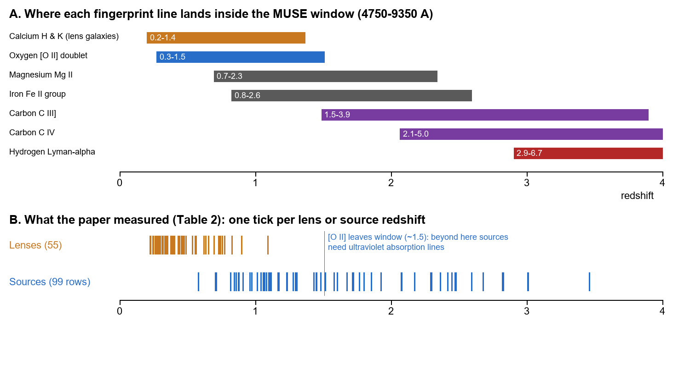
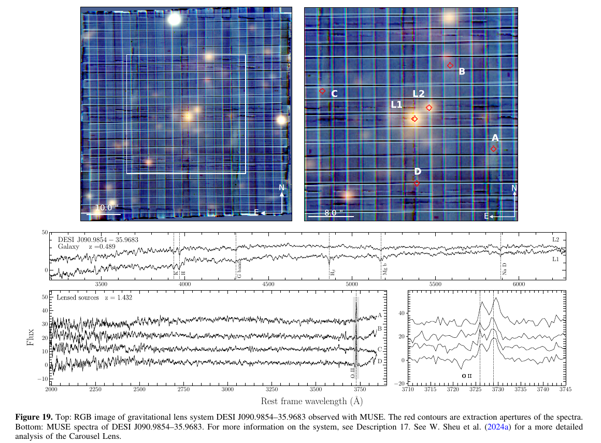
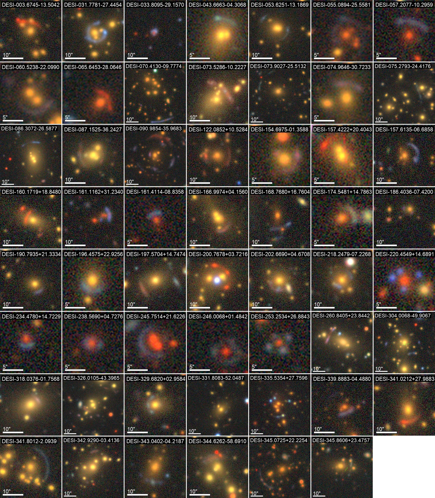
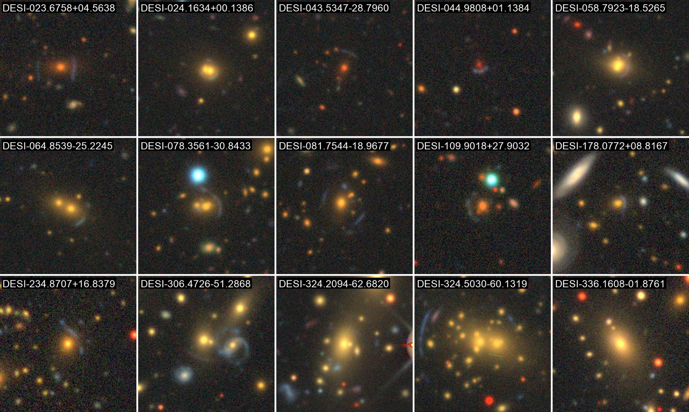

v3.16
Analyzing | Framework v3.16

> **Access Status** — Full paper: the local 74-page PDF (Lin et al., ApJS 286:9, 2026 September; DOI 10.3847/1538-4365/ae844d). I read all prose, every per-system description and all four tables via the full-text extraction, and checked figures and captions in the PDF and page renders. · Abstract: from the PDF. · Supplementary material: none separate; the machine-readable spectra ("data behind Figure 3") were not available, so I used the printed tables. · Figures: no author figure files. Viewed Figs. 2 and 64 (embedded rasters), Figs. 3 and 19 (page renders, Fig. 19 cropped), and Figs. 57, 65, 66, 67 in the PDF; I sampled rather than inspected all 63 per-system figure pages. Figs. 66–67 are vector plots with no extractable image and are described in words. · Context, from arXiv abs pages with version history seen (abstract text only, not full papers): Cikota et al. 2307.12470 v1 (only version); Sheu et al. 2408.10320 v1 (only version); Carousel Lens II 2602.16077 v2 (current); Dahle et al. 1211.1091 v1 (only version); Pettini et al. 0909.3301 v2 (current); Huang et al. Foundry I 2502.03455 v2 (current). A search result showed an arXiv preprint of this paper; per the run instructions I did not consult it. · Analysis basis: full text.

## 1. Seventy-Six Suspects, One Spectrograph: Sorting Real Cosmic Lenses from Look-Alikes

A neural network flagged thousands of galaxies that *look* like gravitational lenses. This paper takes 76 of the best-looking ones in the southern sky, points a spectrograph at each, and reads the distance of every galaxy in the frame. It confirms 55 as real lenses and catches six impostors that turn out to be spiral arms, tidal debris or foreground blobs.

## 2. Big-Picture Context

Strong gravitational lensing happens when a massive galaxy sits almost exactly in front of a more distant one. The foreground galaxy's gravity bends the background light into arcs, rings or several separate copies. Astronomers prize these systems because the bending depends only on mass, not on whether the mass shines. Each lens is a scale that weighs a galaxy's total mass, dark matter included. With enough of them you can map dark matter in galaxy cores, hunt for small dark clumps, and, using the time delays between copies of a flickering source, measure the expansion rate of the universe.

The bottleneck has moved. Finding candidates used to be the hard part. Now machine-learning classifiers run over wide imaging surveys and return thousands of "lens-like" images. This team's earlier discovery papers ran a residual neural network (an image classifier that learns by stacking many correction layers) over the DESI Legacy Imaging Surveys and produced about 3,500 new candidates. An image alone, however, cannot prove lensing. A blue arc next to a red galaxy could be a stretched background galaxy, or it could be a spiral arm, a tidal tail, or an unrelated small galaxy at the same distance. The decisive test is spectroscopic. You measure the redshift (a distance tag, explained in Section 3) of the foreground galaxy and of the arc, and the arc must be much farther away. Spectroscopy is slow, one target at a time, and the southern sky has fewer survey spectrographs to lean on.

This paper is Part IV of the "DESI Strong Lens Foundry" series, which splits the follow-up across instruments. Paper I confirmed 51 candidates with Hubble Space Telescope snapshot imaging (arXiv:2502.03455, current version v2). Paper II handles spectra from the DESI survey spectrograph, and Paper III uses Keck near-infrared spectra for sources too distant for optical lines. This paper uses MUSE, an "integral field" spectrograph on ESO's Very Large Telescope in Chile, which records a spectrum at every point of a small patch of sky at once.

**Paper type & stakes:** this is an observational catalog paper. It delivers spectroscopic confirmation of lens candidates rather than a single physical measurement. The stakes are practical: whether the candidate list deserves trust, and how many systems are now ready for lens modeling, dark-matter and cosmology work.

**Prior Belief Check:** the results align with expectations and the paper is confirmatory, not surprising. The field already knew that neural-network-selected candidates with clear arcs are mostly real lenses, and that MUSE excels at lens redshifts (the same group showed this on single systems). The value here is volume and the southern-sky coverage, plus a handful of unusual systems: two source planes behind one lens, a lens at unusually high redshift, and a possible Lyman-break galaxy. No expert will find the confirmation rate unexpected. The interesting expert-level content lies in the details of individual systems and in how cleanly the impostors get rejected.

**Replication & Convergence Note:** the catalog comes from a single team with one instrument, but several systems have independent confirmation. The quadruple image known as CSWA 20 matches the X-shooter redshifts of Pettini et al. (arXiv:0909.3301 v2). The cluster-lensed quasar SDSS J2222+2745 was first studied by Dahle et al. (arXiv:1211.1091 v1). The team's own Einstein cross and Carousel Lens papers also overlap. For most of the 55, independent confirmation would mean a second spectrograph (DESI or Keck, already planned in Papers II and III) reproducing the source redshift, plus high-resolution imaging showing the counter-images a lens model predicts. Until then, each redshift with a weak quality flag rests on one team's reading of one spectrum.

## 3. Necessary Background Crash-Course

### What does a strong lens actually do?

A galaxy's mass curves the space around it, so light rays from a background galaxy that pass on different sides of it get bent toward the middle. When the alignment is close, more than one ray path from the same source reaches us. We then see the source several times: as two images on opposite sides (an "arc and counter-arc"), four images in a cross (an "Einstein cross"), or a nearly complete ring when the alignment is almost perfect. Each image is also stretched and usually magnified, which turns faint distant galaxies into bright arcs. The ring's angular size tracks how much mass sits inside it.

**Analogy:** think of a content-delivery network serving one file from several edge servers. A user who asks for the file can receive copies routed along different paths, each arriving with its own delay. The lensed images are those copies: one source, several routes, each route with its own path length and arrival time.

**Breaks when:** you treat the copies as identical. A CDN serves byte-identical files. Lensed images are distorted and magnified by different amounts, and for an extended galaxy each image can sample a slightly different part of the source. That is one honest reason two images of the "same" galaxy can show slightly different spectra, which matters in the Claim Check.

### How does a spectrum give a distance?

Atoms and ions absorb and emit light at fixed wavelengths, their fingerprint lines. Because the universe expands, light from a distant galaxy arrives stretched, and every line in its spectrum shifts redward by the same factor. That stretch factor, minus one, is the redshift. Larger redshift means more distant, and older light. A lens galaxy at redshift around 0.4 emitted its light roughly four billion years ago. A typical source here, around redshift 1.4, sent its light about nine billion years ago.

$$\lambda_{\text{observed}} = (1+z)\,\lambda_{\text{rest}}$$

**Symbol definitions:**
$\lambda_{\text{rest}}$ : wavelength of a spectral line as measured in a laboratory (ångström)
$\lambda_{\text{observed}}$ : wavelength at which the telescope records that line (ångström)
$z$ : redshift, the fractional stretch of the light caused by cosmic expansion (no units)

**What this actually means:** every line in a galaxy's spectrum moves by the same *proportion*. Find two or three lines whose observed spacing matches a known pattern, and the stretch factor follows.

**Analogy:** a barcode printed on a rubber band. Stretch the band and every bar moves, but the ratios between bar positions survive. A scanner can identify the barcode from those ratios and report how far the band was stretched.

**Breaks when:** the galaxy's own internal motions add small extra shifts (gas rotating toward or away from us), and in quasars the bright broad lines come from fast-moving gas that is systematically offset from the host galaxy. The rubber band then carries local wrinkles on top of the uniform stretch, which sets a floor on how precisely any one line pins the redshift.

### Why some lines work for lenses and others for sources

Lens galaxies are usually massive, old, red "elliptical" galaxies with little ongoing star formation. Their spectra show absorption lines from stellar atmospheres, above all the calcium pair called H and K, plus a sharp drop in light below a rest wavelength of 4,000 ångström. Background sources are usually young star-forming galaxies. Their brightest feature is an emission line of ionized oxygen that comes as a close *doublet*, two peaks separated by about three ångström. The doublet matters: a single bright line could be one of several elements, but a resolved double peak with the right spacing is nearly unambiguous. The paper repeatedly cites "a clear double peak" as its confirmation.

The catch is the instrument's window. MUSE records only visible and very-near-infrared light. Above a source redshift of roughly 1.5 the oxygen doublet slides out the red end, and the team must switch to ultraviolet lines that have been stretched into view: iron and magnesium absorption from gas in the source, then carbon lines, then hydrogen's Lyman-alpha line for the most distant objects. These features are weaker and often appear in absorption rather than emission, which is why high-redshift sources are harder to confirm.



*Analyst-built illustration (not from the paper):* top, the redshift range over which each line family falls inside the MUSE window, computed from rest wavelengths and the instrument's coverage; bottom, the first-listed lens of each confirmed system and every source row in the paper's Table 2, one tick each. **What to look at:** the oxygen bar ends near 1.5; the many source ticks to its right were measured with the weaker ultraviolet lines, and those make up most of the hard cases.

### What an integral field spectrograph adds

An ordinary slit spectrograph samples a thin line of sky. You must guess in advance where the arc lies and accept whatever falls in the slit. MUSE instead slices a one-arcminute square into a grid of fine pixels and records a full spectrum in every one, producing a "data cube": two sky coordinates by one wavelength axis. Afterwards you can sum the cube over any wavelength band to make a picture, or sum any chosen set of pixels to make a spectrum.

**Analogy:** a hyperspectral image stored as a three-dimensional array. Reduce along the wavelength axis and you get an image; reduce over a mask of pixels and you get a spectrum. Here the "mask" is drawn by hand around each arc, knot or lens galaxy, after the data are taken.

**Breaks when:** you assume each pixel is independent. The atmosphere blurs every point of light over neighboring pixels (typical blur here is just under one arcsecond, several MUSE pixels wide). A faint arc that wraps tightly around a bright galaxy therefore inherits some of the galaxy's light. That is why several arcs show the lens's calcium lines faintly, and why the authors pick "red pixels around the interlopers" by hand.

### Quality flags

Each redshift carries one of three flags: "robust" (clear, unambiguous features), "probable" (features visible but low signal or not unambiguous), or "possible" (signal too weak to fit, only a rough estimate). The paper's tables number them first, second and third. These flags are visual judgments, not computed probabilities. They matter for anyone who uses the catalog, because the paper's headline "both redshifts measured" includes probable and possible cases.

### Origins & Big Picture: how lens systems come to exist

A strong lens is a chance alignment, but not a random one. It needs an unusually massive foreground galaxy, and those form in a particular way. In the standard picture, small dark-matter halos form first and merge into larger ones. The most massive galaxies assemble in the densest regions, where repeated mergers build big, round elliptical galaxies and exhaust their gas, so star formation shuts down and the stars redden with age. These galaxies sit at the bottom of the deepest gravitational wells, often at the center of a group or cluster. That explains the recurring pattern in this paper: a bright red central galaxy, often with one to three companions at nearly the same redshift, and sometimes a whole group contributing to the bending. Many of the 55 confirmed systems list two or three "lens" galaxies with matching redshifts.

The sources are a different population. The universe formed stars fastest around redshift 1 to 3, a period astronomers call "cosmic noon," and the galaxies of that era are gas-rich, clumpy and bright in ultraviolet and oxygen emission. Lensing favors them twice over. They are common, and they sit far enough behind a typical lens for the geometry to work well. Lensing is most efficient when the lens sits roughly halfway (in the relevant distance sense) between us and the source. That is why the confirmed lenses cluster at redshifts of a few tenths while their sources sit several times farther out.

**Analogy:** a cache hit needs the right item in the right slot at the right time. A lens needs a heavy galaxy (the slot), a bright, distant, star-forming source (the item) and near-perfect alignment (the timing). Most massive galaxies produce no strong lens because nothing bright sits directly behind them.

**Breaks when:** you read "chance" as "unpredictable." Lens statistics are highly predictable as a population. Forecasts for the coming surveys rely on exactly that predictability.

The search history follows the instruments. The first large uniform sample came from spotting background emission lines inside survey spectra of massive galaxies, which yields lenses that arrive spectroscopically confirmed but only at small separations. Imaging searches took over next, by eye, then by citizen scientists, and now by neural networks scanning hundreds of millions of galaxy images. Image-based finding is cheap but leaves distances unknown, and a lens becomes scientifically usable only when both distances are known, because the inferred mass depends on distance ratios.

Euclid, the Vera Rubin Observatory and the Roman Space Telescope are expected to raise the known population from thousands to around a hundred thousand. Spectroscopic follow-up will not scale the same way. Programs like this one test which tools work: here, filler time on a large telescope with an instrument that captures the whole lens field in one pointing. The systems with several sources at different distances are the rarest and most valuable products. Two sources behind the same lens give a lever arm on the geometry of the universe that does not depend on the lens's mass normalization.

### Central analogy

> **Central analogy for this paper:** two stretched barcodes; background stretched more

### How the pipeline flows

*Analyst-built concept diagram (not from the paper):*

```
DESI Legacy imaging (ground, wide)
   |  neural-network classifier
   v
~3,500 lens candidates --> best southern ones queued
   |  5 ESO filler programs, 2022-2024
   v
175 observing blocks -> 100 executed -> 92 useful (76 targets)
   |  pipeline reduction + sky-line cleanup
   v
MUSE data cube per target
   |  synthetic V/R/I color image; hand-drawn apertures
   v
223 one-dimensional spectra
   |  eye line ID -> Gaussian fit -> quality flag 1/2/3
   v
55 lens + source z | 15 lens z only | 6 not lenses
```

Read top to bottom: each stage removes candidates or adds information, and the last line is the paper's headline split.

## 4. Core Technical Explanation

### Step 1: Getting telescope time without a dedicated survey

**The failure it prevents:** without southern spectroscopy, most southern candidates would stay unconfirmed indefinitely, since the DESI spectrograph mostly covers the north. **What the authors do:** they run five ESO "filler" programs, which use telescope time when conditions are too poor for higher-priority work. Each target gets four exposures of a little under twelve minutes. Because filler blocks only run when nothing better is scheduled, many never run, and some run in bad seeing or thin cloud. **What it buys:** a lot of targets for modest scheduling priority. The price is uneven data quality, and several targets needed a second visit in a later semester.

| Observing outcome | Count |
| :-- | :-: |
| Observing blocks requested | 175 |
| Blocks executed | 100 |
| Useful observations (Table 1 rows) | 92 |
| Distinct targets | 76 |
| Median atmospheric blur (arcsec, from Table 1) | 0.8 |

*Table (from the paper's Section 2 and Table 1; median computed by the analyst).* **What to look at:** almost half the requested blocks never ran. That is the cost of filler time, and it explains most of the "lens-only" outcomes below.

### Step 2: Cleaning the sky out of the spectrum

**The failure it prevents:** Earth's upper atmosphere glows in hundreds of sharp emission lines, densest in the red, where faint source lines land; left in, they would mimic or bury source lines. **What the authors do:** they reduce the data with the standard MUSE pipeline, remove residual sky glow with a tool (ZAP) that models the sky pattern across the whole cube, and plot error spectra under the science spectra so a reader can see when a line sits on a sky residual. **What it buys:** credible weak-line detections near the red edge, exactly where the oxygen doublet sits for sources near redshift 1.4.

### Step 3: Drawing the right apertures

**The failure it prevents:** arcs are thin, curved and often overlap other galaxies; a circular aperture would mix the arc with its neighbors. **What the authors do:** they build a synthetic color image from the cube, identify each component by eye (often cross-checked against Hubble images from Paper I), and extract spectra from circles for compact objects or from hand-picked pixel lists for arcs. Positions and brightnesses come from the Legacy Survey catalog rather than from new MUSE measurements. **What it buys:** clean, separable spectra for each lens galaxy, arc segment, knot and interloper, so that one pointing yields many spectra.



*Figure 19 (from the paper): the Carousel Lens. Top, the MUSE color image with red extraction apertures on two lens galaxies (L1, L2) and four images (A–D) of one source; bottom, the lens spectra with calcium and other absorption lines, and the four source spectra with the oxygen doublet zoomed at right.* **What to look at:** in the right-hand zoom, all four images show the same two-peaked oxygen line at the same position. That shared fingerprint proves they are one background galaxy. The grid of stripes across the image is an instrument artifact, a reminder of how faint these arcs are.

### Step 4: Turning lines into redshifts

**The failure it prevents:** automated template matching can lock onto the wrong line in noisy, contaminated spectra of faint arcs. **What the authors do:** a person first identifies the prominent lines and makes a rough redshift guess. The software then fits Gaussian line shapes tied to their laboratory wavelengths, with one shared redshift (for the doublet, two peaks with one redshift), and takes the uncertainty from the fit's covariance matrix. Each fit is overplotted on the data and inspected. For a few high-redshift sources with almost featureless spectra, the team uses Keck spectra from a companion program to identify the single visible line. **What it buys:** redshifts precise to about one part in ten thousand for most objects. The cost: the method is partly manual, and the quoted uncertainty covers only the statistical fit (see the Claim Check).

### Step 5: Sorting every candidate into a verdict

**The failure it prevents:** a binary "lens / not lens" call would hide the systems where the data simply ran out. **What the authors do:** three bins. "Confirmed" means both a lens and a background-source redshift. "Lens only" means the bright foreground galaxy was measured but the faint arc was not. "Not a lens" means the "arc" turned out to lie at the same distance as the galaxy, or in front of it. **What it buys:** an honest denominator.

| Verdict | Targets | What it means |
| :-- | :-: | :-- |
| Lens and source redshift measured | 55 | Usable for modeling; 47 of these have a robust (flag 1) value for both |
| Lens redshift only | 15 | Arc too faint or weather too poor; still candidates |
| Not a lens | 6 | Arc at the galaxy's own distance or in front of it |
| Spectra extracted in total | 223 | 192 of them in the 55 confirmed fields |

*Table (from the paper's abstract, Sections 4–5 and Tables 2–4; the flag-1 count is the analyst's tally from Table 2).* **What to look at:** the 15 "lens-only" systems are open cases, not failures of the candidates.



*Figure 2 (from the paper): Legacy Survey color cutouts of all the confirmed systems; scale bars of 5 or 10 arcseconds.* **What to look at:** the range of shapes. Near-complete blue rings, crosses, red "tadpole" arcs, long arcs around groups of orange galaxies, and a few systems where the lens is a tight pair. The red arcs are the hard cases: their sources look like the lens galaxies themselves (old, dusty or distant), with weak emission.

### What the confirmed sample looks like

The confirmed lenses are mostly massive red galaxies at redshifts of a few tenths. By my count from Table 2, the typical lens sits near redshift 0.4 and the typical source near 1.4. In travel time, the lens light left about four billion years ago and the source light about nine billion years ago. Roughly two in five source redshifts lie beyond the point where the oxygen doublet leaves the window, so the team relied on ultraviolet absorption lines for them. The paper's lens-versus-source scatter plot (Fig. 67, described here because it is a vector graphic) puts every source well above its lens, apart from one apparent plotting slip noted in the Claim Check, with vertical red lines joining the systems that have more than one source. Its companion histograms (Fig. 66) show the lenses bunched at low redshift and the sources spread broadly to the right, the same pattern as the analyst-built explainer above.

Group-scale systems are common: many fields list two or three lens galaxies at matching redshifts, so the bending comes from a group's combined mass. That complicates modeling but helps the science, since group halos are where dark-matter profiles are least understood.

### The standout systems

**Two source planes behind one lens.** In one field a single nearby lens galaxy lenses two different galaxies: one into a pair of images near redshift 1.3, and another into four images near redshift 3.0 (the paper's Fig. 57, which I viewed in the PDF). The more distant source shows a broad hydrogen absorption trough and unusually strong metal lines. The authors suggest a Lyman-break galaxy, a young galaxy seen through a thick hydrogen column, and leave a gamma-ray-burst afterglow or quasar as alternatives. The arcs also lie in a nearly straight line rather than curving around the lens, which the authors call unexpected.

A second field does the same with sources near redshifts 1.7 and 3.5. The farther one shows a textbook Lyman-alpha emission line, with a steep blue edge and a gentle red tail, and is the most distant source in the paper.

**Why two source planes are prized.** Light from a farther source passes the lens and then travels farther before reaching us, so it gets bent into a larger ring. The *ratio* of the two ring sizes depends only on ratios of cosmic distances. It does not depend on how massive the lens is, so it probes how the universe's expansion has changed over time, including the behavior of dark energy. The team's companion paper on the Carousel Lens (arXiv:2602.16077, current version v2) already extracts dark-energy constraints from one such cluster lens. Its abstract states that the error bars are still wide and dominated by modeling systematics. Turning these new double-plane systems into cosmology needs sharp space-based imaging and careful mass models, a multi-year effort.

**Known lenses, now complete.** The quadruple CSWA 20 gets redshifts for all four images, which match each other closely. Its lens and source values agree with the X-shooter redshifts in Pettini et al. (arXiv:0909.3301 v2) to within about two hundred kilometres per second. The team's own Einstein cross matches its discovery paper (arXiv:2307.12470 v1). The cluster-lensed quasar SDSS J2222+2745 shows three quasar images plus a lensed arc; the paper states the arc "was not spectroscopically confirmed by the other papers mentioned above," a claim I examine in the Claim Check.

**A lens far away.** One confirmed lens sits at redshift about 1.1 (light from roughly eight billion years ago), in a group whose other galaxies overlap its arcs; the team separates them by color and spectrum.

### Catching the impostors

The six rejected candidates are the paper's most instructive result. Each looked convincingly lens-like in survey images, and each fails the barcode test in a different way. Two "arcs" are spiral arms: they share the central galaxy's emission and absorption lines, and the paper notes, reasonably, that one unusually bright single arm is odd but not lensing. One is a long tidal tail between two merging galaxies at the same redshift. One blue arc is a star-forming region at the galaxy's own distance, partly hidden by a foreground star. Two "arcs" lie in *front* of the supposed lens. The same test also clears up a smaller case inside a confirmed field: an arc-like "Object X" sits at the lens's own redshift, so it is not lensed.



*Figure 64 (from the paper): Legacy Survey cutouts of the 15 systems where only the lens redshift could be measured.* **What to look at:** most show plausible arcs (several clear blue ones), which supports reading these as unconfirmed rather than rejected. Their lens spectra (Fig. 65) all show the calcium pair cleanly.

### Claim check

Checks ran in Python on the paper's printed tables (scripts `claim_check.py` and `claim_check2.py` in the run's work directory); literature values come from the arXiv abstract pages listed in the Access Status.

**Target bookkeeping — Reproduced.** Table 1 has 92 observation rows covering 76 distinct targets, and Tables 2–4 contain exactly the 55 + 15 + 6 targets the abstract quotes. The spectrum count adds up too: the rows in Tables 3 and 4 account exactly for the difference between the 223 spectra in total and the 192 in confirmed fields. The headline counts are internally consistent.

**"Both lens and source redshifts for 55" — Partly reproduced (significant finding).** Only 47 of the 55 have a robust (flag 1) value for both the lens and at least one source. In one system the lens "redshift" is no spectroscopic measurement at all: the paper says it was assigned "purely" from survey photometric distance estimates of surrounding red galaxies, because the spectrum was too noisy. That value still appears in the confirmed table and in the summary plots. Three other confirmed systems rest on a source flagged only "possible." The 55 is a fair count of *candidates with a proposed redshift pair*. For a list of systems ready for precision modeling, use the 47.

**Agreement with earlier work — Reproduced, with one quasar offset.** The Einstein cross, CSWA 20 and the Carousel source match earlier redshifts (arXiv:2307.12470 v1, 0909.3301 v2, 2408.10320 v1) to within about 200 kilometres per second. The sextuple quasar sits near 2.80 against Dahle et al.'s 2.82, about 1,600 kilometres per second apart. That fits a known systematic: the value here comes from the quasar's broad carbon line, which typically runs blueshifted relative to the host galaxy.

**Redshift uncertainties — Not reproduced as stated (significant finding).** The quoted errors come only from the fit's covariance, and the smallest correspond to about one kilometre per second, far finer than MUSE's resolution element of roughly 75–150 kilometres per second. Where the paper gives separate redshifts for images it calls one source, I compared them. In 6 of 14 such pairs the images disagree by more than three times their combined quoted error. The worst case is the lensed quasar: two images of one point source, which must share a redshift, differ by about 570 kilometres per second, roughly 13σ on the quoted errors. Some small differences have a physical cause (different images sample different parts of a rotating galaxy), but the conclusion holds either way: real uncertainties run several times larger than the quoted ones. For lens geometry this makes no difference, since redshifts good to a part in a thousand suffice. It does matter wherever the paper uses redshift *differences* to decide whether arcs come from one source. One field's four images are read as a "trio of physically close galaxies" on the strength of differences of a few hundred kilometres per second, which is smaller than the scatter between the quasar's own images. That interpretation therefore stays open.

**Sensitivity — what counts as "confirmed."** The paper counts a single strongly stretched arc with a background redshift as confirmed, and seven robust systems are described as "singly lensed" or a "single arc." A strict multiple-image standard drops the robust count to about forty. The field usually accepts giant arcs, so the count survives that convention but not the stricter one.

**Robustness — the impostor test.** Test: measure the "arc" redshift directly. Contamination would look like the arc matching the galaxy's redshift or lying in front of it. Result: six candidates fail exactly this way, and no confirmed system shows it; every source sits well behind its lens. One caveat: the 76 were chosen as the most promising candidates, so the confirmation rate does not carry over to the full list of about 3,500.

**Internal consistency (significant for catalog users).** In Table 2, both sources of one system carry the coordinates of a different system (copied rows, off by more than ten degrees on the sky). In Table 3, one nonlens "arc" carries another target's coordinates. Several photometry rows duplicate other rows (one source's magnitudes repeat another system's values). The summary scatter plot (Fig. 67) shows a source near redshift 0.25, although Table 2 has no source below about 0.58, so a lens companion was probably plotted as a source. Anyone loading these tables into a database should check coordinates against the images. Minor: one target's name differs between Tables 1 and 2, one name has a declination typo, one lens magnitude of 7.8 is impossible, and the Dahle et al. v1 abstract already reports a giant arc at redshift 2.30. That arc is probably the "new" arc, though I could not confirm from the abstract that it is the same one.

### Assumption Audit

> **Watch:** Reader likely assumes "fully confirmed" means two secure spectroscopic redshifts. The paper actually counts any system with a proposed lens and source value, including one lens whose redshift comes from neighbors' photometric estimates and three sources flagged only "possible"; 47 of the 55 carry a robust value for both.

> **Watch:** Reader likely assumes the tiny error bars (often a few parts in a hundred thousand) are the total uncertainty. The paper actually reports fit-only errors. Images of a single quasar disagree by about 570 kilometres per second, so differences of a few hundred kilometres per second cannot by themselves separate "one source" from "two neighboring sources."

> **Watch:** Reader likely assumes the confirmation rate measures how reliable the neural-network candidate list is. The paper actually observed hand-picked, high-ranked southern candidates under weather-limited filler time; 15 remain undecided, and the six rejections teach more about failure modes than about rates. Separately, "confirmed" here means the geometry is right. No lens model or mass measurement appears in this paper.

## 5. What's Genuinely New or Clever

The paper's contribution is a *sample*, not a method; fitting lines in MUSE cubes is standard, and this group showed it on single systems in 2023 and 2024. New to the field is a uniform southern-sky batch of 55 lens–source redshift pairs from one neural-network discovery program, including a few rare systems: two lenses with two well-separated source planes, a lens near redshift 1.1, a possible lensed Lyman-break galaxy, and complete four-image redshift sets for two known crosses. The double-source-plane lenses matter most scientifically, because they bear on dark energy independently of other probes.

The clever part is a design choice the instrument enables: point once, then decide what to extract. Because MUSE captures the whole field, the team discovers *during analysis* that an arc holds two sources, that a "lens" is a group, that a blob in front of an arc is a nearby dwarf galaxy, or that a candidate arc is a spiral arm. A slit spectrograph would need several pointings and prior knowledge to catch the same things. The honest publication of the six impostors, with spectra, is a small but real service: it gives classifier builders labelled examples of the look-alikes their networks fall for (spiral arms, tidal tails, foreground star-forming blobs). In systems terms, machine-learning *finding* and spectroscopic *verification* form a two-stage pipeline with a severe throughput mismatch, and this paper measures the second stage's yield and failure modes under real, weather-limited conditions.

### Predictive Content Check

1. **Falsifiable handle:** every redshift is a checkable prediction. The specific exposures: (a) the source near redshift 3.0 behind the two-plane lens should show Lyman-break-galaxy spectral structure in deeper or near-infrared spectra, and nothing like a fading afterglow or a quasar's broad emission; (b) the "trio" field should resolve, with higher-resolution spectra or Hubble imaging, into either three distinct galaxies or two images of one; (c) DESI and Keck spectra (Papers II–III) should reproduce the source redshifts to about a part in a thousand, especially for the flag 2–3 sources; (d) high-resolution imaging of the 15 lens-only systems should show counter-images that lens models predict. A source redshift that later moves substantially, or a confirmed arc that resolves into a non-lensed galaxy, would count against the catalog. The paper mostly *measures* rather than predicts; its falsifiable content lies in these individual identifications.

## 6. Limitations & Open Questions

**Redshift identification is manual.** A person picks the lines, picks the apertures and assigns the quality flag; no automated cross-correlation, independent second classifier or blind re-inspection is reported. **(B) Contested** — visual inspection is standard and often necessary for faint arcs, but other teams pair it with automated templates and multiple independent inspectors, and reasonable people differ on how much that matters at this signal level. **(paper §3)**

**Quoted redshift errors are statistical only and understate the real uncertainty by several times.** **(A) Consensus** — the finding comes from my recomputation of image-to-image differences in Table 2, and it is broadly accepted that a single-line fit covariance omits calibration, sky-residual and source-structure systematics. **(analyst inference)**

**"Fully confirmed" mixes robust and tentative cases.** Eight of the 55 lack a robust value for the lens or every source, and one lens redshift is photometric. **(B) Contested** — the flags are honestly printed, so this is partly a labelling question; whether a flag-3 source "confirms" a lens depends on the user's standard. **(analyst inference from Table 2)**

**No lens modeling or new high-resolution imaging.** Single-arc systems are confirmed on spectroscopy plus ground-based (sometimes Hubble) morphology; masses, Einstein radii and image counts await future work, which the paper defers to future JWST/Euclid imaging and modeling. **(A) Consensus** — the paper states this as future work, and modeling is the standard next step. **(paper §5)**

**The confirmation rate is not a purity estimate for the full candidate list.** **(A) Consensus** — targets were prioritized, observed under weather-limited filler time, and 15 remain undecided; the paper never claims a purity figure, and selection effects of this kind are well known. **(analyst inference)**

**Catalog transcription errors.** Duplicated coordinates and photometry rows, and a plotted point with no table counterpart. **(A) Consensus** — these are factual mismatches in the printed tables, found by cross-checking rows. **(analyst inference)**

**Data quality is weather-limited, and photometry is borrowed.** Nearly half the requested blocks never ran, and arc magnitudes come from the Legacy Survey catalog, where arcs blend with lens light. **(C) Speculative** — the weather losses are stated in the paper, but how much blending degrades the arc photometry is my inference; the paper does not discuss it. **(paper §2, §4.3; analyst inference)**

**Open questions (12–24 months):** Do the DESI and Keck redshifts (Papers II–III) confirm the flag 2–3 sources? What is the source near redshift 3.0, and why are its arcs straight? Do the two-source-plane systems yield useful distance-ratio constraints once modeled? Do the 15 lens-only fields resolve into lenses with deeper MUSE time? And how will the series turn its confirmed pairs into a lens-model sample with a documented selection function?

## 7. Detailed Summary & Explanation

The team used MUSE, a spectrograph on one of ESO's 8-metre telescopes that records a spectrum at every point of a small sky patch, to follow up 76 strong-lens candidates found by a neural network in DESI Legacy Imaging data, mostly in the southern sky. Five low-priority filler programs run over three years produced the usable observations. For each target the authors built a color image from the data cube, outlined every lens galaxy, arc segment and interloper, extracted 223 spectra, identified fingerprint lines by eye, and fitted them to get redshifts with a three-level quality flag.

The results split three ways. For 55 targets they report both a lens and a background-source redshift, the defining evidence of lensing. For 15 they measured only the bright lens galaxy, because the arc was too faint or the weather too poor. Six turned out not to be lenses at all: spiral arms, a tidal tail, a star-forming region at the galaxy's own distance, and two blobs in front of the supposed lens. The typical lens sits a few billion light-years away, the typical source about nine billion, and two sources lie beyond eleven billion. Highlights include lenses with two sources at very different distances, valuable for testing cosmic expansion; complete four-image redshifts for two known crosses; a lens at unusually high redshift; and a possible lensed Lyman-break galaxy.

My checks reproduced the bookkeeping and the agreement with earlier published redshifts. They found two things a user should know. First, "fully confirmed" includes eight systems with a tentative value, one lens redshift that comes from neighbors' photometry rather than a spectrum, so a strict "robust both" list holds 47. Second, the quoted error bars are fit-only and several times too small, which matters for the few cases where the paper uses small redshift differences to decide whether arcs come from one galaxy or several. The tables also contain copied coordinate and photometry rows.

**Why I framed it this way.** For a catalog the useful questions are "how far can I trust each entry?" and "what is rare here?", so Section 3 teaches how a redshift becomes evidence, the Claim Check targets the confirmation standard and the error bars, and the double-source-plane systems stand as the payoff. The impostors stay prominent because they show the barcode test working.

**Where I'm least confident in this analysis:** the per-system line identifications themselves. I read every description and table but sampled the 63 spectrum figures rather than re-examining each faint arc. I cannot independently judge whether a given flag-2 or flag-3 feature is real, and my "about forty under a strict multiple-image standard" sensitivity number rests on the paper's own wording ("singly lensed," "single arc") rather than on new imaging.

**Revision notes:** the referee pass replaced an implied purity reading of the confirmation rate with the selection caveat, promoted the photometric lens redshift and the 47-system robust count to a significant finding, checked the Dahle arc claim against the v1 abstract, moved Section 4 numbers into tables, and trimmed repetition.

## 8. Three Crystallized Takeaways

1. **A lens photo is a suspect; the spectrum is the verdict.** A blue arc next to a red galaxy proves nothing until spectra show the arc is far behind it. Six of these candidates looked convincing and turned out to be spiral arms, tidal tails or foreground blobs.

2. **The catalog is solid in bulk, softer at the edges.** Of 55 "confirmed" lenses, 47 rest on robust redshifts for both galaxies. One lens distance is borrowed from neighbors, and the printed error bars are several times too optimistic.

3. **The prizes are lenses with two background galaxies at different distances.** Comparing how strongly one lens bends two sources gives a measure of cosmic expansion that ignores the lens's mass. This survey found a few such systems that are now ready for modeling.

## 9. Shorter Summary

Strong gravitational lenses, massive galaxies that bend the light of more distant galaxies into arcs and multiple images, weigh dark matter and help measure how fast the universe expands. Neural networks now find thousands of candidates in sky images, but an image cannot prove lensing. You must show, with spectra, that the arc lies far behind the galaxy.

This paper follows up 76 of the best southern candidates from a DESI imaging search with MUSE, a European instrument that records a spectrum at every point of a small sky patch. Working mostly in leftover telescope time, the team extracted spectra and measured distances (redshifts) from fingerprint lines.

They report 55 systems with both a lens and a source distance, 15 where only the foreground galaxy could be measured, and six impostors, including spiral arms, a tidal tail and blobs in front of the galaxy.

The sample includes rare treasures: lenses with two background galaxies at very different distances, which can test dark energy independently of other methods; complete measurements of two known four-image crosses; and a possible lensed young galaxy seen when the universe was only about two billion years old.

My checks found the bookkeeping sound and the agreement with earlier measurements good, with two caveats. Only 47 of the 55 rest on robust distances for both galaxies, and one lens distance was estimated from neighboring galaxies rather than measured. The quoted error bars are several times too small: two images of the same quasar disagree far beyond them. The tables also contain some copied coordinates.

The result is confirmatory rather than surprising. It is a useful, partly provisional catalog that turns machine-learning candidates into systems ready for lens modeling.

---
*Analysis: Claude (headless Claude Code), 2026-10-09 · Framework v3.16 · posture: explanatory (peer-reviewed ApJS) · checks: claim_check.py, claim_check2.py; explainer: make_explainer.py.*
